# 基于 NLTK 和 SpaCy 的命名实体识别

> 原文：<https://towardsdatascience.com/named-entity-recognition-with-nltk-and-spacy-8c4a7d88e7da?source=collection_archive---------0----------------------->


Photo credit: Pixabay

## NER 在自然语言处理的许多领域都有应用

[命名实体识别](https://en.wikipedia.org/wiki/Named-entity_recognition) (NER)可能是信息提取的第一步，它试图定位文本中的[命名实体](https://en.wikipedia.org/wiki/Named_entity)并将其分类成预定义的类别，如人名、组织、位置、时间表达式、数量、货币值、百分比等。NER 在[自然语言处理](https://en.wikipedia.org/wiki/Natural_language_processing) (NLP)的很多领域都有应用，它可以帮助回答很多现实世界的问题，比如:

*   新闻中提到了哪些公司？
*   投诉或评论中是否提到了特定产品？
*   推文包含人名吗？推文包含这个人的位置吗？

本文描述了如何使用 [NLTK](https://www.nltk.org/book/ch07.html) 和 [SpaCy](https://spacy.io/usage/linguistic-features) 构建命名实体识别器，以识别事物的名称，例如原始文本中的人员、组织或位置。我们开始吧！

# NLTK

```
import nltk
from nltk.tokenize import word_tokenize
from nltk.tag import pos_tag
```

## 信息提取

我引用了《纽约时报》的一句话:“欧洲当局周三对谷歌处以创纪录的 51 亿美元罚款，原因是谷歌在手机市场滥用权力，并责令该公司改变做法。”

```
ex = 'European authorities fined Google a record $5.1 billion on Wednesday for abusing its power in the mobile phone market and ordered the company to alter its practices'
```

然后，我们对句子应用单词标记化和词性标注。

```
def preprocess(sent):
    sent = nltk.word_tokenize(sent)
    sent = nltk.pos_tag(sent)
    return sent
```

让我们看看我们得到了什么:

```
sent = preprocess(ex)
sent
```

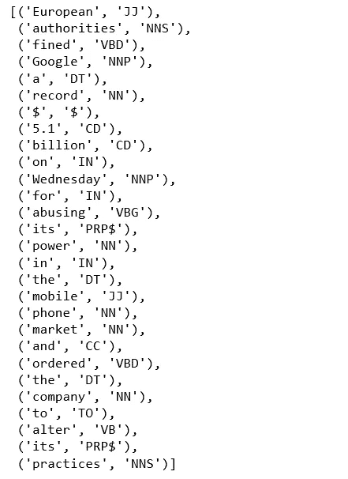

Figure 1

我们得到一个元组列表，其中包含句子中的单个单词及其相关的词性。

现在，我们将实现名词短语分块，以使用由规则组成的正则表达式来识别命名实体，这些规则指示句子应该如何分块。

我们的组块模式由一个规则组成，即每当组块者找到可选的限定词 DT，后跟任意数量的形容词 JJ，然后是名词 NN 时，就应该形成名词短语 NP。

```
pattern = 'NP: {<DT>?<JJ>*<NN>}'
```

## 组块

使用这个模式，我们创建了一个组块解析器，并在我们的句子上测试它。

```
cp = nltk.RegexpParser(pattern)
cs = cp.parse(sent)
print(cs)
```

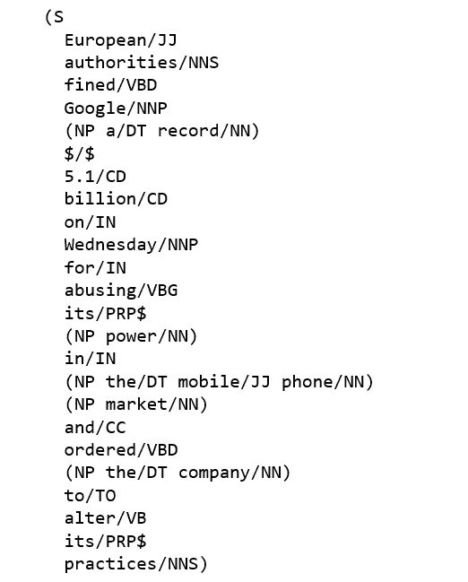

Figure 2

输出可以读作树或层次结构，S 是第一级，表示句子。我们也可以用图形显示出来。

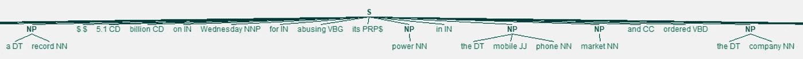

Figure 3

IOB 标签已经成为在文件中表示块结构的标准方式，我们也将使用这种格式。

```
from nltk.chunk import conlltags2tree, tree2conlltags
from pprint import pprintiob_tagged = tree2conlltags(cs)
pprint(iob_tagged)
```

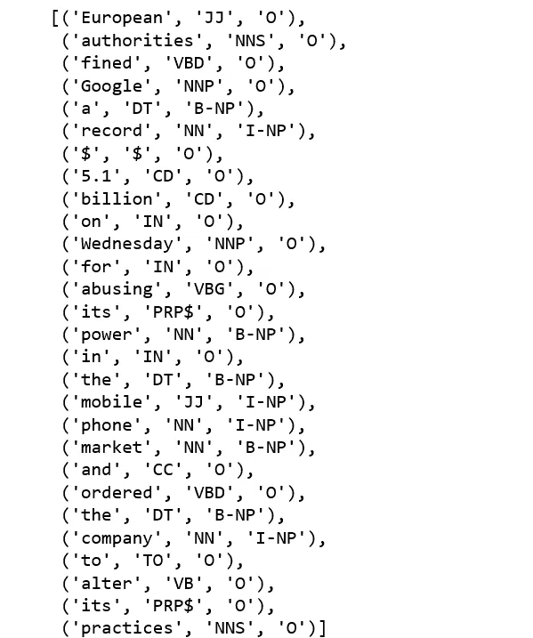

Figure 4

在这个表示中，每行有一个标记，每个标记都有其词性标记和命名实体标记。基于这个训练语料，我们可以构建一个可以用来标注新句子的 tagger 并使用 nltk.chunk.conlltags2tree()函数将标记序列转换成块树。

通过函数 nltk.ne_chunk()，我们可以使用分类器识别命名实体，分类器添加了类别标签，如个人、组织和 GPE。

```
ne_tree = ne_chunk(pos_tag(word_tokenize(ex)))
print(ne_tree)
```

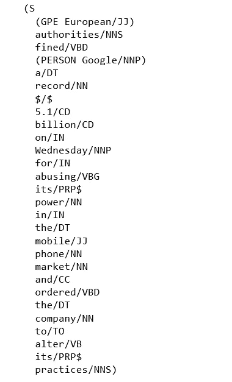

Figure 5

谷歌是公认的人。挺让人失望的，你不觉得吗？

# 空间

[SpaCy 的命名实体识别](https://spacy.io/api/annotation#section-named-entities)已经在 [OntoNotes 5](https://catalog.ldc.upenn.edu/ldc2013t19) 语料库上进行训练，它支持以下实体类型:

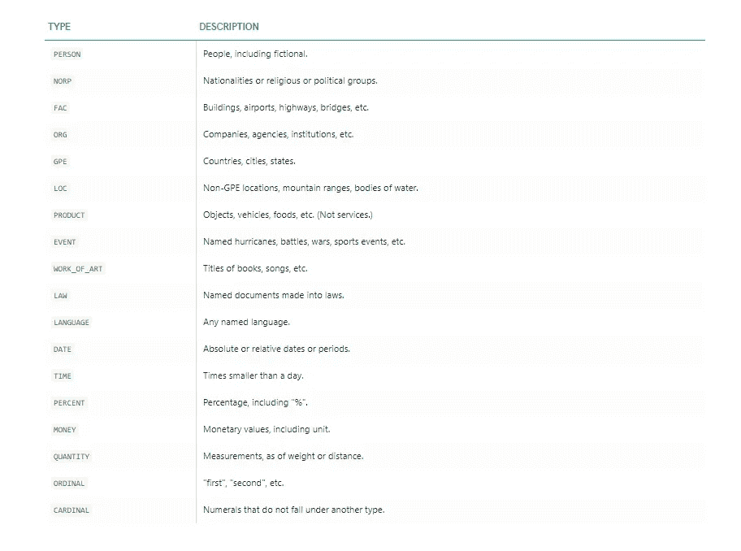

Figure 6 (Source: SpaCy)

## 实体

```
import spacy
from spacy import displacy
from collections import Counter
import en_core_web_sm
nlp = en_core_web_sm.load()
```

我们用的是同一句话，“欧洲当局周三对谷歌处以创纪录的 51 亿美元罚款，原因是其在手机市场滥用权力，并责令该公司改变做法。”

Spacy 的一个好处是我们只需要应用 nlp 一次，整个后台管道将返回对象。

```
doc = nlp('European authorities fined Google a record $5.1 billion on Wednesday for abusing its power in the mobile phone market and ordered the company to alter its practices')
pprint([(X.text, X.label_) for X in doc.ents])
```

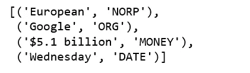

Figure 7

European 是 NORD(国籍或宗教或政治团体)，Google 是一个组织，51 亿美元是货币值，星期三是日期对象。都是对的。

## 代币

在上面的例子中，我们在实体级别上工作，在下面的例子中，我们演示了使用罗比标记方案来描述实体边界的令牌级实体注释。

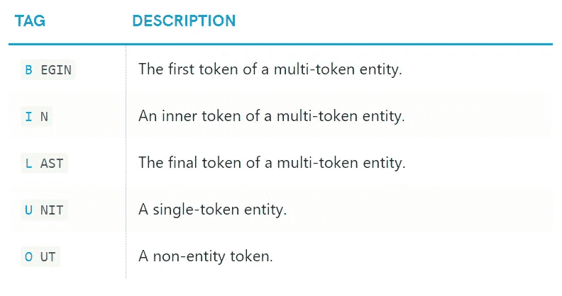

Figure 8 (Source: SpaCy)

```
pprint([(X, X.ent_iob_, X.ent_type_) for X in doc])
```

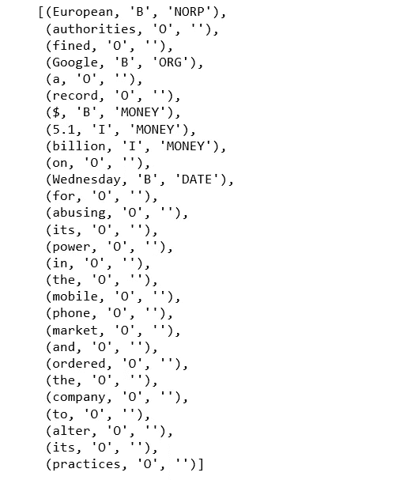

Figure 9

`"B"`表示令牌开始于实体，`"I"`表示令牌在实体内部，`"O"`表示令牌在实体外部，`""`表示没有设置实体标签。

## 从文章中提取命名实体

现在，让我们认真对待空间问题，从《纽约时报》的一篇文章中提取命名实体——“[在短信中批评特朗普的联邦调查局特工彼得·斯特佐克被解雇了](https://www.nytimes.com/2018/08/13/us/politics/peter-strzok-fired-fbi.html?hp&action=click&pgtype=Homepage&clickSource=story-heading&module=first-column-region&region=top-news&WT.nav=top-news)”

```
from bs4 import BeautifulSoup
import requests
import redef url_to_string(url):
    res = requests.get(url)
    html = res.text
    soup = BeautifulSoup(html, 'html5lib')
    for script in soup(["script", "style", 'aside']):
        script.extract()
    return " ".join(re.split(r'[\n\t]+', soup.get_text()))ny_bb = url_to_string('https://www.nytimes.com/2018/08/13/us/politics/peter-strzok-fired-fbi.html?hp&action=click&pgtype=Homepage&clickSource=story-heading&module=first-column-region&region=top-news&WT.nav=top-news')
article = nlp(ny_bb)
len(article.ents)
```

***188***

文章中有 188 个实体，它们被表示为 10 个独特的标签:

```
labels = [x.label_ for x in article.ents]
Counter(labels)
```

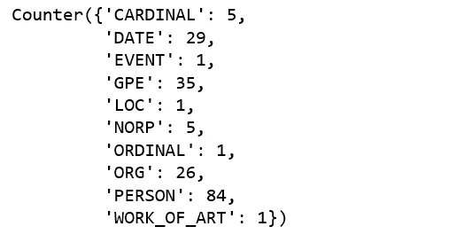

Figure 10

以下是三个最常见的令牌。

```
items = [x.text for x in article.ents]
Counter(items).most_common(3)
```


Figure 11

让我们随机选择一句话来了解更多。

```
sentences = [x for x in article.sents]
print(sentences[20])
```

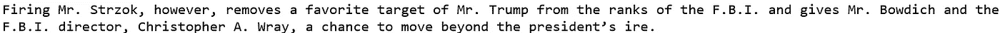

Figure 12

让我们运行`[displacy.render](https://spacy.io/api/top-level#displacy.render)` [](https://spacy.io/api/top-level#displacy.render)来生成原始标记。

```
displacy.render(nlp(str(sentences[20])), jupyter=True, style='ent')
```

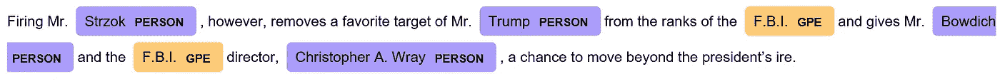

Figure 13

一个错误的分类是联邦调查局。这很难，不是吗？

使用 spaCy 的内置 [displaCy visualizer](https://spacy.io/usage/visualizers) ，上面的句子及其依赖项看起来是这样的:

```
displacy.render(nlp(str(sentences[20])), style='dep', jupyter = True, options = {'distance': 120})
```

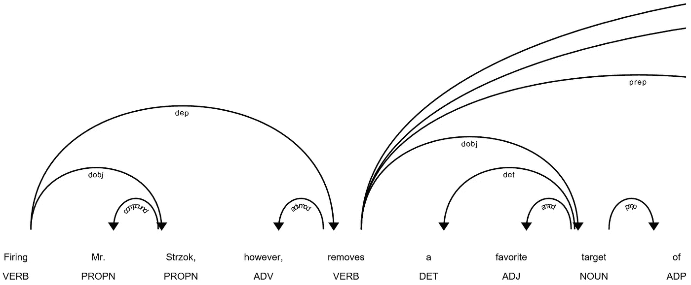

Figure 14

接下来我们逐字逐句，提取词性，把这个句子词条化。

```
[(x.orth_,x.pos_, x.lemma_) for x in [y 
                                      for y
                                      in nlp(str(sentences[20])) 
                                      if not y.is_stop and y.pos_ != 'PUNCT']]
```

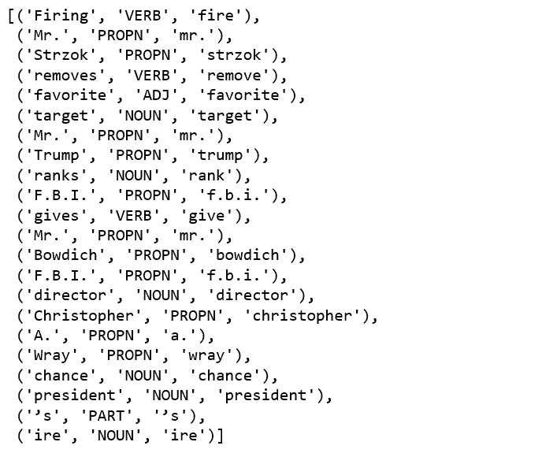

Figure 15

```
dict([(str(x), x.label_) for x in nlp(str(sentences[20])).ents])
```

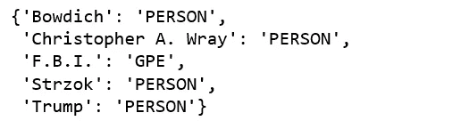

Figure 16

命名实体提取是正确的，除了“F.B.I”。

```
print([(x, x.ent_iob_, x.ent_type_) for x in sentences[20]])
```

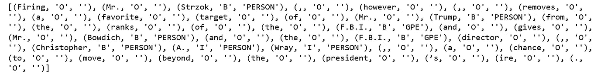

Figure 17

最后，我们将整篇文章的实体形象化。


Figure 18

你自己试试。很有趣！源代码可以在 [Github](https://github.com/susanli2016/NLP-with-Python/blob/master/NER_NLTK_Spacy.ipynb) 上找到。星期五快乐！