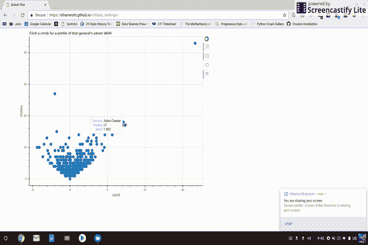
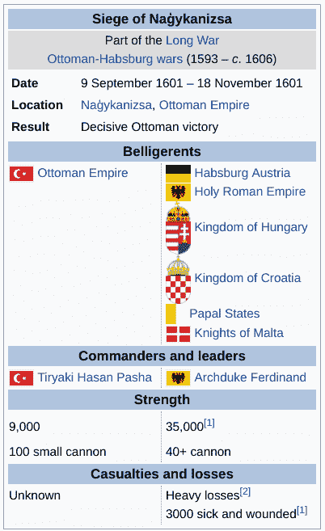
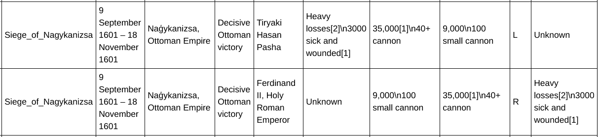
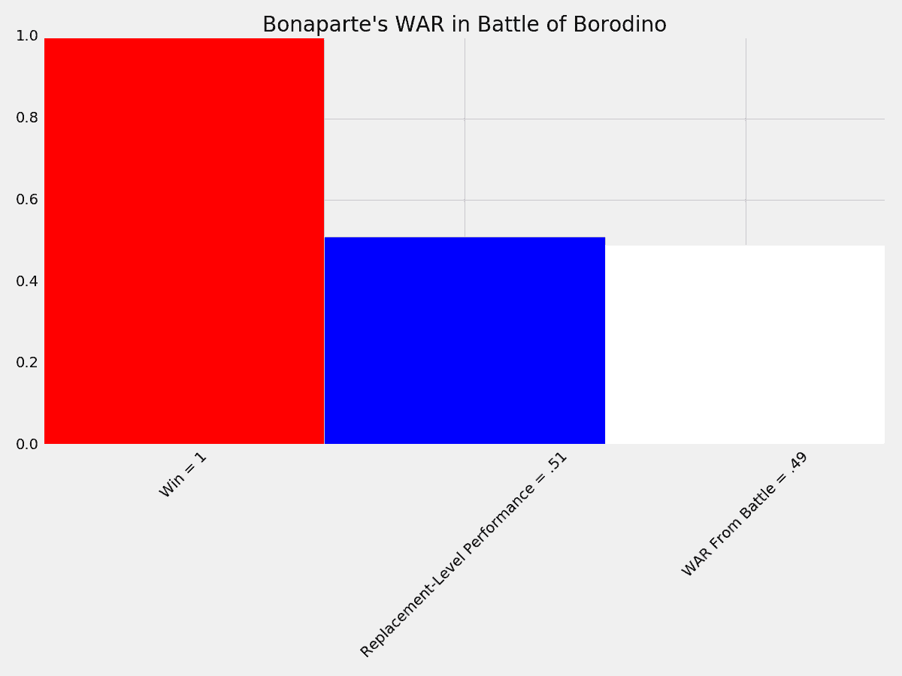
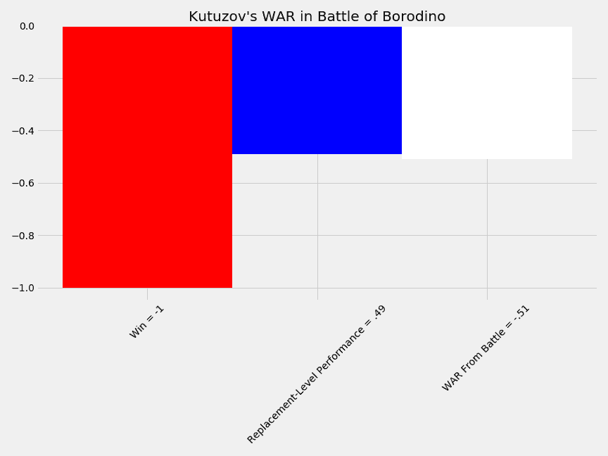
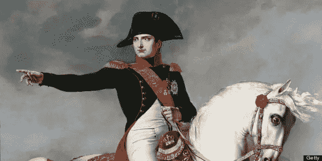
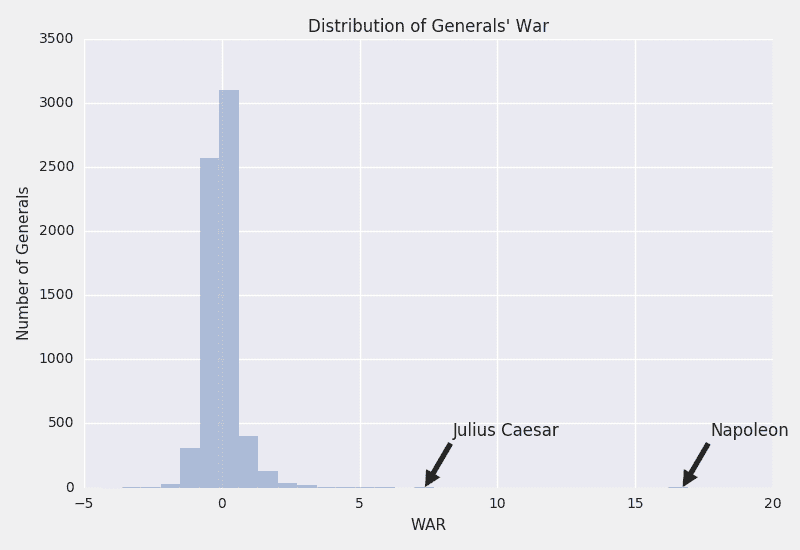
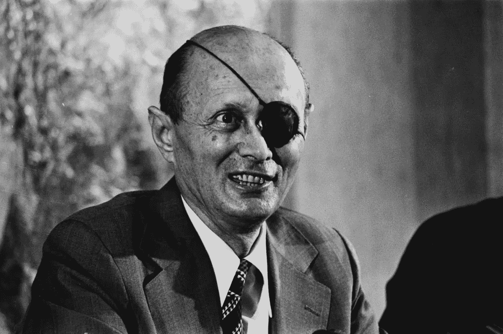
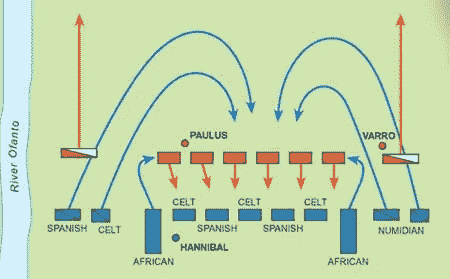

# 拿破仑是有史以来最好的将军，数学证明了这一点。

> 原文：<https://towardsdatascience.com/napoleon-was-the-best-general-ever-and-the-math-proves-it-86efed303eeb?source=collection_archive---------0----------------------->

# 对战争史上的每一位将军进行排名

*几乎每

> 当 Africanus 问汉尼拔认为谁是最伟大的将军时，汉尼拔说出了**Alexander**……至于谁会排在第二位，汉尼拔选择了**皮拉斯**……**问汉尼拔**认为谁是第三位，他**毫不犹豫地说出了自己的名字**。接着，西庇阿大笑起来，说道:“如果你打败了我，你会说什么？”
> 
> [—李维](http://www.perseus.tufts.edu/hopper/text?doc=Perseus%3Atext%3A1999.02.0165%3Abook%3D35%3Achapter%3D14)

就像汉尼拔一样，我想在战争史上给强有力的领导人排名。与汉尼拔不同，我试图用数据来确定一个将军的能力，而不是对将军成就的具体描述。其结果是军事史上每一位杰出指挥官的排名系统。

# 该方法

受棒球赛计量法的启发，我选择使用胜于败的系统。战争经常被用来评估一个棒球运动员对他的球队的贡献。它计算玩家相对于替补玩家增加(或减少)的总胜率。例如，与高水平小联盟球员的平均贡献相比，一个打了 5 场仗的棒球球员为他的球队贡献了 5 场额外的胜利。WAR 远非完美，但提供了一种基于一项统计数据来比较玩家的方法。

我用战争来评估一个特定的军事战术家的贡献是高于还是低于一个普通的将军。我的模型，我在下面解释，提供了一个在任何给定情况下的一般一般性能的估计。然后，我可以根据他们在相同情况下超过或低于替代将军的程度来评估将军的素质(假设替代将军的表现处于平均水平)。换句话说，我会在战争中找到将军们的战争。

Interactive visualization showing the 6619 ranked generals’ WARs

## [点击此处查看互动可视化！](https://ethanarsht.github.io/military_rankings/)

# 数据

我的第一个挑战是构建一个可靠的数据集。由于我无法找到一个全面的历史战斗数据集，我决定建立自己的数据集。我使用维基百科的战斗列表作为起点。虽然不全面，维基百科的列表包括 3580 场独特的战斗和 6619 名将军，这提供了足够的样本来创建一个模型。然后，我开发了一个函数，可以收集每场战斗的关键信息，包括参与战斗的所有指挥官、这些指挥官可用的总兵力以及战斗的结果。由此产生的数据集提供了一个大的战斗样本，以创建一个基线(替换级别)性能，我将根据它来比较个别将军的性能。

*上的战斗数据样本* [上的*维基*上的](https://en.wikipedia.org/wiki/Siege_of_Nagykanizsa)上的*上的*上的

*战场数据样本被刮取并处理成数据帧*

然后我从战斗样本中构建了一个线性模型。对于每场战斗，我将战斗人员的部队分为步兵、骑兵、炮兵、空军和海军。然后，我可以衡量一个将军与他们的对手相比在数量上的优势或劣势，并更好地隔离将军作为战术家的能力。最终的模型在权重上惊人地保守，这表明与地形或技术等其他因素相比，原始士兵数量的影响相对较小，进一步的研究可以更详细地调查这些因素。然而，在这个项目中，与其他因素相比，结果潜在地夸大了指挥官战术敏锐度的重要性。

我准备给每一位将军排名并研究结果。我这样做是通过隔离每个将军的战斗，并为他们在每场战斗中的表现分配一个战争分数。例如，法国皇帝拿破仑因在波罗底诺战役中获胜而赢得了 49 年战争。由于法国军队略多于俄罗斯帝国的军队，该模型给出了拿破仑位置上的替代将军 51%的胜算。战争系统分配拿破仑 1 胜作为他的胜利，但是减去一个替代将军无论如何都会赢的机会。因此，拿破仑获得 0.49 胜以上的替换。

该系统使用类似的方法来处理失败。例如，俄国将军米哈伊尔·库图佐夫，拿破仑在波罗底诺战役中的对手之一，被认为是这场对抗导致了. 49 战争。通过遭受失败，他取得了-1 的胜利，但是有 51%的几率一个替代将军会失败。

# 结果呢

在所有将领中，拿破仑的战力最高(16.679)遥遥领先。事实上，排名第二的凯撒大帝(7.445 年战争)，他的战争时间还不到拿破仑历次战争的一半。拿破仑从他领导的大量战斗中受益匪浅。在他参加的 43 场战斗中，他赢了 38 场，只输了 5 场。拿破仑在 17 次胜利中克服了困难，在所有 5 次失败中处于劣势。在所有战役中，没有其他将军能与拿破仑相提并论。拿破仑在 43 场战役中指挥军队，第二多产的将军是[罗伯特·李](https://ethanarsht.github.io/military_rankings/Robert%20E.%20Lee)，27 场战役(平均 1.5 场)。拿破仑的大量战斗让他有更多的机会展示他的战术能力。[亚历山大大帝](https://ethanarsht.github.io/military_rankings/Alexander%20the%20Great.html)，尽管赢得了全部 9 场战斗，但积累的战争较少，主要是因为他的职业生涯较短且较少产。

Napoleon’s height was 5'7", slightly taller than average for his time.

然而，除了拿破仑外围的成功，将军们的战争很大程度上遵循正态分布。这表明他的成功归因于指挥才能，而不是模型发现的异常。事实上，拿破仑的总战争比数据集中将军们累积的平均战争高出近 23 个标准差。

Napoleon is a huge outlier with nearly 17 WAR

也有一些将军尽管被誉为战术大师，但总体战数却出奇的低。罗伯特·e·李，邦联军队的指挥官，以一场消极的战争结束(-1.89)，暗示一个普通的将军会比李领导的邦联军队更成功。李将军背负着相当大的劣势，包括军队规模和可用资源的巨大赤字。尽管如此，他作为一个老练的战术家的声誉可能是不应该的，他的战争支持了那些批评他的总体战略和关键战役处理的历史学家，例如在葛底斯堡战役的最后一天下令灾难性的'[皮克特冲锋](https://en.wikipedia.org/wiki/Pickett%27s_Charge)。用南卡罗来纳大学教授托马斯·康纳利的话来说，“人们会想，如果没有罗伯特·李，南方是否会过得更好。”

德国陆军元帅埃尔温·隆美尔(Erwin Rommel)因二战期间在北非的成功而被昵称为“沙漠之狐”，他在这一模式中也表现不佳，最终以-1.953 战。这一发现质疑了隆美尔作为战术家从现代将军那里得到的赞誉，包括[诺曼·施华蔻](https://ethanarsht.github.io/military_rankings/Norman%20Schwarzkopf%20Jr..html)和[阿里尔·沙龙](https://ethanarsht.github.io/military_rankings/Ariel%20Sharon.html)。然而，和李将军一样，隆美尔也是历史争论的焦点。尤其是，批评家们将他作为战术天才的声誉归功于德国和盟国的宣传。据报道，英国将军夸大了隆美尔的战术能力，以尽量减少对他们失败的不满。

现代将领在模型中表现相对较差。美国将军乔治·S·巴顿被历史学家特里·布莱顿描述为“二战中最伟大的将军之一”，他只打了 0.9 场战争。现代将军在战争中表现不佳，可能是由于战争的变化使个别将军无法参加大量的战斗。

Moshe Dayan boosted his WAR by winning the Six-Day War, despite a numerical disadvantage

在二战后的将军中，以色列指挥官脱颖而出。以色列军事领导人摩西·达扬(Moshe Dayan)以 2.109 战结束(第 60 名)，对于一个现代将军来说这是一个令人印象深刻的数字，但与 20 世纪前的战术家相比相对温和。类似地，以色列前总理阿里埃勒·沙龙因在苏伊士危机、六日战争和赎罪日战争中的战场胜利而累积了 2.171 场战争(总排名第 58 位)。

最后，我把汉尼拔对有史以来最高将领的评估与我的模型进行了对比。根据 WAR，汉尼拔低估了自己的能力——在迄今为止的所有将军中，汉尼拔的 WAR 最高，为 5.519(总排名第六)。亚历山大大帝，汉尼拔任命为最高将领，以 4.391 战(总排名第 10)仅次于汉尼拔的标记。然而，亚历山大只打了 9 场仗就死了，而且全部都赢了。汉尼拔有 17 场战斗来积累价值，赢了 13 场，输了 2 场，平了 2 场。因此，我同意汉尼拔的评估，即亚历山大是更有能力的战术家，尽管汉尼拔提供了更多的总价值——亚历山大展示了他赢得战斗的能力，如果他没有死于疾病，很可能会继续获胜。

Depiction of the Battle of Cannae, a decisive victory for Hannibal against Roman consuls Varro and Paulus

我的发现与汉尼拔对伊庇鲁斯的皮拉斯的评价截然不同，伊庇鲁斯是一位希腊将军，也是早期罗马的对手。我的模型认为皮拉斯只有 3 场战斗和-0.53 场战争。尽管汉尼拔将创新的军事战术归功于皮拉斯，但我对他的整体战术敏锐度深表怀疑，甚至在考虑到他在胜利期间无法防止[军队灾难性伤亡](https://en.wikipedia.org/wiki/Pyrrhic_victory)之前。

这个项目和由此产生的可视化有望提供一种有趣的方式来探索和比较将军们的相对成功。WAR 为经验性地比较将军们提供了一个有用的范例，尽管未来的研究可以通过扩大数据集或考虑其他因素(如对手的实力)来改进这一模型。请玩玩[可视化](https://ethanarsht.github.io/military_rankings/)，如果你想找一个特定的将军，只需输入网址'[https://ethanarsht.github.io/military_rankings/](https://ethanarsht.github.io/military_rankings/)* * *。其中***是将军的名字，和维基百科上显示的完全一样。

2011 年 12 月 11 日更新:基于许多我非常尊重其工作的人的反馈，我想对上述分析明确提出一些警告。首先，这篇文章旨在作为一个有趣的思想实验，而不是一个权威的排名，或对军事历史领域的学术贡献。我相信这个项目的一些结果，特别是李和隆美尔，为更广泛地讨论他们的战术能力提供了有趣的数据点。我绝不声称我的分析提供了全貌，或任何接近全貌的东西。

此外，由于我非常依赖维基百科获取数据和数据分类，我的输入中存在漏洞和不一致。鉴于我个人资源的缺乏，对我来说，在检查每一个数据点的准确性的同时进行如此规模的项目是不现实的。

最后，我必须重申，我的排名是一个将军的战术附加值，而不是他们的整体战略能力，或者谁会在一场假设的兵力和装备均等的对决中获胜。

同样，我相信绝大多数读者都按照我的意图解读了这篇文章——一个有着有趣结果和娱乐性互动的思想实验。感谢所有阅读这篇文章和/或提供反馈的人。

更新 12/8:根据大众的需求，可视化现在包括平均每场战斗增加的战争。只需将鼠标悬停在一个将军的点上，弹出窗口中就会出现“每场战争”。

此外，有些人在浏览与项目相关的 GitHub 库时遇到了麻烦。我在这个 [Google Drive](https://drive.google.com/open?id=1nQM9eJKjp4T8EeqkSGitZS7kiok5zwJ2) 中放了两个重要的电子表格:一个包含所有的部队人数数据，另一个包含每场战斗的战争结果。

更新 12/6:我想对过去几天收到的一些合理且持续的建设性批评做出回应。

1.  缺少数据！许多人准确地指出了数据中缺失的战斗/将军，特别是关于蒙古人，包括成吉思汗和苏布泰。这是一个主要问题，源于我对维基百科战斗列表的依赖。这是我应该早点发现的，我计划更新数据集以包含更多的战斗。然而，处理这些数据需要大量的手动数据输入/清理，并且在向数据集添加重大更新之前将花费我相当多的时间。
2.  战略与战术:人们认为将军被低估/高估是因为他们战役的最终结果。我特别关注将军的战术敏锐性，而不是他们的战略决策。因此，拿破仑不应因其灾难性的俄罗斯战役而失去信誉，乔治·华盛顿也不应因其对美国独立战争的战略方针而获得信誉。
3.  增加了胜率高于替代胜率与胜率高于平均胜率与胜率的概率:那些熟悉棒球赛的人很快指出，我的模型并没有在所有方面反映胜率高于替代胜率的方法，因为棒球的战争使用一个普通的顶级小联盟球员作为基线。我只是将平均质量作为我的替换级别。可能不完全准确，但我认为我在上述方法中使用什么作为基线是非常清楚的。

感谢你们当中提出建设性批评的人。

*请不要犹豫，在 twitter (@ethanarsht)上提供反馈。此处提供的代码和数据:*[*【https://github.com/ethanarsht/military_rankings】*](https://github.com/ethanarsht/military_rankings)*。很抱歉弄得一团糟。*