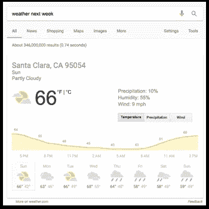

# 谷歌研究院的自然语言生成

> 原文：<https://towardsdatascience.com/natural-language-generation-at-google-research-bbf2c3756d80?source=collection_archive---------4----------------------->

在本集《云人工智能历险记》中，我将谷歌研究工程师贾斯汀·赵(Justin Zhao)带入演播室，了解生成自然发音的文本有多难。我们还讨论了这项技术如何应用在你的日常生活中，比如当你向谷歌主页询问天气时。

我们还讨论了一些应用于自然语言生成问题的机器学习技术，以及这一领域的最新研究进展。这是一次有趣而有意义的讨论，尽情享受吧！

我们正在为[云人工智能冒险](https://goo.gl/UC5usG)测试一种新的形式，在那里我采访人工智能和机器学习专家，讨论他们在该领域的一些研究和进展。这是一次真正的，嗯，*冒险*为这一集做准备和拍摄，请让我知道你是否喜欢这个结构！

要了解更多机器学习动作，请务必关注 Medium 上的[me](https://medium.com/@yufengg)或订阅 YouTube 频道以观看未来的剧集。更多剧集即将推出！