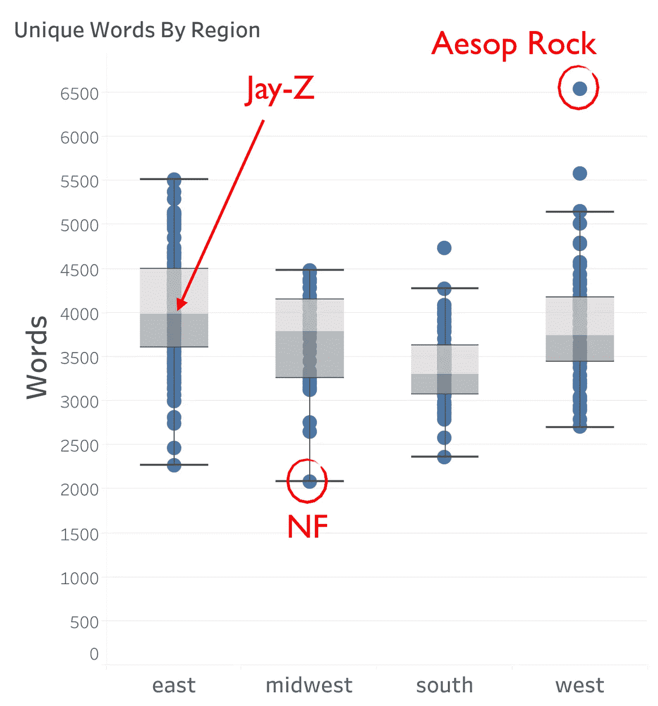

# 自然语言处理与说唱歌词

> 原文：<https://towardsdatascience.com/natural-language-processing-and-rap-lyrics-c678e60073fb?source=collection_archive---------12----------------------->

梅蒂斯的第四个项目侧重于无监督学习和自然语言处理。我选择探索说唱歌词，希望能根据说唱歌手使用的单词找到不同的组合。

# 数据

我想看一大堆说唱歌手，包括我不认识的。为了做到这一点，我使用了一个用户创建的有史以来最伟大说唱歌手的[列表](https://www.ranker.com/crowdranked-list/the-greatest-rappers-of-all-time)和另一个有史以来最伟大说唱组合的[列表](https://www.ranker.com/crowdranked-list/overall-best-hip-hop-crew)。然后，我从歌词网站 [genius](https://genius.com/) 中为每一位艺术家提取了所有的歌曲。

为了获取所有这些数据，我需要对两个网站进行网络抓取。幸运的是，我找到了一个由约翰·米勒创建的 python 包。他的这个 [github 页面](https://github.com/johnwmillr/trucks-and-beer)包括了如何使用代码的例子。

我从 350 多名说唱歌手那里收集了 55000 多首歌曲。我对自己能够得到的金额感到满意，但这非常耗时。这个剧本在我身上失败了几次，所以我不得不运行几次来吸引所有的艺术家。

# 谁的词汇量最大？

我最初想做一些数据探索，我决定通过使用每个艺术家独有的单词数量来找出谁的词汇量最大。这是受马特·丹尼尔斯(Matt Daniels)关于同一主题的[博客帖子](https://pudding.cool/2017/02/vocabulary/index.html)的启发。他使用了 85 位艺术家，所以我很想知道，考虑到我使用了 350 多位艺术家，我的结果会和他的结果相比。

为了计算每一位艺术家的独特词汇，我从每一位艺术家的歌曲中随机抽取了一个样本，并查看了歌曲中的前 35000 个词。我想能够比较苹果和苹果，所以如果一个艺术家没有那么多单词，我就把它们排除在外。我不得不考虑的一个问题是如何处理像“走”、“走”和“走”这样的词。将它们全部包括在内意味着，当它们都是同一个单词的变体时，我将把它们作为单独的单词来计算。我决定用一种叫做[的方法来解决这个问题。](https://en.wikipedia.org/wiki/Stemming)[雪球词干器](https://www.nltk.org/_modules/nltk/stem/snowball.html)把这三个字都变成了“走”。因此，它们都被认为是同一个词，而不是三个不同的词。

总的来说，东海岸说唱歌手用的词最多，而南方说唱歌手用的最少。最大的异常值是伊索岩石，它以 6542 个独特的单词位居榜首。说唱歌手 NF 的独特词汇最少，为 2084 个。

Jay-Z, one of the most successful artists, landed right in the middle of east region with 4,174 words.

看到地区细分很有趣，但我想展示一些更细致的东西。下面的视频显示了一个可视化，它使用 d3 根据唯一单词的数量来绘制每个说唱歌手。你可以在这里玩**。**

**Demo of how to use the visualization**

**每个泡泡代表一个特定的说唱歌手，根据他们使用的独特词汇的数量，他们被放在页面上。泡沫越右，他们使用的独特词汇就越多。迄今为止，说话最独特的说唱歌手是伊索·洛克。我把它与两位作家查尔斯·狄更斯和赫尔曼·梅尔维尔进行了比较，以表明《伊索岩石》甚至比得上著名作家。**

**我还包括不同的过滤器。在“按地区查看”过滤器中，每个艺术家都根据他们来自的地区(东部、西部、中西部或南部)进行颜色编码。在“群组”过滤器中，代表 rap 群组的气泡会高亮显示。我原以为它们会更集中在右边(表示更多的单词)，但它们分布得很均匀。使用大量词汇的一个群体是吴唐族。我加入了一个过滤器，只突出显示了武堂家族的成员，以显示他们每个人比一般说唱歌手使用更多的词。我的最后一个过滤器，非说唱过滤器，突出了三个不同的非说唱歌手(泰勒斯威夫特，披头士和鲍勃迪伦)。我把他们包括进来是因为我想展示说唱歌手和其他流派的比较。事实上，这三个词都在图表的左侧，这表明即使是使用平均或低于平均字数的说唱歌手也比其他流派的著名艺术家使用更多的词。**

# **基于歌词的分组**

**观察哪些说唱歌手用词最多很有趣，但我的目标是看看我能否根据歌词创建有意义的说唱歌手群体。为了做到这一点，我决定在我的歌曲集上使用主题建模。**

**我首先使用了[术语频率-逆文档频率](https://en.wikipedia.org/wiki/Tf%E2%80%93idf) (TFIDF)来显示每个单词在语料库中的重要性。这种方法对较罕见的单词给予较大的权重，而对较常见的单词给予较小的权重。TFIDF 基本上表明了一个人看到这个词应该有多惊讶。例如，假设语料库包括 1000 首歌曲。如果一个词出现在每一首歌中，人们看到这个词就不会感到惊讶。但是如果一个词只出现在三首歌里，那么当你在一首特定的歌里看到这个词时，你应该会非常惊讶。**

**然后，我对我的歌曲集应用了非负矩阵分解(NMF)。我用了 NMF，因为我想让每个主题中的每个单词都有正的权重来帮助解释。一旦我有了每首歌的主题，我就把它们平均到每个艺术家身上，因为我感兴趣的是所有的艺术家，而不是任何一首特定的歌。我期望看到至少两个形式良好的主题，但事实并非如此。遗憾的是，我从 NMF 那里得到的话题并不连贯，也没有形成有意义的群体。我尝试调整许多不同的参数，但没有改善我的话题。**

**然后，我使用 K-最近邻(KNN)法，根据我的艺术家的个人话题向量对他们进行聚类，看看将说唱歌手分组是否会比我的话题产生更好的分组。我希望看到的一件事是根据说唱歌手来自的地区进行分组。我以为会有地区俚语把西海岸说唱歌手和南方说唱歌手区分开来，或者纽约说唱歌手会自成一派。总的来说，这种情况没有发生。当我尝试三个集群时，我能够得到一个主要是南方说唱歌手的集群和一个有社会意识的说唱歌手的集群。当我增加聚类的数量时，这是我唯一能理解的两个聚类，而其余的聚类看起来是随机的。**

**虽然我能够得到几个不错的组，但我没有得到我想要的整体清晰的分离。这种失望让我创建了一个推荐系统。**

# **推荐系统**

**我创建了这个系统，这样用户可以输入一个特定的说唱歌手，然后会有 5 个说唱歌手推荐。用户可以选择调整他们希望推荐的冒险程度。用户越喜欢冒险，推荐就越不相似。有 6 个不同的级别，所以用户可以看到每个说唱歌手输入总共 30 个推荐。这里 可以玩 app [**。**](http://ec2-54-84-247-115.compute-1.amazonaws.com)**

**Demo of recommendation app**

**为了建立我的推荐，我使用我的 NMF 模型中的向量，并确定哪些向量彼此接近。为此，我找到了突出显示的说唱歌手和其他说唱歌手之间的欧几里德距离。推荐的是基于这个距离最近的说唱歌手。我也测试了余弦距离，但结果几乎相同，所以我还是用欧几里得。**

**我还试着使用了 [word2vec](https://radimrehurek.com/gensim/models/word2vec.html) 。我想看看使用单词的语义关系来避开歌词中的所有拼写错误是否会提供更好的推荐。我使用 50 的大小来训练，这意味着我的输出是每首歌的 50 维向量。然后，我对每个艺术家的矢量进行平均，得到每个艺术家的一个矢量，并使用与前面相同的距离公式。**

**NMF 和 word2vec 的推荐略有不同，在我看来，word2vec 提供了更好的建议。然而，因为我并不熟悉我包括的每一位艺术家，所以在其他人身上测试一下会很有用。**

# **结论**

**我发现做这个项目很有趣。推荐系统看起来运行良好，但是推荐本身是主观的，所以很难说。我的系统的主要限制是我只能用歌词来做推荐。歌词绝对是决定一个人是否喜欢某个特定歌手/歌曲的重要因素，但这不是唯一的因素。有些人对歌曲的节拍或速度更感兴趣。又或许有人根本不在乎歌词，只在乎歌曲整体的声音。包含这些信息将是我改进系统的第一步。**

# **我学到了什么**

*   ****NLP 技术**如 TF-IDF and 和 word2vec**
*   ****话题建模**利用 NMF**
*   ****聚类方法**如 KNN**
*   ****创建推荐系统****
*   ****使用 d3 和烧瓶。我使用 d3 和 flask 来创建我的视觉效果。****
*   ****使用 Docker 将 Flask 应用程序部署到 AWS EC2 容器服务(ECS)。****