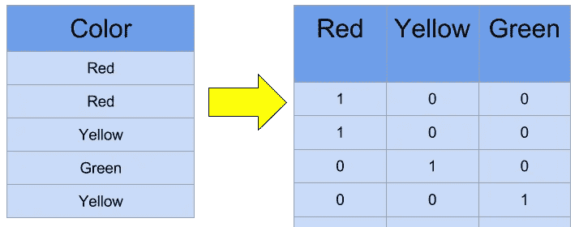

# 自然语言处理:用 scikit-learn 计算矢量化

> 原文：<https://towardsdatascience.com/natural-language-processing-count-vectorization-with-scikit-learn-e7804269bb5e?source=collection_archive---------1----------------------->

## 这是一个关于如何使用 scikit-learn 对真实文本数据进行计数矢量化的演示。



# 计数矢量化(也称为一键编码)

如果你还没有，看看我之前关于单词嵌入的博文:[单词嵌入介绍](/introduction-to-word-embeddings-4cf857b12edc)

在那篇博客文章中，我们讨论了很多不同的方法来表示机器学习中使用的单词。这是一个高层次的概述，我们将在这里展开，并检查我们如何在一些真实的文本数据上实际使用计数矢量化。

# 计数向量化概述


今天，我们将探讨用数字表示文本数据的最基本方法之一:一键编码(或计数矢量化)。想法很简单。

我们将创建向量，其维数等于我们的词汇表的大小，如果文本数据以该词汇为特征，我们将在该维数上放置一个 1。每当我们再次遇到这个词，我们将增加计数，留下 0 到处我们没有找到这个词甚至一次。

这样做的结果将是非常大的向量，但是，如果我们在真实的文本数据上使用它们，我们将得到我们的文本数据的单词内容的非常精确的计数。不幸的是，这不能提供任何语义或关系信息，但这没关系，因为这不是使用这种技术的目的。

今天，我们将使用来自 [scikit-learn](http://scikit-learn.org/stable/modules/generated/sklearn.feature_extraction.text.CountVectorizer.html) 的软件包。

# 一个基本例子

以下是使用计数矢量化获取矢量的基本示例:

```
from sklearn.feature_extraction.text import CountVectorizer

# To create a Count Vectorizer, we simply need to instantiate one.
# There are special parameters we can set here when making the vectorizer, but
# for the most basic example, it is not needed.
vectorizer = CountVectorizer()

# For our text, we are going to take some text from our previous blog post
# about count vectorization
sample_text = ["One of the most basic ways we can numerically represent words "
               "is through the one-hot encoding method (also sometimes called "
               "count vectorizing)."]

# To actually create the vectorizer, we simply need to call fit on the text
# data that we wish to fix
vectorizer.fit(sample_text)

# Now, we can inspect how our vectorizer vectorized the text
# This will print out a list of words used, and their index in the vectors
print('Vocabulary: ')
print(vectorizer.vocabulary_)

# If we would like to actually create a vector, we can do so by passing the
# text into the vectorizer to get back counts
vector = vectorizer.transform(sample_text)

# Our final vector:
print('Full vector: ')
print(vector.toarray())

# Or if we wanted to get the vector for one word:
print('Hot vector: ')
print(vectorizer.transform(['hot']).toarray())

# Or if we wanted to get multiple vectors at once to build matrices
print('Hot and one: ')
print(vectorizer.transform(['hot', 'one']).toarray())

# We could also do the whole thing at once with the fit_transform method:
print('One swoop:')
new_text = ['Today is the day that I do the thing today, today']
new_vectorizer = CountVectorizer()
print(new_vectorizer.fit_transform(new_text).toarray())
```

我们的产出:

```
Vocabulary:
{'one': 12, 'of': 11, 'the': 15, 'most': 9, 'basic': 1, 'ways': 18, 'we': 19,
  'can': 3, 'numerically': 10, 'represent': 13, 'words': 20, 'is': 7,
  'through': 16, 'hot': 6, 'encoding': 5, 'method': 8, 'also': 0,
  'sometimes': 14, 'called': 2, 'count': 4, 'vectorizing': 17}
Full vector:
[[1 1 1 1 1 1 1 1 1 1 1 1 2 1 1 2 1 1 1 1 1]]
Hot vector:
[[0 0 0 0 0 0 1 0 0 0 0 0 0 0 0 0 0 0 0 0 0]]
Hot and one:
[[0 0 0 0 0 0 1 0 0 0 0 0 0 0 0 0 0 0 0 0 0]
 [0 0 0 0 0 0 0 0 0 0 0 0 1 0 0 0 0 0 0 0 0]]
One swoop:
[[1 1 1 1 2 1 3]]
```

# 在真实数据上使用它:

所以还是用在一些真实数据上吧！我们将查看 scikit-learn 附带的 [20 个新闻组数据集](http://scikit-learn.org/stable/datasets/twenty_newsgroups.html)。

```
from sklearn.datasets import fetch_20newsgroups
from sklearn.feature_extraction.text import CountVectorizer

import numpy as np

# Create our vectorizer
vectorizer = CountVectorizer()

# Let's fetch all the possible text data
newsgroups_data = fetch_20newsgroups()

# Why not inspect a sample of the text data?
print('Sample 0: ')
print(newsgroups_data.data[0])
print()

# Create the vectorizer
vectorizer.fit(newsgroups_data.data)

# Let's look at the vocabulary:
print('Vocabulary: ')
print(vectorizer.vocabulary_)
print()

# Converting our first sample into a vector
v0 = vectorizer.transform([newsgroups_data.data[0]]).toarray()[0]
print('Sample 0 (vectorized): ')
print(v0)
print()

# It's too big to even see...
# What's the length?
print('Sample 0 (vectorized) length: ')
print(len(v0))
print()

# How many words does it have?
print('Sample 0 (vectorized) sum: ')
print(np.sum(v0))
print()

# What if we wanted to go back to the source?
print('To the source:')
print(vectorizer.inverse_transform(v0))
print()

# So all this data has a lot of extra garbage... Why not strip it away?
newsgroups_data = fetch_20newsgroups(remove=('headers', 'footers', 'quotes'))

# Why not inspect a sample of the text data?
print('Sample 0: ')
print(newsgroups_data.data[0])
print()

# Create the vectorizer
vectorizer.fit(newsgroups_data.data)

# Let's look at the vocabulary:
print('Vocabulary: ')
print(vectorizer.vocabulary_)
print()

# Converting our first sample into a vector
v0 = vectorizer.transform([newsgroups_data.data[0]]).toarray()[0]
print('Sample 0 (vectorized): ')
print(v0)
print()

# It's too big to even see...
# What's the length?
print('Sample 0 (vectorized) length: ')
print(len(v0))
print()

# How many words does it have?
print('Sample 0 (vectorized) sum: ')
print(np.sum(v0))
print()

# What if we wanted to go back to the source?
print('To the source:')
print(vectorizer.inverse_transform(v0))
print()
```

我们的产出:

```
Sample 0:
From: lerxst@wam.umd.edu (where's my thing)
Subject: WHAT car is this!?
Nntp-Posting-Host: rac3.wam.umd.edu
Organization: University of Maryland, College Park
Lines: 15

 I was wondering if anyone out there could enlighten me on this car I saw
the other day. It was a 2-door sports car, looked to be from the late 60s/
early 70s. It was called a Bricklin. The doors were really small. In addition,
the front bumper was separate from the rest of the body. This is
all I know. If anyone can tellme a model name, engine specs, years
of production, where this car is made, history, or whatever info you
have on this funky looking car, please e-mail.

Thanks,
- IL
   ---- brought to you by your neighborhood Lerxst ----

Vocabulary:
{'from': 56979, 'lerxst': 75358, 'wam': 123162, 'umd': 118280, 'edu': 50527,
  'where': 124031, 'my': 85354, 'thing': 114688, 'subject': 111322,
  'what': 123984, 'car': 37780, 'is': 68532, 'this': 114731, 'nntp': 87620,
  'posting': 95162, 'host': 64095, 'rac3': 98949, 'organization': 90379,
  'university': 118983, 'of': 89362, 'maryland': 79666,
  'college': 40998, ... } (Abbreviated...)

Sample 0 (vectorized):
[0 0 0 ... 0 0 0]

Sample 0 (vectorized) length:
130107

Sample 0 (vectorized) sum:
122

To the source:
[array(['15', '60s', '70s', 'addition', 'all', 'anyone', 'be', 'body',
       'bricklin', 'brought', 'bumper', 'by', 'called', 'can', 'car',
       'college', 'could', 'day', 'door', 'doors', 'early', 'edu',
       'engine', 'enlighten', 'from', 'front', 'funky', 'have', 'history',
       'host', 'if', 'il', 'in', 'info', 'is', 'it', 'know', 'late',
       'lerxst', 'lines', 'looked', 'looking', 'made', 'mail', 'maryland',
       'me', 'model', 'my', 'name', 'neighborhood', 'nntp', 'of', 'on',
       'or', 'organization', 'other', 'out', 'park', 'please', 'posting',
       'production', 'rac3', 'really', 'rest', 'saw', 'separate', 'small',
       'specs', 'sports', 'subject', 'tellme', 'thanks', 'the', 'there',
       'thing', 'this', 'to', 'umd', 'university', 'wam', 'was', 'were',
       'what', 'whatever', 'where', 'wondering', 'years', 'you', 'your'],
      dtype='<U180')]

Sample 0:
I was wondering if anyone out there could enlighten me on this car I saw
the other day. It was a 2-door sports car, looked to be from the late 60s/
early 70s. It was called a Bricklin. The doors were really small. In addition,
the front bumper was separate from the rest of the body. This is
all I know. If anyone can tellme a model name, engine specs, years
of production, where this car is made, history, or whatever info you
have on this funky looking car, please e-mail.

Vocabulary:
{'was': 95844, 'wondering': 97181, 'if': 48754, 'anyone': 18915, 'out': 68847,
  'there': 88638, 'could': 30074, 'enlighten': 37335, 'me': 60560, 'on': 68080,
  'this': 88767, 'car': 25775, 'saw': 80623, 'the': 88532, 'other': 68781,
  'day': 31990, 'it': 51326, 'door': 34809, 'sports': 84538, 'looked': 57390,
  'to': 89360, 'be': 21987, 'from': 41715, 'late': 55746, '60s': 9843,
  'early': 35974, '70s': 11174, 'called': 25492, 'bricklin': 24160, 'doors': 34810,
  'were': 96247, 'really': 76471, ... } (Abbreviated...)

Sample 0 (vectorized):
[0 0 0 ... 0 0 0]

Sample 0 (vectorized) length:
101631

Sample 0 (vectorized) sum:
85

To the source:
[array(['60s', '70s', 'addition', 'all', 'anyone', 'be', 'body',
       'bricklin', 'bumper', 'called', 'can', 'car', 'could', 'day',
       'door', 'doors', 'early', 'engine', 'enlighten', 'from', 'front',
       'funky', 'have', 'history', 'if', 'in', 'info', 'is', 'it', 'know',
       'late', 'looked', 'looking', 'made', 'mail', 'me', 'model', 'name',
       'of', 'on', 'or', 'other', 'out', 'please', 'production', 'really',
       'rest', 'saw', 'separate', 'small', 'specs', 'sports', 'tellme',
       'the', 'there', 'this', 'to', 'was', 'were', 'whatever', 'where',
       'wondering', 'years', 'you'], dtype='<U81')]
```

# 现在怎么办？

所以，你现在可能想知道什么？我们知道如何基于计数对这些东西进行矢量化，但是我们实际上能利用这些信息做什么呢？

首先，我们可以做一系列的分析。我们可以查看词频，我们可以删除停用词，我们可以可视化事物，我们可以尝试聚类。现在我们有了这些文本数据的数字表示，我们可以做很多以前做不到的事情！

但是让我们更具体一点。我们一直在使用来自 20 个新闻组数据集中的文本数据。为什么不把它用在任务上呢？

20 个新闻组数据集是一个论坛帖子的数据集，分为 20 个不同的类别。为什么不使用我们的矢量化工具来尝试对这些数据进行分类呢？

```
from sklearn.datasets import fetch_20newsgroups
from sklearn.feature_extraction.text import CountVectorizer

from sklearn.naive_bayes import MultinomialNB
from sklearn import metrics

# Create our vectorizer
vectorizer = CountVectorizer()

# All data
newsgroups_train = fetch_20newsgroups(subset='train',
                                      remove=('headers', 'footers', 'quotes'))
newsgroups_test = fetch_20newsgroups(subset='test',
                                     remove=('headers', 'footers', 'quotes'))

# Get the training vectors
vectors = vectorizer.fit_transform(newsgroups_train.data)

# Build the classifier
clf = MultinomialNB(alpha=.01)

#  Train the classifier
clf.fit(vectors, newsgroups_train.target)

# Get the test vectors
vectors_test = vectorizer.transform(newsgroups_test.data)

# Predict and score the vectors
pred = clf.predict(vectors_test)
acc_score = metrics.accuracy_score(newsgroups_test.target, pred)
f1_score = metrics.f1_score(newsgroups_test.target, pred, average='macro')

print('Total accuracy classification score: {}'.format(acc_score))
print('Total F1 classification score: {}'.format(f1_score))
```

我们的产出:

```
Total accuracy classification score: 0.6460435475305364
Total F1 classification score: 0.6203806145034193
```

嗯……所以不是超级神奇，但我们只是使用计数向量！一个更丰富的表现将为我们的分数创造奇迹！

# 包扎

希望您感觉已经学到了很多关于计数矢量化的知识，如何使用它，以及它的一些潜在应用！

如果你喜欢读这篇文章，给我留言或者给我的 GoFundMe 捐款来帮助我继续我的 ML 研究！

敬请关注即将推出的更多单词嵌入内容！