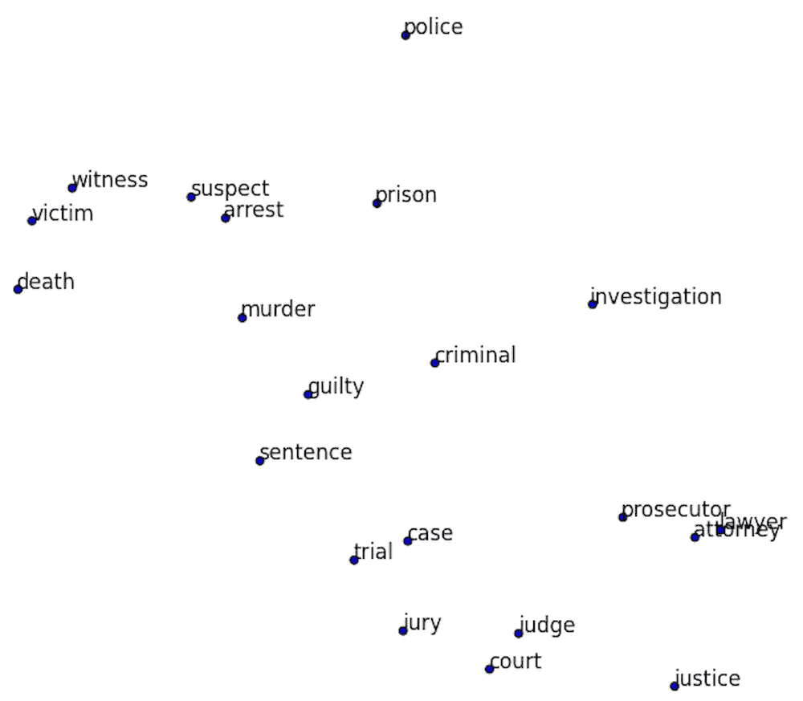
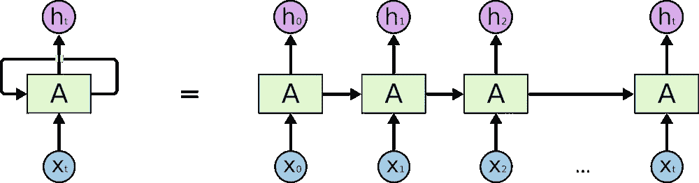
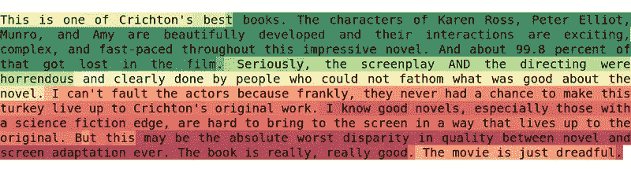
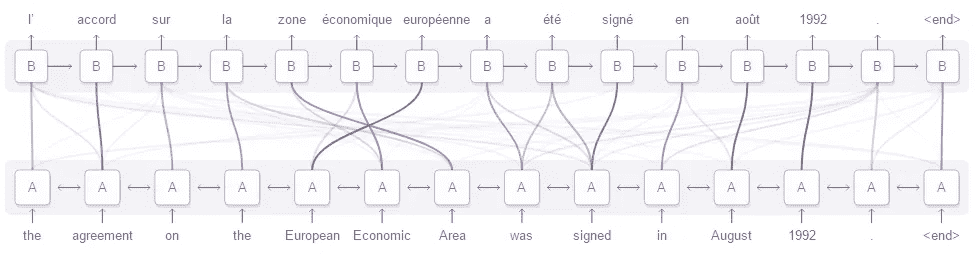

# 人工智能中的自然语言处理几乎是人类级别的精确。更糟糕的是，它变聪明了！

> 原文：<https://towardsdatascience.com/natural-language-processing-in-artificial-intelligence-is-almost-human-level-accurate-fbdaffed6392?source=collection_archive---------3----------------------->

# 深度学习时代之前

早在深度学习时代之前的日子里——那时神经网络更像是一种可怕、神秘的数学好奇心，而不是一种强大的机器学习或人工智能工具——在*自然语言处理(NLP)* 领域，经典数据挖掘算法有许多令人惊讶的相对成功的应用。似乎像 T2 的垃圾邮件过滤和 T4 的词性标注这样的问题可以用简单易懂的模型来解决。

但并不是每个问题都能这样解决。简单的模型无法充分捕捉语言的微妙之处，如上下文、习语或讽刺(尽管人类也经常在这方面失败)。基于整体摘要的算法(例如[词袋](https://en.wikipedia.org/wiki/Bag-of-words_model))被证明不足以捕捉文本数据的顺序性质，而 [n 元语法](https://en.wikipedia.org/wiki/N-gram)努力为一般上下文建模，并严重遭受[维数灾难](https://en.wikipedia.org/wiki/Curse_of_dimensionality)。即使是基于[嗯](https://en.wikipedia.org/wiki/Hidden_Markov_model)的模型也很难克服这些问题，因为它们具有马尔可夫性(比如，它们的无记忆性)。当然，这些方法也用于处理更复杂的 NLP 任务，但不是很成功。

# 首次突破— Word2Vec

NLP 领域在单词的语义丰富表示形式方面经历了第一次重大飞跃，这是通过应用神经网络实现的..在此之前，最常见的表示方法是所谓的 *one-hot* 编码，其中每个单词都被转换为唯一的二进制向量，只有一个非零条目。这种方法很大程度上受到稀疏性的影响，并且根本没有考虑特定单词的含义。

***图 1:*** *Word2Vec 将单词投影到二维空间上的表示法。*

相反，想象从一串单词开始，删除中间的一个，并让神经网络预测给定中间单词的上下文( [skip-gram](http://mccormickml.com/2016/04/19/word2vec-tutorial-the-skip-gram-model/) )。或者，要求它基于上下文预测中心单词(即，连续的单词包， [CBOW](http://iksinc.wordpress.com/tag/continuous-bag-of-words-cbow/) )。当然，这样的模型是没有用的，但事实证明，作为一个*副作用*，它产生了一个惊人强大的向量表示，保留了单词的语义结构。

# 进一步的改进

尽管新的强大的 *Word2Vec* 表示提高了许多经典算法的性能，但仍然需要一种能够捕获文本中顺序依赖关系的解决方案(*长期和短期*)。这个问题的第一个概念是所谓的香草递归神经网络(RNNs)。传统的 rnn 利用数据的时间特性，在使用存储在*隐藏状态*中的关于先前单词的信息的同时，将单词顺序地馈送给网络。

***图 2:*** *一个递归神经网络。图片来自一位优秀的 Colah 在 LSTMs* 上的 [*帖子*](http://http//colah.github.io/posts/2015-08-Understanding-LSTMs/)

事实证明，这些网络很好地处理了局部依赖性，但由于[消失梯度](http://en.wikipedia.org/wiki/Vanishing_gradient_problem)而难以训练。为了解决这个问题，计算机科学家&机器学习研究人员开发了一种新的网络拓扑结构，称为长短期记忆( [LSTM](http://http//colah.github.io/posts/2015-08-Understanding-LSTMs/) )。LSTM 通过在网络中引入被称为存储单元的特殊单元来解决这个问题。这种复杂的机制允许在不显著增加参数数量的情况下找到更长的模式。许多流行的架构也是 LSTM 的变体，如 [mLSTM](http://arxiv.org/abs/1609.07959) 或 [GRU](http://arxiv.org/abs/1406.1078) ，由于*存储单元*更新机制的智能简化，这些架构显著减少了所需的参数数量。

在*计算机视觉*中**卷积神经网络**取得惊人成功之后，它们被纳入 NLP 只是时间问题。今天，1D 卷积是许多成功应用的热门构建模块，包括[语义分割](http://arxiv.org/abs/1511.07122)，快速[机器翻译](http://arxiv.org/abs/1610.10099)，以及通用[序列到序列学习](http://s3.amazonaws.com/fairseq/papers/convolutional-sequence-to-sequence-learning.pdf/)框架——它胜过递归网络，并且由于更容易并行化，可以更快地训练一个数量级。

> *👀* **卷积神经网络**，最初用于解决计算机视觉问题，并在该领域保持最先进水平。了解更多关于[他们的应用和功能](http://sigmoidal.io/dl-computer-vision-beyond-classification/)。

# 典型的 NLP 问题

有各种各样的语言任务，虽然简单并且是人类的第二天性，但对机器来说却非常困难。这种混淆主要是由于语言上的细微差别，如反语和习语。让我们来看看研究人员正在努力解决的 NLP 的一些领域(大致按照它们的复杂性排序)。

最常见也可能是最简单的是**情感分析**。本质上，这决定了说话者/作者对某个特定话题(或总体)的态度或情绪反应。可能的情绪有积极的、中立的和消极的。查看[这篇伟大的文章](http://casa.disi.unitn.it/~moschitt/since2013/2015_SIGIR_Severyn_TwitterSentimentAnalysis.pdf)关于使用深度卷积神经网络来衡量推文中的情绪。另一个有趣的实验表明，一个深度循环网络可以偶然地学习情绪。

***图 3*** : *激活用于生成文本下一个字符的网络中的神经元。很明显，它学会了这种情绪，尽管它是在完全无人监督的环境中接受训练的。*

前一种情况的自然推广是**文档分类**，我们解决了一个普通的分类问题，而不是给每篇文章分配三个可能的标志中的一个。根据对算法的综合[比较，可以肯定地说深度学习是文本分类的必由之路。](http://arxiv.org/pdf/1703.01898.pdf)

现在，我们开始真正的交易:**机器翻译**。很长一段时间以来，机器翻译一直是一个严峻的挑战。重要的是要理解，这是一个完全不同的任务，与前两个我们已经讨论过。对于这个任务，我们需要一个模型来预测单词序列，而不是标签。机器翻译清楚地表明了深度学习有什么值得大惊小怪的，因为当涉及到序列数据时，它已经是一个令人难以置信的突破。在这篇[博文](http://medium.com/@ageitgey/machine-learning-is-fun-part-5-language-translation-with-deep-learning-and-the-magic-of-sequences-2ace0acca0aa)中，你可以读到更多关于如何——是的，你猜对了——**递归神经网络**处理翻译的内容，在这篇中，你可以了解它们如何实现最先进的结果。

假设你需要一个自动的**文本摘要**模型，你希望它只提取文本中最重要的部分，同时保留所有的意思。这需要一种算法，它可以理解整个文本，同时专注于承载大部分意思的特定部分。这个问题被[注意机制](http://www.wildml.com/2016/01/attention-and-memory-in-deep-learning-and-nlp/)巧妙地解决了，它可以作为模块引入到[端到端解决方案](http://arxiv.org/pdf/1602.06023.pdf)中。

最后，还有**问答**，这是你能得到的最接近人工智能的东西。对于这项任务，模型不仅需要理解一个问题，还需要对感兴趣的文本有全面的理解，并确切地知道在哪里寻找答案。对于一个问题回答解决方案的详细解释(当然是使用深度学习)，请查看[这篇文章](http://einstein.ai/research/state-of-the-art-deep-learning-model-for-question-answering)。

***图 4:*** *漂亮* [*可视化*](http://distill.pub/2016/augmented-rnns/) *一个被训练成将英语翻译成法语的递归神经网络中的注意机制。*

由于深度学习为各种类型的数据(例如，文本和图像)提供了向量表示，因此您可以建立模型来专攻不同的领域。研究人员就是这样想出了 [**视觉问答**](https://arxiv.org/abs/1705.03865) 。任务很“琐碎”:只需回答一个关于某个图像的问题。听起来像是 7 岁小孩的工作，对吧？尽管如此，深度模型是第一个在没有人类监督的情况下产生合理结果的模型。该模型的结果和描述见本文。

# 概述

现在你知道了。由于计算问题，深度学习最近才出现在 NLP 中，我们需要学习更多关于深度神经网络的知识，以了解它们的能力。但一旦我们做到了，它就永远改变了游戏。

***转帖:*** [用 NLP 提升你的解决方案，sigmoid id . io](https://sigmoidal.io/boosting-your-solutions-with-nlp/)