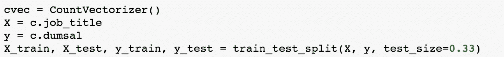
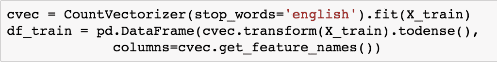
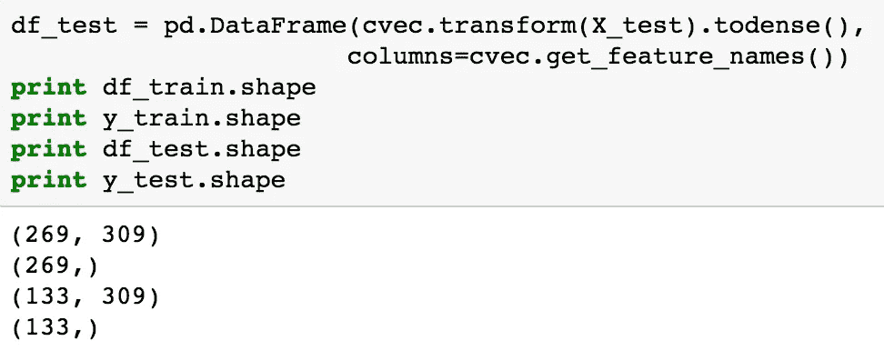
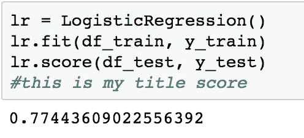
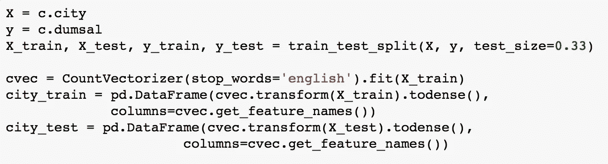
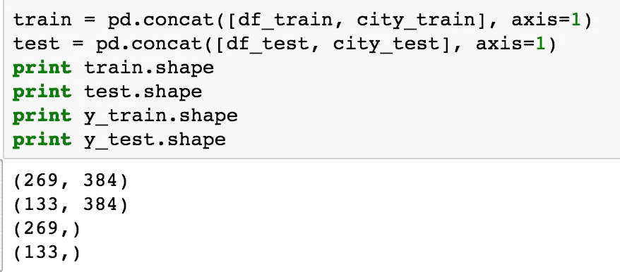
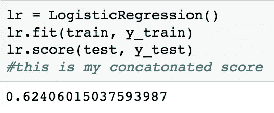

# python 中多列的自然语言处理

> 原文：<https://towardsdatascience.com/natural-language-processing-on-multiple-columns-in-python-554043e05308?source=collection_archive---------0----------------------->

当我第一次听说 NLP 的时候，我很惊讶，也有点不知所措。用最基本的术语来说，NLP 或自然语言处理通过文本数据并检查每个特征(在这种情况下是单词或字符)对于我们的因变量的预测能力的重要性。鉴于语言在我们的世界中的重要性，将数据科学扩展到定性变量的能力似乎是必不可少的。根据数据集的大小，这可能意味着它会遍历 1，000 个要素，因此计算量可能会很大，但有一些方法可以限制处理需求。

有几种不同类型的 NLP，我们在训练营中使用的主要是 CountVectorizer (CVec)和 TFIDF Vectorizer(词频逆文档频率)。知道如何在不同种类的数据中进行选择，通常只是对您的数据(或数据的子集)进行测试，看看哪一种性能更好。考虑这种差异的最简单的方法是，CVec 将计算一个单词在文档中出现的次数，而 TFIDF 将比较一个单词在文档中出现的次数和该短语在多少个文档中出现。如果一个单词只在一小部分文档中出现，TFIDF 将赋予它更高的“特征重要性”

我发现使用 NLP 的主要缺点是，除了计算量大以外，您只能在一列上运行 CVec 或 TFIDF。我正在处理从 Indeed.com 搜集的数据，我想检验一下职位和城市是否会对工资是高于还是低于中位数产生预测作用。我选择使用 CVec 来做这件事，纯粹是因为它对我正在处理的数据更有预测性。

Here’s the head of my data. Avg = salary averaged if given range, Dumsal= a dummy variable if my average salary was above or below my median salary of $106,750

我开始在我的数据顶部导入一些东西。因为我要做交叉验证和训练测试分割，所以我需要导入一些你可能不需要的东西。

在我完成导入之后，我设置了我的 X 和 y 变量，并完成了我的训练测试分割。我选择了 0.33 的测试大小，因为这是行业标准。由于我试图根据我的职位对我的虚拟工资变量进行分类，我将它们设置为我的 X 和 y。我最初试图放入多个列，当我发现我不能时，我决定写这篇博客！

当您创建 CountVectorizer 时，有一些事情需要记住:

1.  你需要在 X 列车上适应和转换
2.  您只在 X_test 上转换
3.  在转换过程中，将它们都更改为数据帧，以便稍后可以对它们执行回归

我们只适合 X_train，就像我们在 python 中处理过的其他模型一样。我们希望只根据训练数据来训练模型，然后我们想对测试数据做的就是根据我们的训练数据来转换它。我们仍然需要这两个都是数据帧，所以我们将 fit 中制作的矩阵转换为密集矩阵，这样它们就可以很容易地制作成数据帧。

在将我的 X_test 转换为密集矩阵之后，我想检查并确保我的 X_train 数据帧和 y_train 具有相同数量的特征，并且对于我的测试集也是相同的。当我发现它们确实如此时，我可以用这些术语进行回归！

我对这些数据框架进行了线性回归，发现我的得分在 0.77 左右。虽然这还不错，但我希望做得更好，所以我决定也在我的城市专栏上做 NLP！

I followed the same steps as above and fit/transformed a CVec on my city column as well.

下一步对于在多个列上完成 NLP 是最重要的。在为您选择的每个列拟合/转换 CVecs 之后，您需要将它们连接起来，这样我们就可以将它们作为一个数据帧来运行分类算法。因为我们希望它们成为特性，所以我们将沿着列连接它们，而不是将它们放在数据帧的底部。

我们可以看到，我的新 X_train 数据框架和 y_train 数据框架具有相同的列数，因此我们可以成功地对它们运行回归。最后一步只是再次运行逻辑回归，看看这个模型是否比我的第一个模型更好。

因为这个分数明显比我的原始分数差，所以我选择不使用串联数据帧，但是，嘿，我在这个过程中学到了一些新东西！

 [## sk learn . feature _ extraction . text . count vectorizer-sci kit-learn 0 . 18 . 1 文档

### 本文档适用于 sci kit-学习版本 0.18.1 -其他版本

scikit-learn.org](http://scikit-learn.org/stable/modules/generated/sklearn.feature_extraction.text.CountVectorizer.html)