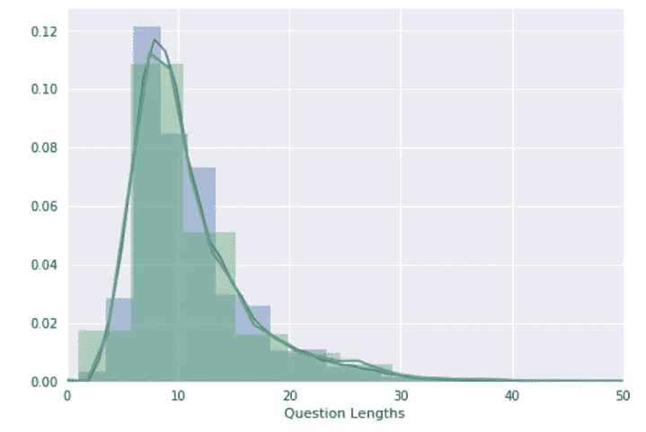
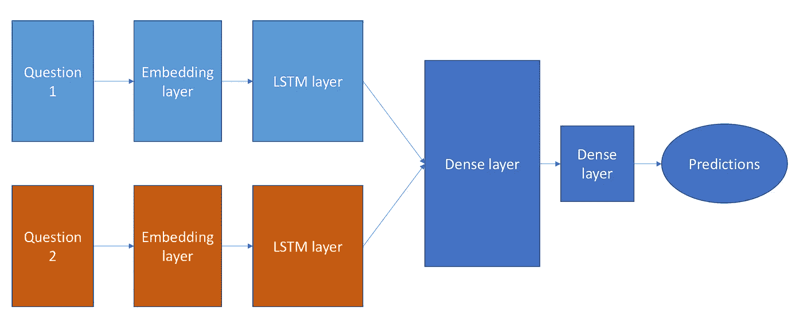
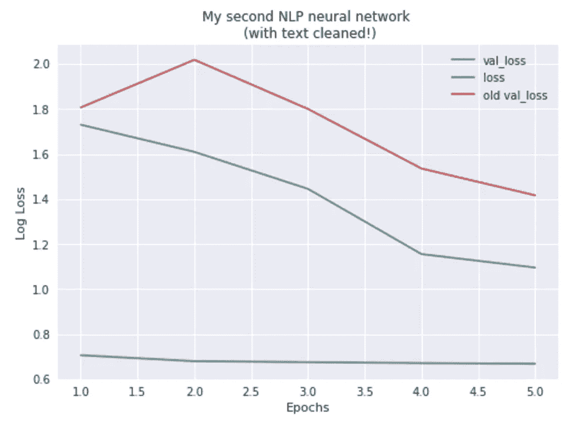
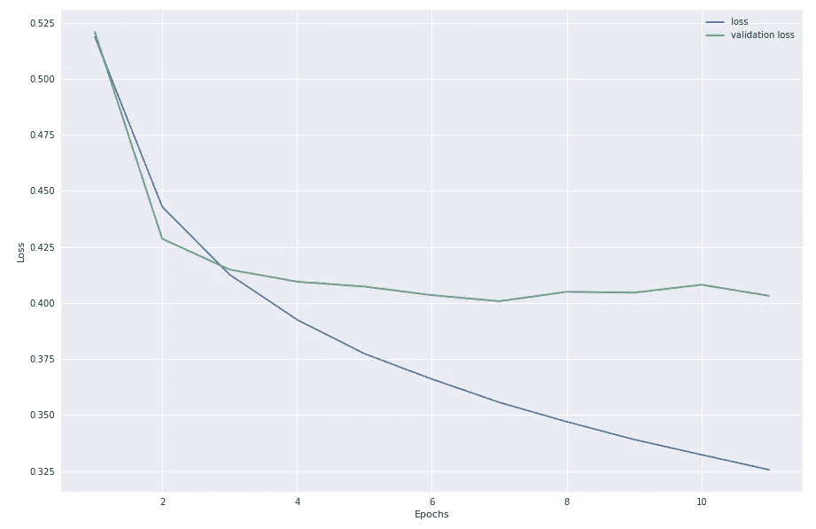

# 用 Quora 进行自然语言处理

> 原文：<https://towardsdatascience.com/natural-language-processing-with-quora-9737b40700c8?source=collection_archive---------2----------------------->

在推荐系统中使用单词嵌入之后，我现在想使用这些嵌入来创建一个自然语言处理神经网络。

内容:

0.设置和单词嵌入

1.  我的第一个自然语言处理神经网络
2.  清理文本
3.  添加附加功能

**挑战:**正确评估 Quora 上的问题是否互相重复。

Kaggle 提供的数据来自一个 csv 文件，共有五行:

```
id                                                              3
qid1                                                            7
qid2                                                            8
question1       Why am I mentally very lonely? How can I solve...
question2       Find the remainder when [math]23^{24}[/math] i...
is_duplicate                                                    0
```

其中，如果问题的意图相同，is_duplicate 为 1，否则为 0。我想用这些数据来预测测试集中的问题是否重复。

# 0.设置

[链接到代码](https://github.com/GabrielTseng/LearningDataScience/blob/master/Natural_Language_Processing/Quora/Exploration.ipynb)

首先，我需要将这个 csv 文件中的数据转换成可以输入神经网络的东西。

## 0.1 标记和填充问题

做到这一点的第一步是将问题中的单词转换成我的神经网络更容易比较的东西。幸运的是，我已经使用单词嵌入完成了这项工作(我在这里探索了)，它将单词转换成浮点数组。

Keras 的神经网络也喜欢接收相同大小的所有输入。因为不是所有的问题都是一样长的，所以我需要选择一个问题长度(每个问题我将输入多少单词到我的神经网络中)。

为了找到最佳问题长度，让我们看看问题长度在整个数据集中是如何变化的:

```
The longest question length is 237 words
The mean question lengths are 10.9422317754 and 11.1820410203
```

这不是很有帮助。我还可以画出问题长度的频率:



A plot of the frequency of question lengths in the dataset

这更能说明问题！这个数据集有一条很长的尾巴，但是绝大多数问题都少于 35 个单词。选择这个作为我的最大问题长度将比 237 个单词计算效率高得多(我将使用 300 维单词嵌入，所以这样我将训练 35*300 个数组，而不是 237*300 个数组)。

```
MAX_LENGTH = 35
```

既然我已经定义了这个长度，我想把我的问题变成由单词 embeddings 定义的 35 个元素的数组。

一种低效的方法是将字符串传递给神经网络，并有一个带有字典的嵌入层来嵌入单词。更好的方法是用一个整数表示每个单词，并有一个字典将每个单词翻译成整数。

Keras 有一个名为 Tokenizer 的函数可以做到这一点。我可以选择有多少单词被编入索引(在我的例子中，我选择了数据集中最常见的 20，000 个单词)

```
tokenizer = Tokenizer(nb_words = 20000)
tokenizer.fit_on_texts(train.question1 + train.question2)q1sequence = tokenizer.texts_to_sequences(train.question1)
q2sequence = tokenizer.texts_to_sequences(train.question2)word_index = tokenizer.word_index
```

`word_index`现在是一个字典，它将每个单词链接到一个唯一的整数(例如:’`replaces': 28265`)。

Keras 还有一个确保所有输入序列长度相同的功能:

```
q1_input = pad_sequences(q1sequence, maxlen = MAX_LENGTH)
q2_input = pad_sequences(q2sequence, maxlen = MAX_LENGTH)
```

我几乎准备好训练神经网络了！

## 0.2.添加单词嵌入

最后一步是获取这些输入，这些输入现在是长度为 35 的整数数组(其中每个整数都可以链接到一个单词)，并添加由单词嵌入捕获的有用信息。

我不能只为包含单词 embeddings 的输入创建一个数组，因为生成的数组太大了，它占用了 python 的所有内存(我试过了，当我把它保存为文本文件时，它是 18Gb)。

一个更好的方法是给我的神经网络添加一个嵌入层，其中每个输入只有在通过网络时才被赋予它的嵌入。为此，我需要制作另一个字典，它接受`q1_input`和`q2_input`中的整数，并将它们翻译成各自的单词嵌入。

第一步是打开 Glove 嵌入，这是一个文本文件，并将它们转换成一个字典。然后我可以创建一个嵌入矩阵，它包含所有的手套嵌入，并将它们(通过索引)链接到`word_index`中的所有单词。

当然，并不是我的数据中的每个单词都有一个手套式的等价物(例如，有些人会拼错单词)；如果是这种情况，我让向量只有零。

有了这个嵌入矩阵，我就可以创建一个嵌入层，它将成为我的神经网络的输入层:

```
embedding_layer = Embedding(len(word_index) + 1,
                            EMBEDDING_DIM,
                            weights=[embedding_matrix],
                            input_length=MAX_LENGTH,
                            trainable=False)
```

我现在有了训练神经网络的所有要素！

# 1.我的第一个自然语言处理神经网络

递归神经网络(我在这里看的是)有很大的意义；为了让我的神经网络理解一个问题背后的意图，它需要记住第一个单词是什么，即使它到了第十个单词。

我还想让我的神经网络分别考虑这两个问题，从中提取意义，然后再一起考虑。



The architecture of my neural network. The LSTM (recurrent) layers extract meaning from the questions, before a dense layer compares them. A batch normalization layer was present between every layer, and dropout was used to prevent overfitting. Note: here is a fantastic [blog post](http://blog.echen.me/2017/05/30/exploring-lstms/?utm_source=Mailing+list&utm_campaign=479f35fbcc-Kaggle_Newsletter_06-29-2017&utm_medium=email&utm_term=0_f42f9df1e1-479f35fbcc-402440637) on how LSTMs work.

训练该神经网络 5 个时期产生 1.4161 的确认损失:

```
Epoch 5/5
322894/322894 [==============================] - 131s - loss: 0.6615 - val_loss: 1.4161
```

这不是一个很好的结果，但是当你考虑我是如何处理这个问题的时候，这是有意义的；我根本没有对问题进行预处理。这势必会降低我的网络的准确性。例如，在 Quora 上，人们很容易出现拼写错误。

事实上，在我的`word_index`字典中的 96500 个单词中，有 36169 个没有手套的对等词。这意味着超过 1/3 的被发送到我的神经网络的嵌入数组都是零！

# 2.清理文本

让我们来看看 Quora 数据集中的一些问题:

```
question 1: Which one dissolve in water quikly sugar, salt, methane and carbon di oxide?
question 2: Which fish would survive in salt water?
```

单词“quikly”拼错了，并且没有手套的对等词，尽管很明显作者**想要**写“quickly ”,事实也的确如此。

幸运的是，一个 Kaggle 用户(Currie32)已经找到了一个[清理文本的好方法](https://www.kaggle.com/currie32/the-importance-of-cleaning-text)，我可以在我的模型中实现它。它去掉了无用的词(如`the`)，并清除了文本中明显的拼写错误。例如，相同的问题对后清理是

```
question 1: one dissolve in water quickly sugar salt methane carbon di oxide
question 2: fish would survive in salt water
```

在干净的文本上运行模型(注意:这需要重新制作`word_index`字典和嵌入矩阵)在 5 个时期后产生 1.0955 的验证损失，明显更好的性能:



The output of my neural network with cleaned text. For comparison, the validation loss of the first network is plotted in red as ‘old val_loss’.

虽然这个性能比最好的 Kaggle 分数差了很多，但是验证损失根本没有收敛。

## 收敛训练



Training to convergence yielded a minimum loss of 0.4008\. Overfitting still occurs.

注意:作为 Keras 的一个怪癖，这个模型在 Tensorflow 上的训练比在 Theano 上好得多。

虽然这是一个不坏的模型(它有 81%的准确率)，但它与 Kaggle 最好的提交材料相去甚远。为了与 Kaggle 的排行榜竞争，在训练我的神经网络时，我还需要考虑一件事:

# 3.(奖金！)添加附加功能

Kaggle 将泄漏定义为“在训练数据中创建意外的附加信息”。换句话说，除了问题本身，我还能从我得到的训练数据中提取什么来改进我的模型？

因为这些特征是在进行竞赛时意外创建的，所以它们不能真实地反映数据集(即 Quora 本身不能使用这些特征来识别问题是否重复，这些特征对于如何创建该数据集是唯一的)。

有两个额外的特征被证明非常能预测问题是否是重复的:

1.  问题在数据集中出现的[频率](https://www.kaggle.com/jturkewitz/magic-features-0-03-gain)
2.  问题之间的[交集](https://www.kaggle.com/tour1st/magic-feature-v2-0-045-gain)(问题 1 数据集和问题 2 数据集共有的问题数量)。

仅仅增加这两个泄漏就减少了我在 5 个纪元后对`0.7754`的验证损失！(与清理数据集的`1.0955`和最初使用 Theano 后端时的`1.4161`相比)。

# 结论

从这里可以得到一些启示:

1.  **lstm 很厉害**！清理文本将“空”向量的百分比从 37%降低到 29%，因此即使只有 71%的单词，网络也能够以 80%的准确率正确判断问题的意图。
2.  **我输入数据的方式很重要:**除了清理数据，在训练收敛时改进我的网络的一个重要步骤是重复数据，因此问题 1 的输入是`question1 + question2`，问题 2 的输入是`question 2 + question 1`；事后看来，这完全有道理，因为问题的顺序与我的网络是否认为它们是重复的没有关系，这很容易增加我的网络可用的训练数据量。
3.  寻找数据集中存在但不明显的额外数据可以显著提高我的网络性能。与其盲目地建立一个网络并把数据扔向它，不如看看数据集来判断什么可能是重要的。