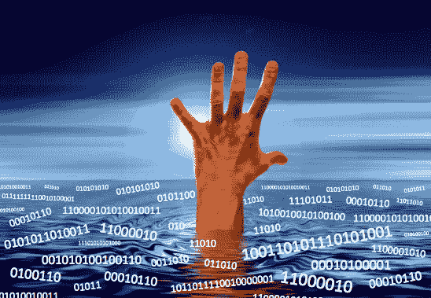

# 在数据海洋中导航:如何从数据中收获有意义的见解而不被淹没

> 原文：<https://towardsdatascience.com/navigating-the-data-seas-how-to-harvest-meaningful-insights-from-data-without-getting-overwhelmed-eac1ca1451c6?source=collection_archive---------9----------------------->

正如最近一期《经济学人》杂志所指出的，“世界上最有价值的资源不再是石油，而是数据。”随着数字革命稳步改变我们的经济，我们正在产生创纪录数量的数据。据估计，在过去的两年中产生的数据比之前所有人类历史产生的数据都多。

尽管数据量之大无可争议，但是什么让数据如此有价值呢？首先，数据允许公司监控他们的表现，并将其与有意义的基准、竞争对手的表现或一般市场进行比较。其次，数据为了解客户的偏好、需求和行为提供了一个前所未有的窗口。

在一个运作良好的数据驱动型组织中，对公司业绩和消费者行为的洞察为决策者提供了做出更明智决策所需的信息，从而带来更高的投资回报(ROI)。事实上，经济学人信息部的一项[研究发现，自称数据驱动的公司在财务表现方面比竞争对手高出三倍。](http://www.managementthinking.eiu.com/sites/default/files/downloads/Tableau_DataCulture_130219.pdf)

然而，正如未经提炼的原油用处不大一样，原始数据的用处也微乎其微。数据只有在能够从中提取相关见解的情况下才有价值。尽管数据驱动型公司正在市场上实现收益，但许多公司正在努力将数据洞察与决策有效整合。根据国际注册专业会计师协会(CGMA)发布的 [2016 年对 16 个国家 300 名高管的研究](https://www.cgma.org/resources/reports/joining-the-dots.html)，只有 27%的高管认为他们的公司“高效”利用了数据。与此同时，32%的高管声称，现在可用的数据浪潮实际上使事情变得更糟！

许多决策者(可以理解)被他们现在可以获得的大量信息淹没了。在他们的同名著作中，经验丰富的企业高管克里斯托弗·J·弗兰克和保罗·马格诺内将这种现象称为“从消防水管中喝水”决策者已经被一千个相互竞争的优先事项弄得捉襟见肘，他们如何利用数据的价值做出更好的服务客户的决策？正如《CGMA 报告》(第 13 页)所指出的:“高质量的决策从未像现在这样重要，也从未像现在这样困难。”

**信息过载**

虽然我们现在可以获得前所未有的信息，但这并不是我们人类第一次面临信息过载。事实上，早在智能手机和电脑发明之前，我们就已经面临着信息的洪流！即使我们今天设法抛开我们的数字工具，我们仍然会遇到比我们的大脑能够处理的更多的信息。

这些信息来自哪里？它来自我们周围的世界，通过我们的感觉器官:我们的眼睛、耳朵、鼻子、舌头和皮肤。我们的大脑不断受到感官信号的冲击。

世界上可用的信息比我们认知资源处理的信息多得多，比我们有意识处理的注意力资源更少。然而，不管怎样，我们必须通过一系列的决定在这个世界上闯出一条路来。我们该怎么做？

我们的大脑想办法缩小可用信息的范围，把注意力集中在最相关的片段上。

为了演示，看看下面闪烁的图像。这是两个图像之间的交替，它们之间有一个显著的区别。你能发现它吗？

你还在找吗？通常需要几秒钟，有时甚至几分钟才能发现差异。然而，一旦你发现了它，图像之间的差异似乎完全显而易见，很难不被发现！(如果你被卡住了，答案在这篇文章的底部。)

在心理学中，这种现象被称为变化盲视。这是我个人最喜欢的一幅插图，展示了有多少信息是我们意识不到的。即使当我们觉得我们正在吸收世界上大多数视觉信息时，我们有意识地处理的信息量实际上非常少。

大脑已经进化到可以通过 [*选择性过滤*](https://www.psychologytoday.com/blog/brain-babble/201502/is-how-the-brain-filters-out-unimportant-details) 来处理大量的感官输入。这意味着我们只关注一小部分信息，而忽略其他的。我们过滤掉不太可能重要的细节，以保存我们宝贵的认知资源。这样，我们就不会因为通过我们的感觉器官不断收到的大量信息而变得完全疯狂。

**数据—第二次信息泛滥**

尽管信息过载的现象可能并不新鲜，但我们现在正面临着第二种形式的信息过载。这一次，不是感官信息通过我们的眼睛、耳朵和其他感觉器官到达，而是信息以数字格式向我们袭来。我们已经进化了上亿年来处理感官信息，但只是在最近一二十年，我们才开始面对真正的数字信息浪潮。数据可能是新的石油，但我们如何利用它呢？面对数字信息的浪潮，决策者如何保持理智？

投资数据基础设施和人力资源(如分析师、数据工程师和数据科学家)是解决方案的一部分。然而，最终，为了让数据变得有用，它需要融入到决策中，这意味着任何处于决策角色的人都需要能够访问和利用数据洞察力。这意味着决策者需要不再问“我如何使用所有这些信息？”到问“什么信息是重要的，什么是可以忽略的？”换句话说，我们如何对数据进行过滤，找出对我们真正重要的东西？

在他们的书《从消防水管中喝水:在不被信息淹没的情况下做出更明智的决策》中，克里斯托弗·弗兰克和保罗·马格诺内建议决策者从问自己开始:“什么是最基本的商业问题？”

“把这个问题想象成数据软管上的一个阀门，或者一个过滤器。它让你掌控一切。它控制着你收集和处理数据的速度、流量和方向，甚至有助于决定你如何交付数据。”(Ch。1，标准杆。3)

人类产生的数据量已经高得惊人，估计每年增长 40%。随着数字革命的不断发展，每个公司都变成了数字公司。与此同时，组织仍在想办法准确地利用突然出现的大量信息。

存储数据不够。从数据中获得最大优势的组织是那些知道他们需要什么信息以及如何利用这些信息的组织。从基本问题开始，决策者可以对他们的数据进行选择性过滤。这意味着他们仍然掌握着主动权，用数据提供的强大洞察力推动他们的决策。

(变化盲演示答案:其中一张图片上，飞机机翼下少了一个喷气发动机)。

*原载于*[*www.heatherelizabethmann.com*](https://www.heatherelizabethmann.com/blog/navigating-the-data-seas-how-to-harvest-insights-from-data-without-getting-overwhelmed)*。*