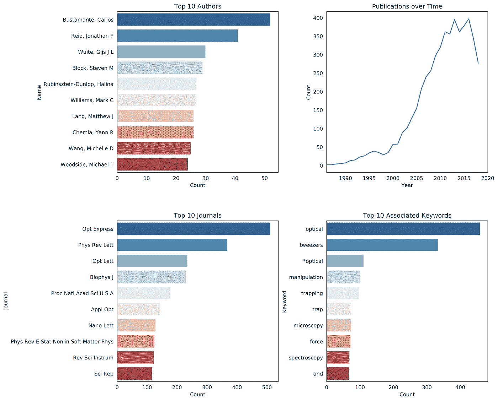
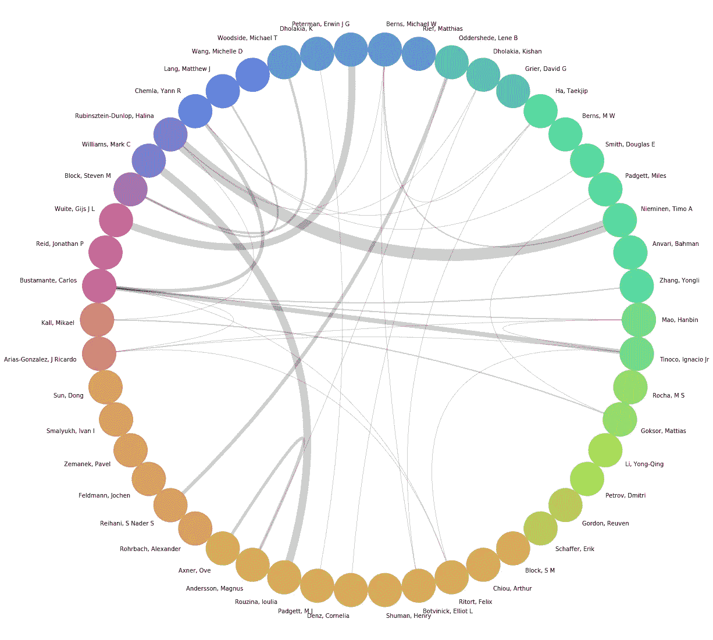
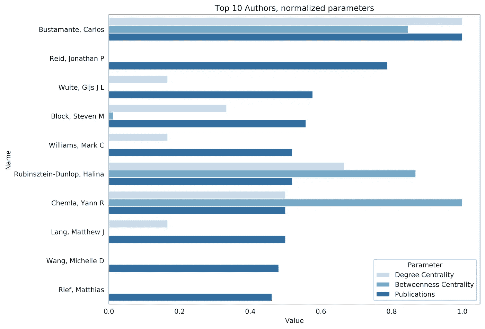

# 使用 python 快速洞察学术领域的网络分析

> 原文：<https://towardsdatascience.com/network-analysis-to-quickly-get-insight-into-an-academic-field-with-python-cd891717d547?source=collection_archive---------5----------------------->

每年十月初，科学界都会感到越来越兴奋。是时候宣布今年的诺贝尔奖得主了。从外部的角度来看，很难掌握正在发生的事情，报纸花费了大量的精力试图洞察这个世界的内部运作。现在，假设你对一个新的主题很感兴趣，你想获得一种洞察力，无论你是一名想要指导未来职业生涯的本科生，还是一名想要扩展自己视野或只是随便逛逛的有经验的科学家。当在自己的专业知识之外探索时，获得一个概述可能是压倒性的。谁是关键人物，我怎样才能认识他们，热门话题是什么？通常，在一个领域内需要几年的时间，去参加会议，阅读一份又一份出版物，才能对相关人员及其关系和贡献有一个直觉。幸运的是，通过一些 python 及其丰富的库，我们可以加速这个过程，并通过简单地分析所有相关的期刊出版物来快速洞察这个网络。

# 感兴趣的话题:2018 年诺贝尔物理学奖

例如，我们看看今年的[诺贝尔物理学奖](https://www.nobelprize.org/prizes/physics/2018/summary/)，授予亚瑟·阿什金“光镊及其在生物系统中的应用”同时获奖的还有热拉尔·穆鲁和唐娜·斯特里克兰，他们发明了啁啾脉冲放大。为了便于演示，我们将重点放在光镊领域。简而言之，光镊使用高度聚焦的激光，可以施加微微牛顿的力来固定小粒子。

# 获取摘要的生物制药

为了避免我们阅读所有的科学文献，我们将使用`b[iophython](https://biopython.org/)` [包](https://biopython.org/)从 PubMed 数据库中获取与我们的搜索查询相关的摘要。确保开始阅读 [NCBI 的 Entrez 用户要求](http://www.ncbi.nlm.nih.gov/books/NBK25497/#chapter2.Usage_Guidelines_and_Requiremen)。具体来说，我们不想让这项服务超负荷，所以请在美国高峰时间之外提出大量请求，并正确设置电子邮件参数，以便可以联系到您。作为搜索参数，我们将把`optical trap`作为关键字传递。请注意，光镊的最初术语叫做“单光束梯度力陷阱”，但由于大多数出版物都与几个关键词相关联，我们应该仍然能够获得相关的结果。为了获取，我们首先收集与关键字相关联的出版物的数量，然后收集它们的所有 id，以便以 100 个为一批连续下载。

```
Total number of publications that contain the term optical trap: 5059100%|██████████| 51/51 [01:20<00:00,  1.36s/it]Complete.
```

# 探索数据:顶级作者、时间序列、顶级期刊和顶级关键词

现在有了数以千计的出版物的信息，我们现在想深入了解这些数据。一些直接的问题可能是:谁是领先的科学家？这个领域还有人出版吗？应该看哪些期刊？我应该注意哪些关键词？为了对此有一个总体的了解，我们将研究这些数据。首先，我们将我们的`record_list`转换成一个`pandas`数据帧。感兴趣的列是作者姓名的`FAU`、期刊标题的`TA`、时间的`EDAT`和与出版物相关的关键字列表的`OT`。因为作者和关键字是作为列表存储在数据帧中的，所以我们需要首先将它们展平。这可以通过列表理解方便地完成。然后，我们可以使用集合中的计数器方法方便地提取最常见的元素，并通过使用`seaborn`创建条形图来可视化它们。



Figure 1: Exploring the data

从这四幅图中，我们可以得出一些有趣的观察结果。首先，在考察顶级作者时，我们注意到诺贝尔奖获得者阿什金并不在场。顶级学者是`Bustamante, Carlos.`当考虑一段时间内的出版物时，我们看到大多数作品都是在 2000 年之后出版的——当记住阿什金的出版物是在 1986 年时，很明显他的工作是多么重要。时间进程还告诉我们，我们现在正处于出版物数量下降的状态。与我们的搜索查询相关的出版物最多的期刊是 Optics Express。

# 可视化网络

我们现在可以更深入地挖掘我们的数据，并开始可视化科学网络。具体来说，我们将分析哪些作者一起发表了文章，以及发表的频率。为此，我们为每篇论文创建一个所有作者组合的列表，这将是我们的作者连接。这里，我们不考虑作者的立场，即一个作者是否是主要研究者。在将它转换成一个`pandas`数据帧之后，我们可以用这个数据帧和`networkx`包创建一个无向图。每个作者现在都变成了一个`node`，两者之间的连接是一个`edge.`，为了显示这个图形，我们使用了`nxviz`库，并将其显示为一个`CircosPlot`。在这里，作者排列在一个圆圈上，圆圈之间有联系。虽然我认为这对于给定的任务是一种有益的表示，但是一定要查看可以用于可视化的不同类型的图表
此外，我们将图表限制在前 50 名作者中。作者连接数将通过决定连接线宽的参数`edge_width`来反映。我们将通过出版物计数来确定节点的数量，以便出版物的数量从拥有最多论文的学者开始顺时针减少(`Bustamante, Carlos`)。



Figure 2: A CircosPlot of the scientific network of the TOP 50 Authors

有了 CircosPlot，我们现在有了一个科学网络的彩色表示，可以立即发现最重要的人在网络中的联系程度。我们可以看到，在这个前 50 名的网络中，许多作者都有很好的关系，而其他人，即使他们发表了很多，也完全没有关系。虽然这种表示对于获得该领域内人员的定性概述是理想的，但我们接下来将探索如何定量评估人员的重要性。

# 网络分析:度中心性和介数中心性

为了获得最佳连接的节点，我们将计算网络的两个相关参数:`degree_centrality`和`betweenness_centrality`。前者是与节点的所有可能连接相关的连接的度量，而后者是节点是否是两个节点之间最短路径的一部分的度量。转化为我们的案例:谁有最多的合作，谁是联系其他作者的关键？

现在我们可以用这两个指标来扩展我们最初的 10 大图表。为此，我们通过前 10 名作者的最大值来标准化每个参数，以获得 0 和 1 之间的相对值:



Figure 3: Top 10 Authors with Degree and Betweenness Centrality

这让我们验证了 CircosPlot 中已经存在的一个重要观察:拥有最多论文的人不一定是这个网络中联系最好的人。在这里，`Rubinsztein-Dunlop, Halina`和`Chemla, Yann R`可以被认为是作者网络中不可或缺的一部分。

# 寻路:如何与感兴趣的人取得联系

最后，我们将探索如何使用这个网络来寻找路径，也就是说，当你认识某个教授并且想要认识另一个教授时。这很容易通过使用`networx`包装中的`all_shortest_path`来完成。举个例子，如果你碰巧知道`Ha, Taekjip`并且想要查看到`Bustamante, Carlos`的连接，我们可以计算最短路径:

```
['Ha, Taekjip', 'Chemla, Yann R', 'Bustamante, Carlos']
['Ha, Taekjip', 'Yu, Jin', 'Bustamante, Carlos']
```

这里，我们发现两条路径，一条通过`Chemla, Yann R`，我们已经在图 3 中确定了它的重要性，另一条通过`Yu, Jin`。这些结果很容易在图示中得到验证。

# 结论

这里，我们使用了几个 python 包来分析与某个科学领域相关的期刊出版物的摘要。在网络分析的帮助下，只需几行代码就能提供很好的洞察力。最终，它有助于识别在该领域有良好关系和高产的科学家。然而，强调其局限性也很重要，这源于我们在分析中使用的核心指标，即出版物的数量。可以说，这并没有反映科学工作在社区内是如何被接受的。这里，考虑引用的数量将是有益的。当考虑阿什金 1986 年的出版物时，我们可以了解到这部作品被引用了 6000 多次，其重要性显而易见。其他试图衡量影响和生产力的作者级指标，如 h-或 i-index，似乎是有益的选择。
进一步的分析可能包括这些额外的指标。地理信息可以用来显示科学家的位置。示例应用可以是做进一步的网络分析和为科学家建立推荐系统。