# 神经机器翻译—使用 seq2seq 和 Keras

> 原文：<https://towardsdatascience.com/neural-machine-translation-using-seq2seq-with-keras-c23540453c74?source=collection_archive---------1----------------------->

## 基于编解码模型的英语到法语翻译

Photo by [Kiarash Mansouri](https://unsplash.com/@kiarash_mansouri?utm_source=medium&utm_medium=referral) on [Unsplash](https://unsplash.com?utm_source=medium&utm_medium=referral)

本文是受此 [*的启发，以*](https://github.com/keras-team/keras/blob/master/examples/lstm_seq2seq.py) *和* [*为例阐述了*](https://arxiv.org/abs/1409.3215) 上的编解码网络*。*目的是从这个例子中获得直观和详细的理解。在我的 [*github 链接*](https://goo.gl/bEBhGQ) **中提供了我自己对这个例子的实现。**

在我们开始之前，它可能有助于通过 [*我的另一篇关于 LSTM*](https://medium.com/@kmsravindra123/lstm-nuggets-for-practical-applications-5beef5252092) 的文章来帮助理解 LSTM 的基本原理。

下面是用于训练 seq2seq 编码器-解码器网络的详细网络架构。我们将引用这个数字。

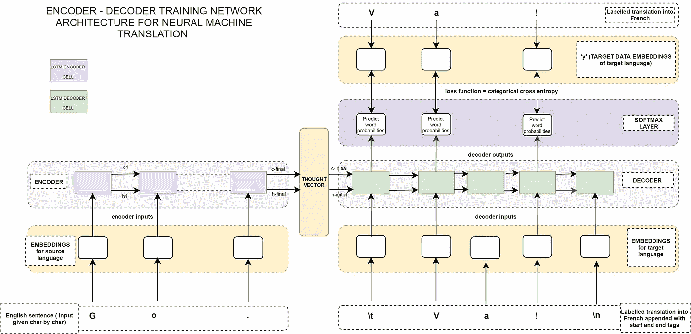

Fig A— Encoder-Decoder training architecture for NMT — image copyright@[Ravindra Kompella](https://medium.com/u/c3f8c66f5451?source=post_page-----c23540453c74--------------------------------)

首先，我们将着手训练网络。然后我们将看看如何把一个给定的英语句子翻译成法语的推理模型。推理模型(用于预测输入序列)有一个稍微不同的解码器架构，我们将在那里详细讨论。

**训练网络—**

那么训练数据看起来怎么样呢？

*   我们有 10，000 个英语句子和相应的 10，000 个翻译的法语句子。所以我们的 nb_samples = 10000。

**培训总体计划—**

1.  为英语和法语句子创建一次性字符嵌入。这些将是编码器和解码器的输入。法语一键字符嵌入也将用作损失函数的目标数据。
2.  一个字符一个字符地输入到编码器中，直到英文句子序列结束。
3.  获得最终的编码器状态(隐藏和单元状态),并将它们作为解码器的初始状态提供给解码器。
4.  解码器在每个时间步长有 3 个输入——2 个解码器状态和一个字符一个字符地输入的法国字符嵌入。
5.  在解码器的每一步，解码器的输出都被发送到 softmax 层，与目标数据进行比较。

***代码训练网络的详细流程—***

参考代码片段 1——注意，我们在法语句子的开头附加了' \t ',在法语句子的结尾附加了' \n'。这些附加的法语句子将被用作解码器的输入。所有的英文字符和法文字符都收集在不同的集合中。这些集合被转换成字符级字典(对以后检索索引和字符值很有用)。

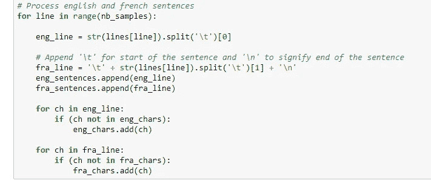

Snippet 1

参考片段 2—为编码器输入、解码器输入和目标数据嵌入准备嵌入。我们将为英语和法语中的每个字符分别创建一个热编码。这些在代码片段中被称为 *tokenized_eng_sentences* 和 *tokenized_fra_sentences* 。这些将分别是编码器和解码器的输入。请注意，与解码器输入嵌入相比，我们在 softmax 层输出比较的 *target_data* 法语字符嵌入偏移了(t+1 )(因为目标数据中没有起始标签，请参考上面的架构图以获得更多信息)。因此，下面代码片段中的 *target_data* 被相应地偏移(注意下面 *target_data* 数组的第二维中的 *k-1* )

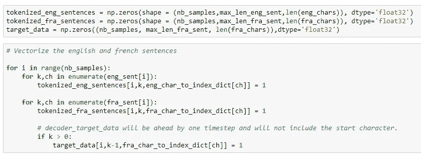

Snippet 2.

参考片段 2——正如我们在 [*中提到的，我在 LSTM*](https://medium.com/@kmsravindra123/lstm-nuggets-for-practical-applications-5beef5252092) *，*中的嵌入(*tokenized _ eng _ sentences*和*tokenized _ fra _ sentences*和 *target_data)* 是 3D 数组。第一维对应于 nb_samples ( =本例中为 10，000)。第二维对应于英语/法语句子的最大长度，第三维对应于英语/法语字符的总数。

参考代码片段 3:我们将一个字符接一个字符(当然，它们对应的一个热嵌入)输入编码器网络。对于编码器 _LSTM，我们已经设置了*返回 _ 状态=真*。我们没有做 *return_sequences = True* (默认设置为 False)。这将意味着我们在输入序列结束时仅获得最终编码的单元状态和编码的隐藏状态，而不是每个时间步长的中间状态。这些将是用于初始化解码器状态的最终编码状态。

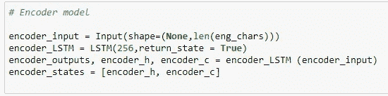

Snippet 3— Encoder model for training

参考代码片段 3 —还要注意，输入形状已经被指定为 *(None，len(eng_chars))* 。这意味着编码器 LSTM 可以动态地展开与字符数一样多的时间步长，直到到达该句子序列的末尾。

参考代码片段 4——解码器的输入将是法语字符嵌入(包含在 *tokenized_fra_sentences* 数组中),在每个时间步一个接一个，以及先前的状态值。解码器第一步的先前状态将用我们之前在代码片段 3 中收集的最终编码器状态进行初始化。因此，请注意在下面的代码片段中已经设置了*初始状态=编码器状态*。从随后的步骤开始，解码器的状态输入将是其单元状态和隐藏状态。

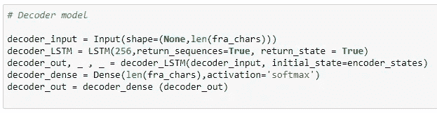

Snippet 4 — Decoder model for training

同样从上面的代码片段中，请注意解码器设置为***return _ sequences = True***以及***return _ state = True***。因此，我们在每个时间步长获得解码器输出和两个解码器状态。虽然这里已经声明了***return _ state = True***，但是在训练模型时我们不打算使用解码器状态。其存在的原因是它们将在构建解码器推理模型时使用(我们将在后面看到)。解码器输出通过 softmax 层传递，该层将学习对正确的法语字符进行分类。

参考片段 5——损失函数是分类交叉熵，它是通过将 softmax 层的预测值与 *target_data* (一个热门法语字符嵌入)进行比较而获得的。

现在模型已经准备好进行训练了。针对指定数量的时期训练整个网络。

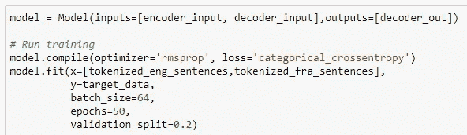

Snippet 5 — y = target_data ( containing one hot french character embeds)

**测试(推理模式)——**

以下是用于推理模型的架构——推理模型将利用训练期间学习的所有网络参数，但我们单独定义它们，因为推理期间的输入和输出不同于训练网络期间的输入和输出。

从下图可以看出，网络的编码器端没有变化。因此，我们将新的英语句子(嵌入一个热字符)向量作为输入序列馈送到编码器模型，并获得最终的编码状态。

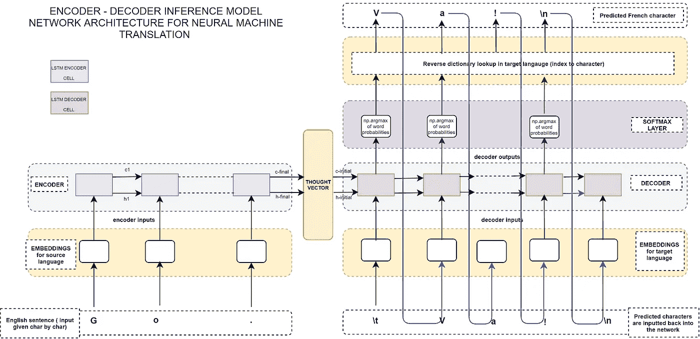

Fig B— Encoder-Decoder Inference model architecture for NMT —image copyright @[Ravindra Kompella](https://medium.com/u/c3f8c66f5451?source=post_page-----c23540453c74--------------------------------)

将解码器端的图 B 与图 A 进行对比。可以看到的主要变化如下—

*   在第一个时间步长，解码器有 3 个输入——开始标记' \t '和两个编码器状态。我们将第一个字符作为' \t '(它的一个热嵌入向量)输入到解码器的第一个时间步长中。
*   然后解码器输出第一个预测字符(假设是‘V’)。
*   观察蓝线是如何连接回下一个时间步长的解码器输入的。所以这个预测的字符“V”将在下一个时间步作为输入被馈送到解码器。
*   还要注意，在每个时间步，我们在 softmax 层的输出上使用 np.argmax 函数，仅获得预测字符的一个热嵌入向量。因此，我们在索引上进行反向字典查找，以获得实际的字符‘V’。
*   从下一时间步开始，解码器仍有 3 个输入，但不同于第一时间步。它们是先前预测字符的一个热编码、先前解码器单元状态和先前解码器隐藏状态

***鉴于以上理解，现在让我们看看代码—***

参考代码片段 6——编码器推理模型非常简单。这将只输出编码器状态。

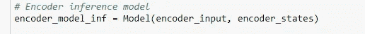

Snippet 6 — Encoder inference model

参考代码片段 7——解码器模型更加复杂。注意，我们为解码器隐藏状态和解码器单元状态创建单独的“输入”。这是因为我们将在每个时间步长(*而不是第一个时间步长)提供这些状态，回想一下，在第一个时间步长，我们仅将编码器状态*提供给解码器，解码器推理模型是一个单独的独立模型。编码器和解码器都将被递归调用，用于在翻译后的序列中生成的每个字符。

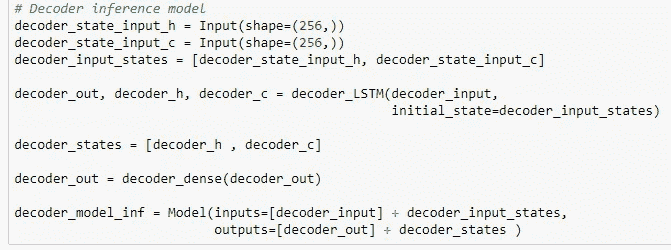

Snippet 7 — Decoder inference model

参考代码片段 8——我们将编码器状态放入 *states_val* 变量。在 while 循环内的第一次调用中，来自编码器的这些隐藏和单元状态将用于初始化作为模型输入直接提供的 *decoder_model_inf* 。一旦我们使用 softmax 预测了字符，我们现在输入这个预测的字符(使用 *target_seq* 3D 数组用于预测字符的一次热嵌入)以及更新的 *states_val* (从先前的解码器状态更新而来)用于下一次的 *while* 循环迭代。注意，在我们每次在 *while* 循环中创建预测字符的一键嵌入之前，我们重置了我们的 *target_seq* 。

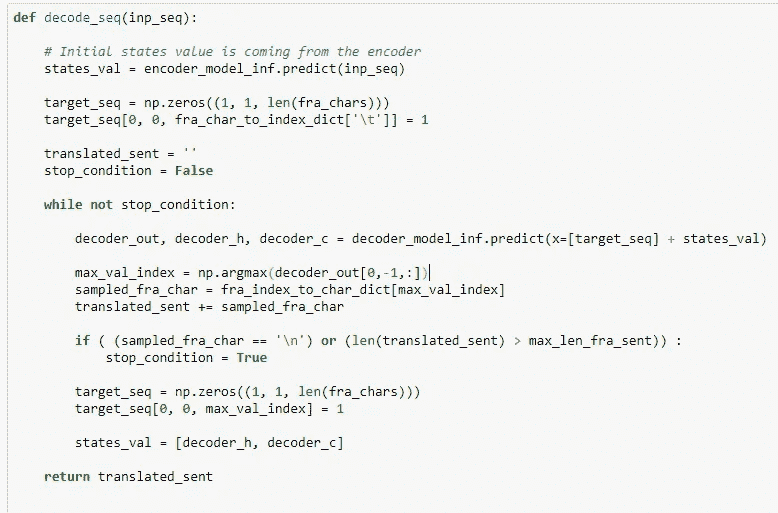

Snippet 8 — Function to recursively call the decoder for predicting the translated character sequence.

就是这样！现在我们有了一个训练有素的模型，可以把英语句子翻译成法语！下面是在训练网络 25 个时期后获得的结果。

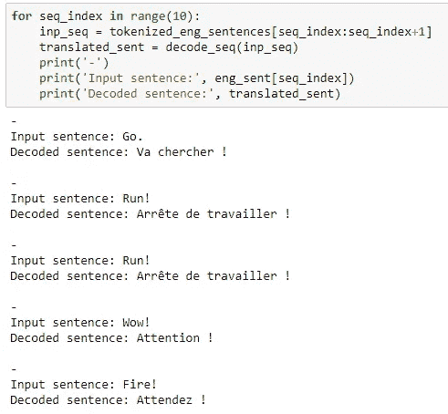

Results obtained using some sample training data

如果你打算使用任何上述架构图的数字，请随时这样做，并要求你提到我的名字在图像学分。

如果你从这篇文章中发现了什么有用的信息，请举起鼓掌图标表示你的掌声。