# 用 Python 实现神经机器翻译

> 原文：<https://towardsdatascience.com/neural-machine-translation-with-python-c2f0a34f7dd?source=collection_archive---------0----------------------->


Photo credit: eLearning Industry

机器翻译，有时简称为 **MT** 是一项非常具有挑战性的任务，研究如何使用软件将文本或语音从一种语言翻译成另一种语言。传统上，它涉及使用高度复杂的语言知识开发的大型统计模型。

在这里，我们将使用深度神经网络来解决机器翻译的问题。我们将发现如何开发一个神经机器翻译模型来将英语翻译成法语。我们的模型将接受英语文本作为输入，并返回法语翻译。更准确地说，我们将练习构建 4 个模型，它们是:

*   简单的 RNN。
*   嵌入的 RNN。
*   双向 RNN。
*   编码器-解码器模型。

训练和评估深度神经网络是一项计算密集型任务。我使用了 [AWS EC2](https://aws.amazon.com/ec2/) 实例来运行所有代码。如果您打算继续下去，您应该能够访问 GPU 实例。

# 导入库

```
import collectionsimport helper
import numpy as np
import project_tests as testsfrom keras.preprocessing.text import Tokenizer
from keras.preprocessing.sequence import pad_sequences
from keras.models import Model
from keras.layers import GRU, Input, Dense, TimeDistributed, Activation, RepeatVector, Bidirectional
from keras.layers.embeddings import Embedding
from keras.optimizers import Adam
from keras.losses import sparse_categorical_crossentropy
```

我用`[help.py](https://github.com/susanli2016/NLP-with-Python/blob/master/helper.py)`加载数据，`[project_test.py](https://github.com/susanli2016/NLP-with-Python/blob/master/project_tests.py)`用于测试我们的功能。

# 数据

数据集包含相对较少的词汇，可以在[这里](https://github.com/susanli2016/NLP-with-Python/tree/master/data)找到。`small_vocab_en`文件包含`small_vocab_fr`文件中的英语句子及其法语翻译。

**加载数据**

```
english_sentences = helper.load_data('data/small_vocab_en')
french_sentences = helper.load_data('data/small_vocab_fr')print('Dataset Loaded')
```

***数据集加载***

**例句**

`small_vocab_en`中的每一行都包含一个英文句子，而`small_vocab_fr`中的每一行都有相应的翻译。

```
for sample_i in range(2):
    print('small_vocab_en Line {}:  {}'.format(sample_i + 1, english_sentences[sample_i]))
    print('small_vocab_fr Line {}:  {}'.format(sample_i + 1, french_sentences[sample_i]))
```

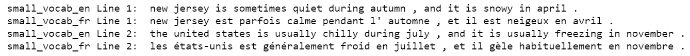

Figure 1

**词汇**

问题的复杂程度是由词汇的复杂程度决定的。更复杂的词汇是更复杂的问题。让我们看看我们将要处理的数据集的复杂性。

```
english_words_counter = collections.Counter([word for sentence in english_sentences for word in sentence.split()])
french_words_counter = collections.Counter([word for sentence in french_sentences for word in sentence.split()])print('{} English words.'.format(len([word for sentence in english_sentences for word in sentence.split()])))
print('{} unique English words.'.format(len(english_words_counter)))
print('10 Most common words in the English dataset:')
print('"' + '" "'.join(list(zip(*english_words_counter.most_common(10)))[0]) + '"')
print()
print('{} French words.'.format(len([word for sentence in french_sentences for word in sentence.split()])))
print('{} unique French words.'.format(len(french_words_counter)))
print('10 Most common words in the French dataset:')
print('"' + '" "'.join(list(zip(*french_words_counter.most_common(10)))[0]) + '"')
```

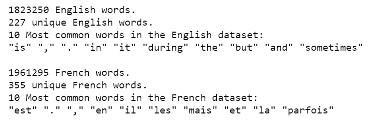

Figure 2

# 预处理

我们将使用以下预处理方法将文本转换为整数序列:

1.  将单词标记为 id
2.  添加填充以使所有序列长度相同。

**符号化**

使用 Keras 的`[Tokenizer](https://keras.io/preprocessing/text/#tokenizer)`函数将每个句子转换成一系列单词 id。使用此函数来标记`english_sentences`和`french_sentences`。

函数`tokenize`返回标记化的输入和标记化的类。

```
def tokenize(x):
    x_tk = Tokenizer(char_level = False)
    x_tk.fit_on_texts(x)
    return x_tk.texts_to_sequences(x), x_tktext_sentences = [
    'The quick brown fox jumps over the lazy dog .',
    'By Jove , my quick study of lexicography won a prize .',
    'This is a short sentence .']
text_tokenized, text_tokenizer = tokenize(text_sentences)
print(text_tokenizer.word_index)
print()
for sample_i, (sent, token_sent) in enumerate(zip(text_sentences, text_tokenized)):
    print('Sequence {} in x'.format(sample_i + 1))
    print('  Input:  {}'.format(sent))
    print('  Output: {}'.format(token_sent))
```

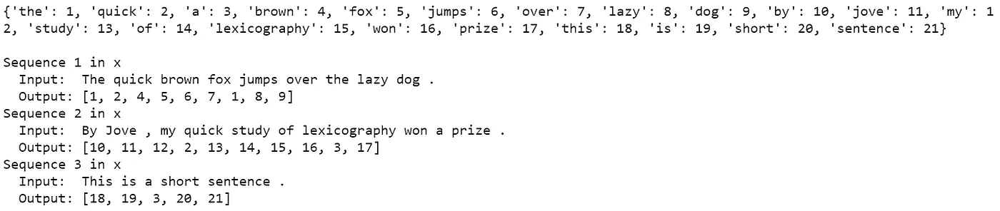

Figure 3

**填充**

通过使用 Keras 的`[pad_sequences](https://keras.io/preprocessing/sequence/#pad_sequences)`函数向每个序列的**末端**添加填充，确保所有英文序列和所有法文序列长度相同。

```
def pad(x, length=None):
    if length is None:
        length = max([len(sentence) for sentence in x])
    return pad_sequences(x, maxlen = length, padding = 'post')tests.test_pad(pad)# Pad Tokenized output
test_pad = pad(text_tokenized)
for sample_i, (token_sent, pad_sent) in enumerate(zip(text_tokenized, test_pad)):
    print('Sequence {} in x'.format(sample_i + 1))
    print('  Input:  {}'.format(np.array(token_sent)))
    print('  Output: {}'.format(pad_sent))
```

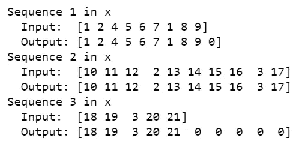

Figure 4

**预处理管道**

实现预处理功能

```
def preprocess(x, y):
    preprocess_x, x_tk = tokenize(x)
    preprocess_y, y_tk = tokenize(y)preprocess_x = pad(preprocess_x)
    preprocess_y = pad(preprocess_y)# Keras's sparse_categorical_crossentropy function requires the labels to be in 3 dimensions
    preprocess_y = preprocess_y.reshape(*preprocess_y.shape, 1)return preprocess_x, preprocess_y, x_tk, y_tkpreproc_english_sentences, preproc_french_sentences, english_tokenizer, french_tokenizer =\
    preprocess(english_sentences, french_sentences)

max_english_sequence_length = preproc_english_sentences.shape[1]
max_french_sequence_length = preproc_french_sentences.shape[1]
english_vocab_size = len(english_tokenizer.word_index)
french_vocab_size = len(french_tokenizer.word_index)print('Data Preprocessed')
print("Max English sentence length:", max_english_sequence_length)
print("Max French sentence length:", max_french_sequence_length)
print("English vocabulary size:", english_vocab_size)
print("French vocabulary size:", french_vocab_size)
```

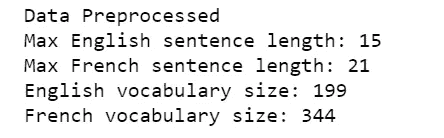

Figure 5

# 模型

在本节中，我们将实验各种神经网络架构。我们将从训练四个相对简单的架构开始。

*   模型 1 是一个简单的 RNN
*   模型 2 是具有嵌入的 RNN
*   模型 3 是双向 RNN
*   模型 4 是一个编码器-解码器 RNN

在对四个简单的架构进行实验之后，我们将构建一个更深层次的模型，该模型旨在超越所有四个模型。

**id 返回正文**

神经网络将把输入翻译成单词 ids，这不是我们想要的最终形式。我们想要法语翻译。函数`logits_to_text`将在从神经网络到法语翻译的逻辑之间架起一座桥梁。我们将使用这个函数来更好地理解神经网络的输出。

```
def logits_to_text(logits, tokenizer):
    index_to_words = {id: word for word, id in tokenizer.word_index.items()}
    index_to_words[0] = '<PAD>'return ' '.join([index_to_words[prediction] for prediction in np.argmax(logits, 1)])print('`logits_to_text` function loaded.')
```

***`logits_to_text `函数已加载。***

**车型一:RNN**

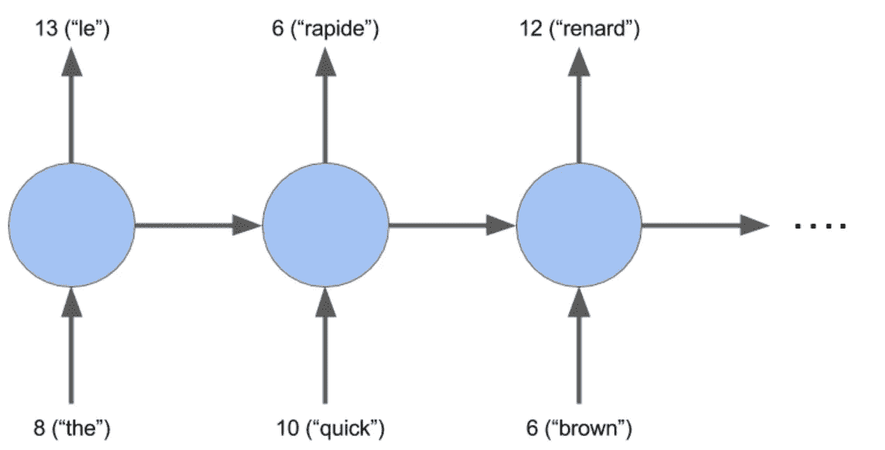

Figure 6

我们正在创建一个基本的 RNN 模型，它是将英语翻译成法语的序列数据的良好基线。

```
def simple_model(input_shape, output_sequence_length, english_vocab_size, french_vocab_size):
    learning_rate = 1e-3
    input_seq = Input(input_shape[1:])
    rnn = GRU(64, return_sequences = True)(input_seq)
    logits = TimeDistributed(Dense(french_vocab_size))(rnn)
    model = Model(input_seq, Activation('softmax')(logits))
    model.compile(loss = sparse_categorical_crossentropy, 
                 optimizer = Adam(learning_rate), 
                 metrics = ['accuracy'])

    return model
tests.test_simple_model(simple_model)tmp_x = pad(preproc_english_sentences, max_french_sequence_length)
tmp_x = tmp_x.reshape((-1, preproc_french_sentences.shape[-2], 1))# Train the neural network
simple_rnn_model = simple_model(
    tmp_x.shape,
    max_french_sequence_length,
    english_vocab_size,
    french_vocab_size)
simple_rnn_model.fit(tmp_x, preproc_french_sentences, batch_size=1024, epochs=10, validation_split=0.2)# Print prediction(s)
print(logits_to_text(simple_rnn_model.predict(tmp_x[:1])[0], french_tokenizer))
```

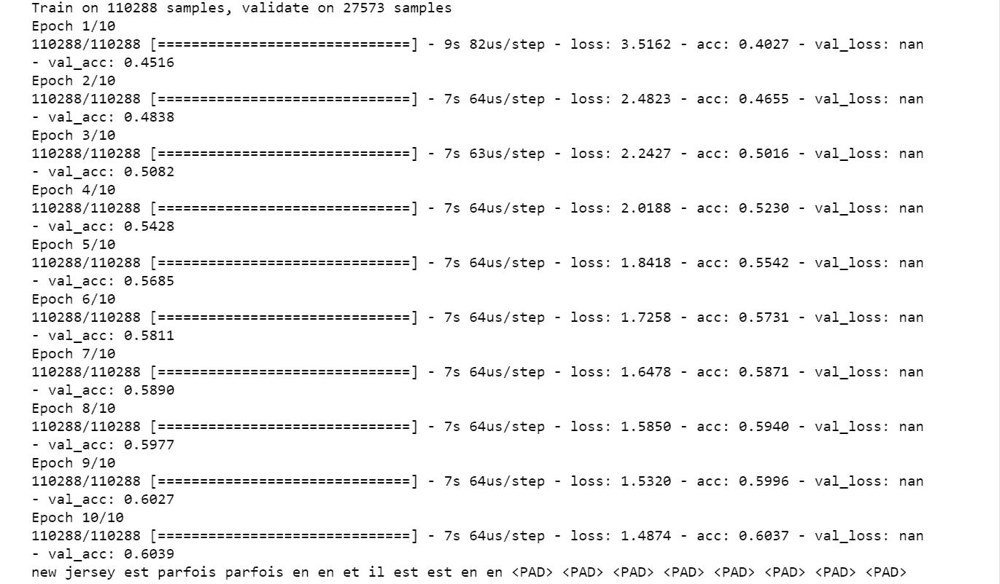

Figure 7

基本的 RNN 模型的验证精度终止于 0.6039。

**模式二:嵌入**

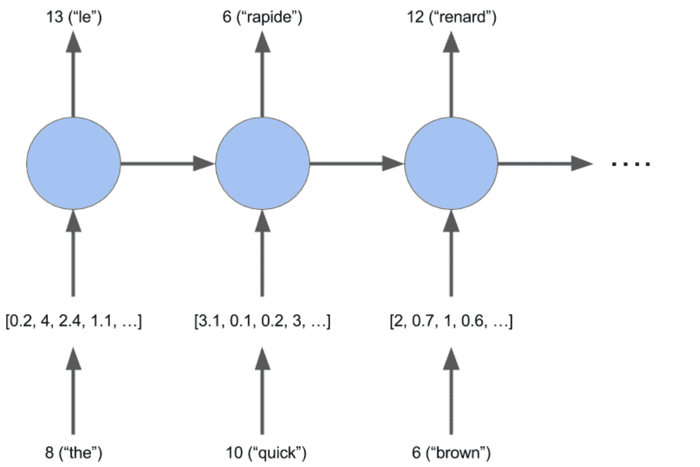

Figure 8

嵌入是在 n 维空间中接近相似单词的单词的向量表示，其中 n 表示嵌入向量的大小。我们将使用嵌入创建一个 RNN 模型。

```
from keras.models import Sequential
def embed_model(input_shape, output_sequence_length, english_vocab_size, french_vocab_size):
    learning_rate = 1e-3
    rnn = GRU(64, return_sequences=True, activation="tanh")

    embedding = Embedding(french_vocab_size, 64, input_length=input_shape[1]) 
    logits = TimeDistributed(Dense(french_vocab_size, activation="softmax"))

    model = Sequential()
    #em can only be used in first layer --> Keras Documentation
    model.add(embedding)
    model.add(rnn)
    model.add(logits)
    model.compile(loss=sparse_categorical_crossentropy,
                  optimizer=Adam(learning_rate),
                  metrics=['accuracy'])

    return model
tests.test_embed_model(embed_model)tmp_x = pad(preproc_english_sentences, max_french_sequence_length)
tmp_x = tmp_x.reshape((-1, preproc_french_sentences.shape[-2]))embeded_model = embed_model(
    tmp_x.shape,
    max_french_sequence_length,
    english_vocab_size,
    french_vocab_size)embeded_model.fit(tmp_x, preproc_french_sentences, batch_size=1024, epochs=10, validation_split=0.2)print(logits_to_text(embeded_model.predict(tmp_x[:1])[0], french_tokenizer))
```

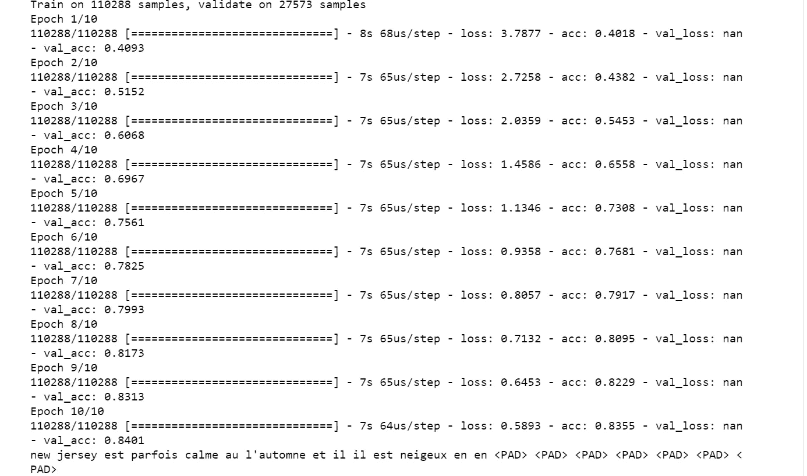

Figure 9

嵌入模型的验证精度终止于 0.8401。

**模型 3:双向 RNNs**

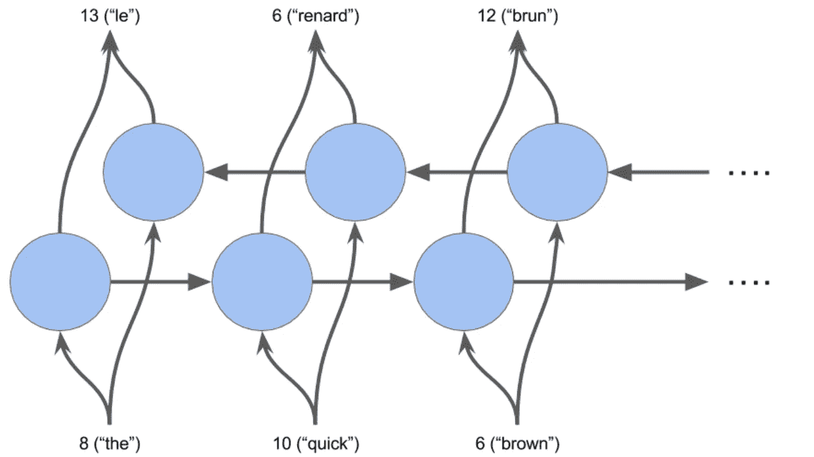

Figure 10

```
def bd_model(input_shape, output_sequence_length, english_vocab_size, french_vocab_size):

    learning_rate = 1e-3
    model = Sequential()
    model.add(Bidirectional(GRU(128, return_sequences = True, dropout = 0.1), 
                           input_shape = input_shape[1:]))
    model.add(TimeDistributed(Dense(french_vocab_size, activation = 'softmax')))
    model.compile(loss = sparse_categorical_crossentropy, 
                 optimizer = Adam(learning_rate), 
                 metrics = ['accuracy'])
    return model
tests.test_bd_model(bd_model)tmp_x = pad(preproc_english_sentences, preproc_french_sentences.shape[1])
tmp_x = tmp_x.reshape((-1, preproc_french_sentences.shape[-2], 1))bidi_model = bd_model(
    tmp_x.shape,
    preproc_french_sentences.shape[1],
    len(english_tokenizer.word_index)+1,
    len(french_tokenizer.word_index)+1)bidi_model.fit(tmp_x, preproc_french_sentences, batch_size=1024, epochs=20, validation_split=0.2)# Print prediction(s)
print(logits_to_text(bidi_model.predict(tmp_x[:1])[0], french_tokenizer))
```


Figure 11

双向 RNN 模型的验证精度终止于 0.5992。

**模型 4:编码器-解码器**

编码器创建句子的矩阵表示。解码器将该矩阵作为输入，并预测翻译作为输出。

```
def encdec_model(input_shape, output_sequence_length, english_vocab_size, french_vocab_size):

    learning_rate = 1e-3
    model = Sequential()
    model.add(GRU(128, input_shape = input_shape[1:], return_sequences = False))
    model.add(RepeatVector(output_sequence_length))
    model.add(GRU(128, return_sequences = True))
    model.add(TimeDistributed(Dense(french_vocab_size, activation = 'softmax')))

    model.compile(loss = sparse_categorical_crossentropy, 
                 optimizer = Adam(learning_rate), 
                 metrics = ['accuracy'])
    return model
tests.test_encdec_model(encdec_model)tmp_x = pad(preproc_english_sentences)
tmp_x = tmp_x.reshape((-1, preproc_english_sentences.shape[1], 1))encodeco_model = encdec_model(
    tmp_x.shape,
    preproc_french_sentences.shape[1],
    len(english_tokenizer.word_index)+1,
    len(french_tokenizer.word_index)+1)encodeco_model.fit(tmp_x, preproc_french_sentences, batch_size=1024, epochs=20, validation_split=0.2)print(logits_to_text(encodeco_model.predict(tmp_x[:1])[0], french_tokenizer))
```

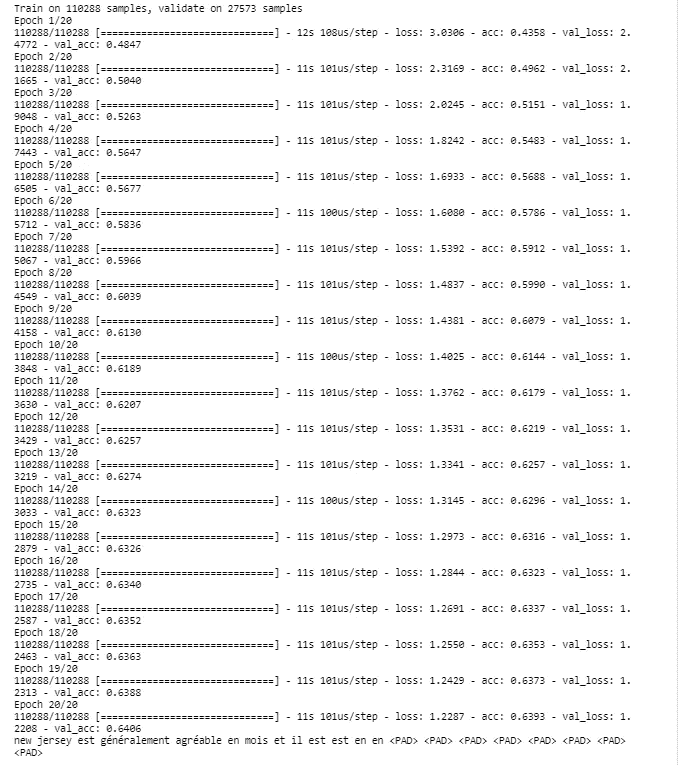

Figure 12

编码器-解码器模型的验证精度终止于 0.6406。

**型号 5:定制**

创建一个将嵌入和双向 RNN 合并到一个模型中的 model_final。

在这个阶段，我们需要做一些实验，例如将 GPU 参数更改为 256，将学习率更改为 0.005，为超过(或少于)20 个时期训练我们的模型等。

```
def model_final(input_shape, output_sequence_length, english_vocab_size, french_vocab_size):

    model = Sequential()
    model.add(Embedding(input_dim=english_vocab_size,output_dim=128,input_length=input_shape[1]))
    model.add(Bidirectional(GRU(256,return_sequences=False)))
    model.add(RepeatVector(output_sequence_length))
    model.add(Bidirectional(GRU(256,return_sequences=True)))
    model.add(TimeDistributed(Dense(french_vocab_size,activation='softmax')))
    learning_rate = 0.005

    model.compile(loss = sparse_categorical_crossentropy, 
                 optimizer = Adam(learning_rate), 
                 metrics = ['accuracy'])

    return model
tests.test_model_final(model_final)print('Final Model Loaded')
```

***最终模型载入***

# 预言；预测；预告

```
def final_predictions(x, y, x_tk, y_tk):
    tmp_X = pad(preproc_english_sentences)
    model = model_final(tmp_X.shape,
                        preproc_french_sentences.shape[1],
                        len(english_tokenizer.word_index)+1,
                        len(french_tokenizer.word_index)+1)

    model.fit(tmp_X, preproc_french_sentences, batch_size = 1024, epochs = 17, validation_split = 0.2)

    y_id_to_word = {value: key for key, value in y_tk.word_index.items()}
    y_id_to_word[0] = '<PAD>'sentence = 'he saw a old yellow truck'
    sentence = [x_tk.word_index[word] for word in sentence.split()]
    sentence = pad_sequences([sentence], maxlen=x.shape[-1], padding='post')
    sentences = np.array([sentence[0], x[0]])
    predictions = model.predict(sentences, len(sentences))print('Sample 1:')
    print(' '.join([y_id_to_word[np.argmax(x)] for x in predictions[0]]))
    print('Il a vu un vieux camion jaune')
    print('Sample 2:')
    print(' '.join([y_id_to_word[np.argmax(x)] for x in predictions[1]]))
    print(' '.join([y_id_to_word[np.max(x)] for x in y[0]]))final_predictions(preproc_english_sentences, preproc_french_sentences, english_tokenizer, french_tokenizer)
```

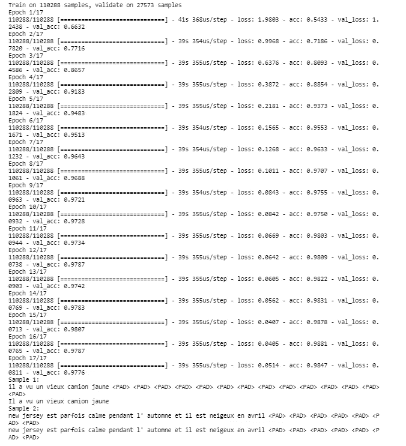

Figure 13

我们得到了两个句子的完美翻译和 0.9776 的验证准确度分数！

源代码可以在 [Github](https://github.com/susanli2016/NLP-with-Python/blob/master/machine_translation.ipynb) 找到。我期待听到反馈或问题。