# 从头开始的神经网络(使用 Numpy)

> 原文：<https://towardsdatascience.com/neural-net-from-scratch-using-numpy-71a31f6e3675?source=collection_archive---------3----------------------->


image Source: Data Flair

这篇文章是关于使用 Python 中的 numpy 库为分类问题从头构建一个浅层 NeuralNetowrk(nn )(只有一个隐藏层),并与 LogisticRegression(使用 scikit learn)进行性能比较。

从头开始构建神经网络有助于理解神经网络在后端如何工作，这对于构建有效的模型是必不可少的。让我们毫不迟疑地从头开始构建简单的浅层神经网络模型。

完整的代码可在 [**这里**](https://github.com/Msanjayds/NeuralNets/blob/master/Classficatin_NN%20vs%20LogisticReg.ipynb) 。

对于这项任务，我正在使用 scikit learn 数据集生成器 **make_gaussian_quantiles** 函数生成数据集(生成各向同性高斯样本并按分位数标记样本)。生成的输入数据集将有两个特征(“X1”和“X2”)，输出“Y”将有两个类(红色:0，蓝色:1)，共有 200 个示例。

```
def load_extra_datasets():  
    **N = 200**
    **gaussian_quantiles** = **sklearn.datasets.make_gaussian_quantiles**
     (mean=None, cov=0.7, n_samples=N, **n_features=2, n_classes=2**,  shuffle=True, random_state=None)
    return  gaussian_quantilesgaussian_quantiles= load_extra_datasets()
X, Y = gaussian_quantiles
X, Y = X.T, Y.reshape(1, Y.shape[0])# Visualize the data
plt.scatter(X[0, :], X[1, :], c=Y, s=40, cmap=plt.cm.Spectral);
```

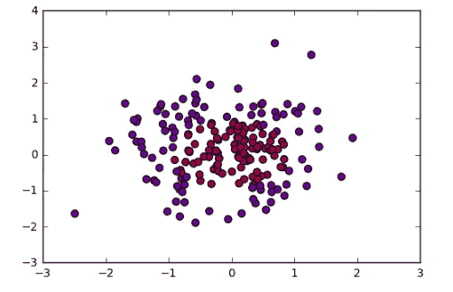

生成的数据集有两个类，分别标为红色和蓝色的点。我们的目标是建立一个机器学习分类器，在给定 X 和 Y 坐标的情况下预测正确的类别。正如我们在图中看到的，数据不是线性可分的，所以我们不能画一条直线来分隔这两个类。这意味着线性分类器，如逻辑回归，将无法适合这些类型的数据。在这种情况下，神经网络会帮助我们。在神经网络中，不需要特征工程，因为隐藏层会自动学习特征模式，以准确地对数据进行分类。

## **逻辑回归**:

首先，让我们使用输入的 x 和 y 值训练一个 LR 分类器，输出将是预测的类(0 或 1)。我们将使用 *scikit-learn* 中的回归类

```
clf = sklearn.linear_model.LogisticRegressionCV()
clf.fit(X.T, Y.T)# Plot the decision boundary for logistic regressionplot_decision_boundary(lambda x: clf.predict(x), X, Y)
plt.title("Logistic Regression")# Print accuracyLR_predictions = clf.predict(X.T)
print ('Accuracy of logistic regression: %d ' % float((np.dot(Y,LR_predictions) + np.dot(1-Y,1-LR_predictions))/float(Y.size)*100) +
       '% ' + "(percentage of correctly labelled datapoints)")
```

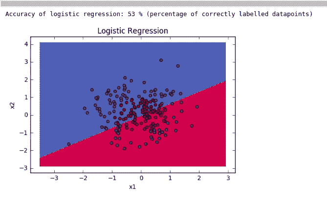

从上面我们可以看到，LR 只能正确分类 53%的数据点，因为这些数据点不是线性可分的。

# **神经网络**:

现在让我们建立一个简单的神经网络，1 个隐藏层，4 个神经元。输入层将有 2 个节点，因为我们的数据有两个特征(X1 和 X2)，输出层将有一个节点，根据概率阈值，我们将输出分类为红色或蓝色(0 或 1)。

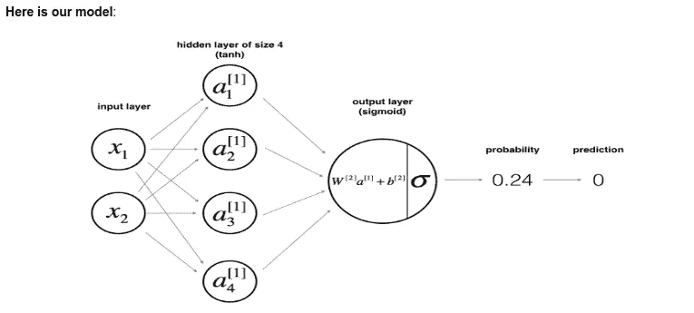

Source: Andrew Ng’s Coursera

我们需要做以下步骤来建立我们的神经网络模型。

*   定义网络结构(输入单元数量、隐藏单元数量等)。
*   初始化模型的参数
*   循环执行以下步骤，直到我们获得最小成本/最佳参数。

1.  实现向前传播
2.  计算损失
3.  实现反向传播以获得梯度
4.  更新参数

*   然后将上述所有步骤合并成一个函数，我们称之为‘nn _ model()’。
    一旦我们建立了“nn_model()”并学习了正确的参数，我们就可以对新数据进行预测。

1.  **定义网络结构**:如前所述，输入层的节点数为 2，隐藏层的节点数为 4。通过在这一层选择更多的节点，我们可以使模型学习复杂的函数。但是进行预测和学习网络参数需要大量的计算。更多的隐藏层和节点也会导致我们的数据过度拟合。

```
#X and Y are the input and output variables **n_x = X.shape[0] # size of input layer`
    n_h = 4
    n_y = Y.shape[0] # size of output layer**
```

**2。初始化模型的参数** : W1(隐藏层的权重矩阵)和 W2(输出层的权重矩阵)参数使用 numpy 随机函数随机初始化。乘以 0.01，因为我们不希望初始权重过大，因为这会导致学习速度变慢。b1 和 b2 被初始化为零。

W1 —隐藏层的形状权重矩阵(n_h，n _ x)
B1—形状偏差向量(n_h，1)
W2 —输出层的形状权重矩阵(n_y，n _ h)
B2—形状偏差向量(n_y，1)

```
 W1 = np.random.randn(n_h,n_x) * 0.01
    b1 = np.zeros(shape=(n_h, 1))
    W2 = np.random.randn(n_y,n_h) * 0.01
    b2 = np.zeros(shape=(n_y, 1))
```

**3。前向传播:**在前向传播期间，输入特征矩阵被馈送到隐藏层中的每个神经元。其将乘以相应的初始权重集(W1)和偏差集(b1)以形成 Z1 矩阵(给定输入的线性变换)。然后，我们通过激活函数将非线性应用于 Z1(以应用非线性)。我们选择“tanh”作为我们的激活函数，因为它适合许多场景。这个激活函数/隐藏层的输出将是 a1(这是一个大小为(4，1)的矩阵，包含来自 4 个神经元的激活，即 A1、a2、a3、a4)。

对于下一层，在我们的情况下是最终输出层，我们将来自前一层(A1)的输入乘以输出层(W2)的初始权重，加上偏差(b2)以形成 Z2。然后在 Z2 上应用 sigmoid 激活函数以产生最终输出 A2(这是我们的预测)。我们使用 sigmoid 作为最后一层，因为我们希望我们的输出介于 0 和 1 之间。基于概率阈值，我们可以决定输出是红色还是蓝色。这就是 nn 如何在前向传播期间进行预测，这只是一系列矩阵乘法和激活函数的应用。

```
# Implement Forward Propagation to calculate A2 (probabilities)
    Z1 = np.dot(W1,X) + b1
    A1 = np.tanh(Z1)
    Z2 = np.dot(W2,A1) + b2
    A2 = sigmoid(Z2) # Final output prediction
```

**4。计算损失:**现在我们有了我们的预测，下一步将是检查我们的预测与实际值有多大差异，即损失/误差。这里我们不使用均方差(MSE)来计算我们的损失，因为我们的预测函数是非线性的(sigmoid)。平方预测将导致具有许多局部最小值的非凸函数。在这种情况下，梯度下降可能找不到最优的全局最小值。因此，我们使用二元**交叉熵**损失(用于误差估计的对数似然方法)，该成本函数本质上是凸的，因此到达全局最小点(最小损失点)将更容易。下面是成本函数公式和代码。

m:训练实例的数量

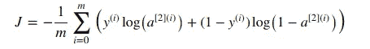

```
# Compute the cross-entropy costlogprobs = np.multiply(np.log(A2), Y) + np.multiply((1 - Y), np.log(1 - A2)
cost = - np.sum(logprobs) / m
```

**5。反向传播/梯度下降(GD)** :反向传播用于计算损失函数相对于模型参数(w1，b1，w2，b2)的梯度(斜率/导数)。为了最小化我们的成本，我们使用 GD 算法，该算法使用计算的梯度来更新参数，使得我们的成本随着迭代不断降低，即，它有助于向全局最小值移动。

*   以下是每个模型参数的梯度/斜率计算公式。“m”是训练样本的数量。

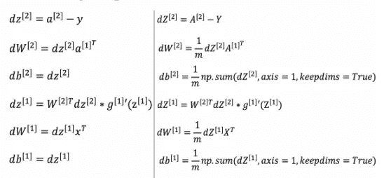

Sourced from Coursera

```
 dZ2 = A2 - Y
    dW2 = (1 / m) * np.dot(dZ2, A1.T)
    db2 = (1 / m) * np.sum(dZ2, axis=1, keepdims=True)
    dZ1 = np.multiply(np.dot(W2.T, dZ2), 1 - np.power(A1, 2))
    dW1 = (1 / m) * np.dot(dZ1, X.T)
    db1 = (1 / m) * np.sum(dZ1, axis=1, keepdims=True)
```

**6。更新参数**:一旦我们计算出我们的梯度，我们将它们乘以一个称为学习率(收敛率)的因子，并从初始参数中减去以获得更新的参数(权重和偏差)。学习率应该是最小的，这样我们就不会错过全局最小点。

*   用学习率乘以梯度
*   从重量中减去

```
 W1 = W1 - learning_rate * dW1
    b1 = b1 - learning_rate * db1
    W2 = W2 - learning_rate * dW2
    b2 = b2 - learning_rate * db2
```

现在，我们已经为所有训练示例执行了一轮前向传播和后向传播，即，我们完成了 1 个时期。我们需要在多个时期重复这些步骤，直到我们的成本最小(模型达到全局最小点)或者学习停止(参数没有更新)。

下面是函数“nn_model ”,它在给定的时期数(num_iterations)内重复执行上述所有操作，并在每 1000 个时期后打印成本。该函数的输出将是最终的一组优化参数(重量/基数)。

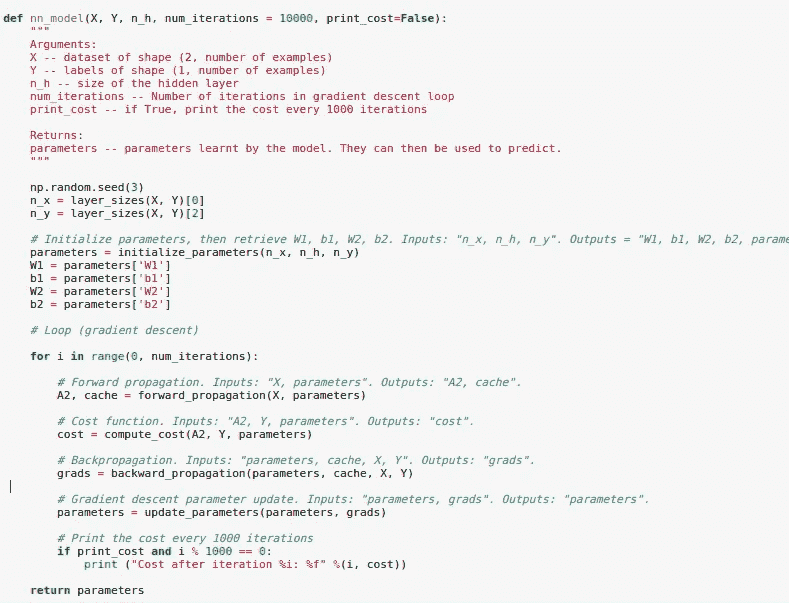

**7。预测**:下面是使用学习到的参数进行预测的函数，只需向前传播即可。我们将阈值设置为 0.5，如果最终层(A2)的输出是> 0.5，那么我们将其分类为 1:蓝色，否则为 0:红色。

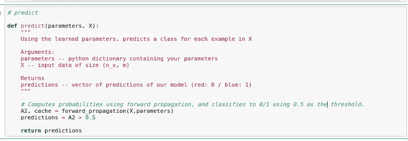

现在，让我们通过运行函数 **nn_model** 超过 5000 个时期来训练我们的最终模型，并查看结果。

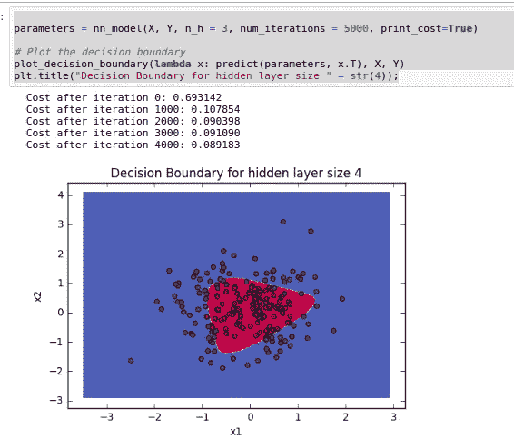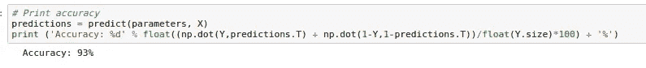

从结果可以看出，我们的神经网络模型很好地学习了模式。其能够学习分隔类别的非线性决策边界。而我们的成本从 0.69 开始，经过 4000 个纪元达到 0.089。最终的准确率达到 93%,这比我们从逻辑回归得到的只有 53%要高得多。

**调整隐藏层大小**:下一步是决定隐藏层神经元的最佳数量，看看我们的模型是否能在不过度拟合的情况下做得更好。为此，让我们使用不同数量的节点(1、2、3、4、5、20、50)来训练模型，并查看结果。

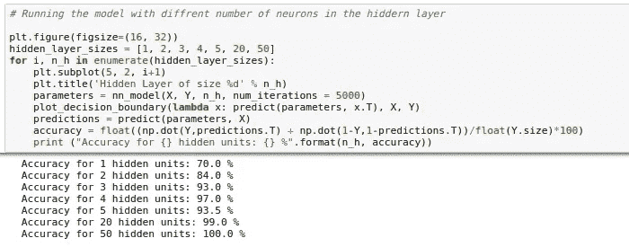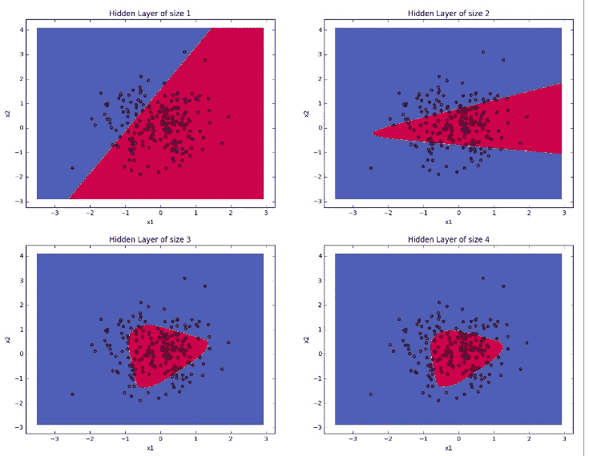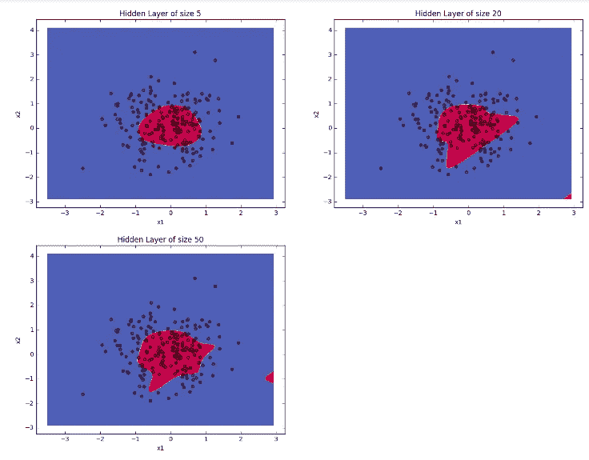

以下是这次测试的结果。

*   较大的模型(具有更多隐藏单元)能够更好地拟合训练集，直到最大的模型最终过度拟合数据。我们可以看到，在 n_h = 50 时，该模型似乎过拟合(100%精度)。
*   最佳隐藏层大小似乎在 n_h = 4 左右。事实上，这里的一个值似乎与数据吻合得很好，而不会引起明显的过度拟合。

非常感谢您阅读到最后，请评论任何建议/修改。请吧👏如果你喜欢邮报…😉