# 神经网络架构

> 原文：<https://towardsdatascience.com/neural-network-architectures-156e5bad51ba?source=collection_archive---------0----------------------->

深度神经网络和深度学习是强大和流行的算法。他们的成功很大程度上在于神经网络架构的精心设计。

我想在深度学习的背景下重温过去几年神经网络设计的历史。

关于这里报道的所有网络的更深入的分析和比较，请参见我们的[最近的文章](https://arxiv.org/abs/1605.07678)(以及[更新的帖子](https://medium.com/@culurciello/analysis-of-deep-neural-networks-dcf398e71aae))。这篇文章中的一个代表人物是:

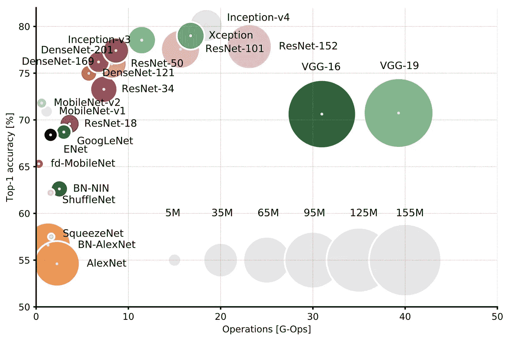

Top1 vs. operations, size ∝ parameters. Top-1 one-crop accuracy versus amount of operations required for a single forward pass. See also [here](https://medium.com/@culurciello/analysis-of-deep-neural-networks-dcf398e71aae)

在多种流行的神经网络架构中，报告单次正向传递所需的最高单作物精度与操作量。

# LeNet5

这是 1994 年，这是最早的卷积神经网络之一，推动了深度学习领域的发展。自 1988 年以来，经过多次成功的反复，Yann LeCun 的这项开创性工作被命名为 [LeNet5](http://yann.lecun.com/exdb/publis/pdf/lecun-01a.pdf) ！

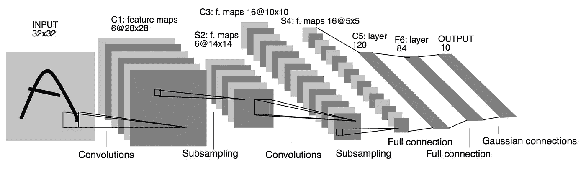

LeNet5 架构是基础，特别是图像特征分布在整个图像上的观点，并且具有可学习参数的卷积是在多个位置用很少的参数提取相似特征的有效方法。当时没有 GPU 来帮助训练，甚至 CPU 也很慢。因此，能够节省参数和计算是一个关键的优势。这与使用每个像素作为大型多层神经网络的单独输入形成对比。LeNet5 解释说，这些不应用于第一层，因为图像是高度空间相关的，使用图像的单个像素作为单独的输入特征不会利用这些相关性。

LeNet5 的特点可以概括为:

*   卷积神经网络使用 3 层序列:卷积、池化、非线性–>这可能是本文以来图像深度学习的关键特征！
*   使用卷积提取空间要素
*   使用地图空间平均值的二次抽样
*   tanh 或 sigmoids 形式的非线性
*   多层神经网络(MLP)作为最终分类器
*   层间连接矩阵稀疏，避免计算量大

总的来说，这个网络是最近许多架构的起源，也是这个领域许多人的真正灵感。

# 差距

从 1998 年到 2010 年，神经网络处于酝酿阶段。大多数人都没有注意到他们不断增强的力量，而其他许多研究人员却在慢慢进步。由于手机相机和廉价数码相机的兴起，越来越多的数据可用。计算能力在上升，CPU 变得更快，GPU 成为通用计算工具。这两种趋势都推动了神经网络的发展，尽管速度很慢。数据和计算能力使得神经网络处理的任务越来越有趣。然后很明显…

# 丹·奇雷桑网

2010 年，Dan Claudiu Ciresan 和 Jurgen Schmidhuber 发表了第一批 GPU 神经网络的实现之一。该实现在一个高达 9 层神经网络的[英伟达 GTX 280](http://www.geforce.com/hardware/desktop-gpus/geforce-gtx-280) 图形处理器上向前和向后实现。

# AlexNet

2012 年，Alex Krizhevsky 发布了 [AlexNet](https://papers.nips.cc/paper/4824-imagenet-classification-with-deep-convolutional-neural-networks.pdf) ，这是 LeNet 的一个更深入、更广泛的版本，并以较大优势赢得了困难的 ImageNet 竞赛。

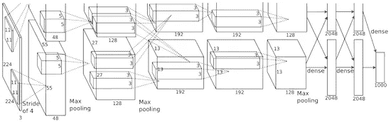

AlexNet 将 LeNet 的见解扩展为一个更大的神经网络，可以用来学习更复杂的对象和对象层次。这项工作的贡献是:

*   使用校正线性单位(ReLU)作为非线性
*   在训练过程中使用丢弃技术选择性地忽略单个神经元，这是一种避免模型过度拟合的方法
*   重叠最大池，避免平均池的平均效应
*   使用 GPU[英伟达 GTX 580](http://www.geforce.com/hardware/desktop-gpus/geforce-gtx-580/specifications) 减少培训时间

当时，GPU 提供的内核数量比 CPU 多得多，训练时间也快了 10 倍，这反过来又允许使用更大的数据集和更大的图像。

AlexNet 的成功引发了一场小革命。卷积神经网络现在是深度学习的主力，它成为“现在可以解决有用任务的大型神经网络”的新名称。

# 吃得过多

2013 年 12 月，Yann LeCun 的 NYU 实验室提出了 [Overfeat](http://arxiv.org/abs/1312.6229) ，这是 AlexNet 的衍生产品。这篇文章还提出了学习包围盒，这后来引发了许多其他相同主题的论文。我相信学习分割物体比学习人工包围盒更好。

# VGG

牛津的 [VGG 网络](http://arxiv.org/abs/1409.1556)率先在每个卷积层中使用更小的 3×3 滤波器，并将它们组合成一个卷积序列。

这似乎与 LeNet 的原理相反，LeNet 使用大卷积来捕捉图像中的相似特征。取代 AlexNet 的 9×9 或 11×11 过滤器，过滤器开始变得更小，太危险地接近 LeNet 想要避免的臭名昭著的 1×1 卷积，至少在网络的第一层。但是 VGG 最大的优点是洞察到顺序的多重 3×3 卷积可以模拟更大感受野的效果，例如 5×5 和 7×7。这些想法也将用于最近的网络架构，如 Inception 和 ResNet。

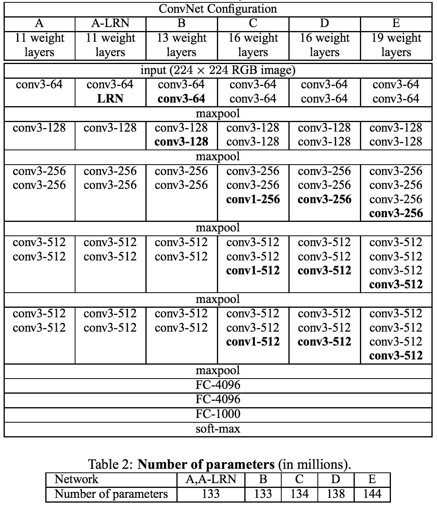

VGG 网络使用多个 3×3 卷积层来表示复杂的特征。注意，VGG-E: 256×256 和 512×512 3×3 滤波器的块 3、4、5 被按顺序多次使用，以提取更复杂的特征和这些特征的组合。这实际上就像拥有 3 层 512×512 的大型分类器，它们是卷积的！这显然意味着大量的参数和学习能力。但是这些网络的训练是困难的，不得不分成更小的网络，一层一层地增加。所有这一切都是因为缺乏强有力的方法来正则化模型，或者以某种方式限制由大量参数促进的大规模搜索空间。

VGG 在许多层中使用了大的特征尺寸，因此推断在运行时是相当[昂贵的。减少特征的数量，就像在初始瓶颈中所做的那样，将会节省一些计算成本。](http://arxiv.org/abs/1605.07678)

# 网络中的网络

[网络中的网络](https://arxiv.org/abs/1312.4400) (NiN)有着伟大而简单的洞察力，使用 1x1 卷积为卷积层的功能提供更多组合能力。

NiN 架构在每次卷积后使用空间 MLP 图层，以便在另一个图层之前更好地组合要素。同样，人们可能会认为 1x1 卷积违反了 LeNet 的原始原则，但实际上它们有助于以更好的方式组合卷积功能，而这是通过简单地堆叠更多的卷积层不可能实现的。这不同于使用原始像素作为下一层的输入。这里，1×1 卷积用于在卷积后跨要素地图在空间上组合要素，因此它们有效地使用非常少的参数，在这些要素的所有像素之间共享！

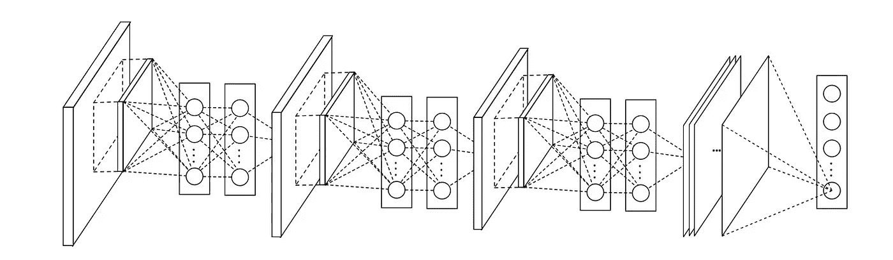

通过将单个卷积特征组合成更复杂的组，MLP 的能力可以大大提高它们的有效性。这个想法将会在最近的架构中使用，比如 ResNet、Inception 和 derivatives。

NiN 还使用了一个平均池层作为最后一个分类器的一部分，这是另一个将变得普遍的实践。这样做是为了在分类之前平均网络对输入图像的多个区域的响应。

# 谷歌网和盗梦空间

来自谷歌的克里斯蒂安·塞格迪开始了一项旨在减少深度神经网络计算负担的探索，并设计了第一个盗梦空间架构。

到现在，2014 年秋天，深度学习模型在对图像和视频帧的内容进行分类时变得非常有用。大多数怀疑论者已经承认，深度学习和神经网络这次回来了。考虑到这些技术的有用性，像 Google 这样的互联网巨头对在他们的服务器农场上高效和大规模地部署架构非常感兴趣。

Christian 想了很多方法来减少深度神经网络的计算负担，同时获得最先进的性能(例如，在 ImageNet 上)。或者能够保持相同的计算成本，同时提供改进的性能。

他和他的团队想出了盗梦空间模块:

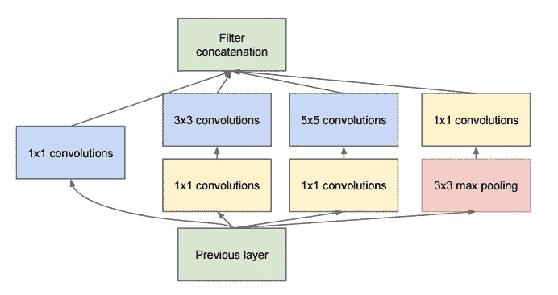

乍一看，它基本上是 1×1、3×3 和 5×5 卷积滤波器的并行组合。但是，inception 模块的伟大之处在于使用 1×1 卷积模块(NiN)来减少昂贵的并行模块之前的功能数量。这就是通常所说的“瓶颈”。这值得单独一节来解释:参见下面的“瓶颈层”一节。

GoogLeNet 使用了一个没有初始模块的词干作为初始层，以及一个类似于 NiN 的平均池加 softmax 分类器。与 AlexNet 和 VGG 的分类器相比，这个分类器的运算量也非常低。这也促成了[非常高效的网络设计](http://arxiv.org/abs/1605.07678)。

# 瓶颈层

受 NiN 的启发,《盗梦空间》的瓶颈层减少了每一层的功能和操作数量，因此推理时间可以保持在较低水平。在将数据传递到昂贵的卷积模块之前，特征的数量减少了，比如说，4 倍。这导致了计算成本的大量节省，以及这种架构的成功。

让我们详细检查一下。假设你有 256 个特性进来，256 个出来，假设初始层只执行 3x3 的卷积。也就是说，需要执行 256×256×3×3 的卷积运算(589，000 次乘法累加或 MAC 运算)。这可能超过了我们的计算预算，比如说，在谷歌服务器上 0.5 毫秒内运行这一层。我们没有这样做，而是决定减少必须进行卷积的特征数量，比如减少到 64 或 256/4。在这种情况下，我们首先执行 256 -> 64 个 1×1 卷积，然后在所有初始分支上执行 64 个卷积，然后我们再次使用来自 64 -> 256 个特征的 1x1 卷积。现在的操作是:

*   256×64 × 1×1 = 16，000 个
*   64×64 × 3×3 = 36，000 个
*   64×256 × 1×1 = 16，000 个

总计约 7 万英镑，而之前我们有近 60 万英镑。几乎减少了 10 倍的操作！

而且虽然我们做的操作少了，但是在这一层并没有失去通用性。事实上，瓶颈层已经被证明可以在 ImageNet 数据集上以最先进的方式执行，并且还将被用在 ResNet 等后来的架构中。

成功的原因是输入特征是相关的，因此可以通过将它们与 1x1 卷积适当组合来消除冗余。然后，在与少量要素卷积后，它们可以再次扩展为对下一层有意义的组合。

# 盗梦空间 V3(和 V2)

克里斯蒂安和他的团队是非常高效的研究人员。2015 年 2 月[批量规范化的 Inception](http://arxiv.org/abs/1502.03167) 作为 Inception V2 被引入。批量归一化计算图层输出中所有要素地图的平均值和标准差，并使用这些值对其响应进行归一化。这相当于“白化”数据，从而使所有的神经图具有相同范围内的响应，并且具有零均值。这有助于训练，因为下一层不必学习输入数据中的偏移，并且可以专注于如何最佳地组合要素。

2015 年 12 月，他们发布了[新版本的 Inception 模块和相应的架构](http://arxiv.org/abs/1512.00567)这篇文章更好地解释了最初的 GoogLeNet 架构，给出了更多关于设计选择的细节。最初的想法有:

*   通过精心构建深度和宽度平衡的网络，最大化流入网络的信息。每次汇集前，增加特征地图。
*   当深度增加时，特征的数量或层的宽度也系统地增加
*   在每一层使用宽度增加来增加下一层之前的要素组合
*   如果 5×5 和 7×7 滤波器可以用多个 3×3 来分解，则尽可能只使用 3×3 卷积。见图:

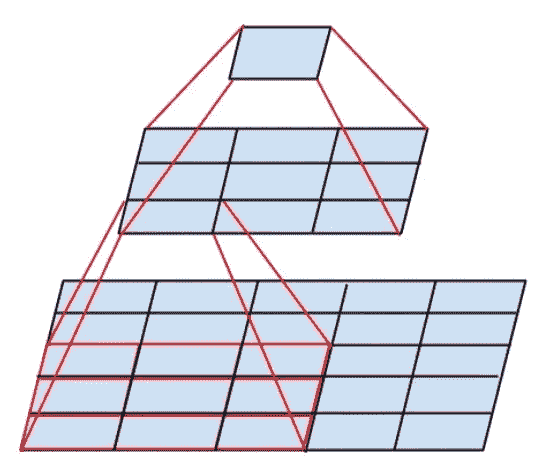

*   因此，新的初始模块变成:

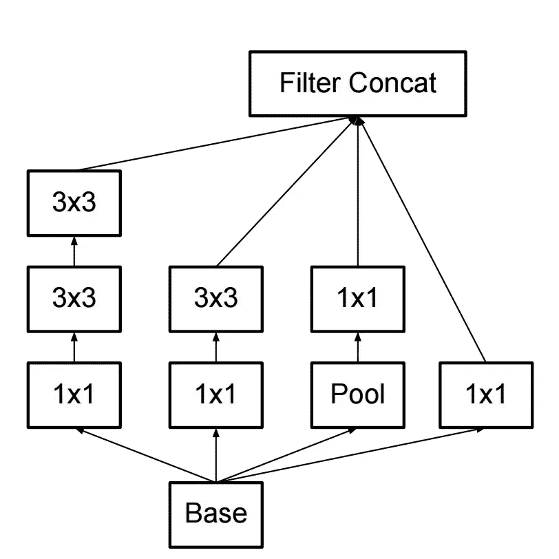

*   过滤器也可以通过[扁平卷积](http://arxiv.org/abs/1412.5474)分解成更复杂的模块:

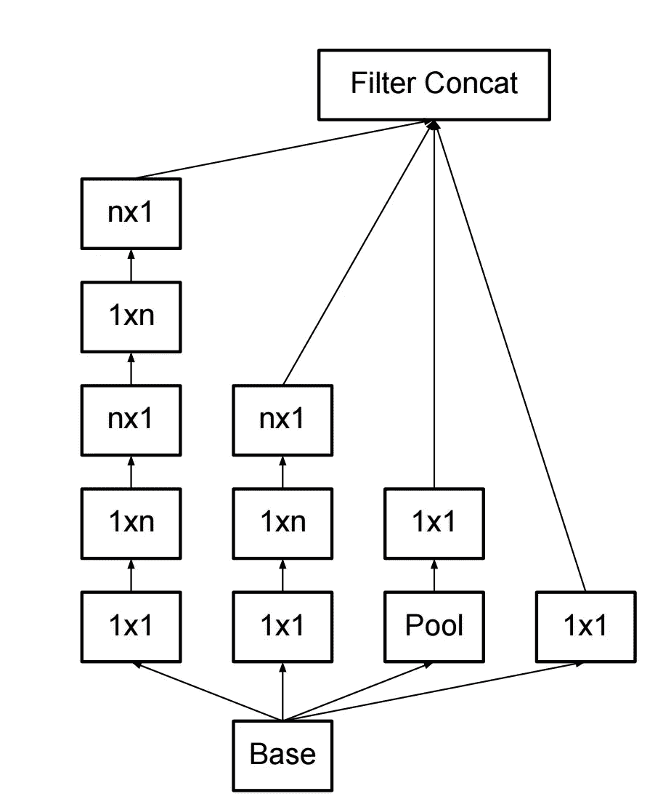

*   在执行初始计算时，初始模块还可以通过提供池来减少数据的大小。这基本上等同于使用简单的池层并行执行步长卷积:

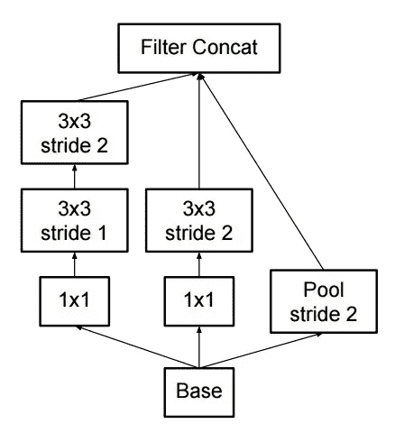

Inception 仍然使用一个池层加上 softmax 作为最终分类器。

# 雷斯内特

革命在 2015 年 12 月到来，大约与《盗梦空间 3》同时。 [ResNet](https://arxiv.org/abs/1512.03385) 有一个简单的想法:将两个连续卷积层的输出馈入，同时将输入旁路到下一层！

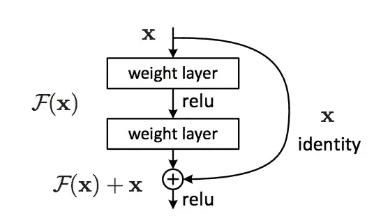

这类似于像[这个](http://yann.lecun.com/exdb/publis/pdf/sermanet-ijcnn-11.pdf)这样的老创意。但在这里它们绕过了两层，被大规模应用。绕过两层后是一个关键的直觉，因为绕过一层不会有太大的改善。通过 2 层可以认为是一个小的分类器，或网络中的网络！

这也是第一次训练超过 100 层甚至 1000 层的网络。

拥有大量层的 ResNet 开始使用类似于 Inception 瓶颈的瓶颈层:

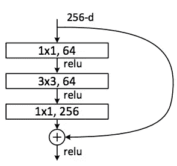

该图层通过首先使用具有较小输出(通常为输入的 1/4)的 1x1 卷积，然后使用 3x3 图层，然后再次使用 1x1 卷积来减少每个图层的要素数量。就像在 Inception 模块的情况下，这允许保持低计算量，同时提供丰富的特性组合。参见“GoogLeNet 和 Inception”之后的“瓶颈层”部分。

ResNet 在输入端使用了一个相当简单的初始层(stem):一个 7x7 的 conv 层，然后是一个 2 层的池。相比之下，在 Inception V3、V4 中，词干更复杂，更不直观。

ResNet 还使用一个池层加上 softmax 作为最终分类器。

关于 ResNet 架构的其他见解每天都在出现:

*   ResNet 可以被看作是并行和串行模块，只要把 inout 看作是并行到许多模块，而每个模块的输出是串行连接的
*   ResNet 也可以被认为是[多个并行或串行模块的集合体](http://arxiv.org/abs/1605.06431)
*   人们发现，ResNet 通常在深度相对较低(约 20–30 层)的区块上运行，这些区块并行运行，而不是在网络的整个长度上串行流动。
*   ResNet，当输出反馈到输入时，就像在 RNN，网络可以被看作是大脑皮层的一个更好的生物模型

# 初始版本 4

克里斯蒂安和他的团队又开始了新版本的《盗梦空间》。

stem 之后的 Inception 模块与 Inception V3 非常相似:

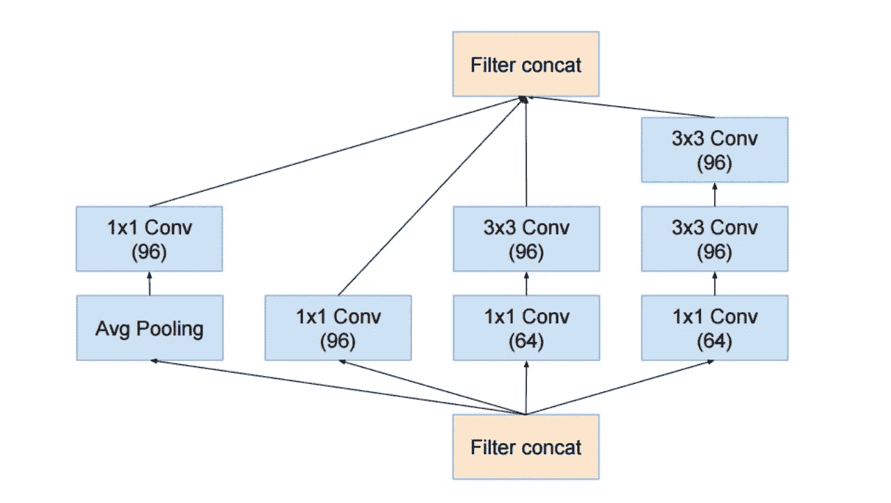

他们还将 Inception 模块与 ResNet 模块结合起来:

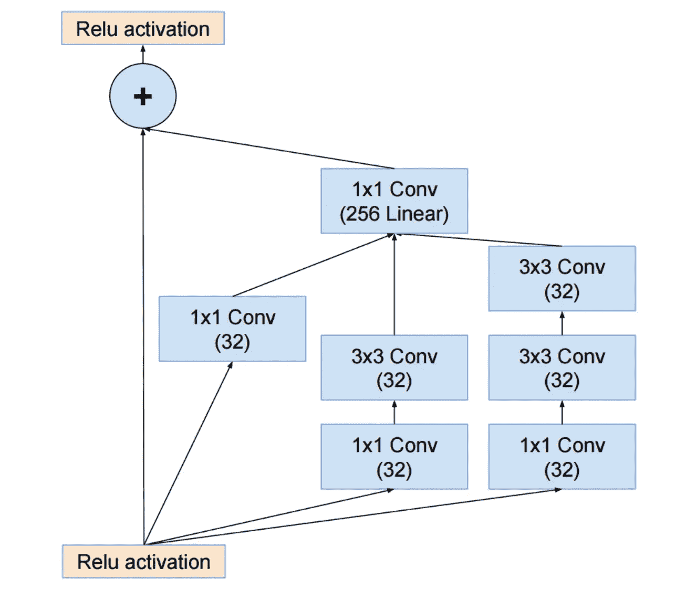

在我看来，这一次的解决方案不太优雅，也更复杂，但也充满了不太透明的启发。很难理解这些选择，作者也很难证明它们是正确的。

在这方面，ResNet 获得了一个干净简单、易于理解和修改的网络奖。

# 挤压网

[SqueezeNet](http://arxiv.org/abs/1602.07360) 最近已经发布。它是 ResNet 和 Inception 中许多概念的重新组合，表明毕竟更好的架构设计将提供较小的网络大小和参数，而不需要复杂的压缩算法。

# ENet

我们的团队着手将最新架构的所有功能整合到一个非常高效、轻量级的网络中，使用非常少的参数和计算来实现最先进的结果。这个网络架构被称为 [ENet](https://arxiv.org/abs/1606.02147) ，由[亚当·帕兹克](https://apaszke.github.io/posts.html)设计。我们用它来执行像素标记和场景解析。下面是 ENet 的一些视频。这些视频不是[训练数据集](https://www.cityscapes-dataset.com/)的一部分。

[有关 ENet 的技术报告可在此处获得](https://arxiv.org/abs/1606.02147)。ENet 是一个编码器加解码器的网络。编码器是用于分类的常规 CNN 设计，而解码器是用于将类别传播回原始图像大小以进行分割的上采样网络。这种方法只使用了神经网络，没有使用其他算法来执行图像分割。

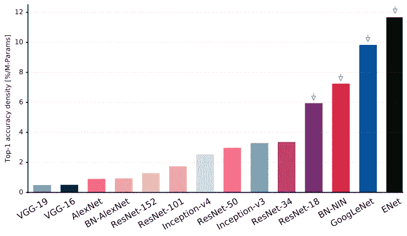

正如你在这个图中看到的，ENet 在所有的神经网络中，每个参数的精确度都是最高的！

ENet 从一开始就被设计成使用尽可能少的资源。因此，它的尺寸非常小，编码器和解码器网络总共仅占用 0.7 MB，fp16 精度。即使在这样小的尺寸下，ENet 在分割精度上类似于或高于其他纯神经网络解决方案。

# 模块分析

CNN 模块[的系统评估已经提交](https://arxiv.org/abs/1606.02228)。这一发现有利于使用:

使用不带 batchnorm 或 ReLU 的 ELU 非线性。

应用学习到的 RGB 色彩空间转换。

使用线性学习率衰减策略。

使用平均池层和最大池层的总和。

使用大约 128 或 256 的小批量。如果这对于你的 GPU 来说太大了，那就按照批量大小成比例地降低学习速率。

使用全连接层作为卷积层，并对最终决策的预测进行平均。

当投资增加训练集规模时，检查是否尚未达到稳定水平。数据的整洁比大小更重要。

如果您不能增加输入图像的尺寸，则减少后续层的步幅，效果大致相同。

如果您的网络具有复杂且高度优化的架构，例如 GoogLeNet，请谨慎修改。

# 例外

[Xception](https://arxiv.org/abs/1610.02357) 对 inception 模块和架构进行了改进，采用了一种更简单、更优雅的架构，与 ResNet 和 Inception V4 一样有效。

这里给出了异常模块:

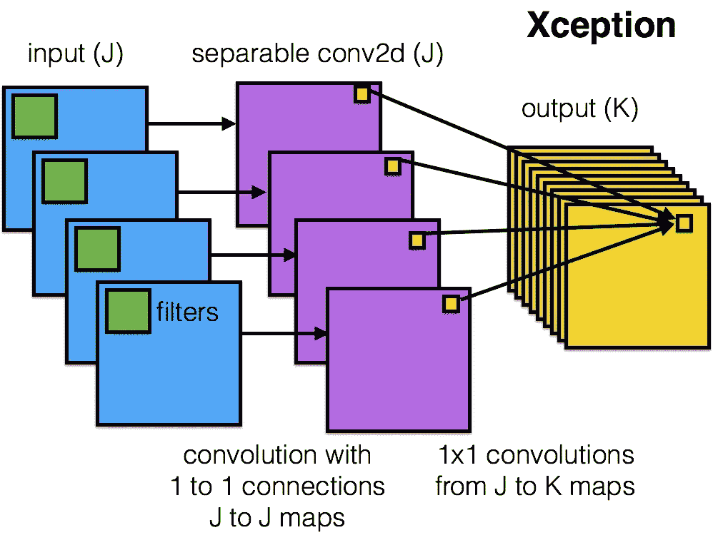

该网络可以是任何人的最爱，因为其架构简单而优雅，如下所示:

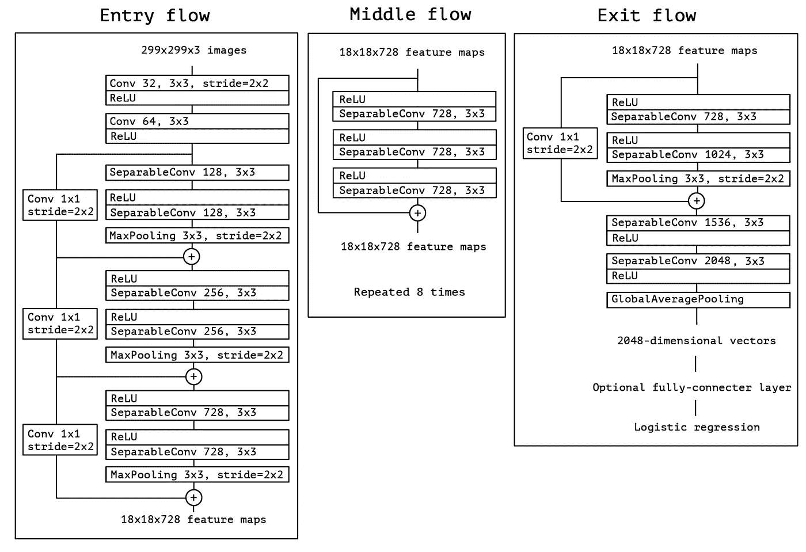

该架构有 36 个卷积级，与 ResNet-34 非常相似。但是模型和代码就像 ResNet 一样简单，而且比 Inception V4 更容易理解。

这个网络的 Torch7 实现可用[这里](https://gist.github.com/culurciello/554c8e56d3bbaf7c66bf66c6089dc221)一个 Keras/TF 的实现可用[这里](https://keras.io/applications/#xception)。

有趣的是，最近的 Xception 架构也受到了我们关于可分离卷积滤波器的工作的启发。

# 移动网络

新的 M [obileNets](https://arxiv.org/abs/1704.04861) 架构也将于 2017 年 4 月推出。这种架构使用可分离的卷积来减少参数的数量。除了上面的例外，单独的卷积是相同的。现在，这篇论文声称参数有了很大的减少——在 FaceNet 的情况下大约是 1/2，正如论文中所报道的。以下是完整的模型架构:

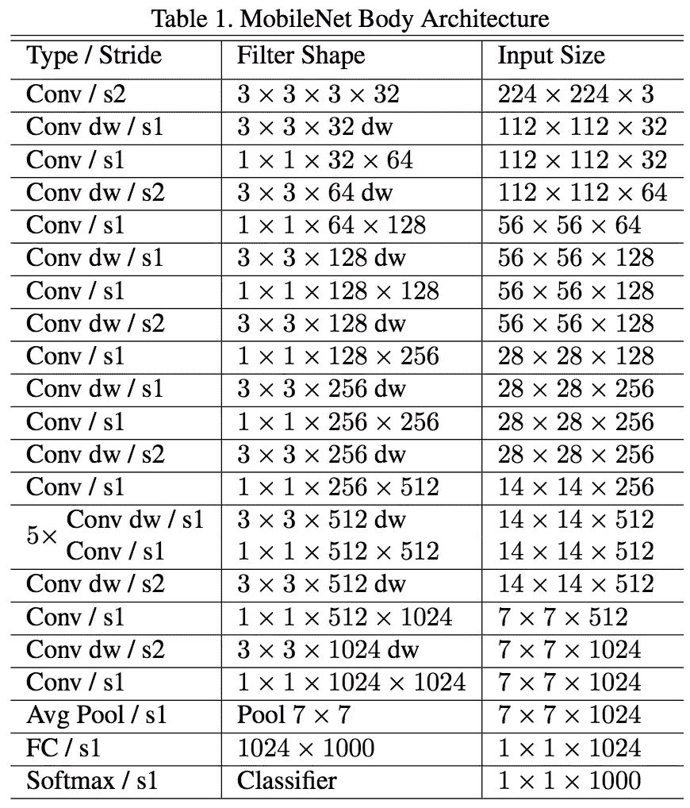

MobileNets

不幸的是，我们在实际应用中测试了这个网络，发现它在 Titan Xp GPU 上的一批 1 上非常慢。看一下每张图片推理时间的比较:

*   resnet18 : 0.002871
*   alexnet : 0.001003
*   vgg16 : 0.001698
*   挤压网:0.002725
*   移动网络:0.033251

显然这不是一个快速推理的竞争者！它可以减少磁盘上网络的参数和大小，但不可用。

# 其他著名的架构

[FractalNet](https://arxiv.org/abs/1605.07648) 使用了一种递归架构，这种架构没有在 ImageNet 上测试过，它是一种衍生或更通用的 ResNet。

# 更新

关于比较的更新，请[见本帖](https://medium.com/@culurciello/analysis-of-deep-neural-networks-dcf398e71aae)。

# 今后

我们认为，打造神经网络架构对于深度学习领域的进步至关重要。我们小组强烈建议仔细阅读并理解这篇文章中的所有论文。

但是现在有人可能会问，为什么我们要花这么多时间来精心设计架构，为什么我们不用数据来告诉我们使用什么，以及如何组合模块。这将是美好的，但现在它正在进行中的工作。一些有趣的初步结果是[这里](https://arxiv.org/abs/1606.06216)。

还要注意，这里我们主要讨论了计算机视觉的架构。类似地，神经网络体系结构在其他领域得到了发展，研究所有其他任务的体系结构的演变也是很有趣的。

如果您对神经网络架构和计算性能的比较感兴趣，请参见我们最近的论文。

# 感谢

这篇文章的灵感来自与 Abhishek Chaurasia，Adam Paszke，Sangpil Kim，Alfredo Canziani 和其他人在我们普渡大学电子实验室的讨论。

# 关于作者

我在硬件和软件方面都有将近 20 年的神经网络经验(一个罕见的组合)。在这里看关于我:[媒介](https://medium.com/@culurciello/)、[网页](https://e-lab.github.io/html/contact-eugenio-culurciello.html)、[学者](https://scholar.google.com/citations?user=SeGmqkIAAAAJ)、 [LinkedIn](https://www.linkedin.com/in/eugenioculurciello/) 等等…