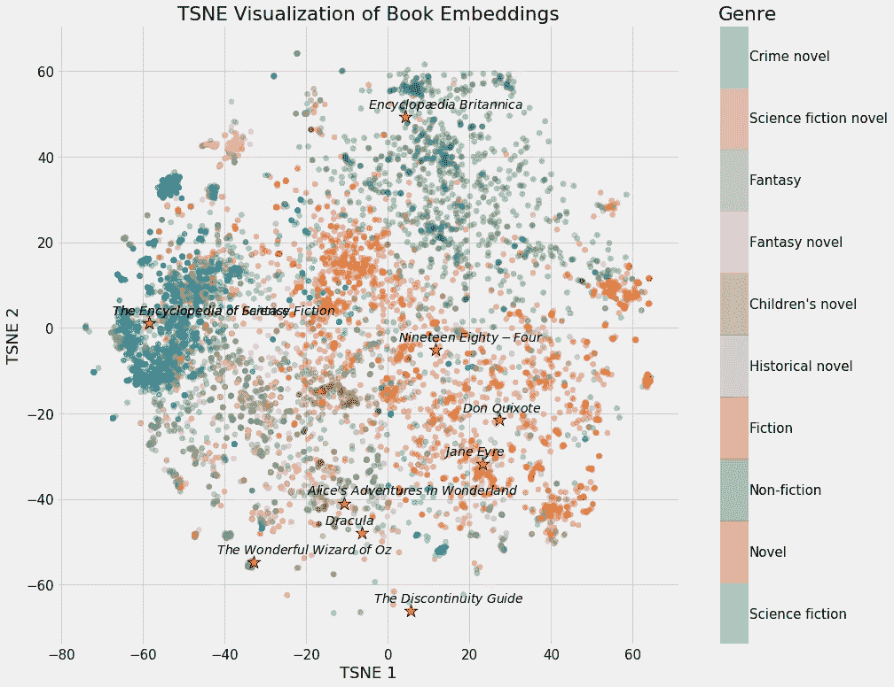
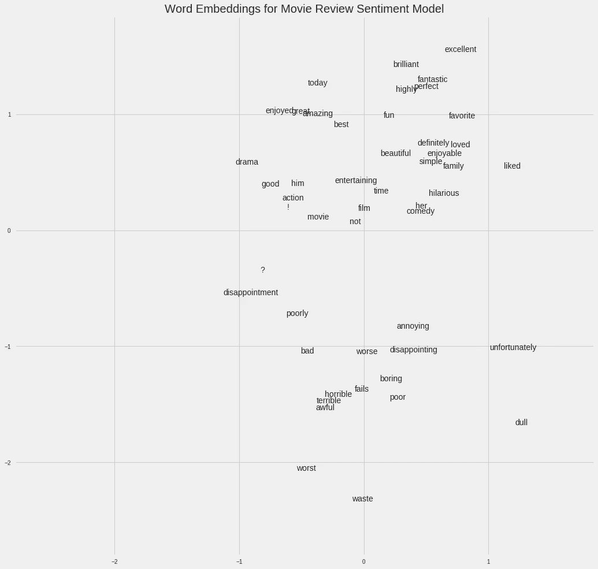
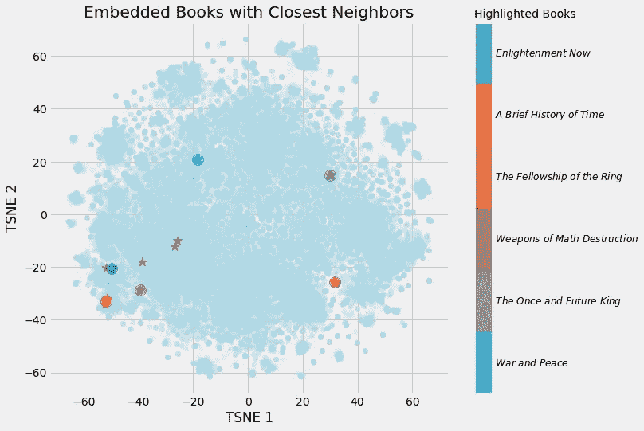
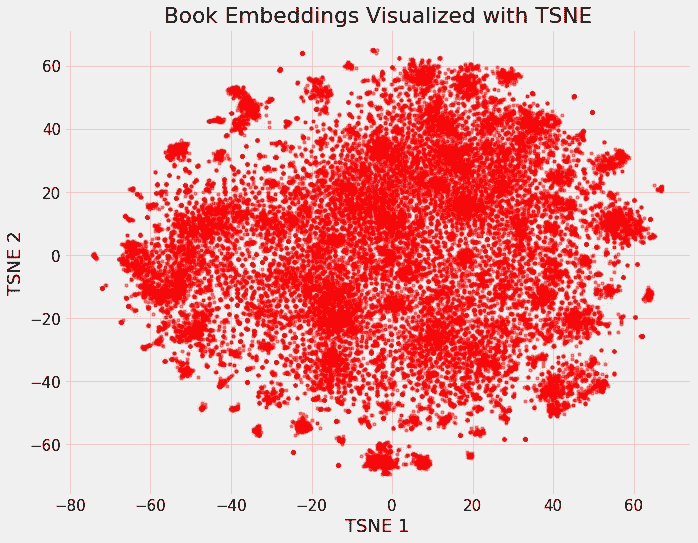
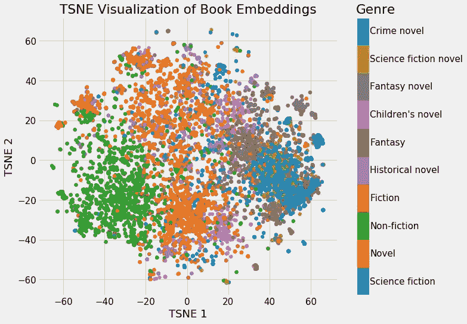
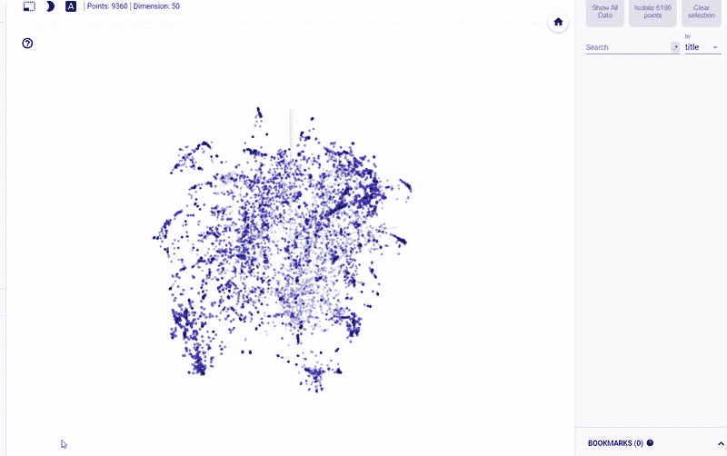

# 解释了神经网络嵌入

> 原文：<https://towardsdatascience.com/neural-network-embeddings-explained-4d028e6f0526?source=collection_archive---------0----------------------->


([Source](https://www.pexels.com/photo/milky-way-illustration-1169754/))

## 深度学习如何将*战争与和平*表示为一个向量

近年来，神经网络的应用从图像分割到自然语言处理再到时间序列预测都有了很大的发展。深度学习的一个显著成功的应用是嵌入，这是一种用于将离散变量表示为连续向量的方法。这种技术已经在实际应用中找到了用于[机器翻译](https://arxiv.org/abs/1705.03127)的单词嵌入和用于分类变量的[实体嵌入。](https://arxiv.org/abs/1604.06737)

在本文中，我将解释什么是神经网络嵌入，为什么我们要使用它们，以及它们是如何学习的。我们将在我正在解决的一个[实际问题](https://github.com/WillKoehrsen/wikipedia-data-science/blob/master/notebooks/Book%20Recommendation%20System.ipynb)的背景下讨论这些概念:将维基百科上的所有书籍表示为向量，以创建一个图书推荐系统。



Neural Network Embedding of all books on Wikipedia. ([From Jupyter Notebook on GitHub](https://github.com/WillKoehrsen/wikipedia-data-science/blob/master/notebooks/Book%20Recommendation%20System.ipynb)).

# 嵌入

*嵌入是离散分类变量到连续数字向量的映射。* [在神经网络的背景下，嵌入](https://www.tensorflow.org/guide/embedding)是*低维、* *学习到的*离散变量的连续向量表示。神经网络嵌入是有用的，因为它们可以*减少分类变量的维度*并且*有意义地表示变换空间中的*类别。

神经网络嵌入有 3 个主要目的:

1.  在嵌入空间中寻找最近的邻居。这些可以用来根据用户兴趣或聚类类别进行推荐。
2.  作为监督任务的机器学习模型的输入。
3.  用于可视化概念和类别之间的关系。

这意味着就图书项目而言，使用神经网络嵌入，我们可以获得维基百科上所有的 37，000 篇图书文章，并用向量中的 50 个数字来表示每一篇文章。此外，因为嵌入是习得的，在我们学习问题的上下文中更相似的书籍在嵌入空间中彼此更接近。

神经网络嵌入克服了表示分类变量的常用方法的两个局限性:一键编码。

## 一个热编码的局限性

一键编码分类变量的操作实际上是一个简单的嵌入，其中每个类别被映射到一个不同的向量。该过程采用离散的实体，并将每个观察值映射到 0 的向量和表示特定类别的单个 1。

独热编码技术有两个主要缺点:

1.  对于高基数变量——具有许多独特类别的变量——转换后的向量的维数变得难以管理。
2.  这种映射是完全不知情的:“相似的”类别在嵌入空间中不会彼此放置得更近。

第一个问题很好理解:对于每一个额外的类别——被称为一个实体——我们必须向独热编码向量添加另一个数字。如果我们在维基百科上有 37，000 本书，那么表示这些书需要每本书 37，000 维的向量，这使得在这种表示上训练任何机器学习模型都不可行。

第二个问题同样具有局限性:独热编码*不会将相似的实体在向量空间*中放置得更近。如果我们使用余弦距离来度量向量之间的相似性，那么在一次热编码之后，对于实体之间的每次比较，相似性都是 0。

这意味着像《T2》《战争与和平》《T3》《T4》《安娜·卡列尼娜》《T5》(都是列夫·托尔斯泰的经典著作)这样的实体彼此之间的距离并不比《战争与和平》《T7》和《银河系漫游指南》的距离更近，如果我们使用一键编码的话。

```
**# One Hot Encoding Categoricals****books = ["War and Peace", "Anna Karenina", 
          "The Hitchhiker's Guide to the Galaxy"]****books_encoded = [[1, 0, 0],
                 [0, 1, 0],
                 [0, 0, 1]]****Similarity (dot product) between First and Second = 0
Similarity (dot product) between Second and Third = 0
Similarity (dot product) between First and Third = 0**
```

考虑到这两个问题，表示分类变量的理想解决方案需要的*数字比唯一类别的*数字少，并且将相似的类别*彼此放置得更靠近*。

```
**# Idealized Representation of Embedding****books = ["War and Peace", "Anna Karenina", 
          "The Hitchhiker's Guide to the Galaxy"]****books_encoded_ideal = [[0.53,  0.85],
                       [0.60,  0.80],
                       [-0.78, -0.62]]****Similarity (dot product) between First and Second = 0.99
Similarity (dot product) between Second and Third = -0.94
Similarity (dot product) between First and Third = -0.97**
```

为了构建分类实体的更好表示，我们可以使用嵌入神经网络和监督任务*学习嵌入*。

## 学习嵌入

独热编码的主要问题是转换不依赖于任何监督。我们可以通过在监督任务中使用神经网络来学习嵌入，从而极大地改进嵌入。[嵌入形成了网络的参数](https://stats.stackexchange.com/questions/182775/what-is-an-embedding-layer-in-a-neural-network)——权重，其被调整以最小化任务上的损失。得到的嵌入向量是类别的表示，其中相似的类别(相对于任务)彼此更接近。

例如，如果我们有一个在电影评论集中使用的 50，000 个单词的词汇表，我们可以使用训练来预测评论情感的嵌入神经网络来学习每个单词的 100 维嵌入。(具体应用见[这款 Google Colab 笔记本](https://colab.research.google.com/notebooks/mlcc/intro_to_sparse_data_and_embeddings.ipynb?utm_source=mlcc&utm_campaign=colab-external&utm_medium=referral&utm_content=embeddings-colab&hl=en))。词汇表中与积极评价相关联的词，如“精彩”或“优秀”，将在嵌入空间中更接近地出现，因为网络已经知道这些都与积极评价相关联。



Movie Sentiment Word Embeddings ([source](https://colab.research.google.com/notebooks/mlcc/intro_to_sparse_data_and_embeddings.ipynb?utm_source=mlcc&utm_campaign=colab-external&utm_medium=referral&utm_content=embeddings-colab&hl=en))

在上面给出的书的例子中，我们的监督任务可以是“识别一本书是否是列夫·托尔斯泰写的”，由此产生的嵌入将把托尔斯泰写的书彼此放得更近。弄清楚如何创建受监督的任务来产生相关的表示是进行嵌入的最困难的部分。

## 履行

在维基百科图书项目([完整笔记本此处](https://github.com/WillKoehrsen/wikipedia-data-science/blob/master/notebooks/Book%20Recommendation%20System.ipynb))中，监督学习任务被设定为预测给定的维基百科页面链接是否出现在一本书的文章中。我们提供成对的(书名，链接)训练示例，其中混合了正面-正确-和负面-错误-对。这种设置基于这样的假设，即链接到相似维基百科页面的书籍彼此相似。因此，最终的嵌入应该将相似的书籍在向量空间中更紧密地放置在一起。

我使用的网络有两个平行的嵌入层，用于将图书和 wikilink 映射为单独的 50 维向量，还有一个点积层，用于将嵌入合并为单个数字以进行预测。嵌入是网络的参数或权重，在训练期间被调整以最小化监督任务的损失。

在 Keras 代码中，如下所示(如果您没有完全理解代码，请不要担心，直接跳到图片):

虽然在监督机器学习任务中，目标通常是训练模型对新数据进行预测，但在这种嵌入模型中，预测可能只是达到目的的一种手段。我们想要的是嵌入权重，将书籍和链接表示为连续向量。

嵌入本身并不有趣:它们只是数字的向量:


Example Embeddings from Book Recommendation Embedding Model

然而，嵌入可以用于前面列出的 3 个目的，对于这个项目，我们主要感兴趣的是基于最近邻居推荐书籍。为了计算相似性，我们取一个查询书，并找到它的向量和所有其他书的向量之间的点积。(如果我们的嵌入是归一化的，这个点积就是向量之间的[余弦距离](http://blog.christianperone.com/2013/09/machine-learning-cosine-similarity-for-vector-space-models-part-iii/)，范围从-1，最不相似，到+1，最相似。我们也可以使用欧几里德距离来度量相似性)。

这是我构建的图书嵌入模型的输出:

```
**Books closest to War and Peace.****Book: War and Peace              Similarity: 1.0
Book: Anna Karenina              Similarity: 0.79
Book: The Master and Margarita   Similarity: 0.77
Book: Doctor Zhivago (novel)     Similarity: 0.76
Book: Dead Souls                 Similarity: 0.75**
```

(向量与其自身的余弦相似度必须为 1.0)。经过一些维度的缩减(见下文)，我们可以做出如下图:



Embedding Books with Closest Neighbors

我们可以清楚地看到学习嵌入的价值！我们现在对维基百科上的每一本书都有 50 个数字的表示，相似的书彼此更接近。

# 嵌入可视化

关于嵌入最酷的部分之一是，它们可以用来可视化概念，如*小说*或*非小说*彼此之间的关系。这需要进一步的降维技术来使维数达到 2 或 3。最流行的约简技术本身就是一种嵌入方法:t 分布随机近邻嵌入(TSNE)。

我们可以获取维基百科上所有书籍的原始 37，000 个维度，使用神经网络嵌入将它们映射到 50 个维度，然后使用 TSNE 将它们映射到 2 个维度。结果如下:



Embedding of all 37,000 books on Wikipedia

(TSNE 是一种流形学习技术，这意味着它试图将高维数据映射到低维流形，从而创建一种嵌入，试图保持数据中的局部结构。它几乎专门用于可视化，因为输出是随机的，并且不支持转换新数据。一个很有前途的替代方案是[均匀流形逼近和投影，UMAP，](https://github.com/lmcinnes/umap)它更快并且支持将新数据转换到嵌入空间。

这本身并不是很有用，但是一旦我们开始根据不同的书籍特点给它上色，它就会变得很有洞察力。



Embeddings Colored by Genre

我们可以清楚地看到属于同一流派的书籍分组。这并不完美，但仍然令人印象深刻的是，我们可以只用两个数字来表示维基百科上的所有书籍，这仍然可以捕捉到不同流派之间的差异。

书中的例子(整篇文章即将发表)展示了神经网络嵌入的价值:我们有一个分类对象的向量表示，它是低维的，并且将相似的实体在嵌入的空间中彼此放置得更近。

## 额外收获:交互式可视化

静态图的问题是，我们不能真正探索数据和调查变量之间的分组或关系。为了解决这个问题，TensorFlow 开发了[投影仪](https://projector.tensorflow.org)，这是一个在线应用程序，让我们可以可视化嵌入并与之交互。我将很快发布一篇关于如何使用这个工具的文章，但是现在，这里是结果:



Interactive Exploration of Book Embeddings using projector

# 结论

神经网络嵌入是作为连续向量的离散数据的*学习低维表示。*这些嵌入克服了传统编码方法的局限性，可用于诸如*寻找最近邻居、输入另一个模型*和*可视化*等目的。

虽然许多深度学习概念是用学术术语谈论的，但神经网络嵌入既直观又相对容易实现。我坚信任何人都可以[学习深度学习](http://fast.ai)并使用 Keras 等库[构建深度学习解决方案](http://shop.oreilly.com/product/0636920097471.do)。嵌入是处理离散变量的有效工具，并呈现深度学习的有用应用。

## 资源

*   [谷歌制作的嵌入式教程](https://developers.google.com/machine-learning/crash-course/embeddings/video-lecture)
*   [嵌入张量流指南](https://www.tensorflow.org/guide/embedding)
*   [使用嵌入式技术的图书推荐系统](https://github.com/WillKoehrsen/wikipedia-data-science/blob/master/notebooks/Book%20Recommendation%20System.ipynb)
*   [Keras 中的单词嵌入教程](https://machinelearningmastery.com/use-word-embedding-layers-deep-learning-keras/)

一如既往，我欢迎反馈和建设性的批评。你可以通过推特 [@koehrsen_will](http://twitter.com/@koehrsen_will) 或者我的个人网站 [willk.online](https://willk.online) 找到我。