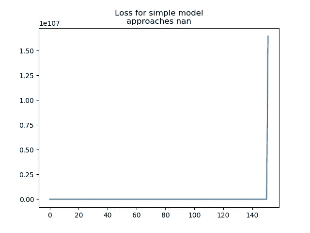
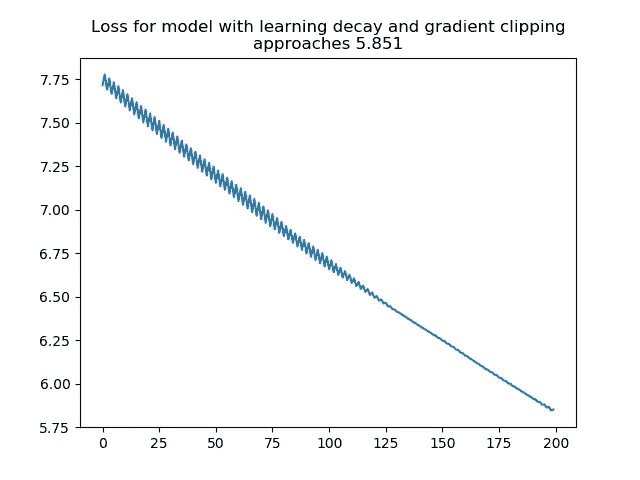
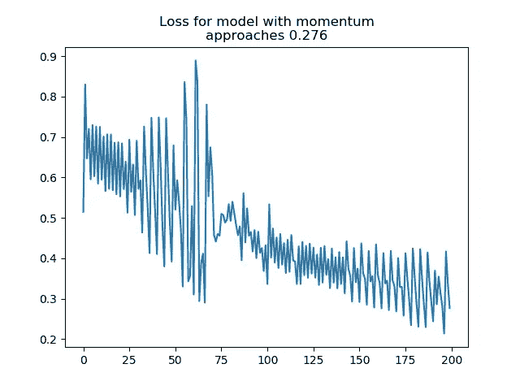
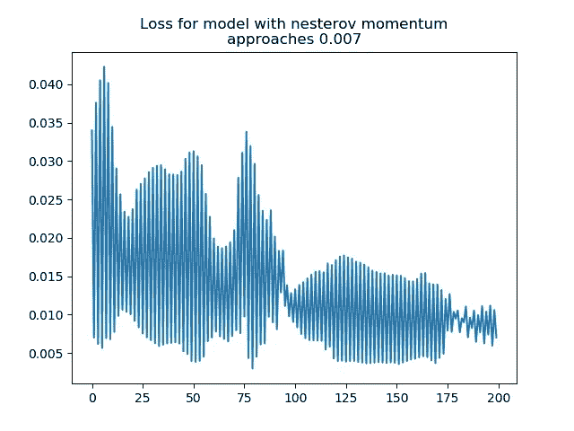
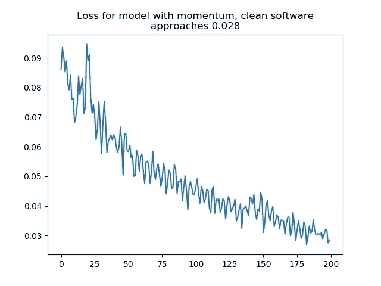

# 软件工程师神经网络导论 1——香草 MLP

> 原文：<https://towardsdatascience.com/neural-network-introduction-for-software-engineers-1611d382c6aa?source=collection_archive---------7----------------------->

这第一篇博文将帮助你用 Python/Numpy 设计一个神经网络。它将展示普通多层感知器(MLPs)的衰落，提出一些简单的增强，并展示它们有多重要。最后，我们将展示这在一个组织良好的软件工程包中会是什么样子。

对于非技术前言，请阅读 [ML 前言](https://medium.com/@leetandata/machine-learning-preface-ba69bca4701d)以了解回归。

为了理解数学，可选地将最初的 numpy 版本与包含可视化的[https://medium . com/coin monks/the-mathematics-of-neural-network-60a 112 dd3 e 05](https://medium.com/coinmonks/the-mathematics-of-neural-network-60a112dd3e05)进行比较。

# 软件工程师神经网络导论

首先，我们将建立一个简单的神经网络(NN 或多层感知器/MLP):

在数学上，我们将定义一个具有一个隐藏层的神经网络如下:

```
x: input matrix
w1: 1st weight matrix for multiplication
w2: 2nd weight matrix for multiplication
Hidden = matrix_multiplication(x, w1)
Hidden_rectified = Clip(Hidden, minimum_value = 0)
output = matrix_multiplication(Hidden_rectified, w2
```

这样，我们将输出计算为输入的函数。我们回顾微积分和线性代数，通过梯度下降最小化损失函数来优化(训练)我们的 MLP 以匹配数据集。



哦不！我们的损失激增。一个基本的神经网络对它的学习速率非常敏感，因为它的梯度会爆炸。一旦梯度变大，它们可以不断地来回摆动它们相应的权重，并爆炸到无穷大。

让我们通过将应用的渐变剪切到[-1，1]来解决这个问题。

让我们也将学习率衰减到 0，以允许网络首先以大的学习率接近合理的解决方案，然后通过小的调整确定特定的解决方案。

梯度削波也是通过将梯度削波到具有最大向量范数来完成的，并且学习率衰减有时被完全忽略，以利于其他微调策略，如 l2 正则化或批量增加。



太好了！我们的损失函数现在向零递减。

你听说过动量优化器或者亚当优化器吗？看看上面曲线中波动的损失，你是否注意到它上下摆动，而通常向下移动？

动量是在一个合理的恒定方向上保持速度的概念。当我们接收到一个梯度来调整我们的参数时，我们更新我们正在移动的速度，然后继续沿着我们认为在我们的参数空间中有效的方向行进。准确地说，

```
Value = Value-gradient
```

变成了:

```
velocity = velocity * momentum + gradient * (1-momentum)
Value = Value-velocity
```

现在，通过动量和函数化我们的损失函数作为一个抽象层，为备选损失函数做准备，我们的代码变成:



太好了！我们的损失变小得更快，接近一个更小的值。让我们再添加一个机器学习工具来帮助模型更可靠地学习，称为“内斯特罗夫动量”

内斯特罗夫的动量工程受到以下启发。在给定的有动力的一步，你大概知道你将采取的下一步。让我们看看我们期望移动的地方，计算那里的梯度，用这个梯度来修正我们的动量向量。然后用新的动量向量，我们像往常一样前进。

```
Theoretical_next_state = Value - Velocity
gradient = gradient at Theoretical_next_state
Velocity = Velocity * momentum + gradient * (1-momentum)
Value = Value-Velocity
```

同时，我们注意到 ReLU 非线性的一个问题，即 ReLU 曲线的“关闭”部分的导数为零。让我们用更流行的泄漏 ReLU 来代替我们的 ReLU，固定这个零导数，平坦区域有一个缓坡。

```
ReLU(x) = max(x, 0)
becomes:
lReLU(x) = max(x, .1*x)
```

请耐心等待这一段，因为演示数学的代码有点疯狂。在下一部分中，我们将组织它，以便观众中的软件工程师感到舒适。



太好了！内斯特罗夫的势头奏效了。但是看看这段代码！太恐怖了。我们硬编码了整个系统来实现一个神经网络

*   恰好一个隐藏层
*   泄漏的 relu 非线性
*   整批优化

如果我们想要改变其中的任何一个，我们就必须改变多个系统来硬编码我们想要尝试的其他系统。我暂时不做解释，但是让我们来看看这个系统到底有多干净和可重用。我们暂时把它作为一个文件，这样我们就可以很容易地在博客中展示它。



万岁！我们有干净的软件来定义、训练和评估一个模型。从机器学习和软件工程的角度来看，我们的实现仍然存在一些巨大的问题，但它展示了一般的概念。

在现实世界中，我们会(未来的连续博客文章):

*   [解决一个真实世界的问题，然后在单独的验证数据集上训练和评估我们的问题。](https://medium.com/@leetandata/neural-network-for-software-engineers-2-mini-batch-training-and-validation-46ee0a1269a0)
*   思考我们的数据的意义，并构建我们的模型以一种深思熟虑的方式来表示它。(链接到卷积后)
*   以一种有意义的方式思考我们的损失函数，建立我们的损失函数，给我们一个有意义的梯度。(房价亏损帖链接)
*   像上面那样思考我们想要什么，但是使用 Tensorflow 这样的神经网络 API 来实现。哇，太简单了！(链接 Tensorflow 房价贴)