# 神经网络优化算法

> 原文：<https://towardsdatascience.com/neural-network-optimization-algorithms-1a44c282f61d?source=collection_archive---------3----------------------->

## 基于张量流的比较研究

***用于训练神经网络的常用优化算法有哪些？他们如何比较？***

本文试图以一个卷积神经网络(CNN)为例，通过 TensorFlow 在 MNIST 数据集上进行训练来回答这些问题。


# **随机梯度下降**

SGD 通过获取大小为( *m* )的数据子集或小批量数据，在梯度( *g* )的负方向上更新模型参数(*θ*):

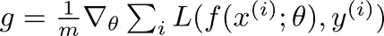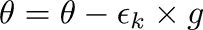

神经网络用 *f(x(i)表示；θ)*其中 *x(i)* 是训练数据，而 *y(i)* 是训练标签，损失的梯度 *L* 是相对于模型参数*θ*计算的。学习率( *eps_k* )决定了算法沿梯度的步长大小(最小化时为负方向，最大化时为正方向)。

学习率是迭代 *k* 的函数，是一个最重要的超参数。学习率太高(如> 0.1)会导致参数更新错过最佳值，学习率太低(如< 1e-5)会导致不必要的长训练时间。一个好的策略是以 1e-3 的学习速率开始，并使用一个学习速率计划，该计划将学习速率降低为迭代的函数(例如，每 4 个时期将学习速率减半的步长计划器):

```
*def step_decay(epoch):
    lr_init = 0.001
    drop = 0.5
    epochs_drop = 4.0
    lr_new = lr_init * \
             math.pow(drop, math.floor((1+epoch)/epochs_drop))
    return lr_new*
```

一般来说，我们希望学习率( *eps_k* )满足罗宾斯-门罗条件:

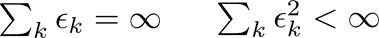

第一个条件确保算法将能够找到局部最优解，而不管起始点是什么，第二个条件控制振荡。

# **气势**

动量累积过去梯度的指数衰减移动平均值，并继续向其方向移动:

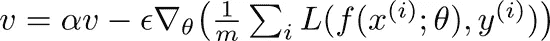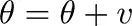

因此，步长取决于梯度序列的大小和对齐程度，动量参数α的常见值为 0.5 和 0.9。

# **内斯特罗夫势头强劲**

内斯特罗夫动量的灵感来自内斯特罗夫的加速梯度法:

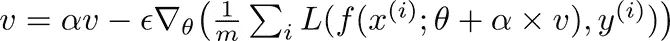

内斯特罗夫动量和标准动量的区别在于梯度的计算，而内斯特罗夫动量是在施加当前速度后计算梯度，因此内斯特罗夫动量为梯度增加了一个修正因子。

# 阿达格拉德

AdaGrad 是一种用于设置学习速率的自适应方法[3]。考虑下图中的两种情况。

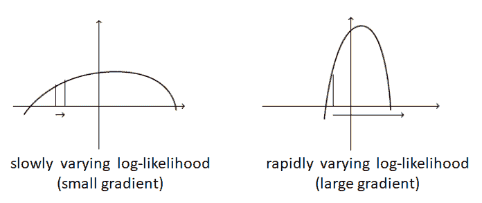

在缓慢变化的物镜(左)的情况下，梯度通常(在大多数点)具有小的幅度。因此，我们需要一个大的学习率来快速达到最优。对于快速变化的物镜(右图)，梯度通常会非常大。使用较大的学习速率会导致非常大的步长，来回摆动但达不到最佳值。

这两种情况的发生是因为学习率的设置与梯度无关。AdaGrad 通过累加目前所见梯度的平方范数并将学习率除以该和的平方根来解决这个问题:

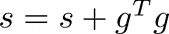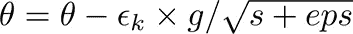

结果，接收高梯度的参数将降低其有效学习率，而接收小梯度的参数将提高其有效学习率。净效应是在参数空间的更平缓倾斜方向上的更大进展，以及在存在大梯度的情况下更谨慎的更新。

# **RMSProp**

RMSProp 通过将梯度累积改变为指数加权移动平均来修改 AdaGrad，即它丢弃了遥远过去的历史[4]:

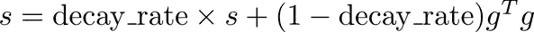

注意，即使梯度由于从训练开始的梯度积累而保持恒定，AdaGrad 也意味着学习速率降低。通过引入指数加权移动平均线，与遥远的过去相比，我们更重视最近的过去。结果表明，RMSProp 是一种有效实用的深度神经网络优化算法。

# **亚当**

Adam 源自“自适应矩”，它可以被视为 RMSProp 和 momentum 组合的变体，更新看起来像 RMSProp，只是使用了平滑版本的梯度而不是原始随机梯度，完整的 Adam 更新还包括偏差校正机制[5]:

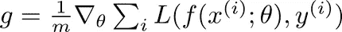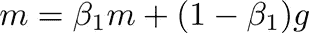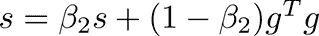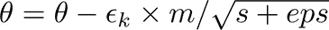

推荐值为 beta_1 = 0.9，beta_2 = 0.999，eps = 1e-8。

# **实验**

使用 TensorFlow 在 MNIST 数据集上训练简单的 CNN 架构，具有 1e-3 学习速率和交叉熵损失，使用四种不同的优化器:SGD、内斯特罗夫动量、RMSProp 和 Adam。下图显示了训练损失值与迭代次数的关系:

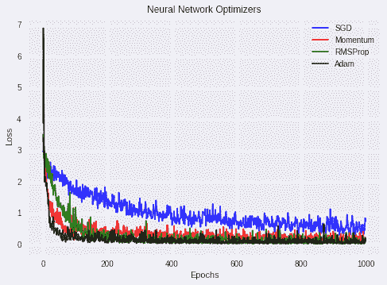

从图中我们可以看到，亚当和内斯特罗夫动量优化器产生最低的训练损失！

# **代码**

下面的 [ipython 笔记本](https://github.com/vsmolyakov/experiments_with_python/blob/master/chp03/tensorflow_optimizers.ipynb)中有全部代码。

# **结论**

我们比较了用于训练神经网络的不同优化器，并获得了它们如何工作的直觉。我们发现，当在 TensorFlow 中对 MNIST 数据训练简单 CNN 时，具有内斯特罗夫动量和 Adam 的 SGD 产生最佳结果。

# **参考文献**

[1]伊恩·古德费勒等人。艾尔。，“深度学习”，麻省理工出版社，2016

[2]安德烈·卡帕西，[http://cs231n.github.io/neural-networks-3/](http://cs231n.github.io/neural-networks-3/)

[3]杜奇，j .，哈赞，e .和辛格，y .“在线学习和随机优化的自适应次梯度方法”，JMLR，2011 年。

[4]t . tie leman 和 and Hinton，“讲座 6.5 — RMSProp，COURSERA:用于机器学习的神经网络”，技术报告，2012 年。

[5]迪耶德里克·金玛和吉米·巴，“亚当:一种随机优化方法”，2015