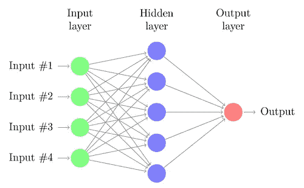
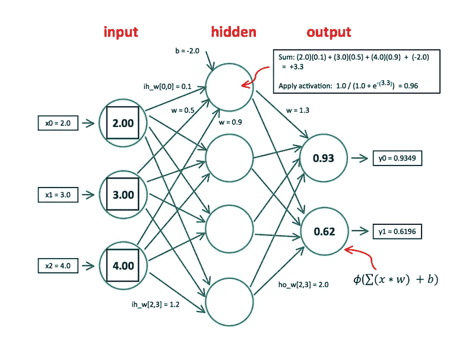
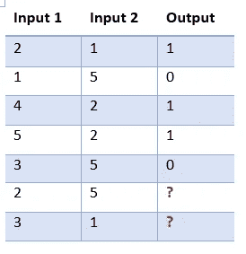
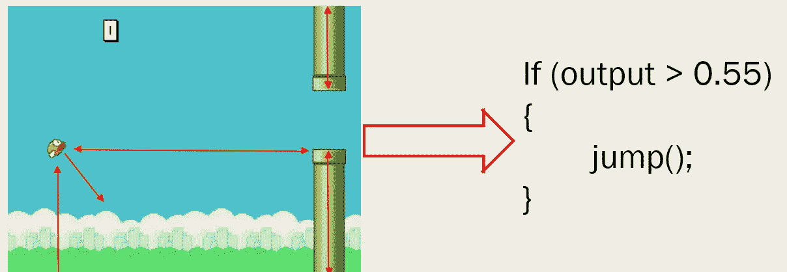
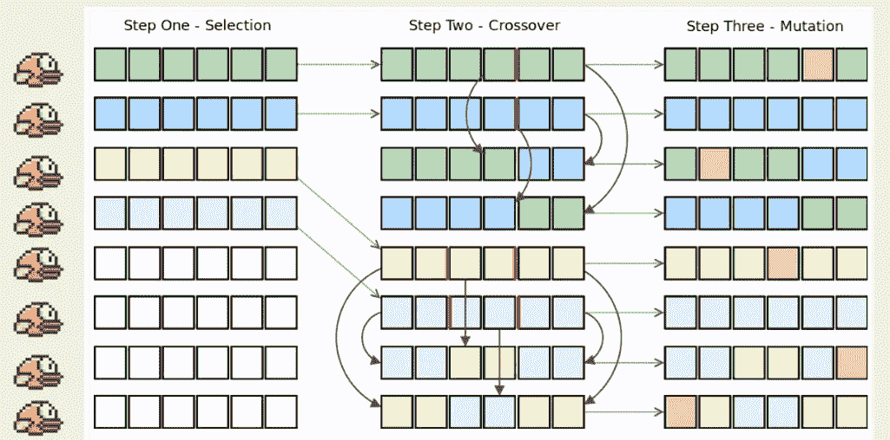

# 神经网络扮演 Flappy Bird

> 原文：<https://towardsdatascience.com/neural-network-plays-flappy-bird-e585b1e49d97?source=collection_archive---------0----------------------->

目前，我是一名大学 IT 专业的学生。这学期，我上了一门非常有趣的课，我选择了自己的主题来学习，并设计了自己的项目。所以我决定学习和研究一些非常有趣和独特的东西。当我在探索各种主题时，我发现了一个关于神经网络的[视频教程](https://www.youtube.com/watch?v=P7XHzqZjXQs)，我对学习这个主题非常感兴趣。

看完教程视频后，我想到了一个实现一个学习如何玩 Flappy Bird 游戏的神经网络程序的想法。最后，这是我的结果。

当程序第一次运行时，它什么也不做，因为它对游戏一无所知。然而，几个小时的训练，它学会了如何玩游戏。

在这篇文章中，我想给出一个关于神经网络的基本信息以及我是如何实现我的程序的。

# 什么是神经网络？

首先，我想说说什么是神经网络。在编程中，人工神经网络是受生物神经网络的结构和功能方面启发的用于机器学习的计算模型/算法。



Neural Network

每个神经网络都有一个输入层、一个输出层和一个或多个隐藏层。每个圆圈代表一个神经元，一个神经元与下一层的每个神经元都有联系。

每个连接都有权重值，每个神经元都有偏差值。例如，下图显示了神经网络中发生的情况。



当神经网络计算输出时，它会对权重和偏差进行大量计算。你可以很容易地预料到，如果我改变其中一个权重或偏差值，最终的输出也会改变。换句话说，训练神经网络意味着找到并调整权重和偏差值，以给出我们想要的最佳输出。

## 新立得

[Synaptic.js](https://synaptic.juancazala.com/#/) 是一个非常棒的用于 node.js 和浏览器的 JavaScript 神经网络库。如果您安装了 node.js，您可以使用以下命令安装 synaptic.js:

```
npm install synaptic --save
```

现在，我想提供一个使用 Synaptic.js 库解决问题的简单例子。



如果你看一下左边的表格，它有两个输入和一个输出。如果第一个输入大于第二个输入，则输出为 1。否则输出为 0。

前五个记录将是我们的测试数据，我们将看到最后两个记录的输出是什么。

下面的代码展示了我如何使用 synaptic.js 来解决这个问题。

```
**var** synaptic = require('synaptic');**var** myNetwork = **new** synaptic.Architect.Perceptron(2, 3, 1);
**var** learningRate = .2;
//training
**for** (**var** i = 0; i < 20000; i++)
{
    //test data 1
    myNetwork.activate([2,1]);
    myNetwork.propagate(learningRate, [1]);

    //test data 2
    myNetwork.activate([1,5]);
    myNetwork.propagate(learningRate, [0]);

    //test data 3
    myNetwork.activate([4,2]);
    myNetwork.propagate(learningRate, [1]);

    //test data 4
    myNetwork.activate([5,2]);
    myNetwork.propagate(learningRate, [1]);

    //test data 5
    myNetwork.activate([3,5]);
    myNetwork.propagate(learningRate, [0]);

}
console.log(myNetwork.activate([2,5])); //[ 0.0000728000640238746 ]
console.log(myNetwork.activate([3,1])); //[ 0.9999465030073619 ]
```

## 代码分解

```
**var** myNetwork = **new** synaptic.Architect.Perceptron(2, 3, 1);
```

上面的代码创建了一个具有 2 个输入神经元、3 个隐藏神经元和 1 个输出神经元的神经网络。

```
myNetwork.activate([2,1]);
```

activate()方法从给定的输入返回输出(在上面的代码中，2 和 1)。输出值在 0 到 1 个浮点值之间。

```
myNetwork.propagate(learningRate, [1]);
```

在调用 activate 函数之后，我们调用 propagate()函数，用学习率和目标输出值来训练网络。这是通过[反向传播](https://en.wikipedia.org/wiki/Backpropagation)完成的。

## 带 Flappy Bird 的神经网络

当我实现 flappy bird 程序时，我得到了 5 个输入和 1 个输出。



这些输入是:

*   鸟的位置
*   速度
*   下一个管道之间的距离
*   上部管道高度
*   下部管道高度

每次渲染游戏时，神经网络都会获得输入并激活它。如果输出大于 0.55，鸟会跳起来。

但是，我不能使用 propagate()方法，因为没有测试数据及其目标值。在这种情况下，我们可以使用遗传算法来训练我们的神经网络。



假设我一代有 8 只鸟，每只鸟有 6 个神经元。(在我的实际实现中，一代中有 12 只鸟，每只鸟有 18 个神经元)。

在一代(12 场)之后，我挑选最好的 4 只鸟并应用交叉和变异。重复同样的过程，直到我们得到好的结果。

对于交叉函数，偏置值将被交叉运算。

```
Learn.crossOverDataKey(netA.neurons, netB.neurons, 'bias');
```

剪切神经元的随机位置，并将其交叉。

```
Learn.crossOverDataKey = **function** (a, b, key) {
    **var** cutLocation = Math.round(a.length * Math.random());

    **var** tmp;
    **for** (**var** k = cutLocation; k < a.length; k++) {
        // Swap
        tmp = a[k][key];
        a[k][key] = b[k][key];
        b[k][key] = tmp;
    }
}
```

对于变异函数，偏差和权重值都会发生变异。

```
Learn.mutateDataKeys(net.neurons, 'bias', Learn.mutationProb);

Learn.mutateDataKeys(net.connections, 'weight', Learn.mutationProb);
```

连接和神经元被随机选择并变异为随机值。在我的实现中，我有 20%的突变率。

```
Learn.mutateDataKeys = **function** (a, key, mutationRate){
    **for** (**var** k = 0; k < a.length; k++) {
        // Should mutate?
        **if** (Math.random() > mutationRate) {
            **continue**;
        }

        a[k][key] += a[k][key] * (Math.random() - 0.5) * 3 + (Math.random() - 0.5);
    }
}
```

你可以在这里看到我的完整代码。

此外，以下是我使用的资源的链接:

synaptic . js:【https://github.com/cazala/synaptic】
flappy bird 网页版:[https://github.com/nebez/floppybird](https://github.com/nebez/floppybird)
我引用的代码/算法:[https://github.com/ivanseidel/IAMDinosaur](https://github.com/ivanseidel/IAMDinosaur)