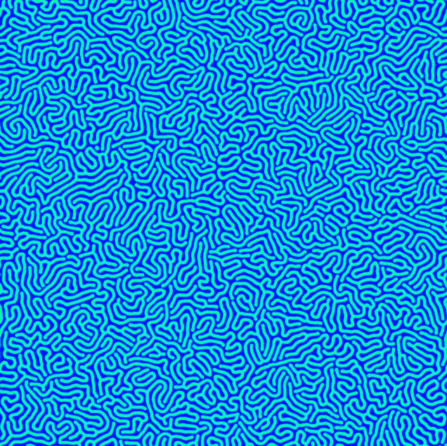

# 神经网络:类比

> 原文：<https://towardsdatascience.com/neural-networks-analogies-7ebeb3ac5d5e?source=collection_archive---------7----------------------->

当我们的大脑形成类比时，它们正在做一些特殊的事情——一些现有神经网络中缺少的事情。我们的大脑采用了为*一个*任务设计的过程，并且在*一个新的*任务中使用相同的过程。他们*转移*他们所学的东西。当我们形成一个概括，两个任务之间的类比时，这被称为'*迁移学习*'。

我将概述展示迁移学习的人工神经网络的潜在途径:

**首先，稀疏分布式表示**

[Numenta](https://numenta.com/neuroscience-research/research-publications/papers/a-theory-of-how-columns-in-the-neocortex-enable-learning-the-structure-of-the-world/) 的分级临时记忆，以及其他技术，依赖于*稀疏分布式表示*。这方面的一个例子是一个很长的 1 和 0 的字符串，其中几乎所有的值都是 0——1 有一个稀疏分布*。如果每个数字*代表*不同的东西，比如“尖耳朵”、“尾巴”、“胡须”，那么任何输入都可以被编码为这些稀疏分布之一。记录“尖耳朵”、“尾巴”和“胡须”存在的图像将与输出“猫”紧密相关。稀疏分布表示可以以这种方式映射到输出，隐含地为它选择“猫”的*提供了一个*理由——它看到了胡须、尾巴和尖尖的耳朵。*

稀疏分布式表示允许一些巧妙的技巧。因为它们只有几个 1 和许多 0，两个表示可以通过加法组合*，当一个新的表示与这个组合进行比较时，通常只有当新的输入与旧的输入之一匹配*时，它才会匹配*。例如，如果向网络呈现一幅有猫和自行车的图像，则对应于“胡须”、“尾巴”和“尖耳朵”的位的值为 1，以及对应于“两个轮子”、“座位”和“车把”的位的值为 1。该表示的所有其他位将为零。然后，一个带有猫和棒球的*新*图像呈现在网络上，并附有问题:“这两个图像之间的*相同点*是什么？”虽然棒球触发了“球体”、“白色”和“缝合”的位，但猫仍然点亮了“尖耳朵”、“尾巴”和“胡须”的位，因此通过比较可以立即确定*猫*为两幅图像所共有。*

这种识别两种表征之间共性的能力是形成类比的关键。为了看到这一点，我们需要看看专家的*混合的动态的稀疏分布表示。*

**混合专家**

听起来像是专家的混合体。神经网络接收输入，并将它们传递给各种各样的“*专家*”——经过训练处理特定类型输入的神经元集群。在一组专家对输入进行处理后，他们的输出将被*解析*给新的一组专家。也就是说，使用的专家取决于输出是什么。每个结果对应不同的专家组。

所以，每个专家的表现都不一样。而且，当遇到一种新的任务时，一批新的专家会接受这项任务的培训。我提出，当新任务被训练后，它的结果可以与旧任务在不同情况下的结果进行比较。**如果结果与**匹配，那么新任务的专家可以由老专家替换。这个过程就是类比的形成。

想象一下——一个神经网络被训练来观看视频并预测棒球的运动。神经网络学会将“球体”、“白色”、“缝线”识别为“棒球”，并将棒球的数据发送给一组处理“下落物体”的专家神经元。网络将球视为下落物体，期望它以抛物线运动下落。它的专家，在许多棒球下落的例子之后，能准确地预测棒球的运动。

然后，同一个网络呈现出一个*篮球*的图像。就像以前一样，“球体”在稀疏分布表示中亮起，但它是“橙色”和“纹理化的”，而不是“白色”和“缝合的”。这是一个新的环境，首先，它被授予一个新的专家神经元集群。过了一会儿，这些新的神经元学会了预测篮球的运动——专家们独立地重新发现了抛物线运动。

接下来，抛物线运动必须与棒球的抛物线运动相比较。如果神经网络识别出两个专家集群的行为方式相同，那么“篮球”实例可以被馈送给棒球使用的同一“下落物体”专家。把“篮球”和“棒球”放在同一个地方，这是两个之间的一个*类比——它们都是“落体”。*

假设出现了第三个图像，一个茶杯。它不是一个“球体”,在它的较低层没有任何其他的特性。然而，如果它下落，它会受到与棒球和篮球相同的抛物线运动的影响——因此，它将被映射为“下落物体”的相同专家群集的类比。最终，大多数事情将被映射到同一个“落体”专家——这将是一个近乎普遍的原则，达到我们在自己心中看到的概括水平。

**如何比较专家**

当专家们观察棒球时，他们学会了下落物体的抛物线运动。看篮球，一群新的*专家*学习同样的抛物线运动。我们怎么知道他们学到了相同的原理？我们可以向他们中的每一个输入另一个，看看他们的预测是否匹配。让棒球数据反馈给受过篮球训练的专家，反之亦然。

我们不需要测试棒球和篮球的每一个实例。要测试的最重要的是 [*边缘案例*](/neural-networks-forming-analogies-587557c3b26e) 。这些被定义为两类专家最有可能产生分歧的地方。如果这些边缘情况匹配，那么我们有信心这两个专家集群已经学习了相同的一般原理。在这些边缘情况下的测试等同于科学方法，在极端情况下进行实验以验证一个概括。

然而，有许多可用的专家集群。我们如何知道从哪里开始？这就是我们需要每个专家的 ***行为*** 的稀疏分布表示的地方。这是新的，可能会在一个幼稚的网络和一个推广良好的网络之间产生差异。

**编码专家行为**

每个专家都需要自己的稀疏分布式表示。该字符串的位通常为“0”，在对应于该专家属性的位置有几个“1”。在棒球上训练的“下落物体”专家将在对应于“抛物线”的位置包含值为“1”的位，因为它的抛物线运动，以及“向下移动”和“小物体”。相比之下，在破碎的冰山上训练的一群专家神经元会识别相同的抛物线下落，照亮“抛物线”并“向下移动”，然而与下落的棒球相比，它们巨大的尺寸会减缓感知的抛物线运动。它将包含用于“大对象”而不是“小对象”的位。这是每个专家的编码，根据其行为的性质。

当两个专家描述相似的行为时，他们有相似的稀疏分布表示。许多“1”在它们的位串上重叠。棒球和篮球的专家几乎完全重叠，这表明他们很可能是相似的。

潜在的相似性是这样发现的:一个新专家的稀疏分布表示与现有专家的表示进行比较，如果两者具有匹配的表示，则假设它们是相似的。从那里，交换他们的输入来检查边缘情况，如前所述。如果边缘案例匹配，假设类比有效，新专家被更成熟的专家取代。

注意，通过使用稀疏分布式表示，只有当某个属性*存在*时，1 和 0 的字符串才进行编码。它不声明输入的哪个分量触发属性的存在。下落的棒球和破碎的冰山都可以包含“天际线”作为其输入的属性，并且稀疏分布表示不会说明“天际线”或“冰山”是“向下移动”的来源。该信息必须通过消融来发现。

如果下落棒球的视频在其稀疏分布表示中包含比特“天际线”，那么当“天际线”被移除时，可以测试专家的结果。天际线的消除会改变“抛物线”、“向下移动”或“小物体”吗？如果不是，那么“天际线”被认为与专家表示的比特无关。“Skyline”对于处理“外部”的不同专家来说可能很重要，但是稀疏分布表示允许我们将其与“向下移动”位分开。就像在两个图像中识别一只猫，独立于旁边的棒球或自行车。通过这种方式，输入的每个组成部分都被映射到它所修改的专家表示的一组位上——**我们发现每个位都依赖于哪些输入**。

每当专家表示的一个比特不依赖于输入表示的一个比特时，比如“向下移动”独立于“skyline ”,当解析使用哪个专家时，网络学会忽略该独立比特。无论是否出现“天际线”,棒球下落的视频都会触发“抛物线运动”。棒球是网络关注的地方，将数据传递给“抛物线运动”专家。

因此，我们可以说视频中“抛物线运动”的*源*是棒球。这就是我们如何克服专家的稀疏分布表示没有明确描述输入的哪一部分触发其表示中的位的事实。这个消融过程相当于测量输入相对于专家表示的比特的梯度。

**类比的价值**

通常，在专家混合的情况下，每个专家只对训练集的一小部分是活跃的。它没有什么可以借鉴的例子。然而，如果专家是由稀疏的分布式表示来描述的，我们可以比较他们，看看假设的类比潜伏在哪里。如果他们的表现匹配，我们测试他们之间的边缘情况，以验证假设的类比，这将那些专家结合成一个。一旦专家有了这样的类比，更大部分的训练数据就会流过它。“落体”专家不再仅仅处理棒球下落的视频，而是概括处理茶杯、篮球、冰山、猫下落的视频。

所有这些不同事件的知识相互补充，大大提高了专家的准确性。专家可以像我们一样从更少的例子中学习。并且，它使用假设和实验不断地发现类似的行为。在强人工智能之前，我只看到一些其他的障碍，使用这种方法。