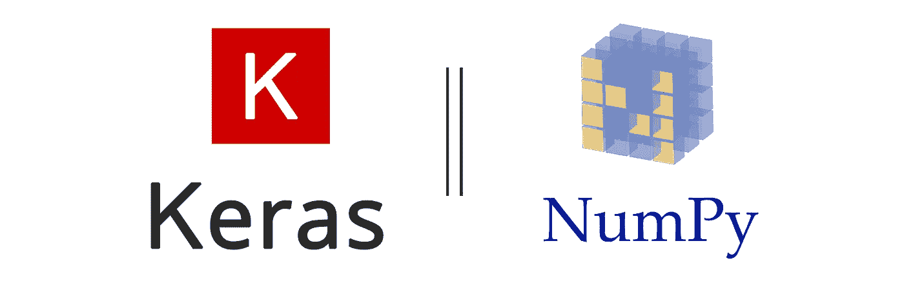
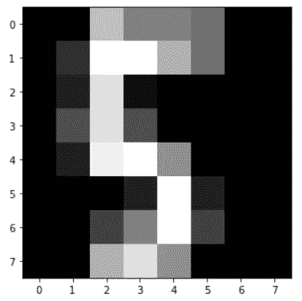
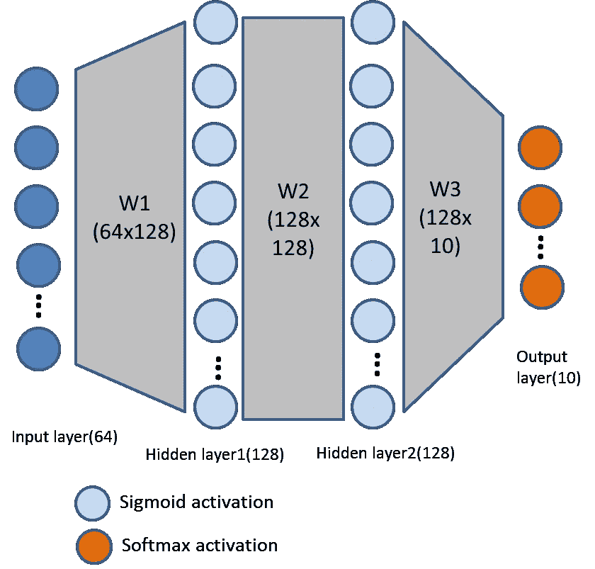
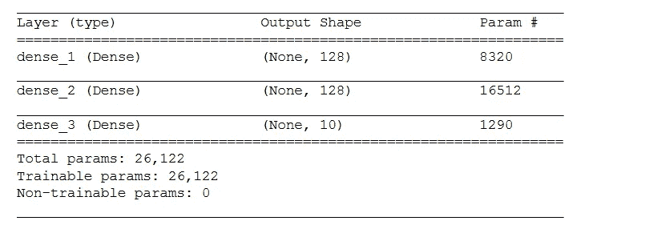
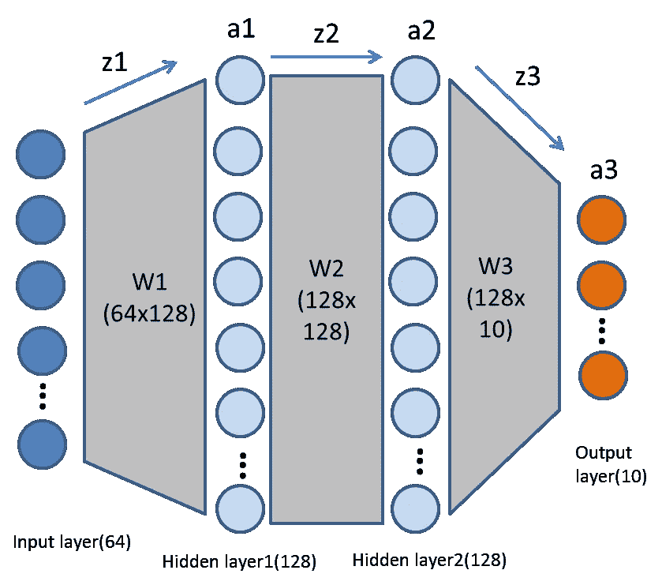
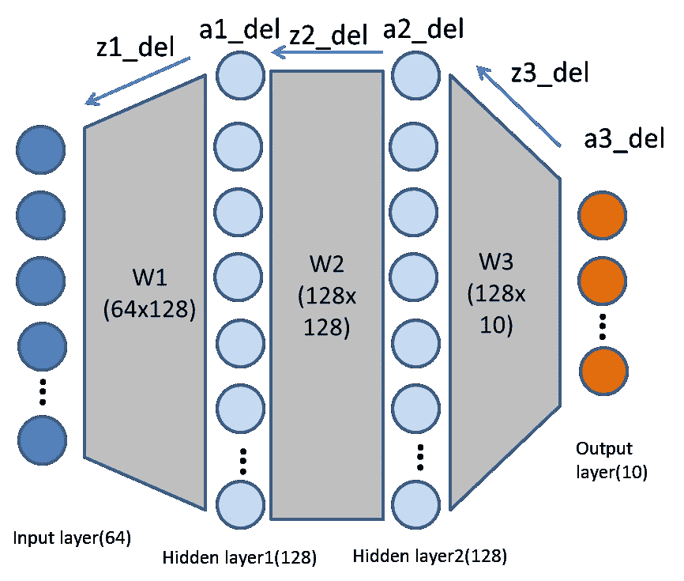
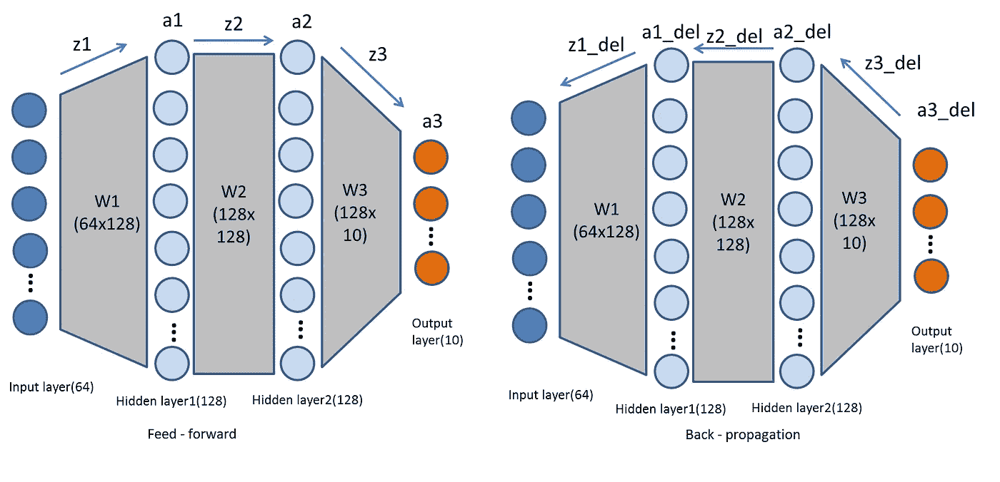

# 神经网络从无到有。容易还是困难

> 原文：<https://towardsdatascience.com/neural-networks-from-scratch-easy-vs-hard-b26ddc2e89c7?source=collection_archive---------4----------------------->



对于那些不了解人工神经网络工作原理的人来说，人工神经网络就像魔法一样神奇。当你可以成为魔术师的时候，为什么要做一个观众！。我想讨论一下开始使用标准的机器学习库(`keras`)是多么容易，如果我们试图从零开始实现一个神经网络(`numpy`)以及一点点数学知识，它会变得多么有趣。

## 有什么新鲜事！

嗯，已经有几篇关于如何从头开始开发神经网络的文章了。但是，在大多数让初学者记住的文章中，实现了一个简单的网络，没有任何关于成本或激活功能的讨论。当手头的问题改变时，由于输入值的范围、激活函数的类型、误差函数，网络不能正常工作。所以，我们再深入挖掘一下。

这是我们将要做的。准备一些数据集，创建一个合适的网络体系结构，先用简单的方法实施该体系结构，然后用困难的方法实施。

## 数据准备

让我们使用来自 sklearn 的数字数据集。它是一个多类分类。

```
import pandas as pd
import matplotlib.pyplot as plt
from sklearn.datasets import load_digits
from sklearn.model_selection import train_test_splitdig = load_digits()
plt.gray()
plt.matshow(dig.images[25])
```



看起来像迷你版的 mnist。应该没问题。[该数据集](http://scikit-learn.org/stable/modules/generated/sklearn.datasets.load_digits.html#sklearn.datasets.load_digits)包含`data`中的输入和`target`变量中的输出。`target`取值范围从 0 到 9。它必须被转换成一位热码表示，其中数组包含所有的零，除了索引值为 1。即，值 4 将被表示为[0，0，0，0，1，0，0，0，0]。`pandas`在单一功能中完成。由于误差函数的性质，这种多类分类问题必须被转换成用于训练 NN 模型的一个热点表示。

```
onehot_target = pd.get_dummies(dig.target)
```

就是这样！。数据集准备好了。现在，让我们把它分成训练和测试数据集。`train_test_split`也随机化实例

```
x_train, x_val, y_train, y_val = train_test_split(dig.data, onehot_target, test_size=0.1, random_state=20)# shape of x_train :(1617, 64)
# shape of y_train :(1617, 10)
```

训练集中有 1617 个实例。每个输入实例包含 64 个值的数组，相应的输出包含 10 个值的数组。

Dataset preparation

# 人工神经网络体系结构；

让我们构建一个四层网络(输入，两个隐藏层，输出)。

*输入层- 64 个神经元(输入图像数组)
隐藏层 1 - 128 个神经元(任意)
隐藏层 2 - 128 个神经元(任意)
输出层- 10 个神经元(输出单热数组)*



ANN architecture

# keras——简单的方法:

`Keras`是一个非常棒的入门库。又快又简单。

```
from keras.layers import Dense
from keras.models import Sequential
from keras.optimizers import RMSprop, Adadelta, Adammodel = Sequential()
model.add(Dense(128, input_dim=x_train.shape[1], activation='sigmoid'))
model.add(Dense(128, activation='sigmoid'))
model.add(Dense(10, activation='softmax'))
```

在我们的例子中，我们将建立一个完全连接的神经网络，这意味着当前层中的所有神经元都连接到下一层中的所有神经元。因此，我们将模型定义为`sequential`，并添加了三个连续的层。需要注意的是，没有必要为输入添加单独的层。当定义第一个隐藏层时，输入层将自动初始化。

该模型添加了具有 128 个神经元的第一个隐藏层，其中`input_dim`也指定了输入层的大小。第二个隐藏层也有同样的 128 个神经元。最后，输出层有 10 个神经元。

```
model.summary()
```



模型不完整，没有指定成本函数和梯度下降优化。

```
model.compile(optimizer=Adadelta(), loss='categorical_crossentropy', metrics=['categorical_accuracy'])
model.fit(x_train, y_train, epochs=50, batch_size=64)
```

好吧。这是做这件事最简单的方法。总的来说，

ANN using keras

# 安白手起家——艰难之路

准备好。。这是一条艰难的路。该算法通过两个主要过程来训练模型。前馈和反向传播。前馈预测具有某些权重的给定输入的输出，反向传播通过调整权重来训练模型。因此，必须首先初始化权重。

```
import numpy as npclass MyNN:
    def __init__(self, x, y):
        self.input = x
        self.output = y
        neurons = 128       # neurons for hidden layers
        self.lr = 0.5       # user defined learning rate
        ip_dim = x.shape[1] # input layer size 64
        op_dim = y.shape[1] # output layer size 10
        self.w1 = np.random.randn(ip_dim, neurons) # weights
        self.b1 = np.zeros((1, neurons))           # biases
        self.w2 = np.random.randn(neurons, neurons)
        self.b2 = np.zeros((1, neurons))
        self.w3 = np.random.randn(neurons, op_dim)
        self.b3 = np.zeros((1, op_dim))
```

从一组好的权重开始肯定会快速提供局部最小值。除了缓慢地达到局部最小值之外，坏的权重集有时可能永远不会收敛。为了打破对称性，初始权重应该被随机化。这些值不应该为零，而应该更接近于零，这样输出就不会激增。最好有正值也有负值，这样除了大小，方向也不同。所以用正态分布。将偏置向量初始化为零是可以的。


source: [Machine learning memes for convolutional teens, facebook](https://www.facebook.com/convolutionalmemes/)

## 前馈



Forward pass

```
def sigmoid(s):
    return 1/(1 + np.exp(-s))# for numerical stability, values are normalised
def softmax(s):
    exps = np.exp(s - np.max(s, axis=1, keepdims=True))
    return exps/np.sum(exps, axis=1, keepdims=True)def feedforward(self):
    z1 = np.dot(self.x, self.w1) + self.b1
    self.a1 = sigmoid(z1)
    z2 = np.dot(self.a1, self.w2) + self.b2
    self.a2 = sigmoid(z2)
    z3 = np.dot(self.a2, self.w3) + self.b3
    self.a3 = softmax(z3)
```

前馈过程非常简单。`(input x weights) + bias`计算`z`并将其传递到包含特定激活函数的层中。这些激活函数产生输出`a`。当前层的输出将是下一层的输入，依此类推。如您所见，第一和第二隐藏层包含作为激活函数的 *sigmoid* 函数，输出层包含作为激活函数的 *softmax* 。softmax 产生的最终结果`a3`是神经网络的输出。

应用于该层的函数类型有很大的不同。Sigmoid 函数将输入压缩到(0，1)，Softmax 也做同样的事情。但是，Softmax 确保输出之和等于 1。在我们的输出中，我们想要测量每个类的输入的概率。例如，如果一个图像有 0.9 的概率是数字 5，那么在其他类中分配 0.1 的概率是明智的，这是由 softmax 完成的。

## 反向传播



Backward pass

好吧。Back-prop 可能看起来很棘手，因为你要处理多个层，多个权重，损失函数，梯度。不要担心，我们会用数学、直觉和代码实现来尝试它。从根本上来说，反向推进根据前馈输出和真实值计算误差。通过计算每层中的梯度，该误差被反向传播到所有的权重矩阵，并且这些权重被更新。听起来很简单对吧。嗯。让我们看看。

**损失函数:**

成本函数和损失函数可以互换使用。严格地说，损失函数是针对单个实例计算的，而成本函数是针对整个网络的。成本函数是一种衡量网络与真实值相比表现如何的方法。实际上，我们永远不会在训练中的任何地方使用成本函数，但是我们必须计算成本函数 w.r.t .权重和偏差的梯度以进行更新。所以，计算损失只是为了看看，我们在每个时期做得有多好。

最常用的损失函数是均方误差。由于我们正在处理多类分类问题，输出将是一个概率分布。我们要把它和我们的真实值进行比较，这也是一个概率分布，找到误差。对于这种情况，强烈建议使用交叉熵作为代价函数。为什么因为，交叉熵函数能够计算两个概率分布之间的误差。

**连锁规则:**

让我们考虑成本函数为 c，从前馈，我们知道

```
z = xw + b                 -> z = function(w)
a = sig(z) or softmax(z)   -> a = function(z)
c = -(y*log(a3))           -> c = function(a)
```

因此，根据输出，我们所要做的就是找出误差，以及每个权重对输出的影响程度。换句话说，求成本函数 w.r.t w3 的导数。是的，反向传播就是用链式法则计算导数。

**外层:**

```
dc     dc    da3   dz3
---  = --- . --- . ---
dw3    da3   dz3   dw3z3 = a2w3 + b3
a3 = softmax(z3)dz3/dw3 = a2
da3/dz3 = softmax derivative(z3)
dc/da3  = cost function derivative(a3) = -y/a3
```

令人惊讶的是，由于交叉熵经常与 softmax 激活函数一起使用，我们实际上不必计算这两个导数。因为，这些导数的某些部分相互抵消，正如这里[清楚解释的](http://neuralnetworksanddeeplearning.com/chap3.html#introducing_the_cross-entropy_cost_function)。由此可见，`predicted value — real value`是他们产物的结果。

```
Let, a3_delta be the product of these terms as it will be needed in the upcoming chain rules.
           dc    da3
a3_delta = --- . --- 
           da3   dz3Thus, a3_delta = a3-y (the error to be propagated)dc     
---  = (a3 - y) . a2
dw3    
w3 = w3 - dc/dw3For changes in biases,
dc     dc    da3   dz3
---  = --- . --- . ---
db3    da3   dz3   db3dz3/db3 = 1\. Rest is already calculated
b3 = b3 - dc/db3 => b3 = b3 - a3_delta
```

**隐藏图层:**

在隐藏层中，成本函数相对于隐藏层的偏导数也将遵循链式规则，因为成本函数是外层的函数。

```
z2 = a1w2 + b2
a2 = sigmoid(z2)dc     dc    da2   dz2
---  = --- . --- . ---
dw2    da2   dz2   dw2dz2/dw2 = a1
da2/dz2 = sigmoid_derv(z2)dc     dc    da3   dz3
---  = --- . --- . --- => dc/da2 = a3_delta.w3
da2    da3   dz3   da2w2 = w2 - dc/dw2
and set a2_delta = dc/da2 . da2/dz2dc     dc    da2   dz2
---  = --- . --- . ---
db2    da2   dz2   db2dz2/db2 = 1
b2 = b2 - dc/db2 => b2 = b2 - a2_delta
```

成本函数 w.r.t w1 的导数也是如此

```
z1 = x.w1 + b1
a1 = sigmoid(z1)
c  = a1.w2 + b2dc     dc    da1   dz1
---  = --- . --- . ---
dw1    da1   dz1   dw1dz1/dw1 = x
da1/dz1 = sigmoid_derv(z1)dc     dc    da2   dz2
---  = --- . --- . --- => dc/da1 = a2_delta.w2
da1    da2   dz2   da1w1 = w1 - dc/dw1
and set a1_delta = dc/da1 . da1/dz1dc     dc    da1   dz1
---  = --- . --- . ---
db1    da1   dz1   db1dz1/db1 = 1
b1 = b1 - dc/db1 => b1 = b1 - a1_delta
```

收集所有上述方程，并把它放在一个单一的镜头将提供一个更好的概览。与向前传球相比，直觉上也是有道理的。



```
Feed forward equations:
z1 = x.w1+b1
a1 = sigmoid(z1)z2 = a1.w2+b2
a2 = sigmoid(z2)z3 = a2.w3+b3
a3 = softmax(z3)Back propagation equations:There is no z3_delta and softmax_derv(a3), as explained before.
a3_delta = a3-y z2_delta = a3_delta.w3.T
a2_delta = z2_delta.sigmoid_derv(a2)z1_delta = a2_delta.w2.T
a1_delta = z1_delta.sigmoid_derv(a1)
```

**注:**sigmoid 函数的导数可通过两种方式实现，具体取决于输入。这总是有一个困惑。如果输入已经是 sigmoid 的输出，即`a`，则

```
def sigmoid_derv(x):
    return x * (1 - x)
```

如果输入为`z`且未通过 softmax 激活，则

```
def sigmoid_derv(x):
    return sigmoid(x) * (1 - sigmoid(x))
```

在链式法则计算中，使用了`z`的 sigmoid 导数。但是在实现中，使用了`a`的 sigmoid 导数。因此，使用前一个等式。希望，这已经够清楚了。现在有了 numpy 实现。

```
def sigmoid_derv(s):
    return s * (1 - s)def cross_entropy(pred, real):
    n_samples = real.shape[0]
    res = pred - real
    return res/n_samplesdef error(pred, real):
    n_samples = real.shape[0]
    logp = - np.log(pred[np.arange(n_samples), real.argmax(axis=1)])
    loss = np.sum(logp)/n_samples
    return lossdef backprop(self):
    loss = error(self.a3, self.y)
    print('Error :', loss)
    a3_delta = cross_entropy(self.a3, self.y) # w3
    z2_delta = np.dot(a3_delta, self.w3.T)
    a2_delta = z2_delta * sigmoid_derv(self.a2) # w2
    z1_delta = np.dot(a2_delta, self.w2.T)
    a1_delta = z1_delta * sigmoid_derv(self.a1) # w1 self.w3 -= self.lr * np.dot(self.a2.T, a3_delta)
    self.b3 -= self.lr * np.sum(a3_delta, axis=0, keepdims=True)
    self.w2 -= self.lr * np.dot(self.a1.T, a2_delta)
    self.b2 -= self.lr * np.sum(a2_delta, axis=0)
    self.w1 -= self.lr * np.dot(self.x.T, a1_delta)
    self.b1 -= self.lr * np.sum(a1_delta, axis=0)
```


Source: [neuralnetmemes, picbear](http://picbear.online/neuralnetmemes)

**预测阶段:**

一旦模型经过足够的训练，预测就简单了。查询输入必须传递给前馈网络并预测输出。

```
def predict(self, data):
    self.x = data
    self.feedforward()
    return self.a3.argmax()
```

总的来说，

ANN using numpy

# 最后的想法

*   调整参数，如学习率，纪元，初始权重，激活函数，看看系统如何反应
*   如果您的模型不起作用，即误差直线上升或权重都是 NaNs，或者只是预测所有输入都属于同一个类别:
    -检查每个函数是否标准化
    -用单个类进行训练，看看它是如何工作的
    -检查矩阵的维数及其转置
    -验证所用产品的类型，点积还是[哈达玛积](https://en.wikipedia.org/wiki/Hadamard_product_(matrices))

感谢您阅读帖子。如果你喜欢，请鼓掌。如果你发现了错误或有疑问，请在评论中告诉我。

欢迎通过 [Github](https://github.com/chmodsss) 、 [Twitter](https://twitter.com/chmodsss) 和 [Linkedin](https://www.linkedin.com/in/sivasuryas) 联系我。干杯！。