# 神经网络 I:符号和构建模块

> 原文：<https://towardsdatascience.com/neural-networks-i-notation-and-building-blocks-817b1d2ea04b?source=collection_archive---------7----------------------->

## [神经网络简介](https://medium.com/tag/neural-network-notes/latest)

这个关于神经网络的[系列帖子](https://medium.com/@pabloruizruiz/neural-networks-notes-fa42ab388bb8)是脸书 PyTorch 挑战赛期间笔记收集的一部分，在 Udacity 的[深度学习纳米学位项目之前。](https://eu.udacity.com/course/deep-learning-nanodegree--nd101)

# 内容

1.  **神经元**
2.  **连接**
3.  **层——神经元与连接**

3.1 神经元层

3.2.连接层— *PyTorch 示例*

**4。符号歧义:Y = X W vs Wt X**

# 1.神经元

神经元是神经网络的组成部分。

毕竟，神经网络是神经元的简单集合，它们朝着同一个目标一起工作，通常是执行给定的任务，实现尽可能少的错误。

由于我们用于神经网络的图形表示，如图 1 所示，神经元也接收节点的名称，因为每个节点对应于图形表示中的一个唯一节点。图形表示不仅仅是用来简单地观察这些网络，也是我们如何计算实际发生的操作的一个基本方面。这将在更高级的部分“图形方法”中介绍，不在本节的讨论范围之内。

Figure 1\. Graph representation of a neural network

只要看一下图 1，我们就可以通过观察神经元看起来是按层组织的，一个接一个地堆叠起来，从而对下一部分有一个直觉。然而，让我们先来看看单个网络的细节，并评估它们与真实生物神经元的接近程度。

在图 2 中，我们只是从网络中随机选取了一个神经元，并观察它由不同的部分组成。放大镜所指的那个神经元将对应于它上面的生物表示中的第二个网络。

我们观察哪些部分？

**收集器**

我将其命名为收集器，因为它的功能是聚集来自其他网络的传入连接。用生物学术语来说就是突触连接。请注意，合计行为的数学等价形式是求和。我们将看到，这种求和不仅仅是对所有连接求和，而是对它们进行加权，这意味着每个连接对收集器都有不同的“重要性”。

**激活器**

聚集在收集器中的接收信号的激活是发生在网络主体内部的过程。目前还不清楚对那个过程来说什么是更好的表示，在深度学习中，它是通过所谓的**激活函数**来建模的。这些函数的形式各不相同，但它们只是将一个函数应用于采集器传递的信号。这些函数是非线性的，因为激活器是神经元(或网络)的唯一部分，在那里我们可以引入学习非线性映射的能力，这是绝大多数真实世界场景所需要的。

**经销商**

在它的名字之后，分配器简单地收集激活器之后的信号，并以相同的强度将它发送到它所属的神经元所连接的其余神经元。在神经网络的图形表示中，它指的是堆叠神经元的下一层中的每一个单个神经元。

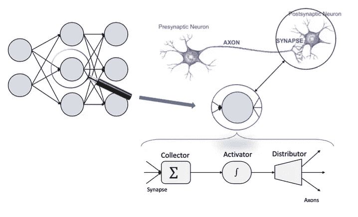

Figure 2\. Biological neuron vs Artificial neuron

# 2.连接

在人工神经网络的图形表示中，不同神经元之间的连接由连接两个节点的边来表示。它们被称为**权重**，通常表示为*和*。神经网络上的权重是任何参数模型上的**参数**的特例。

如图 3 所示，我们可以给组成每一层的每一个神经元一个数字。权重的子指数表示哪些神经元被连接。因此， *wij* 表示在前一层神经元 *i* 与后一层神经元 *j* 之间建立的连接。

一种更有效的表示两层之间所有连接的数学方法是将它们收集到**权重矩阵**、**、 *W* 、**中。该矩阵将具有以下形式:

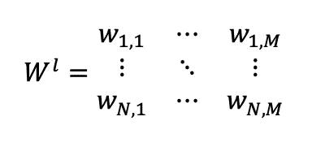

其中 *l* 表示这些权重的层的索引。 *N* 为上一层神经元的数量， *M* 为下一层神经元的数量。因此，行数由第一层神经元的数量定义，而列数由第二层神经元的数量定义，这当然不必相同。为简单起见，图 3 中省略了 *l* 索引。

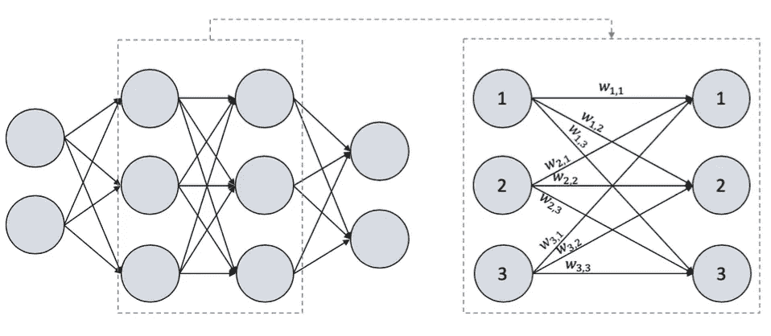

Figure 3\. Connections of neurons between 2 layers

为了对权重矩阵有更强的直觉，让我们给网络的输入命名，看看矩阵的行和列代表什么。

我们可以把图 4 中的输入看作是，例如花在学习理论上的小时数和花在做练习上的小时数。模型的输出可以是通过考试的概率。所以我们要输入变量和 *x1* 和 *x2* 可以简化为输入向量 ***X*** *。*

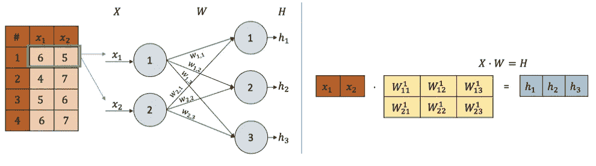

Figure 4\. Computing the output of a layer

通过矩阵乘法，我们看到输入如何乘以每个权重，以产生输出 ***H*** (隐藏后)，其维数与该隐藏层的神经元数相匹配(我们将在下一节中更多地讨论层)。在这种情况下， *h1* ， *h2* ， *h3* 。

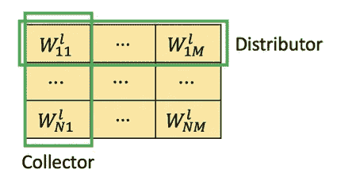

Figure 5\. Weights matrix

让我们更仔细地看看权重矩阵。在图 5 中，我们可以看到每一列实际上代表了后一层中每个神经元的收集器。因此，每一行都代表前一层中每个神经元的分布器。

# 3.层——神经元与连接

我们已经介绍了人工神经元是如何分组分层的。特定层的每个神经元接收其所属层之前的层的每个单个神经元的信号，并将信号发送到下一层的每个单个神经元。

## 神经元层

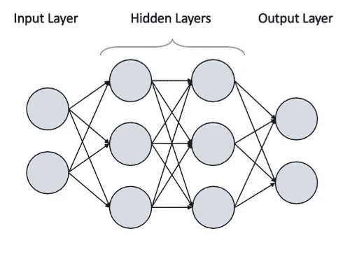

Figure 6\. Layers of an artificial neural network

深度学习中的单词层然后被用来称为神经元的每个堆叠聚集。在图 6 之后，第一层通常称为输入层。这是因为这是将输入引入网络以初始化正向传递的层，如图 4 所示。最后一层接收输出层的名称。直观上，它将把每个神经元执行的所有计算的输出结果提供给输入。输入层和输出层之间的所有中间层称为隐藏层。这些层通过创建数据特征的分层表示来执行所谓的表示学习。在使用了许多隐藏层之后，术语“深度学习”“T21”出现了，就这些层的数量而言，它让位于更深的网络。

## 连接的层次

在某些情况下,“层”这个词也用来指网络的权值层。因此，我们可以在网络中有两种堆叠实体表示，如图 7 所示。

左手边代表典型的神经元层。右手边代表连接的层，其中每一层代表封装该特定层的参数的权重矩阵。

记住这一点是很有用的，因为当我们实现我们的网络时，例如在 PyTorch 中，我们通常定义两层神经元之间连接的隐藏单元的数量。因此，我们给出权重矩阵的维数，并遵循右侧的表示。在这种情况下，PyTorch 中的深度前馈神经网络实现为:

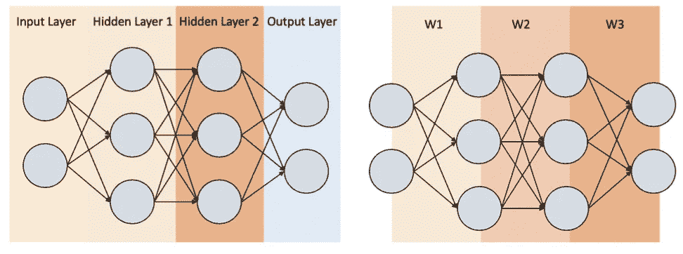

Figure 7\. Layers of neuron vs Layers of weights

图 8 表示在 *PyTorch* 中实现的图中使用的上述网络的输出。我们简单地传递了输入和输出维度以及一个列表，其中每个条目是每个隐藏层中的神经元数量 *(2，2，[3，3])* 。

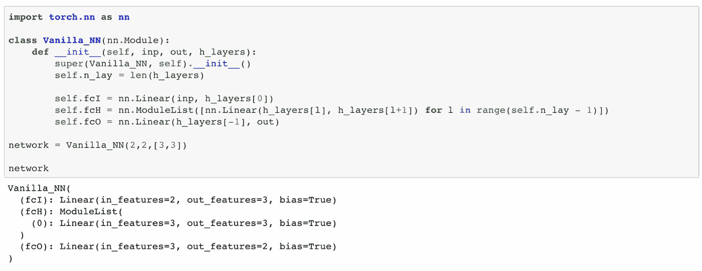

Figure 8\. PyTorch implementation of the network

注意，当我们通过*网络*简单地调用网络时， *PyTorch* 打印出一个表示，将层理解为连接层！如图 7 的右手侧。根据 *PyTorch* 的隐藏层数是 1，对应于 *W2* ，而不是 2 层 3 个神经元，这将对应于*隐藏层 1* 和*隐藏层 2* 。

# 4.**符号歧义:Y = X W vs Wt X**

深度学习中一个非常常见的模糊符号是如何在数学上表示输入和权重之间的乘积，以产生输出或任何特定层的隐藏表示。

首先，无论哪种记数法，如果使用得当，输出都是一样的。它们之间的区别在于如何理解变量(向量)，是水平向量还是垂直向量。

## 4.1.Y = Wt * X

在我们看到权重矩阵的转置出现在输入向量之前的情况下，意味着向量被表示为列向量。这种符号如此常见的原因是，特别是在神经网络被纯粹视为统计黑盒模型的背景下，遵循文献中其余模型的符号。

说到底，神经网络只是做所谓的*曲线拟合的另一个工具而已。这意味着我们试图找到一个更好地适应数据分布的模型，当然，神经网络不是用来解决这一任务的第一个模型。线性回归模型是这种做法的最简单形式，如图 9 所示，用于图 7 所示网络中的二维输入。*

*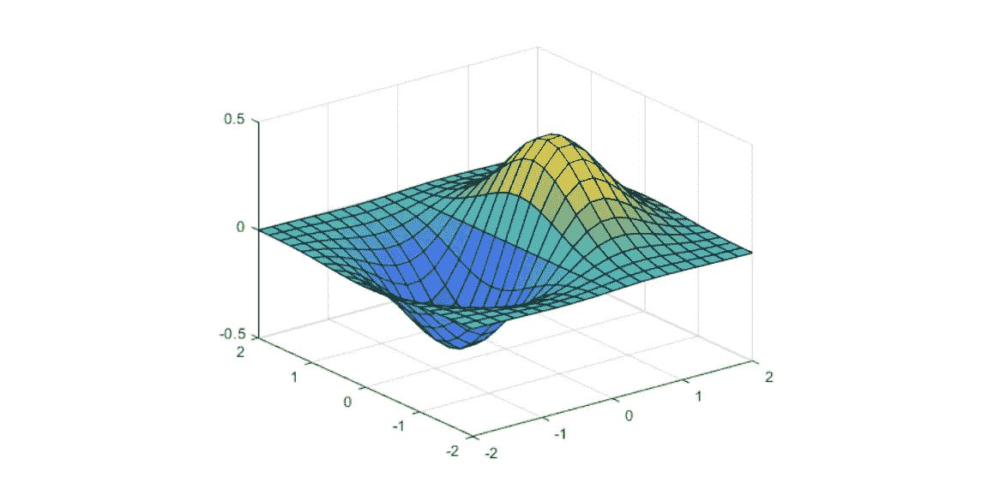*

*Figure 9\. Curve fitting for 2D input space*

*搜索该表面的表达式将以一些未知的系数开始，这些系数对输入值进行“加权”:*

**

*为简单起见，我们将从现在起省略偏置项 *b* 。*

> ***要点是系数通常放在它们所附属的变量之前。***

*听起来很熟悉，对吗？我们可以用一个非常简单的神经网络来表示这个方程，如图 10 所示。*

*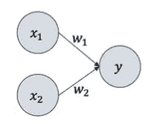*

*Figure 10\. 2D Surface fitting NN*

*我们还省略了权重的第二个子索引，因为只有一个收集器。*

*现在，如果我们将输入理解为两个条目的列向量，则这些网络的组件将是:*

**

*因此，计算输出的最终公式为:*

**

*延伸到一个更复杂的例子，对于图 7 中的网络，第一个隐藏层(没有任何偏置和激活)之后的隐藏值将是:*

*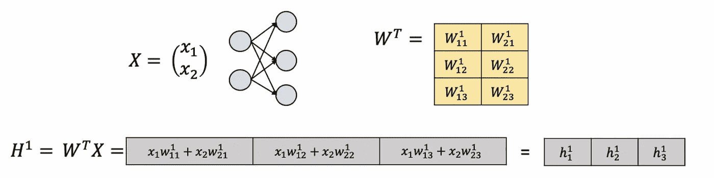*

## *4.2.Y = X* W*

*在文献中找到神经网络的前向传递的另一种可能性是在没有任何转置的情况下利用权重矩阵之前的输入变量。*

*这自然是理解变量的相反方式。这一次，作为一个行向量，因此:*

**

*在我个人看来，这种方式感觉更自然。*

*作为人类，我们非常习惯于表格数据，我们通常赋予列维度的含义，赋予行不同记录(或观察)的含义。因此，类似于图 11 中描述的表格信息，结果非常直观。*

*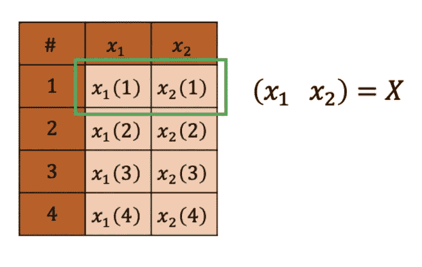*

*Figure 11\. Tabular data to row vector representation*

*在图 11 中，每一列代表现实世界中的一件真实的事情。 *x1* 可能是花在为考试学习理论上的时间，而 *x2* 可能是花在做练习上的时间。这个模型可以试着预测学生将得到的分数。#不是一个栏目，而是一个索引，简单地说就是每个不同的学生询问他是如何分配学习时间的。*

*在这些帖子中，我们将更详细地讨论批量大小。这一批仅仅意味着如果我们不是一次选择一个学生，而是选择更多的学生在网络上做同样的转发。绿框表示批量为 1。*