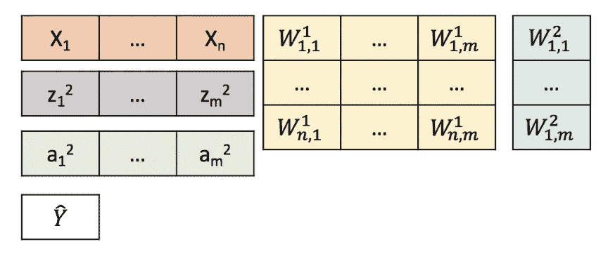
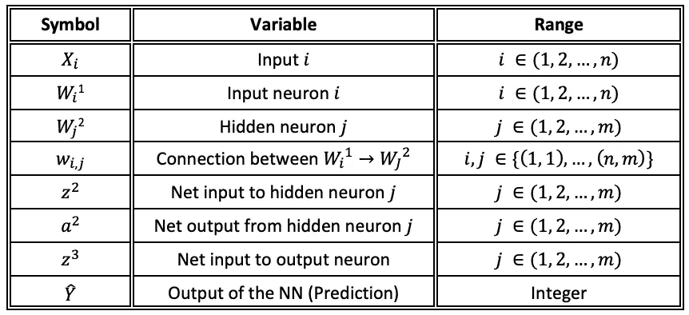
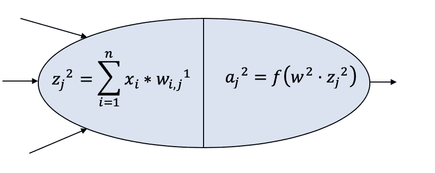
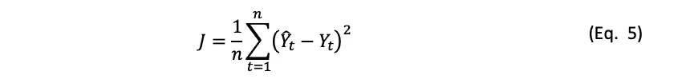
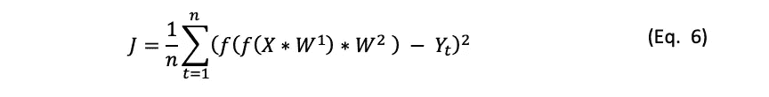
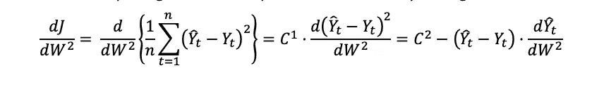
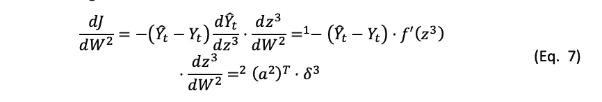
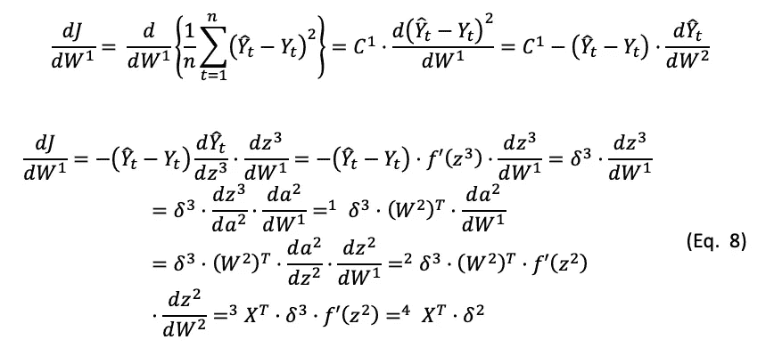
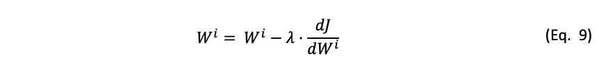

# 神经网络 II:第一次接触

> 原文：<https://towardsdatascience.com/neural-networks-ii-first-contact-7ad5094db1d2?source=collection_archive---------12----------------------->

## [神经网络简介](https://medium.com/tag/neural-network-notes/latest)

这个关于神经网络的[系列帖子](https://medium.com/@pabloruizruiz/neural-networks-notes-fa42ab388bb8)是脸书 PyTorch 挑战赛期间笔记收集的一部分，在 Udacity 的[深度学习纳米学位项目之前。](https://eu.udacity.com/course/deep-learning-nanodegree--nd101)

# 内容

1.  **简介**
2.  **向前传球**
3.  **反向传播**
4.  **学习**
5.  **测试**
6.  **结论**

# 1.介绍

在下图中，显示了一个人工神经网络。我们可以看到如何将我们的输入数据( *X* )转发到神经网络中，并获得对我们输出的预测 *Y_hat* 。

Figure 1\. Schematic Feed Forward Neural Network

因为我们有了预测应该有的实际值，所以我们可以使用所谓的“成本函数”来计算误差。通过这些，我们可以看到每个神经元对该误差的责任有多大，并更新它们的值，以便随着时间(实际上，随着输入向量的迭代次数)减少该误差。

在写下方程之前，为了更容易理解，让我们把神经网络转换成矩阵符号:

请注意，我们使用 n 和 m 来表示它可以是任何数字，也可以是更多的隐藏层。为了简单起见，我们将检查图 1 中所示的 NN，它意味着 1 个隐藏层， *n=2* ， *m=3* 。

在下一个表格中，我们还可以看到一个表格，其中包含我们在本文档中使用的符号:

Table 1\. Notation used

# 2.前进传球

现在我们有了所有这些信息，我们可以在神经网络上发展数学方法。就在它之前，也是为了方便可视化，让我们看看神经元内部发生了什么，例如我们的第一个隐藏神经元。

Figure 2\. Single Neuron Scheme

这应该仍然是本系列第 1 部分中介绍的收集器和分配器的概念。

根据图示，神经元将乘以相应权重的所有输入相加，然后应用一个激活函数将输出传递给下一步。

因此，描述 NN 的整个方程组是:

有了这些等式，我们就完成了将在我们的 Neural_Network 类中定义的 forward 方法(我们将开始引入 Python 符号，以便在查看代码时更加熟悉)。

然后，将使用 NN 的输出和真实值来计算成本函数(注意这是监督学习)。根据你的问题，有几种方法可以计算这个函数。

这一次，我们将尝试最小化 RMSE(均方根误差)，这对应于下一个公式。RMSE 是用于回归问题的典型误差函数，正如交叉熵用于分类问题一样。然而，在这两种情况下，我们都可以使用各种不同的函数

更有趣的是，我们可以根据网络的参数来表达相同的等式:

# 3.反向传播

这是告知神经网络关于该值应该具有的误差，并将其反向传播给*‘告诉’*权重的时刻，它们对该误差负有多大责任，因此它们可以更新它们自己的值，以便持续减小该误差。

因此，我们想知道 *dJ/dW1* 和 *dJ/dW2 的值是多少。*

如果我们首先开发对应于隐藏层权重的梯度:

现在，如果我们暂时忘记常数项，将链式法则应用于剩余的导数项:

> 1–预测 Y_hat 是 z3 的函数，因此可以直接导出。
> 
> 2–预测 Y_hat 可以相对于 W2 绘制成斜率为 a2 的直线。数学上，这被表示为该向量的转置。此外，我们已经将剩余的项分组到 delta3 中，这被称为“反向传播误差”。
> 
> 上述陈述也可以在[这个伟大的 youtube 解释](https://www.youtube.com/watch?v=GlcnxUlrtek&t=301s)中重温。

现在，再次将链式法则应用于下一个方程，我们可以计算剩余的梯度:

> 1–输入 *z3* 可以相对于 a2 绘制成斜率为 w2 → w2 的直线。T
> 
> 2–输入 a2 是 z2 的函数，因此可以直接导出
> 
> 3–输入 z3 可以相对于 a2 绘制成斜率为 X → X.T 的直线

# 4.学习—权重更新

到目前为止，我们已经解释了如何进行前向步骤来获得预测，然后如何使用真实值来计算成本函数值，以及如何使用反向传播(偏导数+链规则)来告诉每个神经元它们对该错误负有多大责任。但是现在，我们的 NN 是怎么学习的呢？嗯，和我们做的一样:尝试，失败，学习。这些步骤就是我们所说的:训练。

因此，我们已经讨论了尝试(转发)和失败(开销)步骤。现在，剩下的步骤 learn 是通过更新权重值来完成的。每个节点(或神经元)将按照下一个等式更新其最后一个值:

该参数*λ*被称为“**学习率**”。因此，作为 *dJ/dWi* 的错误 *J* 是由 *Wi 的责任造成的——(注意 Wi 是一整层的权重)。鉴于所犯的错误(由于他们的错误)乘以这个学习率，我们确切地告诉我们的神经元纠正他们自己的值。*

如果学习率的值太高(通常从 0.01 或 0.001 开始)，学习的过程就不能收敛，如果值太低，学习就可能永远进行下去。就像现实生活中一样！我们想尽可能快地学习，但是我们知道在开始的时候我们需要慢慢来吸收所有我们不知道的信息，直到我们有信心继续尝试新的信息

(*)情商。9 是学习的最简单的实现。通常，我们说**优化器**负责对权重进行更新。优化器有许多不同的实现。这种情况下，最基本的和其余的支柱被称为****t**。这里有一篇关于不同优化器以及如何实现它们的[好文章](http://ruder.io/optimizing-gradient-descent/)。**

# **5.测试——我们学会了吗？**

**学习的过程一遍又一遍地重复，直到我们认为我们已经学会了。但是,“已经学会”是什么意思呢？就像为了考试而学习一样，我们通常会做所有书籍中的问题，直到我们确保能够解决所有问题。但是后来考试来了。在考试中，有(通常)你没有处理过的数据，你不知道你会发现什么！**

**但是，如果你已经做了足够的研究，你很确定如果你对考试数据应用 *forward( )* 函数，你将得到一个 A+的输出(你的答案)。NN 的行为完全相同。它进行训练，直到有信心转发新数据。(小心[过拟合](https://en.wikipedia.org/wiki/Overfitting)，训练过度)。**

# **5.结论——我们学会了吗？**

**我希望这很有趣！这只是神经网络世界的开始！现在你可以去 [GitHub repo](https://github.com/PabloRR100/Artificial-Neural-Networks) 看看如何从头开始编写这个代码，或者如何使用 PyTorch 这样的深度学习框架来实现。**

**我强烈建议您从头开始编程，并确保您了解所有内容。然后你将准备好节省使用这些库的时间，但是要确信你理解在引擎盖下发生了什么。**

**你需要什么，就留下评论，如果你喜欢，请推荐它！下次再见，享受神经网络！！**