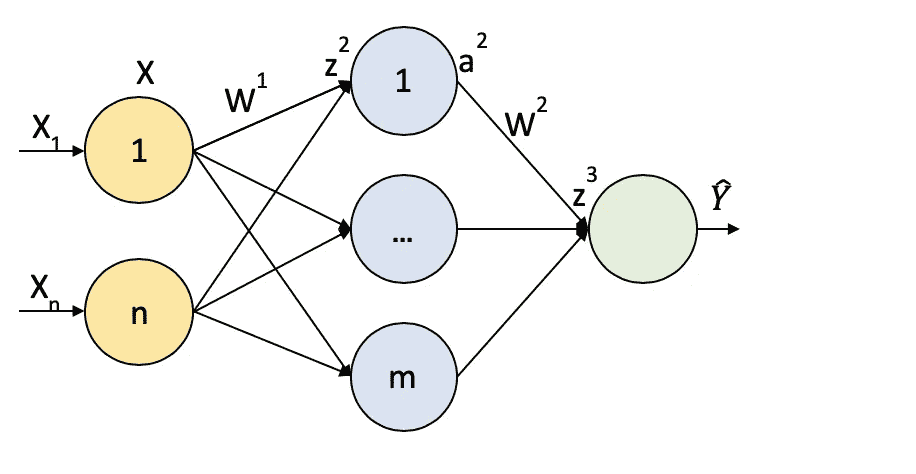
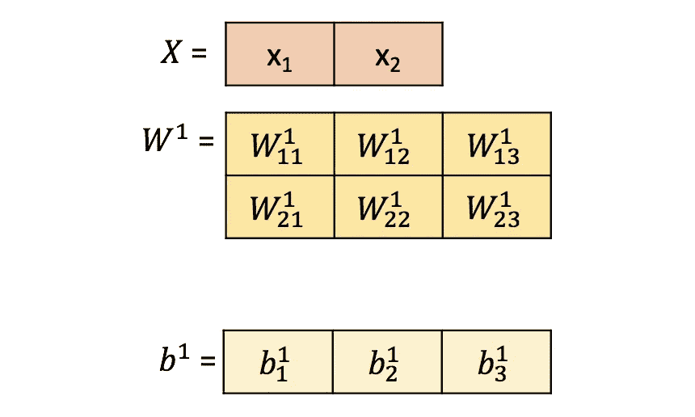
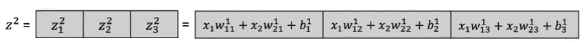
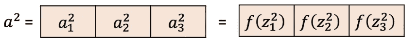
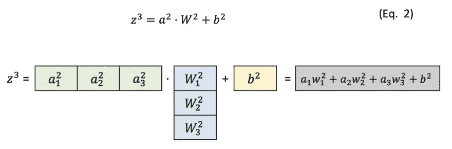
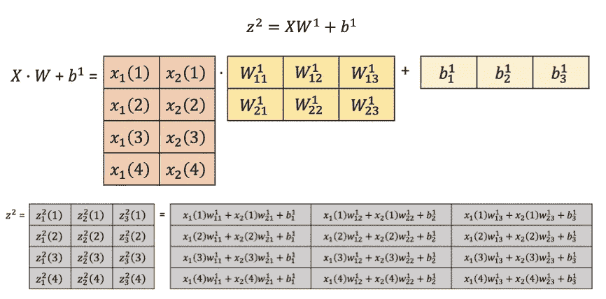
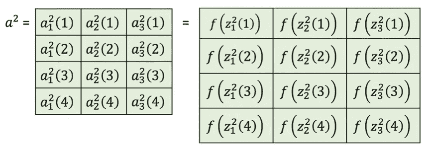

# 神经网络 III:大图

> 原文：<https://towardsdatascience.com/neural-networks-iii-the-big-picture-dfd0ad953d4c?source=collection_archive---------14----------------------->

## [神经网络简介](https://medium.com/tag/neural-network-notes/latest)

这个关于神经网络的[系列帖子](https://medium.com/@pabloruizruiz/neural-networks-notes-fa42ab388bb8)是脸书 PyTorch 挑战赛期间笔记收集的一部分，在 Udacity 的[深度学习纳米学位项目之前。](https://eu.udacity.com/course/deep-learning-nanodegree--nd101)

# 内容

1.  **简介**
2.  **作为功能的网络**
3.  **让我们增加尺寸**
4.  **批量大小**

# 1.介绍

在第一章中，我们已经看到了什么是神经网络，以及我们可以从它们那里得到什么。这种方法是从外部观察神经网络。它们是我们见过的实际上在执行数学运算的黑盒。

为了完全理解神经网络，是时候从内部来看它们了。在这一章中，我们将看看这些神经网络如何被分解成最小的块，以及如何根据我们将要去神秘化的行为从零开始编码。事实上，我们要做的这种分解是神经网络和计算效率的原因，我们可以用它们来解决需要大型数据集的复杂问题。

首先，让我们再看看我们的老朋友，让我们试着找出我们能从中提取的最小片段。

Figure 1\. Schematic Feed Forward Neural Network

唯一的区别是输入的维度和隐藏层中的神经元将是固定的，以便在我们回顾过程时获得更好的理解。我们将在途中发现所有的魔法从何而来。

# 2.让网络发挥作用

正如我们在[前一部分](https://medium.com/@pabloruizruiz/neural-networks-ii-first-contact-7ad5094db1d2)中所做的那样，神经网络只是正在发生的数学运算的一种表示。因此，我们可以将所有变量表示为不同维度的向量。

首先，我们有一个二维输入。这意味着，我们有两个不同的概念，例如，温度和压力。我们的输入神经元将这 2 个输入维度映射到 3 个隐藏维度，这是隐藏层中神经元的数量。因此，矩阵的维数必须是*(2×3)*。此外，为了更清晰地显示，它没有被表示出来，但是我们有一个“b”项，用于在矩阵乘法之后添加偏差。这导致了这种情况:

现在我们有了到达隐藏层所需的所有工具。我们只需要应用矩阵乘法:

这样做的结果将是:

> 记住，每个输入权重将每个输入 *i* 与每个神经元 *j* 连接起来。这就是为什么符号 *Wij* ，连接 *i* 和 *j.*

一旦我们进入图层，就该应用激活功能了。这样做的结果将是:

我们将函数**逐元素地**应用于每个神经元的网络输入的每个元素，因此我们将 3 维作为隐藏神经元的数量。

根据神经网络方案，现在需要的变换是从 3 到 1，因为下一层只有 1 个神经元。最后一个神经元通常不执行任何功能，因为我们不想在这一点上应用非线性。因此，连接这两层的矩阵必须是 *(3x1)* 。

现在我们有了所有的工具来应用隐藏层的权重。那么需要执行等式是:

由于我们的最终输入不执行任何操作(还没有)，我们可以说 *z3* 是输入通过所有网络后的最终输出*(在前面的部分中称为 Y _ hat)*。这就是我们所说的前馈操作。

# 3.让我们增加维度

对于二维的单个观察，我们已经经历了整个前进过程。例如，我们有*温度= 20°C，压力= 1 巴*。但是谁能仅凭一次观察就学会任何东西呢？我们需要知道更多，以提高我们对周围事物的认识，并能够从中找到规律。如果我们想学习如何下棋，我们肯定要尝试几次。这个事实会使过程复杂化吗？当然不是！让我们过一遍。

比方说，我们有 4 个观察值(当然你需要更多，但我只是选择了与已经使用的 1，2，3 不同的最小数字，所以最后你可以使关系更容易；我们会达到这一点，不要担心)。

因此，我们的输入如下所示:

现在，对应于网络本身的变量保持不变。我们没有改变网络中的任何东西，我们只是用**一批观测值作为输入**，而不是单个观测值。因此，如果我们执行向前，我们的结果是:

同样，唯一的区别是我们对每个不同的观察都有一个新的行。接下来的步骤是使用 *z2* 作为每个隐藏神经元的净输入，以元素方式应用激活函数。因此 *a3* 的形状与 *z2* 的大小完全相同。

最后，应用等式。2 计算输出:

# 4.批量

我们一直在使用一批输入示例。在深度学习中，最重要的突破之一是对众所周知的优化器随机梯度下降(SGD)进行小规模修改，成为**小批量随机梯度下降。**

**有什么区别？**

那么，SGD 的普通实现将输入一个输入，并执行向前传递。这将导致误差，该误差将被反向传播到网络中以更新权重。

如第 3 节所示，mini-batchSGD 接收一批输入，并在转发过程中将它们一起转发，将每个输入的误差平均为 mini-batch 的单个误差。

**使用小批量有什么好处？**

首先，由于我们对每批输入进行 1 次权重更新，总的更新次数将会更少！因此，我们减少了训练中的计算量，从而减少了训练时间。

其次，硬件和软件都被优化以执行矩阵乘法。因此，在单次矩阵乘法中进行批量计算所需的时间比顺序进行要少。

最后，结果表明，使用小批量优化器具有更好的收敛特性，对训练有很大帮助。

这个 [kaggle 内核](https://www.kaggle.com/residentmario/full-batch-mini-batch-and-online-learning)是一个很好的资源，可以更好地理解批处理大小如何影响优化器。