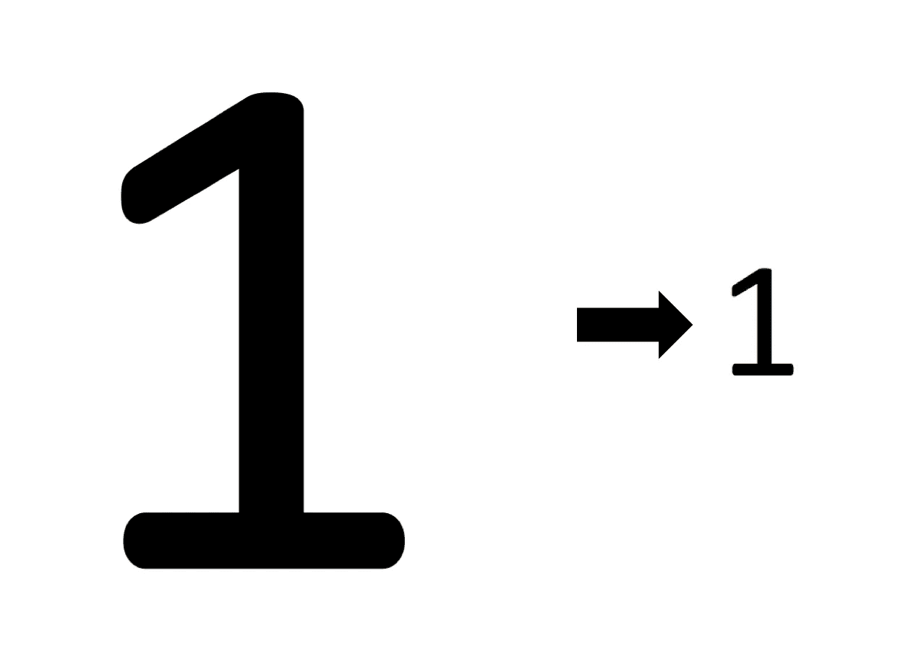
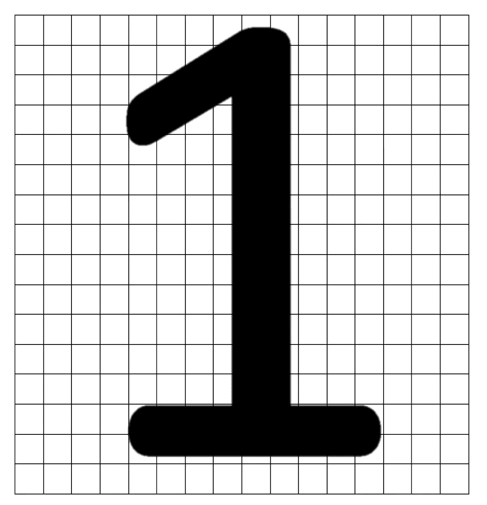
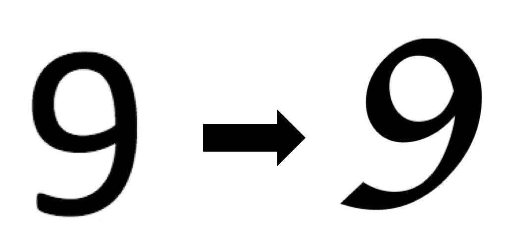

# 行动中的神经网络

> 原文：<https://towardsdatascience.com/neural-networks-in-action-47f7fc1954ab?source=collection_archive---------7----------------------->

## 使用人工神经网络模拟现实世界的问题

# 神经网络

A 人工神经网络是对人脑功能的计算机模拟，使用编程结构来模拟脑神经元的功能。你可能会发现我之前在[的帖子](https://medium.com/@anuradhawick/introduction-to-neural-networks-ead8ec1dc4dd) ( [神经网络介绍](https://medium.com/@anuradhawick/introduction-to-neural-networks-ead8ec1dc4dd))在这方面非常有趣。

## 真实世界的场景和启发

使用神经网络解决的真实世界场景从简单的回归问题扩展到更复杂的问题，如自动驾驶汽车。但是对于神经网络的训练，我们必须评估网络的结果，以便它可以进行学习。有几种方法可以做到这一点。

*   **使用监督训练**
    你知道对于给定的输入，输出应该是怎样的，因此我们提供带有输出的训练集来训练网络。
*   **启发式函数**
    具有确定输入对输出的适合度的函数。主要用于决策制定，其中某个函数评估决定的输出，并为训练提供权重。举个例子，训练安玩 ***井字游戏*** ，移动得越好，移动的重量就越大。
*   **强化学习**
    通过奖励学习。我们可以想象一个场景，我们训练一个安去玩*【flappy bird】。你通过一个障碍间隙，你被奖励，赞成移动。如果你不喜欢任何其他不适合你的动作，那就继续做下去，直到找到最好的动作并开始训练。*

# ***用于文本识别的人工神经网络***

## *建模输入*

*培训的投入是至关重要的，质量越好，产出越好，是吗？对于文本识别，我们不需要更好的质量，我们需要更好的准确性和清晰度。在练习中，我们将使用 ***16×16*** 的图像。事实上，我们将把接收到的图像缩小到这个维度。同样，我们将使图像的灰度为*。因为对于字符识别，我们需要的是画布上黑色像素的分布。将画布变小会使图像变得更轻，并使神经网络更容易将它们馈入。**

****

**Downscaling images**

**如图所示，我们可以将数字从 ***0*** 缩小到 ***9*** 以适应 ***256*** 像素。这将使人工神经网络的外层具有 256 个节点来吸收每个像素，即使在便携环境中也是可管理的。**

## **人工神经网络建模**

****

***16×16 grid image***

**该图描绘了一个数字缩小到 ***16×16*** 网格后的样子。**

**另一项重要任务是确定人工神经网络的规模。很明显，我们将 256 个(图像像素)输入映射到 10 个输出。内部节点呢？。我们实际上不需要太多的中间。因为中间有很多节点和层会使网络过重，增加传播误差更大。**

## **使用 TypeScript 的实际示例**

**我已经使用***0–9***数字图片使用 ***Calibri*** 字体。并使用来自 ***苹果专卖店*** 字体的数字来测试神经网络。考虑下图。**

****

**Detecting whats in left by training from font in left**

**在这个例子中，图像的右侧包含测试输入，并且它由配置的 ANN 通过输出 0.11339060644370896 来检测，最后输出 10。所有其他输出都小于 0.02，这使得我们的选择比下一个最有可能的选择概率高近 5 倍。**

## **示例代码**

## **输出**

```
**Started training
iterations 1000 error 0.031689028142154754 rate 0.1
iterations 2000 error 0.014637913521207704 rate 0.1
iterations 3000 error 0.009482464231621053 rate 0.1
iterations 4000 error 0.007004583325468936 rate 0.1
iterations 5000 error 0.005550772188951524 rate 0.1
Finished training
Attempting detection
Detected file 1_test.png as 1
Detected file 7_test.png as 7
Detected file 9_test.png as 9**
```

> ****附言****
> 
> **有人指出，在某些情况下，5 和 9 混淆了。这是由于相似的形状。如果训练集使用顶部区域较小的 7，这甚至会发生在 1 和 7 上。为了更加准确，我们可以使用几种字体进行训练，我刚刚使用了一种。你也可以从链接的要点评论中下载训练数据文件。**