# 神经网络 IV:图表方法

> 原文：<https://towardsdatascience.com/neural-networks-iv-the-graph-approach-cb25590a7f24?source=collection_archive---------15----------------------->

## [神经网络简介](https://medium.com/tag/neural-network-notes/latest)

这个关于神经网络的[系列帖子](https://medium.com/@pabloruizruiz/neural-networks-notes-fa42ab388bb8)是脸书 PyTorch 挑战赛期间笔记收集的一部分，在 Udacity 的[深度学习纳米学位项目之前。](https://eu.udacity.com/course/deep-learning-nanodegree--nd101)

# 内容

1.  **简介**
2.  **神经网络的图形表示**
3.  **计算中的模式——门**
4.  **结论**

# 1.介绍

和前面的部分一样，我们将使用相同的神经网络结构。

正如我们在“学习”一节中看到的，神经网络通过转发输入并将结果输出与真实值或这些输出应该是什么进行比较，根据所犯的错误来更新其权重。

在数学上，我们计算这些误差的梯度，并更新权重如下:

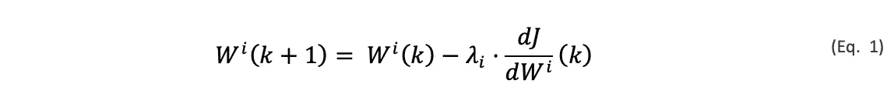

这些更新发生的次数非常多。神经网络使用大量数据进行大量迭代训练。为了使该过程在计算上可行，神经网络被理解为数学运算的非循环图，这便于导数的计算和链规则的应用。

# 2.神经网络的图形表示

是时候发现我们的神经网络是如何运作的了。如果你曾经使用过像 TensorFlow 或 PyTorch 这样的机器学习框架，我们要做的就是试图找出简化你生活的那几行代码背后的东西。

好吧，信不信由你，我们一直在工作的友好的神经网络如图 1 所示。

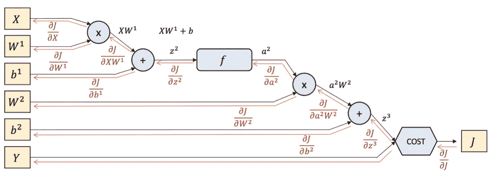

Figure 1\. Graph representation of out [2, 3, 1] neural network.

让我们先看一看，并确定每种形状和颜色是什么:

> 黄色方框是变量。x 是输入，Y 是输出，正向过程的输出应该是什么；J 是实际输出 Y 和 Y_hat 之间的误差。
> 
> 蓝色形状对应于各层之间的数学运算。它们基本上是基于元素的函数(激活)和矩阵加法和乘法。

现在我们可以转到上一章，回顾一下我们是如何通过将不同矩阵相乘的几个步骤来完成正向过程的。让我们写下我们可以为图表推断的方程，并检查它们是否与我们以前的知识一致。

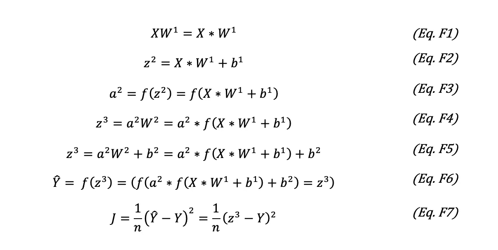

那是所有的向前传球。我们现在开始神经网络的反向传播。这变得越来越有趣，所以让我们用第一个反向传播误差的例子来解释一下细节，看看这个过程基本上是如何以相同的方式重复的，直到我们到达我们网络的起点。

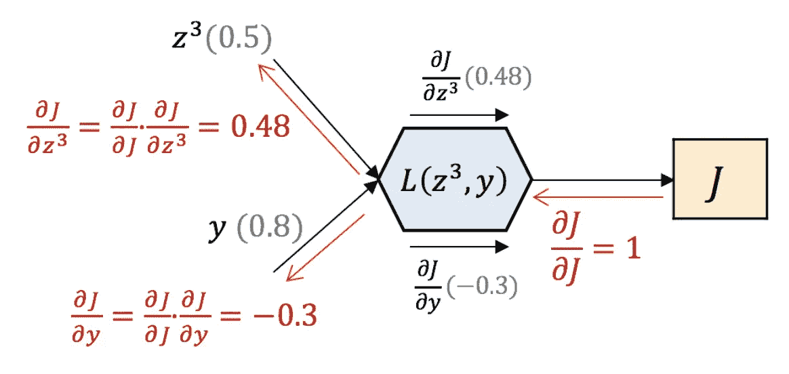

Figure 2.First Backward Propagation Step

我们需要从这里得到的想法如下:

首先，我们输入我们的输入值 *z3* 和 *y* 作为方程中描述的函数(成本)的输入值。F7。它们的值以灰色给出。因此，此时我们能够计算出 ***的局部梯度*** 。这些是电流方程的偏导数(我们看到它们在盒子下面和上面是黑色的)。如果我们拿 Eq。F7 和我们推导它，结果是(鉴于我们只有 1 次步骤，所以 n = 1):

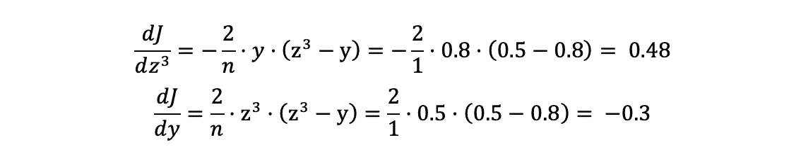

接下来，我们总是从函数本身的局部梯度开始反投影过程，显然是 1。之后，我们希望将该错误反向传播给所犯错误的负责人。我们所做的是**应用链式法则将一个导数分解成更简单的导数**。

你必须意识到，这第一步可能不是最能说明问题的，因为成本函数本身的导数是 1，因此链式法则看起来没有任何作用。然而，当我们查看反向传播过程中的任何其他步骤时，它会对我们有所帮助，如图 3 所示。这里，我们以应用激活函数在系统中引入非线性的过程为例。

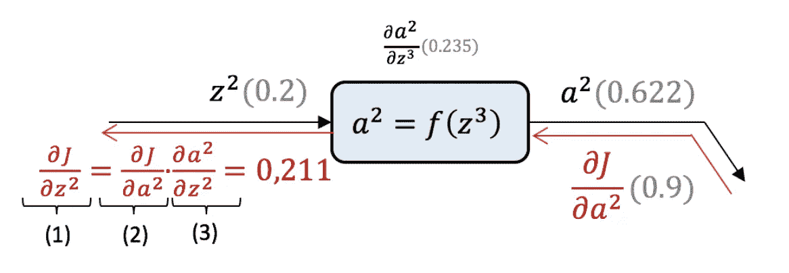

Figure 3\. Activation Backward Propagation Step

本图中使用的激活函数是 sigmoid 函数。

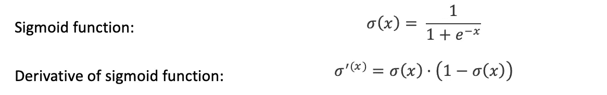

重复相同的过程，我们有输入 *z2* ，它被应用 sigmoid 函数以获得 *a2* 。在这一点上，我们可以计算局部梯度，并等待来自网络末端的反向传播误差。

然后，当它到达时，我们有 *dJ/da2，*它基本上意味着“J 的值对 *a2* 的多少负责”。应用链式法则，我们可以确定 z2 — (1)对那个 *J 有多大的影响。*

为此，我们应用与上一个示例相同的方法。我们使用链式法则将梯度表示为局部梯度和误差反向传播到这一点的乘积。

## 为什么我们要计算这些梯度？

为什么反向传播 J 成本的值？我们需要回忆一下网络是如何学习的。它们基于相对于权重的误差梯度来更新权重值。我们想知道“神经元的权重对所犯错误的责任有多大”，这样我们就可以调整它们的值，让我们的网络学习。所以，最后我们要找的是 *dJ/dW1* 和 *dJ/dW2* 。

好，现在我们知道了工具和目标，让我们为我们的网络开发逆向方程！

## 反向传播

在图 1 上向后看的同时看下面的等式。

我们走吧！我们已经完成了所有的反向投影过程，并计算我们感兴趣的梯度如此容易！我们将使用这些值来更新权重值，并减少下次的误差。但是现在，让我们仔细看看，做一件人类仍然比机器做得更好的事情，让我们找到模式。

# 3.计算中的模式—门

正如我们在图 2 和图 3 中详细看到的，全局网络的每个组件的反向传播基本上包括将从网络末端接收的梯度乘以局部梯度。这就是人工智能的魔力，就这么简单！

我们看到的另一个模式是不同的模块是如何工作的。在人工智能世界中，它们有自己的术语，如下:

## 添加门

在正向传递中，加法门将输入相加作为输出。

在后向通路中，加闸称为*。看看 B2-B2 或 B7-B8 这两个方程中的一个。它们代表网络中两个加法门的反向传播过程。他们两个的本地梯度都是 1，这就是为什么我们称他们为*分销商*。它们只是捕捉到到达它的梯度，然后原封不动地传递给它的所有输入。*

*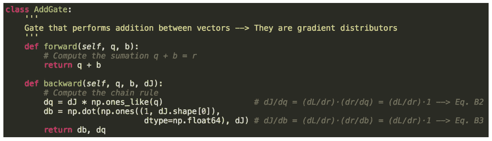*

*Figure 4\. Python code for the Add Gate*

## *乘法门*

*在前向传递中，乘法门将输入的乘积作为输出。*

*在反向通路中，乘法门被称为 ***开关*** 。看看方程式 B4-B5 或 B9-B10 中的一个。它们代表网络中每个乘法门的反向传播过程。两者的局部梯度是另一个输入的值，这就是为什么我们称它们为*开关*。*

*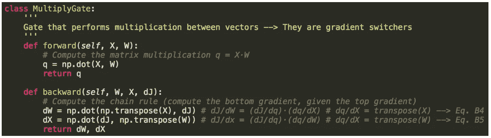*

*Figure 5\. Python code for the Multiply Gate*

## ***激活***

*在正向传递中，各层将我们为其选择的函数(激活函数)应用于输入，以计算输出。*

*在后向过程中，层只是将其自身的导数值乘以传入渐变来计算输出渐变(也称为底部渐变)。看一下等式 6。两个典型的激活函数是 sigmoid 或双曲线正切。*

*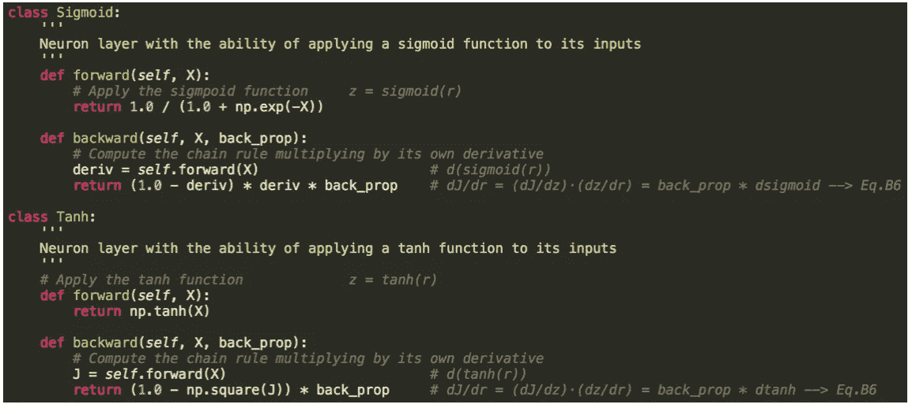*

*Figure 6\. Python code for two common Activations*

## *成本计算器— PyTorch 标准*

*我们所看到的成本(通常也称为损失)是网络在与真实值进行比较时产生的误差。这可以解释为向前传递的最后一步或向后传递的第一步。*

*在这种特殊情况下，我们应用了一个成本函数来最小化均方误差。然而，根据神经网络的应用，这个盒子的结构和其上的值将会不同。*

*在这种特殊情况下，它接收输入的前向过程的输出，并将其与应有的值进行比较。之后，它返回导数的值，我们称之为 *top_diff* 。*

*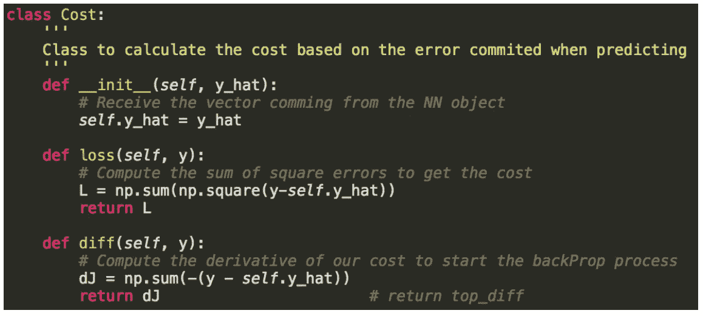*

*Figure 7\. Python code for the Loss calcualtion*

# *4.结论*

*我们已经看到了神经网络的图形表示如何让我们容易地看到反向传播是如何发生的，以及如何通过图形的小组件使用链规则来容易地计算传播。*

*只剩下最后一件事，我真的鼓励你去看，特别是现在你已经到了这一步。我建议你到下一章去关注反向传播过程中矩阵的维数，去理解所有这些矩阵的转置和乘法是从哪里来的。*