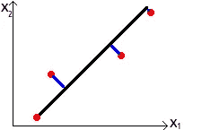
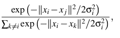
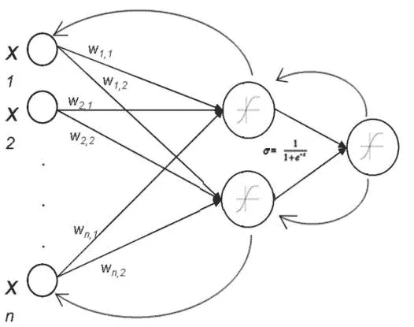
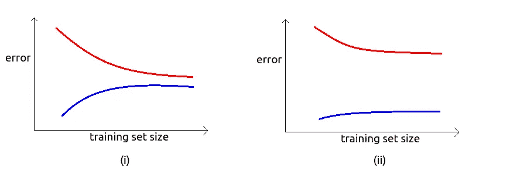

# 神经网络:问题与解决方案

> 原文：<https://towardsdatascience.com/neural-networks-problems-solutions-fa86e2da3b22?source=collection_archive---------2----------------------->

虽然人工神经网络的概念从 20 世纪 50 年代就已经存在，但直到最近我们才有能力将理论付诸实践。神经网络应该能够模仿任何连续的功能。但是很多时候，我们会被表现不佳的网络所困扰，或者要花很多时间才能得到满意的结果。人们应该从统计学的角度来处理这个问题，而不是凭直觉去考虑网络结构中应该发生的变化。第一步应该是对数据进行适当的预处理。除了均值归一化和缩放，**主成分分析**可能有助于加速训练。如果数据的维数减少到这样的程度，即仍然保留适当的方差，则可以节省空间，而不会对数据的质量造成很大的损害。此外，当向神经网络提供较少的数据时，可以更快地训练神经网络。

通过使用奇异值分解将训练数据的协方差矩阵分解成三个矩阵，可以实现维数的降低。第一个矩阵应该包含特征向量。此外，矩阵中存在的向量组是正交的，因此它们可以被视为基向量。我们从这个矩阵中挑选出前几个向量，其数量等于我们希望将数据减少到的维数。用上一步得到的矩阵对原始矩阵(具有原始维数)进行变换，我们得到一个新的矩阵，它既降维又线性变换。



The sum of the lengths of the blue lines is to be minimised (2D to 1D)

上述步骤本质上是数学性的，但本质上我们只是将数据从较高的维度“投影”到较低的维度，类似于将平面中的点投影到拟合良好的直线上，使点必须“行进”的距离最小化。

PCA 的倍频程实现是:

```
function [U, S] = pca(X)
  [m, n] = size(X);
  U = zeros(n);
  S = zeros(n);
  Sigma=(1/m)*(X' * X);
  [U, S, V] =svd(Sigma);
endfunction Z = projectData(X, U, K)
  Z = zeros(size(X, 1), K);
  U_reduce = U(:, 1:K);
  Z = X*U_reduce;
endload ('<data>');                     % Loads the dataset into
                                     % variable X
[X_norm, mu, sigma] = Normalise(X);  % Performs normalisation
[U, S] = pca(X_norm);                % Performs PCA
K = input("Enter reduced dimension");
Z = projectData(X_norm, U, K);
```

人们可以使用主成分分析将数据简化为 3D 或 2D 来可视化。但是，更推荐的方法是利用 **t 分布随机邻居嵌入**，它基于概率分布，不同于 PCA。t-SNE 试图最小化高维和降维条件概率之间的差异。



Conditional probability in the higher dimension

条件概率对于靠得很近的点来说是高的(通过它们的欧几里德距离来测量),而对于相距很远的点来说是低的。根据获得的分布对点进行分组。选择方差，使得密集区域中的点与稀疏区域中的点相比具有较小的方差。

尽管 George Cybenko 在 1989 年证明了具有甚至单个隐藏层的神经网络可以逼近任何连续函数，但是可能希望将更高次的多项式特征引入到网络中，以便获得更好的预测。可以考虑增加隐藏层的数量。事实上，网络的层数等于它应该能够表示的多项式的最高次数。虽然这也可以通过增加现有层中的神经元数量来实现，但与向网络添加隐藏层相比，这将需要更多的神经元(因此增加了计算时间)，以近似具有类似误差量的函数。另一方面，使神经网络“深”会导致不稳定的梯度。这可以分为两部分，即**消失**和**爆发**的梯度问题。

神经网络的权重通常用随机值初始化，具有平均值 0 和标准偏差 1，粗略地置于高斯分布上。这确保了大多数权重在-1 和 1 之间。sigmoid 函数给出的最大导数为 0.25(当输入为零时)。这与权重属于有限范围的事实相结合，有助于确保其乘积的绝对值也小于 0.25。感知器的梯度包括许多这样的项的乘积，每个项小于 0.25。我们越深入图层，这样的术语会越来越多，导致渐变消失的问题。



Backpropagation of weights

本质上，外部隐藏层(更接近输入层)的感知器的梯度将由更深层的梯度和分配给它们之间的每个链接的权重的乘积之和给出。因此，很明显，浅层的梯度很小。这将导致他们的体重在学习过程中变化较小，并在适当的时间内变得几乎停滞不前。第一层应该承载大部分信息，但我们看到它得到的训练最少。因此，梯度消失的问题最终导致网络的死亡。

训练时可能会出现重量超过 1 的情况。在这种情况下，人们可能会想消失的渐变怎么还会产生问题。嗯，这可能会导致爆炸梯度问题，在早期层梯度变得巨大。如果权重很大，并且偏差使得它与激活函数的 sigmoid 的导数的乘积也保持在较高的一侧，那么这个问题就会发生。但是，另一方面，这有点难以实现，因为增加的权重可能会导致激活函数的输入值更高，而 sigmoid 的导数会非常低。这也有助于确立这样一个事实，即消失梯度问题是难以预防的。为了解决这个问题，我们选择其他激活函数，避免使用 sigmoid。


虽然 sigmoid 是一种流行的选择，因为它将输入压缩在 0 和 1 之间，并且它的导数可以写成 sigmoid 本身的函数，但是依赖于它的神经网络可能会遭受不稳定的梯度。此外，sigmoid 输出不是零中心的，它们都是正的。这意味着，所有的梯度要么是正的，要么是负的，这取决于下一层单元的梯度。

最推荐使用的激活功能是 **Maxout** 。Maxout 维护两组参数。使用产生更高值的那个作为激活函数的输入。此外，权重可以根据某些输入条件而变化。一种这样的尝试导致泄漏的整流线性单元。在这种特殊情况下，当输入大于 0 时，梯度保持为 1，当输入小于 0 时，梯度得到一个小的负斜率，与输入成比例。

在神经网络中遇到的另一个麻烦是**内部协变量移位**，特别是当它们很深的时候。随着训练的进行，输入的统计分布保持变化。这可能会导致领域发生重大变化，从而降低培训效率。该问题的解决方案是对每个小批量进行标准化。我们计算所有这些批次的平均值和方差，而不是整个数据。在输入到几乎每一个隐藏层之前，输入被标准化。这个过程通常被称为**批量正火**。应用批量标准化也有助于克服渐变消失的问题。

可以通过实现**退出**来提高正则化。通常，网络中的某些节点从神经网络的一些或所有层被随机关闭。因此，在每次迭代中，我们得到一个新的网络，而最终的网络(在训练结束时获得)是所有这些网络的组合。这也有助于解决过度拟合的问题。

无论采用什么样的调整，都必须始终跟踪网络中死亡神经元的百分比，并相应地调整学习速率。

可以对参数进行某些诊断，以获得更好的统计数据。图中的**偏差**和**方差**是这里的两个重要因素。它们可以通过绘制曲线来确定，该曲线具有关于训练和交叉验证数据集的损失函数(没有正则化)的输出对训练样本的数量。



(i) High bias (ii) High variance

在上图中，红色曲线代表交叉验证数据，而蓝色用于标记训练数据集。第一个数字是当架构遭受高偏置时粗略获得的数字。这意味着，该架构很差，因此即使在训练数据集上，它也给出相当高的错误。向网络中添加更多要素(如添加更多隐藏图层，从而引入多项式要素)可能会很有用。如果方差很大，这意味着训练的参数很好地符合训练集，但在“看不见的”数据(训练集或验证集)上测试时表现不佳。这可能是因为模型“过度拟合”了训练数据。获取更多的数据可以作为一种解决办法。在这种情况下，减少网络中隐藏层的数量也可能是有用的。玩正则化参数也会有所帮助。增加它的值可以修正高方差，而减少它应该有助于修正高偏差。

绘制诊断曲线的倍频程实现将是:

```
function [error_train, error_val] = ...
    learningCurve(X, y, Xval, yval, lambda)

  m = size(X, 1);
  error_train = zeros(m, 1);
  error_val   = zeros(m, 1);

  for i = 1:m
    X_here = X(1:i,:);
    y_here = y(1:i);

    theta = train(X_here, y_here, lambda);

    error_train(i) = LossFunction(X_here,y_here,theta,0);   
    error_val(i) = LossFunction(Xval,yval,theta,0);
   end;

endlambda = input("Enter regularisation parameter");
[theta] = train(X_poly, y, lambda);graphics_toolkit "gnuplot";
figure(1);
[error_train, error_val] = ...                               
    learningCurve(X_poly, y, X_poly_val, yval, lambda);                       plot(1:m, error_train, 1:m, error_val);
xlabel('Number of training examples');                    ylabel('Error');
legend('Train', 'Cross Validation');
```

尽管已经注意到大量的训练数据可以提高任何网络的性能，但是获得大量数据可能是昂贵且耗时的。在网络遭受高偏差或消失梯度问题的情况下，更多的数据将是无用的。因此，简单的数学应该被实现，因为它将指导我们应该下降到哪一步。

**参考文献:
*** [机器学习，斯坦福大学](https://www.coursera.org/learn/machine-learning)
* [卷积神经网络用于视觉识别，斯坦福大学](http://cs231n.stanford.edu/)
* [迈克尔·a·尼尔森，《神经网络与深度学习》，决心出版社，2015 年](http://neuralnetworksanddeeplearning.com/)
* [批量归一化——什么玩意儿？](https://gab41.lab41.org/batch-normalization-what-the-hey-d480039a9e3b)(作者[卡尔·n .](https://gab41.lab41.org/@karl1980.lab41?source=post_header_lockup))
*[*论文摘要* →用于文本分类的字符级卷积网络](https://medium.com/@nishantnikhil/paper-summary-character-level-convolutional-networks-for-text-classification-6edf86e65106)(作者[尼尚特·尼基尔](https://medium.com/@nishantnikhil?source=post_header_lockup) )
**代码库:**[https://github.com/americast/ML_ANg](https://github.com/americast/ML_ANg)