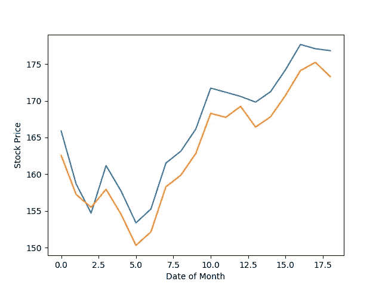

# 预测市场的神经网络

> 原文：<https://towardsdatascience.com/neural-networks-to-predict-the-market-c4861b649371?source=collection_archive---------2----------------------->


机器学习和深度学习已经成为量化对冲基金常用的新的有效策略，以实现利润最大化。作为一名人工智能和金融爱好者，这是一个令人兴奋的消息，因为它结合了我感兴趣的两个领域。本文将介绍如何使用神经网络来预测股票市场，特别是股票(或指数)的价格。本帖基于我的 GitHub 中的 [**python 项目**](https://github.com/VivekPa/IntroNeuralNetworks) ，在这里可以找到完整的 python 代码以及如何使用该程序。此外，更多类似的内容，请查看我自己的页面: [**工程师 Quant**](https://medium.com/engineer-quant)

## 金融中的神经网络

金融是高度非线性的，有时股票价格数据甚至看起来完全是随机的。传统的时间序列方法，如 ARIMA 和 GARCH 模型，只有当序列是平稳的时才有效，这是一个限制性的假设，需要通过取对数回归(或其他变换)对序列进行预处理。然而，在实时交易系统中实现这些模型的主要问题是，随着新数据的增加，不能保证稳定性。

这是通过使用不需要使用任何平稳性的神经网络来解决的。此外，神经网络本质上可以有效地发现数据之间的关系，并使用它来预测(或分类)新数据。

典型的全栈数据科学项目具有以下工作流程:

1.  数据采集——这为我们提供了功能
2.  数据预处理——使数据可用的一个经常令人畏惧但又必要的步骤
3.  开发和实现模型——我们选择神经网络的类型和参数
4.  回溯测试模型——任何交易策略中非常关键的一步
5.  优化—寻找合适的参数

我们的神经网络的输入数据是过去十天的股票价格数据，我们用它来预测第二天的股票价格数据。

## 数据采集

幸运的是，这个项目所需的股票价格数据在 Yahoo Finance 中很容易找到。这些数据可以通过使用他们的 Python API 获得，也可以直接从他们的网站上获得。

## 数据预处理

在我们的例子中，我们需要将数据分解成十个价格和第二天价格的训练集。我通过定义一个类`Preprocessing`，将它分解成训练和测试数据，并定义一个方法`get_train(self, seq_len)`，它返回训练数据(输入和输出)作为`numpy` 数组，给定一个特定的窗口长度(在我们的例子中是 10)。完整代码如下:

```
def gen_train(self, seq_len):
    *"""
    Generates training data* ***:param*** *seq_len: length of window* ***:return****: X_train and Y_train
    """* for i in range((len(self.stock_train)//seq_len)*seq_len - seq_len - 1):
        x = np.array(self.stock_train.iloc[i: i + seq_len, 1])
        y = np.array([self.stock_train.iloc[i + seq_len + 1, 1]], np.float64)
        self.input_train.append(x)
        self.output_train.append(y)
    self.X_train = np.array(self.input_train)
    self.Y_train = np.array(self.output_train)
```

同样，对于测试数据，我定义了一个返回测试数据`X_test` 和`Y_test`的方法。

## 神经网络模型

对于这个项目，我使用了两个神经网络模型:多层感知器(MLP)和长期短期模型(LSTM)。我将简要介绍这些模型是如何工作的，但要阅读 MLPs 是如何工作的，请查看这篇 [**文章**](https://medium.com/engineer-quant/multilayer-perceptron-4453615c4337) 。对于 LSTMs，请查看 Jakob Aungiers 的这篇优秀的 [**文章**](https://www.altumintelligence.com/articles/a/Time-Series-Prediction-Using-LSTM-Deep-Neural-Networks) 。

MLPs 是最简单的神经网络形式，其中输入被输入到模型中，并且使用特定的权重，值通过隐藏层被前馈以产生输出。学习来自于通过隐藏层的反向传播来改变每个神经元之间的权重值。MLP 的一个问题是缺少“内存”。不知道以前的训练数据中发生了什么，也不知道这会如何影响新的训练数据。在我们的模型中，一个数据集和另一个数据集中的十天数据之间的差异可能是重要的(例如),但是 MLP 不具有分析这些关系的能力。

这就是 LSTMs 或一般的递归神经网络(RNNs)的用武之地。rnn 具有存储关于数据的某些信息以供以后使用的能力，这扩展了网络在分析股票价格数据之间关系的复杂结构方面的能力。RNNs 的一个问题是消失梯度问题。这是因为当层数增加时，学习率(小于 1 的值)会增加几倍，从而导致梯度不断降低。LSTMs 解决了这一问题，使其更加有效。

## 实现模型

为了实现这些模型，我选择了`keras` ,因为它使用了向网络添加层的思想，而不是一次定义整个网络。这使我们可以快速改变层的数量和类型，这在优化网络时非常方便。

使用股票价格数据的一个重要步骤是将数据标准化。这通常意味着你减去平均值，然后除以标准差，但是在我们的例子中，我们希望能够在一段时间的实时交易中使用这个系统。因此，采用统计矩可能不是归一化数据的最准确方法。所以我只是将整个数据除以 200(一个任意的数字，使一切都变小)。虽然这看起来像是无中生有，但它仍然可以有效地确保神经网络中的权重不会变得太大。

让我们从更简单的 MLP 开始。在`keras` 中，这是通过制作一个序列模型并在其上添加密集层来实现的。完整代码如下:

```
model = tf.keras.models.Sequential()model.add(tf.keras.layers.Dense(100, activation=tf.nn.relu))
model.add(tf.keras.layers.Dense(100, activation=tf.nn.relu))
model.add(tf.keras.layers.Dense(1, activation=tf.nn.relu))

model.compile(optimizer="adam", loss="mean_squared_error")
```

这才是 keras 的优雅真正展现的地方。仅仅用这五行代码，我们就创建了一个有两个隐藏层的 MLP，每个隐藏层有一百个神经元。简单介绍一下优化器。Adam optimizer 在机器学习社区中越来越受欢迎，因为与传统的随机梯度下降相比，它是一种更有效的优化算法。通过观察随机梯度下降的两个其他扩展的优点，可以最好地理解这些优点:

*   **自适应梯度算法** (AdaGrad)，保持每个参数的学习率，提高稀疏梯度问题(如自然语言和计算机视觉问题)的性能。
*   **均方根传播** (RMSProp)，其还保持基于权重的梯度的最近幅度的平均值(例如，其变化有多快)调整的每个参数的学习速率。这意味着该算法在在线和非平稳问题(例如噪声)上表现良好。

可以认为 Adam 结合了上述扩展的优点，这就是为什么我选择 Adam 作为我的优化器。

现在我们需要用我们的训练数据来拟合模型。同样，keras 使它变得简单，只需要以下代码:

```
model.fit(X_train, Y_train, epochs=100)
```

一旦我们符合我们的模型，我们需要根据我们的测试数据来评估它，看看它的表现如何。这由以下人员完成

```
model.evaluate(X_test, Y_test)
```

您可以使用来自评估的信息来评估模型预测股票价格的能力。

对于 LSTM 模型，过程是相似的，因此我将在下面发布代码，留下解释供您阅读:

```
model = tf.keras.Sequential()
model.add(tf.keras.layers.LSTM(20, input_shape=(10, 1), return_sequences=True))
model.add(tf.keras.layers.LSTM(20))
model.add(tf.keras.layers.Dense(1, activation=tf.nn.relu))

model.compile(optimizer="adam", loss="mean_squared_error")

model.fit(X_train, Y_train, epochs=50)

model.evaluate(X_test, Y_test)
```

需要注意的重要一点是，keras 要求输入数据具有特定的维度，由您的模型决定。使用 numpy 重塑数据至关重要。

## 对模型进行回溯测试

现在，我们已经使用训练数据拟合了模型，并使用测试数据对模型进行了评估，我们可以通过使用新数据对模型进行回溯测试来进一步进行评估。这可以简单地通过

```
def back_test(strategy, seq_len, ticker, start_date, end_date, dim):
    *"""
    A simple back test for a given date period* ***:param*** *strategy: the chosen strategy. Note to have already formed the model, and fitted with training data.* ***:param*** *seq_len: length of the days used for prediction* ***:param*** *ticker: company ticker* ***:param*** *start_date: starting date* ***:type*** *start_date: "YYYY-mm-dd"* ***:param*** *end_date: ending date* ***:type*** *end_date: "YYYY-mm-dd"* ***:param*** *dim: dimension required for strategy: 3dim for LSTM and 2dim for MLP* ***:type*** *dim: tuple* ***:return****: Percentage errors array that gives the errors for every test in the given date range
    """* data = pdr.get_data_yahoo(ticker, start_date, end_date)
    stock_data = data["Adj Close"]
    errors = []
    for i in range((len(stock_data)//10)*10 - seq_len - 1):
        x = np.array(stock_data.iloc[i: i + seq_len, 1]).reshape(dim) / 200
        y = np.array(stock_data.iloc[i + seq_len + 1, 1]) / 200
        predict = strategy.predict(x)
        while predict == 0:
            predict = strategy.predict(x)
        error = (predict - y) / 100
        errors.append(error)
        total_error = np.array(errors)
    print(f"Average error = {total_error.mean()}")
```

然而，这个回溯测试是一个简化的版本，而不是一个完整的回溯测试系统。对于成熟的回测系统，你需要考虑生存偏差、前瞻偏差、市场制度变化和交易成本等因素。因为这仅仅是一个教育项目，一个简单的回溯测试就足够了。但是，如果你对建立一个完整的回溯测试系统有任何疑问，请随时联系我。

下面展示了我的 LSTM 模型在预测二月份苹果股票价格时的表现



对于一个没有优化的简单 LSTM 模型来说，这是一个相当好的预测。它真正向我们展示了神经网络和机器学习模型在模拟参数之间的复杂关系方面有多么强大。

## 超参数调谐

优化神经网络模型对于提高模型在样本外测试中的性能通常很重要。我没有在我的项目开源版本中包括调优，因为我希望它对那些阅读它的人是一个挑战，以便继续尝试优化模型，使其性能更好。对于那些不了解优化的人来说，它涉及到寻找使模型性能最大化的超参数。有几种方法可以搜索这些理想的超参数，从网格搜索到随机方法。我强烈地感觉到，学习优化模型可以将您的机器学习知识提升到一个新的水平，因此，我将挑战您提出一个优化的模型，超越我在上面图表中的表现。

## 结论

机器学习不断发展，每天都有新的方法被开发出来。不断更新我们的知识是至关重要的，最好的方法是为有趣的项目建立模型，如股票价格预测。虽然上面的 LSTM 模型还不够好，不能用于现场交易，但是开发这样一个模型所建立的基础可以帮助我们建立更好的模型，也许有一天可以用在我们的交易系统中。