# 神经网络 V:反向传播

> 原文：<https://towardsdatascience.com/neural-networks-v-back-propagation-60121cd9b904?source=collection_archive---------18----------------------->

## [神经网络简介](https://medium.com/tag/neural-network-notes/latest)

这个关于神经网络的[系列帖子](https://medium.com/@pabloruizruiz/neural-networks-notes-fa42ab388bb8)是脸书 PyTorch 挑战赛期间笔记收集的一部分，在 Udacity 的[深度学习纳米学位项目之前。](https://eu.udacity.com/course/deep-learning-nanodegree--nd101)

# 内容

1.  **简介**
2.  **反向传播中的维数**
3.  **权重更新**

# 1.介绍

像往常一样，让我们首先介绍我们正在使用的神经网络的场景:

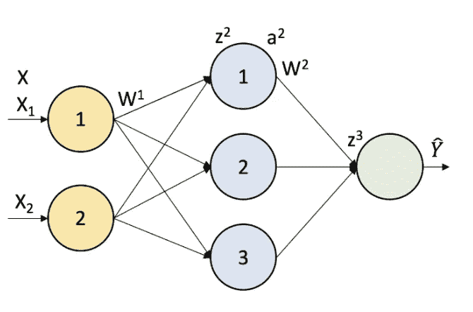

Figure 1\. Artificial Neural Network with shape [2, 3, 1]

及其图形表示:

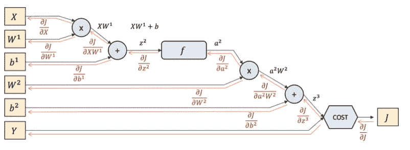

Figure 2\. Graph representation of the [2, 3, 1] neural network.

我们需要记录我们上一章做了什么，因为上一章的输出是这一章的输入。所以，让我们也拿回我们需要继续进行的工具。

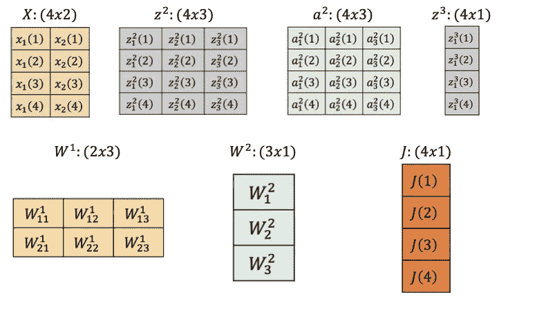

我们已经知道这些值的来源，因为我们根据输入、层、批次和输出的维度定义了 doe 矩阵的形状。我们将再次包括该等式，以便于理解:

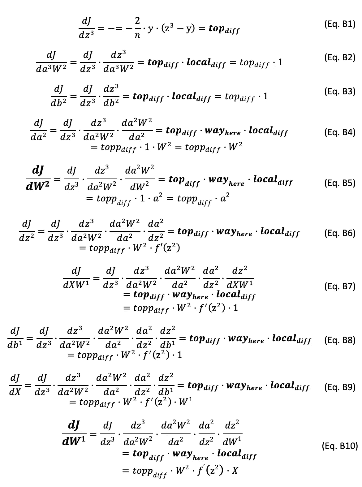

# 2.反向传播中的维数

我们将在最后一章中介绍的内容是，通过前面公式描述的第 4 章中的图形方法中的反向投影过程，对第 3 章进行同样的可视化。

我们讨论的第一个模式是 addGate:

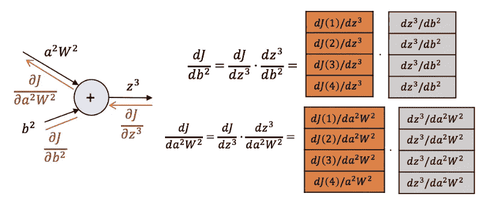

现在我们需要知道如何用数学方法实现这些乘法。如果我们看一下两个输入在每个突触中的线性关系，在下图中:

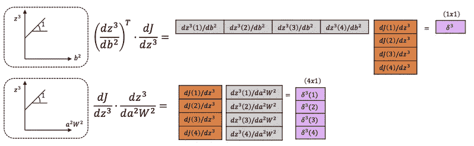

我们可以看到，我们是如何首先根据偏差 *b2* 在梯度之前进行转置和放置的，因为我们打算对不同观测中的所有误差进行平均，以提供一个值来更新该偏差。

另一方面，对于 *a2W2* 项，我们只是将反向传播误差与一列 1 进行矩阵乘法运算，因为我们希望跟踪每个不同的反向传播误差，以便继续反向传播。

我们已经知道 addGates 的行为类似于分布器，并且两种情况下的局部导数都是 1。其结果我们从现在起可以称之为‘反向传播误差’*δ*。

下一步是 mulGate:

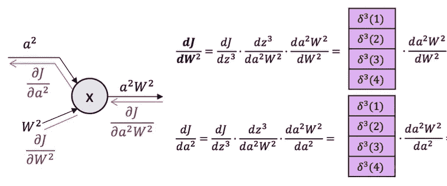

(*)我们已经应用了从 *J* 开始的整个链规则。从现在开始，我们将简化它，只使用顶部差异和局部梯度。

现在我们要确定这两个方程右边的导数。请看图 3 中的 LHS，这两项之间有线性关系，我们可以确定斜率。从数学上讲，我们通过转置矩阵来实现这个操作。

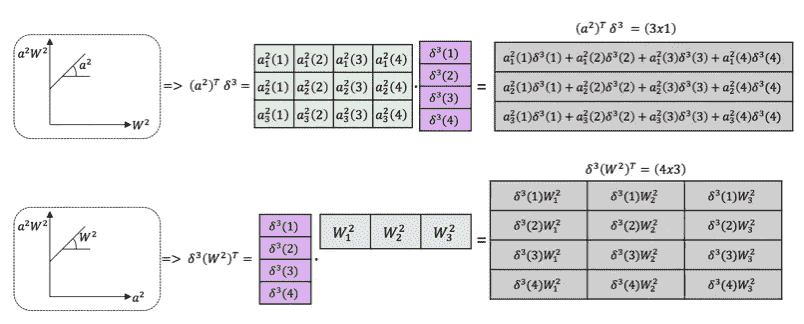

Figure 3\. Back-Propagation Error through Connection between Layers

如果我们把它翻译成人类的语言，试着想想图 1 中发生了什么，我们可以说:

1.我们对不同迭代的乘积*a2δ*进行平均，以定义 *a2W2* 相对于 *W2* 的变化率。这就是为什么我们有 3 个维度，隐藏神经元的每个输出都有一个维度；并且它们中的每一个都增加了不同观测的误差。

2.我们将每个观察值的反向传播误差分割给不同的隐藏神经元，这就是为什么我们有 *(4x3)* 矩阵(4 个观察值和 3 个神经元)。

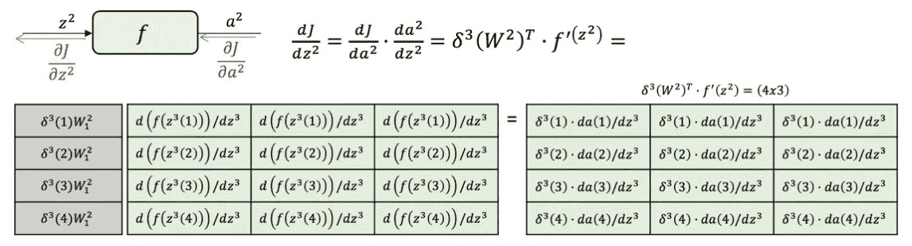

Figure 4\. Back-Propagation through Activated Neuron

非常重要的是要看到，在这个场合，我们做的是标量积，而不是矩阵间的积。这是因为在向前传递时，激活函数是一个基于元素的操作，在向后传递时也是如此。

下一步，我们面临另一个添加门:

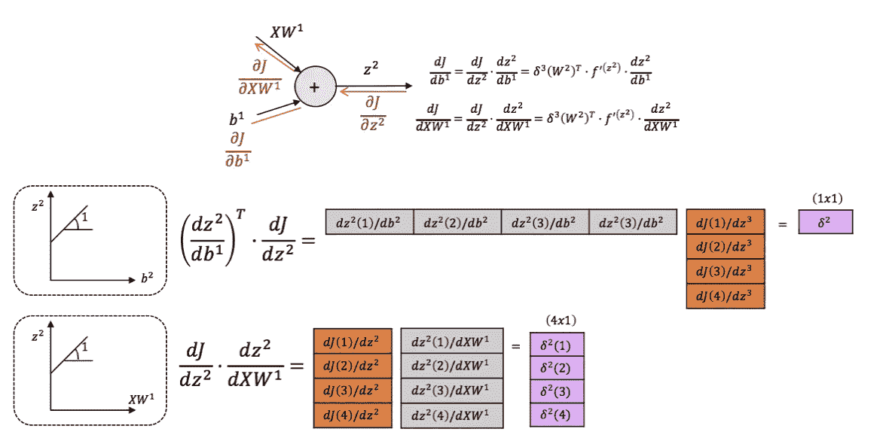

看一看，正如我们所知，addGates 是反向传递中的分发器，两次传播将是相同的值。我们应用了与第一个 addGate 完全相同的过程。

最后一步是另一个 mulGate:

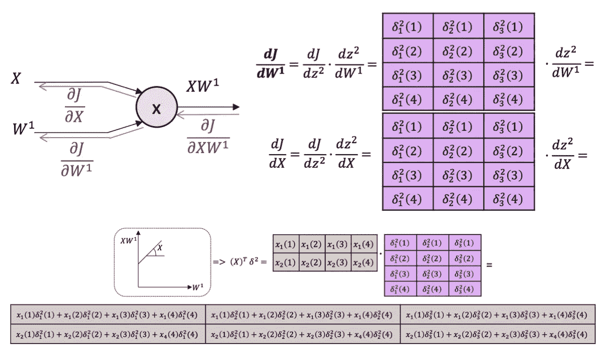

X 的最后转置用于对隐藏层中每个神经元的每个观察的每个输入的每个观察的每个反向传播误差进行平均。

# 3.更新权重

我们现在应该前进到最后一步，学习。使用称重更新公式:

因此，将此应用于我们的两层砝码:

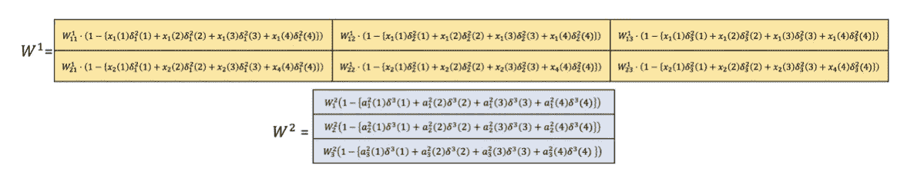

Figure 5\. Weights updated