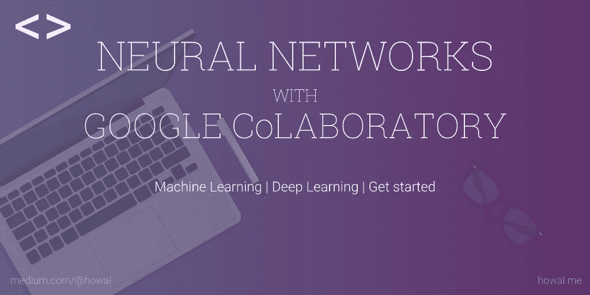
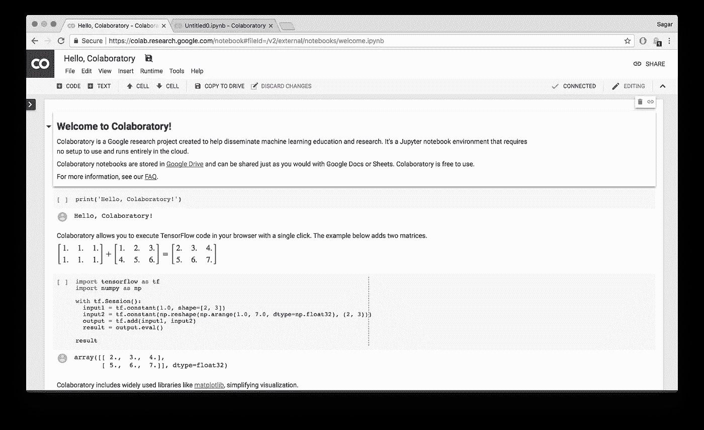
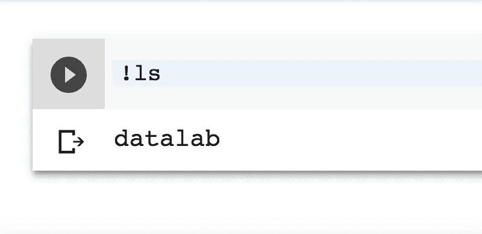
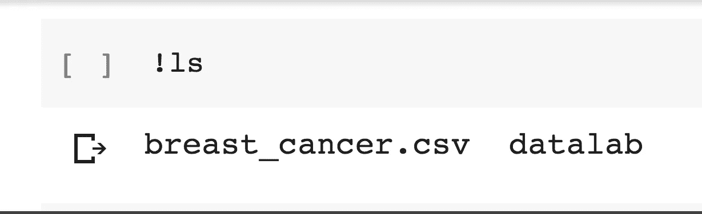
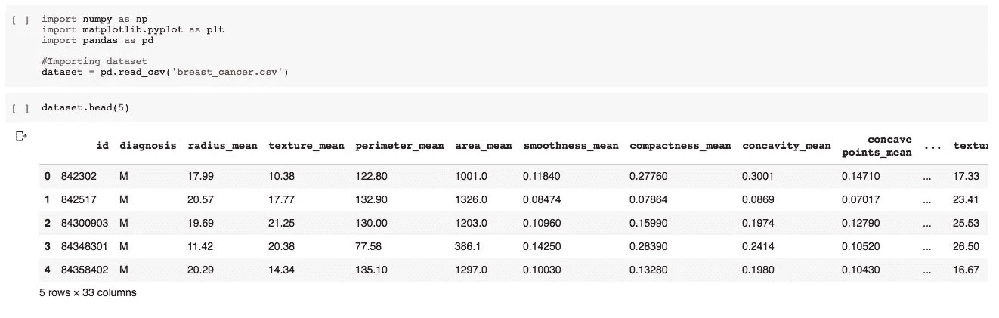
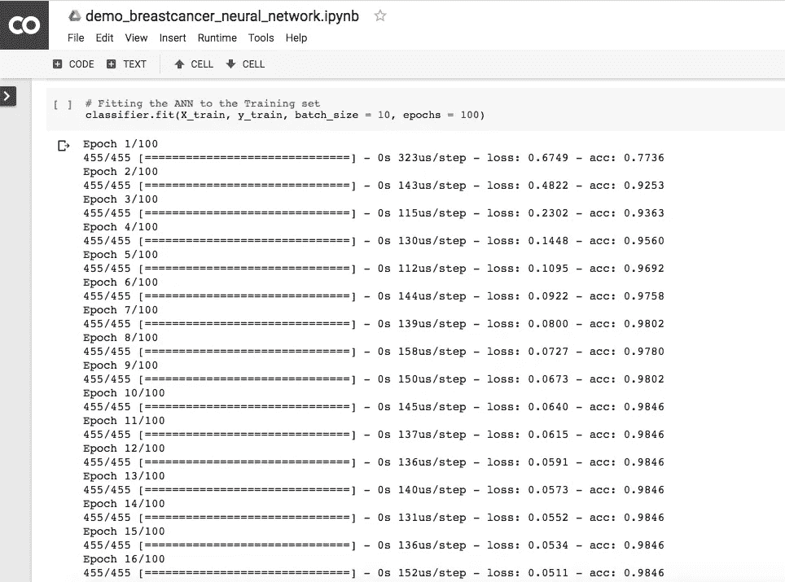
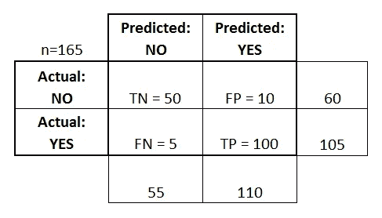
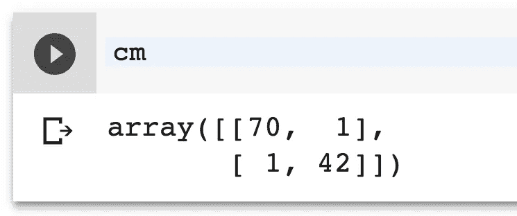

# 谷歌协作的神经网络|机器学习入门

> 原文：<https://towardsdatascience.com/neural-networks-with-google-colaboratory-artificial-intelligence-getting-started-713b5eb07f14?source=collection_archive---------0----------------------->

谷歌最近推出了内部工具，用于协作编写数据科学代码。这个名为 Google co laboratory([g.co/colab](http://g.co/colab))的项目基于 Jupyter 开源项目，并与 Google Drive 集成在一起。Colaboratory 允许用户在 Jupyter 笔记本上工作，就像在 Google Docs 或电子表格上工作一样简单。

# 合作实验室

首先，您可以访问[联合实验室网站](http://g.co/colab)，并注册以收到使用该工具的邀请。确认邮件通常需要一天时间才会进入你的收件箱。CoLaboratory 让你使用谷歌的一个虚拟机来执行你的机器学习任务和制作模型，而不用担心你的计算能力的限制。而且是免费的。

当你第一次打开 colaboratory 时，你会看到一个 *Hello，Colaboratory* 文件，其中包含一些你可以用它做的事情的基本示例。我建议你尝尝它们。

使用 colaboratory，您可以像在 Jupyter 笔记本上一样编写代码。您编写并执行(Shift + Enter)代码单元格，并在单元格下获得您的输出。

除了写代码之外，这个程序还有几个锦囊妙计。您可以编写以“！”开头的 shell 命令在笔记本里。
例如，`!pip install -q keras`。
这让你对谷歌允许你使用的虚拟机有相当大的控制权。这些代码片段可以通过点击左上角的小黑按钮(在菜单下)找到。

我写这篇文章的目的是演示如何使用协同实验室来训练神经网络。我们将通过一个例子，在这个例子中，我们在由 [UCI 机器学习库](http://archive.ics.uci.edu/ml/datasets)提供的乳腺癌威斯康星州数据集上训练一个神经网络。这里的练习相当简单。

这里是我为这篇文章制作的[协作笔记本](https://colab.research.google.com/notebook#fileId=1aQGl_sH4TVehK8PDBRspwI4pD16xIR0r)的链接。

# 深度学习

深度学习是一种机器学习技术，它使用的计算技术在某种程度上模拟了生物神经元的工作。分层排列的神经元网络从输入到输出来回传递信息，直到它调整其权重，以生成特征和目标之间潜在关系的算法。

要了解更多关于神经网络的知识，你可以参考卡洛斯·格雷申森的这篇非常简单的[论文。你也可以在 medium 上找到在线资源。](https://arxiv.org/pdf/cs/0308031.pdf)

对于那些还不了解神经网络的人，不要担心。这里的想法是一毫米一毫米地进步。继续…

# 密码

**问题:** 研究人员获得了乳腺肿块的细针抽吸(FNA)并生成了它的数字化图像。数据集包含描述这些图像中细胞核特征的实例。每个实例都标有两种诊断中的一种:“M”(恶性)或“良性”)。鉴于上述特征，我们的任务是根据这些数据训练一个神经网络来诊断乳腺癌。

当您打开 colaboratory 时，会看到一个新的 untitled.ipynb 文件供您使用。

Google 允许你在他们的服务器上使用一个虚拟的 linux 机器，这样你就可以访问终端来为你的项目安装特定的包。如果您只是在一个代码单元中传递一个`!ls`命令(记住在任何命令之前加上！)，你会在你的机器里得到一个名为`datalab`的文件夹。

我们的任务是将我们的数据集放到这台机器上，以便我们的笔记本可以访问它。你可以用..

一旦你的文件在机器上，你可以检查文件是否在那里。
`!ls`
你应该看到一个`datalab`目录和你的文件列表中的“`breast_cancer_data.csv`”。

**数据预处理:**

现在我们的数据已经在我们的机器上了，让我们使用 pandas 将它导入到项目中。

This is how the Output looks on Colaboratory

现在，分离因变量和自变量。

y 由一个列组成，列中的“M”和“B”分别代表“是”(恶性)和“否”(良性)。这些需要被编码成数学上相关的形式，即‘1’和‘0’。这可以通过标签编码器类来完成。

(当您遇到两类以上的数据时，请使用 OneHotEncoder)

现在我们的数据已经准备好了，让我们把它分成训练集和测试集。我们使用 Scikit-Learn 中的`train_test_split`类，这使得工作变得非常容易。

参数`test_size = 0.2`定义了测试集比例。这里，80%的训练和 20%的测试集。继续前进。

**Keras** *Keras*是用于构建人工神经网络的高级 API。它使用 *Tensorflow* 或*the no*后端进行其幕后操作。要安装 Keras，您必须在计算机上安装 Tensorflow。联合实验室已经在虚拟机上安装了 Tensorflow。如果你想检查你可以使用的安装

`!pip show tensorflow`

查看您使用的 tensorflow 版本。如果需要，您还可以使用`!pip install tensorflow==1.2`安装 Tensorflow 的特定版本

或者，如果你喜欢使用 Theano 后端，你可以在这里阅读文档。

安装 Keras:

顺序类和密集类用于指定神经网络的节点、连接和规格。正如上一节所看到的，我们将需要这些来定制我们的学习网络的参数并对它们进行调整。

为了初始化神经网络，我们将创建一个`Sequential`类的对象。

现在我们需要设计网络。

对于每个隐藏层，我们需要定义三个基本参数— `units`、`kernel_initializer`和`activation`。`units`参数定义了该层将包含的神经元数量。`Kernel_initializer`定义神经元将对数据输入进行操作的初始权重(更多信息请参见)。而`activation`定义了我们选择用于数据的激活函数。
注意:如果这些术语现在让人不知所措，也没关系。随着时间的推移，它们会变得更加清晰。

第一层:

对于第一层，我们放置 16 个神经元，这些神经元具有由 ReLU 激活函数激活的一致初始化的权重。此外，我们将参数`input_dim = 30`定义为输入层的规范。请注意，我们的数据集中有 30 个要素列。

作弊:
我们是如何决定层中单位的数量的？人们会告诉你这是一门艺术，需要经验和专业知识。对于初学者来说，一个简单的方法是将 X 和 y 中的列总数相加，然后除以 2。(30+1)/2 = 15.5 ~ 16.于是，`units = 16`。

第二层:第二层与第一层相同，但没有 input_dim 参数。

输出层:由于我们的输出是两个值中的任何一个，我们可以使用一个具有统一初始化权重的单元。然而，这里我们使用 sigmoid 激活函数(关于激活函数的单独文章即将推出)。

拟合:
运行人工神经网络，让 backprop 魔法发生。你应该在合作实验室而不是你自己的机器上看到所有这些加工过程。

这里，`batch_size`是您希望同时处理的输入数量。而`epoch`是你所有的数据通过神经网络一次的整个周期。它是这样出现在合作笔记本上的:

做出预测和混淆矩阵。

一旦您训练了您的网络，您就可以在 X_test 集合(我们之前放在一边)上进行预测，以检查您的模型在新数据上的表现如何。在单元格中键入并执行`cm`来查看它。

**混淆矩阵**
混淆矩阵，顾名思义，显示了你的模型做出的正确和错误预测的矩阵表示。当您需要单独调查哪些预测与其他预测相混淆时，该矩阵非常方便。这是一个 2×2 的困惑，马迪克斯解释道。

这就是我们的困惑矩阵的样子。[ `cm` (Shift+Enter)]

这是怎么读的: *70 真阴性，* **1 假阳性，1 假阴性**， *42 真阳性*。很简单。当分类类别的等级增加时，方阵的大小增加。

就像这个例子一样，我们有几乎 100%的准确率。只有两个错误的预测。这一点也不坏。但情况可能并不总是如此。其他时候，你可能需要投入更多的时间，调查你的模型的行为，并提出更好、更复杂的解决方案。如果网络表现不佳，可以进行超参数调整来改进模型。我将很快就这个话题写一整篇文章。

我希望这能帮助您开始使用 Colaboratory。[在此找到本教程的笔记本。](https://colab.research.google.com/notebook#fileId=1aQGl_sH4TVehK8PDBRspwI4pD16xIR0r)

*注:本文重点介绍* ***协同*** *的使用，并举例说明。对于一些读者可能没有理解清楚的概念的详细解释，我表示歉意，并请求您等待更多的文章。*