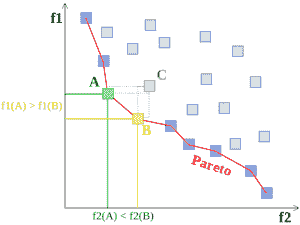
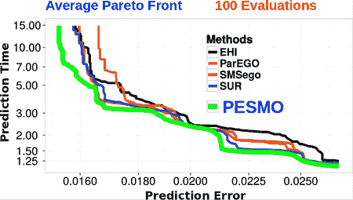

# 预测精度和速度最佳的神经网络

> 原文：<https://towardsdatascience.com/neural-networks-with-optimal-accuracy-and-speed-in-their-predictions-d2cdc3b21b50?source=collection_archive---------1----------------------->

深度神经网络目前被脸书、谷歌、苹果等公司使用。从大量用户生成的数据中进行预测。几个例子是脸书用于人脸识别和文本理解的深度人脸和深度文本系统，或者 Siri 和 Google Now 使用的语音识别系统。在这种类型的应用中，使用既快速又准确地进行预测的神经网络至关重要。这意味着，在设计这些系统时，我们希望调整不同的神经网络参数，以共同最小化两个目标:1)对一些验证数据的**预测误差**和 2)预测速度**。要调整的参数，也称为**设计参数**，可以是隐藏层的数量、每层神经元的数量、学习速率、正则化参数等。**

**最小化预测误差和预测速度涉及解决**多目标**优化问题。在这种类型的问题中，一般来说，不存在单一的最优解来共同最小化不同的目标。相反，有一个称为**帕累托前沿**的最优解集合。**

****

**Example of Pareto front. Each point in the plot shows the objective values (f1 and f2) obtained for a particular setting of the design parameters. The points highlighted in blue are in the Pareto front.**

**帕累托前沿中的点实现了目标之间的最优权衡，也就是说，你不能通过改善一个目标而不损害另一个目标，从帕累托前沿中的一个点移动到另一个任意点。上图显示了两个目标 f1 和 f2 的帕累托前沿示例。图中的每一点都显示了对设计参数的特定选择所获得的目标值。当解决多目标优化问题时，我们感兴趣的是找到映射到 Pareto 前沿点的设计参数值。一旦我们找到了帕累托前沿的点，我们就可以做出决定，选择一个满足我们要求的点。**

**在神经网络调整问题中，对于设计参数的特定设置的预测误差的评估是计算上昂贵的过程。其原因是，在能够计算验证误差之前，我们必须首先在大量训练数据上训练神经网络。对于大型神经网络和大规模数据集，这个过程可能需要几个小时甚至几天。这意味着，理想情况下，我们希望使用少量的客观评估来找到帕累托前沿。这可以通过使用**贝叶斯优化** (BO)技术来完成。这些方法使用模型的预测来有效地搜索昂贵的优化问题的解决方案。在这篇文章中，我将描述如何使用 BO 方法预测熵搜索进行多目标优化**

**埃尔南德斯-洛巴托、埃尔南德斯-洛巴托、沙阿和亚当斯。
**预测熵搜索多目标贝叶斯优化**，
ICML，2016。[【pdf】](http://arxiv.org/pdf/1511.05467v3.pdf)[留兰香代号](https://github.com/HIPS/Spearmint/tree/PESM)**

**用于在 MNIST 数据集上寻找具有最优预测误差与预测速度的深度神经网络。PESMO 是当前最先进的技术，用于具有昂贵目标函数的多目标优化。关于 BO 方法的更多信息，读者可以参考[1，2]。**

# **寻找能对 MNIST 做出快速准确预测的网络**

**PESMO 是在 spearmint 工具的 PESM 分支中实现的，可以通过上面显示的链接公开获得。在我们的系统中安装了 PESM 绿薄荷分公司之后，我们必须指定我们想要解决的多目标优化问题。在我们的案例中，我们将调整神经网络中的以下设计参数:**

1.  **隐藏的层数。**
2.  **每个隐藏层的神经元数量。**
3.  **辍学水平。**
4.  **ADAM 优化器使用的学习率[3]。**
5.  **L1 体重处罚。**
6.  **L2 体重处罚。**

**这些信息在一个名为 **config.json** 的文件中提供给 spearmint，该文件包含优化问题的详细信息，例如要调整的变量、它们的最大值和最小值、我们将优化多少个目标、如何评估目标等。我们将使用以下 config.json 文件:**

```
{
    "language"        : "PYTHON",
    "random_seed"     : 1,
    "grid_size"       : 1000,
    "max_finished_jobs"       : 100,
    "experiment-name" : "MNIST_neural_networks",
    "moo_use_grid_only_to_solve_problem" : true,
    "moo_grid_size_to_solve_problem" : 1000,
    "pesm_use_grid_only_to_solve_problem" : true,
    "likelihood"      : "GAUSSIAN",
    "acquisition"     : "PESM",
    "pesm_pareto_set_size"      : 50,
    "pesm_not_constrain_predictions"     : false,
    "main_file"       : "evaluate_objectives",
    "variables": {
        "n_neurons": {
            "type": "FLOAT",
            "size":  1,
            "min":  50,
            "max":  500
        }, "n_hidden_layers": {
            "type": "FLOAT",
            "size": 1,
            "min":  1,
            "max":  3
        }, "prob_drop_out": {
            "type": "FLOAT",
            "size": 1,
            "min":  0,
            "max":  0.9
        }, "log_learning_rate": {
            "type": "FLOAT",
            "size": 1,
            "min": -20,
            "max":  0
        }, "log_l1_weight_reg": {
            "type": "FLOAT",
            "size": 1,
            "min": -20,
            "max":  0
        }, "log_l2_weight_reg": {
            "type": "FLOAT",
            "size": 1,
            "min": -20,
            "max":  0
        }
    },
    "tasks": {
      "error_task" : {
          "type"        : "OBJECTIVE",
          "fit_mean"    : false,
          "transformations"     : [],
          "group"    : 0
      },
      "time_task" : {
          "type"        : "OBJECTIVE",
          "transformations" : [
                {"IgnoreDims" : { "to_ignore" : [ 2, 3, 4, 5 ]   }}
                ],
          "fit_mean"    : false,
          "group"    : 0
      }
    }
}
```

**我将描述这个文件中的几个重要条目。条目 **main_file** 包含将被调用来评估不同目标的 python 脚本的名称。条目 **max_finished_jobs** 的值为 100。这表明绿薄荷评估不同的目标 100 次，然后完成。条目**变量**包含设计参数的描述，以及它们的最大值和最小值。条目**任务**包含待优化目标的描述。注意，预测时间不依赖于参数丢失、学习率、L1 罚值和 L2 罚值。我们通过在预测时间目标的目标转换中使用条目 **IgnoreDims** 来通知 spearmint。**

**下一步是编写评估不同目标的 python 脚本。我们已经告诉 spearmint，这个文件叫做 **evaluate_objectives.py** ，它包含以下基于 Keras 的代码[4]:**

```
import numpy as np
import time
from keras.datasets import mnist
from keras.models import Sequential
from keras.layers.core import Dense, Dropout, Activation
from keras.optimizers import Adam
from keras.utils import np_utils
from keras.regularizers import l1l2, l2, activity_l2

def build_model(params):

    n_hidden_layers = int(np.round(params['n_hidden_layers'][ 0 ]))
    n_neurons = int(np.round(params['n_neurons'][ 0 ]))
    log_l1_weight_reg = params['log_l1_weight_reg'][ 0 ]
    log_l2_weight_reg = params['log_l2_weight_reg'][ 0 ]
    prob_drop_out = \
        float(params['prob_drop_out'][ 0 ].astype('float32'))
    log_l_rate = params['log_learning_rate'][ 0 ]

    model = Sequential()
    model.add(Dense(n_neurons, input_shape = \
        (784,), W_regularizer=l1l2(l1 = np.exp(log_l1_weight_reg), \
        l2 = np.exp(log_l2_weight_reg))))
    model.add(Activation( 'relu'))
    model.add(Dropout(prob_drop_out))
    for i in range(n_hidden_layers - 1):
        model.add(Dense(n_neurons, \
            W_regularizer=l1l2(l1 = np.exp(log_l1_weight_reg), \
            l2 = np.exp(log_l2_weight_reg))))
        model.add(Activation( 'relu'))
        model.add(Dropout(prob_drop_out))
    n_classes = 10
    model.add(Dense(n_classes))
    model.add(Activation( 'softmax'))
    adam = Adam(lr=np.exp(log_l_rate), beta_1=0.9, \
        beta_2=0.999, epsilon=1e-08)
    model.compile(loss='categorical_crossentropy', optimizer=adam)

    return model

def evaluate_error_model(X_train, Y_train, X_test, Y_test, \
    X_val, Y_val, params):

    nb_epoch = 150
    batch_size = 4000
    model = build_model(params)
    model.fit(X_train, Y_train, batch_size = \
        batch_size, nb_epoch=nb_epoch, \
        show_accuracy=True, verbose=2, \
        validation_data=(X_val, Y_val))
    loss, score = model.evaluate(X_val, Y_val, \
        show_accuracy=True, verbose=0)
    print('Val error:', 1.0 - score)
    return np.log((1 - score) / score)

def evaluate_time_model(X_train, Y_train, X_test, Y_test, \
    X_val, Y_val, params):

    nb_epoch = 1
    batch_size = 500
    model = build_model(params)
    start = time.time()
    for i in range(100):
        predictions = \
            model.predict_classes(X_val, \
            batch_size=X_val.shape[ 0 ], verbose=0)
    end = time.time()
    print('Avg. Prediction Time:', (end - start) / 100.0)
    return (end - start) / 100.0

def main(job_id, params):

    nb_classes = 10
    (X_train, y_train), (X_test, y_test) = mnist.load_data()
    X_train = X_train.reshape(60000, 784)
    X_test = X_test.reshape(10000, 784)
    X_train = X_train.astype('float32')
    X_test = X_test.astype('float32')
    X_train /= 255
    X_test /= 255

    state = np.random.get_state()
    np.random.seed(0)
    suffle = np.random.permutation(60000)
    i_train = suffle[ 0 : 50000 ]
    i_val = suffle[ 50000 : 60000 ]
    np.random.set_state(state)
    X_val = X_train[ i_val, : ]
    y_val = y_train[ i_val ]
    X_train = X_train[ i_train, : ]
    y_train = y_train[ i_train ]

    Y_train = np_utils.to_categorical(y_train, nb_classes)
    Y_test = np_utils.to_categorical(y_test, nb_classes)
    Y_val = np_utils.to_categorical(y_val, nb_classes)

    evaluation = dict()
    evaluation['error_task'] = \
        evaluate_error_model(X_train, \
        Y_train, X_test, Y_test, X_val, Y_val, params)
    evaluation['time_task'] = \
        evaluate_time_model(X_train, Y_train, X_test, \
        Y_test, X_val, Y_val, params)

    return evaluation
```

**注意，在函数 **build_model** 中，我们**将变量 n_neurons 和 n_hidden_layers 四舍五入为整数**，spearmint 假设它们是连续的。同样，在这个脚本中，函数 **evaluate_error_model** 返回错误的逻辑值，而不是错误本身。logit 变换扩大了接近零的值的误差变化范围，并允许 spearmint 使用的高斯过程模型更好地描述收集的数据。一旦我们完成了 config.json 和 evaluate_objectives.py 文件的编写，我们将使用 spearmint 来解决优化问题。让我们假设当前工作目录包含文件 config.json 和 evaluate_objectives.py**

```
$ python /path_to_spearmint_folder/main.py .
```

**其中 **path_to_spearmint_folder** 是到我们已经安装了 spearmint 的 PESM 分支的文件夹的路径。然后，绿薄荷将评估这两个目标 100 次。在每一次评估之后，留兰香都会提出一个建议，其中包含几个有望位于帕累托前沿的点。一般来说，这些建议的质量随着绿薄荷收集的数据量的增加而提高。因此，一般来说，我们只会对最后一个建议感兴趣。所有的推荐都由 spearmint 存储在一个 mongodb 数据库中。我们可以通过使用 python 脚本**extract _ recommendations . py**来提取最后一个建议:**

```
import os
import sys
import numpy as np

from spearmint.utils.parsing          import parse_config_file
from spearmint.utils.database.mongodb import MongoDB
from spearmint.tasks.input_space      import InputSpace

def main():

    options         = parse_config_file('.', 'config.json')
    experiment_name = options["experiment-name"]
    input_space     = InputSpace(options["variables"])
    db              = \
        MongoDB(database_address=options['database']['address'])

    i = 0
    recommendation = db.load(experiment_name, \
        'recommendations', {'id' : i + 1})
    while recommendation is not None:
        params_last = \
            input_space.vectorify(recommendation[ 'params' ])
        recommendation = \
            db.load(experiment_name, \
            'recommendations', {'id' : i + 1})
        i += 1

    np.savetxt('pareto_front.txt', params_last, fmt = '%e')

if __name__ == '__main__':
    main()
```

**我们将这个脚本存储在与 config.json 文件相同的文件夹中，并使用**

```
$ python extract_recommendations.py
```

**脚本 extract_recommendations.py 在文件 **pareto_front.txt** 中存储估计位于 Pareto 前沿的设计参数值。然后，我们可以使用脚本 evaluate_objectives.py 在推荐点评估目标，并选择最符合我们要求的一个。下图显示了 PESMO 和其他现有 BO 方法在 50 次重复优化过程中获得的平均 Pareto 前沿。总的来说，PESMO 能够找到比替代技术在预测精度和预测速度之间具有更好平衡的神经网络。通过可视化帕累托前沿，如图所示，我们还可以做出更好的决定，从帕累托前沿选择哪些点。**

****

**Comparison of PESMO with other BO techniques in the task of finding neural networks that make accurate and fast predictions on the MNIST dataset. Each axis represents a different objective and the curves show the Pareto front produced by each method. On average, the Pareto front recommended by PESMO dominates all the others.**

# **分离评估**

**在前面的例子中，我们总是在相同的输入位置一个接一个地评估两个目标。然而，在实践中，这两个功能可以以分离的方式进行评估，即独立地在不同的位置进行评估。请注意，为了评估验证数据的预测误差，我们必须首先训练神经网络。然而，训练对于评估预测时间不是必需的，这可以使用具有任意权重值的神经网络来完成。这允许我们将这两个目标的评估分离。在这个解耦的设置中，在任何给定的时间，我们可以选择评估预测误差或预测时间。一般来说，考虑这样的具有解耦目标的优化问题可以产生显著的收益，特别是当目标之一的评估是昂贵的并且关于优化问题的解决方案不是非常有用的时候。有趣的是，PESMO 还允许用解耦的目标来解决多目标优化问题。关于解耦函数求值的优化问题的更多细节可以在上面所示的 PESMO 参考文献或[5]中找到。[6]中给出了解耦贝叶斯优化在约束设置中的应用示例。在这项工作中，带约束的预测熵搜索( **PESC** ) [7]用于优化统计机器翻译系统的准确性，同时确保解码速度超过最小值。**

# **参考**

1.  **Brochu，Eric，Vlad M. Cora 和 Nando De Freitas。**关于昂贵成本函数的贝叶斯优化的教程，应用于主动用户建模和分层强化学习**， *arXiv 预印本 arXiv:1012.2599* (2010)。**
2.  **Shahriari，Bobak 等人**将人类带出循环:贝叶斯优化综述，***IEEE 会议录*104.1(2016):148–175。**
3.  **金玛，迪德里克和吉米巴。 **Adam:一种随机优化的方法**。 *arXiv 预印本 arXiv:1412.6980* (2014)。**
4.  **[http://keras.io](http://keras.io/)**
5.  **埃尔南德斯·洛巴托 J. M .、盖尔巴特 M. A .、亚当斯 R. P .、霍夫曼 M. W .和加赫拉马尼 Z. **使用基于信息的搜索进行约束贝叶斯优化的通用框架**，《机器学习研究杂志》，(出版中)，2016 年。[【pdf】](http://arxiv.org/pdf/1511.09422.pdf)**
6.  **丹尼尔·贝克、阿德里亚·德·吉斯佩特、贡萨洛·伊格莱西亚斯、奥雷连·韦特和比尔·伯恩。**使用贝叶斯优化的统计机器翻译的速度受限调优**。 *arXiv 预印本 arXiv:1604.05073* (2016)。**
7.  **埃尔南德斯-洛巴托 J. M .、盖尔巴特 A. M .、霍夫曼 M. W .、亚当斯 r .和加赫拉马尼 Z. **未知约束条件下贝叶斯优化的预测熵搜索**，ICML，2015。【[【补充素材】](https://jmhldotorg.files.wordpress.com/2015/05/pesc-icml2015-supplement.pdf)[【python 代码】](https://github.com/HIPS/Spearmint/tree/PESC)**