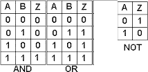
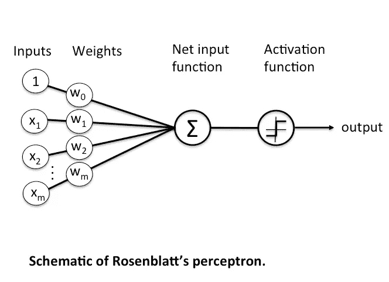
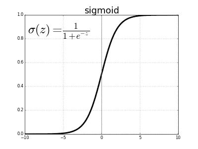

# 逻辑门的神经表示

> 原文：<https://towardsdatascience.com/neural-representation-of-logic-gates-df044ec922bc?source=collection_archive---------2----------------------->

[https://static.pexels.com/photos/39290/mother-board-electronics-computer-board-39290.jpeg](https://static.pexels.com/photos/39290/mother-board-electronics-computer-board-39290.jpeg)

逻辑门即“与”、“或”、“非”是过去十年来每一项技术突破的组成部分，尤其是在硬件方面。

在这个项目中，我们将使用神经网络的基础知识来表示逻辑门。我用 numpy 创建了一个感知器，它用数据集作为感知器的输入来实现这个逻辑门。

**第一部分:逻辑门**

首先，我们必须熟悉逻辑门。

***逻辑门是*** [***数字***](http://searchcio-midmarket.techtarget.com/definition/digital)*[***电路***](http://searchcio-midmarket.techtarget.com/definition/circuit) ***的基本构件。大多数逻辑门有两个输入和一个输出。在任何给定的时刻，每个终端都处于两种二进制状态之一:低(0)或高(1)，由不同的电压电平表示。当电路处理数据时，终端的逻辑状态可以经常改变，通常也确实如此。在大多数逻辑门中，低态大约为零伏(0 V)，而高态大约为正五伏(+5 V)*** *。如 techtarget* 所述*

*最常见逻辑门是与、或、非。如果两个输入都是 1，则逻辑“与”门仅返回 1，否则返回 0；如果所有输入都是 1，则逻辑“或”门返回 1；如果两个输入都是 0，则仅返回 0；最后，逻辑“与”门不返回输入的反相，如果输入是 0，则返回 1；如果输入是 1，则返回 0。为了清楚起见，下图显示了基本门的真值表。*

**

*A 列和 B 列是输入，Z 列是输出。因此，对于输入 A = 0，B = 0，输出为 Z = 0。*

*第二部分:感知器*

**

*感知器是神经网络的基本部分。感知器代表人脑中的单个神经元，它由数据集(Xm)、权重(Wm)和激活函数组成，然后将产生输出和偏差。数据集(输入)被转换为一个 n array，然后与另一个保存权重的 n array 进行矩阵相乘。将所有矩阵相乘相加并加上一个偏差将创建净输入函数，然后输出将传递到一个激活函数，该函数将确定神经元是否需要触发输出。用于分类的最常见的激活函数是 sigmoid 函数，这是一个很好的分类函数(虽然 sigmoid 不是神经网络中间层的主要激活函数[ ehem ReLU / Leaky ReLU ],但它仍然广泛用于最终分类。)*

**

*上图是 sigmoid 函数的曲线。模型的输出作为“z”传递到 sigmoid 中。简单来说，如果模型(z)的结果是负数，sigmoid 函数返回 0–0.4，如果模型是正数，返回 0.5–1。*

***3。代码***

*对于代码，我们将从导入 numpy 开始。Numpy 是一个内置数学函数的库，非常适合做矩阵乘法和科学编程。(在这里了解更多关于 numpy 的信息:【http://www.numpy.org/】T2)*

*然后，我们将创建一个感知器函数，它将充当前面显示的图像中的感知器。该函数将接受权重矩阵、偏差和数据集矩阵。“np.dot(x，weight)”矩阵将数据集与来自输入的权重相乘，然后“np.add()”将矩阵乘法的输出与偏差相加。“1/(1+np.exp(-model)”表示激活函数，将模型传递到 sigmoid 函数中。*

*注意:由于我们这个项目的目标是将感知器表示为逻辑门，我们将对激活函数的输出进行舍入，以使输出仅为 1 或 0，但出于实际目的，舍入输出是一个很大的错误，小数给出的小信息有助于为下一个将处理信息的神经元添加信息。更不用说消失和爆炸梯度，但这是另一个故事*

*创建感知器后，我们需要为它填充输入。函数 compute 会执行此操作，因为数据集和权重还不是数组，我们将在这里执行此操作。它接受 logictype ( "logic_and "、" logic_or "等)来标记机器正在进行的计算，接受 weightdict，这是一个保存所有权重和偏差的字典，最后接受 dataset 参数*

*计算函数将为数组中的每个数据集返回感知器函数的结果*

*下面的要点是逻辑门 AND 和逻辑门 OR 的输出样本。*

*神经逻辑项目到此结束。需要注意的是，为了引入感知器的基本功能，项目权重是手动设定的，尽管优化将是找到该问题正确权重的最佳答案，因此如果输入变大，神经网络可以正确回答该问题。*

*要了解更多信息，您可以访问该知识库:[https://github . com/fjcamillo/Neural-Representation-of-Logic-Functions/blob/master/Logic . py](https://github.com/fjcamillo/Neural-Representation-of-Logic-Functions/blob/master/Logic.py)*