# 神经类型转移教程-第 1 部分

> 原文：<https://towardsdatascience.com/neural-style-transfer-tutorial-part-1-f5cd3315fa7f?source=collection_archive---------2----------------------->

## **神经风格转移理论**

在这篇文章中，你将使用自下而上的方法学习，我们将从神经类型的基础开始。对于初学者，我们将详细介绍它到底是什么，以及它为什么有效。这篇文章是正在进行的系列文章的第一篇，我将与[帕万·萨桑卡·阿玛纳曼奇](https://medium.com/u/f17122844cb9?source=post_page-----f5cd3315fa7f--------------------------------)合著。这个系列看不到尽头，我们将努力最终覆盖这个领域的研究，并不断增加新的作品。坚持到底的先决条件是:

1].计算机编程语言

2].基本了解卷积网络的工作原理。如果你对它们不太了解，我们建议这里的[这篇文章](https://ayearofai.com/rohan-lenny-2-convolutional-neural-networks-5f4cd480a60b)。

**风格转移是什么意思？**

在过去的几年中，我们已经看到了大量的应用程序，如 prisma 和其他类似的应用程序，它们以一种看起来像绘画的方式来设计你的照片。为您提供各种美丽的风格，其中一些是著名艺术家的画作，如梵高的《星夜》。试图用语言来解释这个概念可能会很困难。

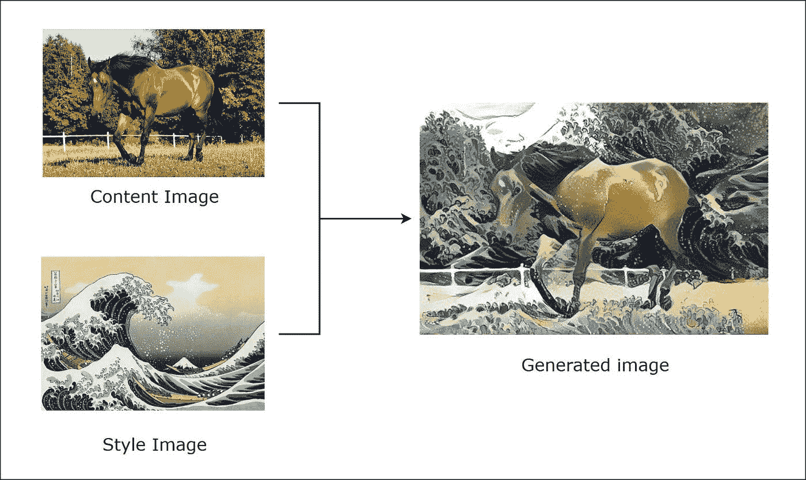

Figure 1

正如您在图 1 中看到的，有两个输入图像，即内容图像和样式图像，用于生成一个新的图像，称为风格化图像。关于这个图像需要注意的几件事是，它具有与内容图像相同的内容，并且具有与样式图像相似的样式。它看起来很好，我们非常确定它不是通过重叠这两张图像实现的，那么我们如何实现这个想法呢？为了回答这些问题，我们需要后退一步，关注卷积神经网络实际上学习什么？这些卷积层以特征图或内核的形式真正编码是什么，让它们这样做，或者换句话说，当我们输入图像时，CNN 学习什么表示，让我们先试着理解一下。

卷积神经网络最初是为图像分类而创建的，最近已用于各种其他任务，如图像分割、神经风格和其他计算机视觉以及自然语言处理任务。CNN 是深度学习中最容易解释的模型之一，因为我们有能力可视化它们的表示，并理解它们可能在学习什么。

**卷积神经网络能提供哪些洞察？**

在这一节中，我想分享一些关于 CNN 深层如何表示图像的直觉，以及我们如何使用这种只对模型有意义的计算表示，以利于我们开发神经类型转移。让我们以 VGG16 架构来理解隐藏层中的这种表示。

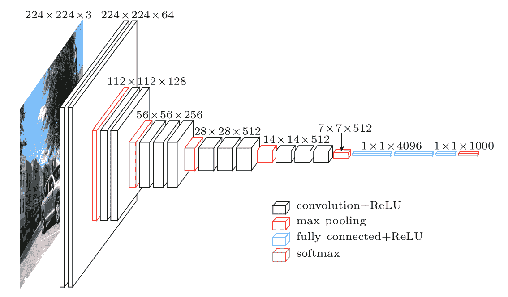

[Figure 2](https://medium.com/@franky07724_57962/using-keras-pre-trained-models-for-feature-extraction-in-image-clustering-a142c6cdf5b1)

使用上述架构作为参考，让我们考虑 vgg16 的第一卷积层，它使用 3×3 内核并训练 64 个特征映射，通过将大小为 224×224 的 3 通道图像作为输入来生成 224×224×64 的图像表示。如果你有点困惑，请看下面

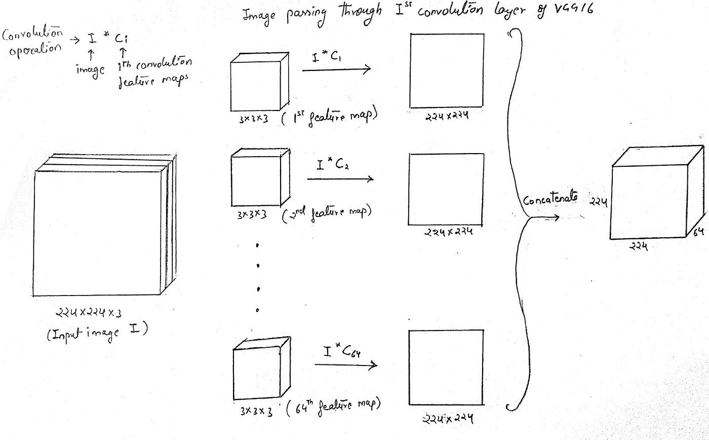

Figure 3

让我们假设，在训练这 64 个特征图时，它们可能已经学会了检测简单的模式，例如，当它们看到一条直线或甚至一些其他类型的模式时，一些神经单元会激活，这些模式对人眼来说可能没有任何意义，但对该模型具有巨大的价值。这种对直线或某种模式的“检测”被称为学习特征表示。

现在让我们考虑 vgg16 的第 10 卷积层，其使用具有 512 个特征图的 3×3 内核进行训练，并最终生成 28×28×512 图像表示的输出，只是为了简单起见，让我们假设在该第 10 层中有某些单元被包含像汽车车轮这样的圆圈的图像激活，或者可能有一些被具有类似于三条相交线等的某种图案的图像激活。

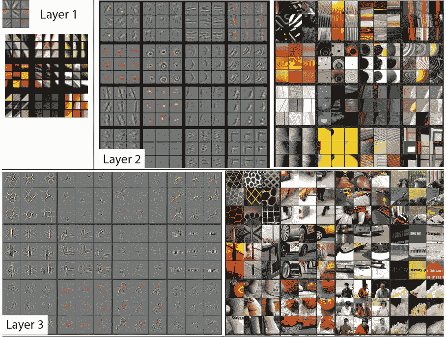

Figure 4 [Visualizing and understanding convolutional networks](https://arxiv.org/pdf/1311.2901)

可以肯定的是，CNN 没有学会对图像进行编码，但它实际上学会了对图像表示的内容或图像中可见的内容进行编码，并且由于神经网络固有的非线性性质，我们从浅层到深层，隐藏单元变得能够从给定图像中检测越来越复杂的特征。

**这些图像表现如何有助于风格转移？**

编码表示本身的这种性质是风格转换的关键，它用于计算生成的图像相对于内容和风格图像之间的损失。当在每类上万幅图像上训练模型时，该模型能够为许多不同的图像生成相似的特征表示，只要它们属于同一类或者具有相似的内容或风格。因此，使用所生成的图像相对于内容和样式图像的特征表示的值的差异来指导迭代是有意义的，通过该迭代，我们产生所生成的图像本身，但是我们如何确保内容图像(C)和所生成的图像(G)在它们的内容而不是样式方面是相似的，而另一方面，我们如何确保所生成的图像仅从样式图像继承相似的样式表示，而不是整个样式图像本身。这可以通过将损失函数分成两部分来解决，一部分是内容损失，另一部分是风格损失，很快我们就会明白它们是如何彼此不同的，以及它们是如何克服我们已经提出的问题的。

# **损失函数**

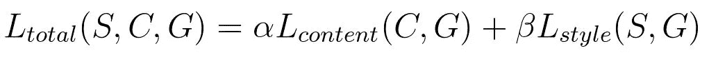

Figure 5

正如你在上面的等式中所看到的，我们需要计算两件事情来获得整体损失，即内容损失和风格损失，alpha 和 beta 超参数用于为每种类型的损失提供权重，即这些参数可以简单地视为控制我们希望在生成的图像中继承多少内容/风格的旋钮。那么，让我们来了解一下，每个损失项意味着什么。

上面显示的这个损失函数的输入是什么？我们不知道最终的输出会是什么样子。所以监督学习的天真方法可能行不通。答案就在下图中。

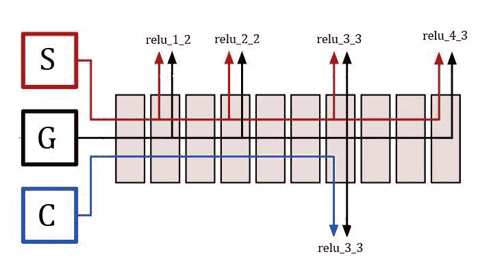

Figure 6 - Different Representations used for Content, Style and Generated Image

在每次迭代期间，所有三个图像，即内容图像、样式图像和生成的图像都通过 vgg16 模型。隐藏单元的激活值对特定层的给定图像的特征表示进行编码，作为这些损失函数的输入，用更简单的术语来说，你可以直接认为这是取 VGG16 网络中的层的输出，在层的选择上没有任何硬性规则。这里还要补充一点，最初我们随机初始化生成的图像，如果你看它，它只不过是一个形状与内容图像相同的随机噪声矩阵。在每次迭代中，我们都会改变生成的图像，以尽量减少总损失 l。

**注意:**这里在每个卷积层之后，它的输出通过 relu 作为它的激活函数，你也可以在图 2 中查看每个卷积块被表示为[卷积+ Relu ]

**内容丢失**

内容损失很容易计算，我们只取其中一层的特征表示，我们考虑 vgg16 的第 7 卷积层。为了计算内容损失，我们通过 vgg16 传递内容图像和生成的图像，并获得这两个图像的第 7 conv 层的激活值(即输出),其具有用于其激活的 Relu，我们将该层的输出一般表示为 relu_3_3，因为它是第三卷积集/块的第三 conv 层的输出(参考图 2 和 6)。最后，我们发现这两个激活矩阵之间的元素减法的 L2 范数，这将有助于通过确保最小化特征表示中的差异来保存生成的图像中的原始内容，该特征表示在逻辑上关注两个图像的内容之间的差异。

把这种损失用数学形式或者一个我们可以计算的方程来表达。假设我们有函数 Content loss，它接受三个参数作为输入，即内容图像 ***C*** ，生成的图像 ***G*** 以及我们将使用其激活来计算损失的层 L。现在让我们将内容图像的每个激活层表示为***a【L】(C)***，将生成图像的激活层表示为***a【L】(G)***。

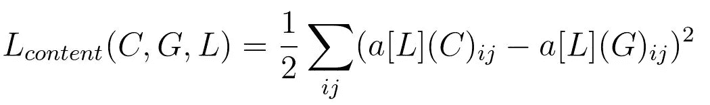

Figure 7

**风格丧失**

现在让我们看看样式损失，在计算样式损失时，我们将考虑从模型的浅层到深层的许多卷积层的特征表示。与内容损失不同，我们不能只找到激活单元的差异，我们需要的是一种方法来找到同一层的不同通道之间的这些激活之间的相关性，为此我们需要一种称为 Gram Matrix 的东西。

**什么是克矩阵？**

我将通过一个示例尝试建立理解 gram 矩阵所需的基础，因此让我们考虑通过 vgg16 传递我们的样式图像，并从第 7 层获取激活值，生成大小为 56x56x256 的特征表示矩阵，您可以参考描述 vgg16 架构的图 2。现在让我们仔细看看这个输出。

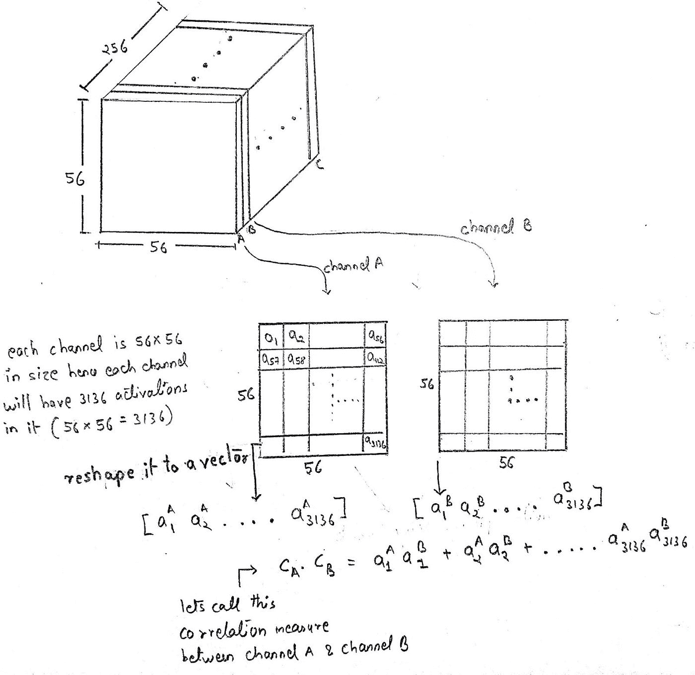

Figure 8

在这个三维阵列中，有 256 个通道，每个通道的大小为 56×56。现在让我们假设有一个通道“A ”,当它们遇到包含黑色和棕色条纹的图像部分时，其激活单元可能被激活；然后有一个通道“B ”,当它们遇到类似眼球的东西时，其激活单元可能被激活。

**注:**此处被激活的单元是指通过 relu 后具有相对于零相当大的值。

如果这两个通道‘A’和‘B’对于相同的输入一起激活，则图像很可能包含老虎的脸(因为它有两个高值的通道，这两个通道激活眼球和棕黑色条纹)。现在，如果这两个通道都以高激活值启动，这意味着与通道“A”和“C”之间的相关性相比，它们将具有高相关性，其中通道“C”在看到菱形图案时可能会被激活。因此，为了获得所有这些通道之间的相关性，我们需要计算一种叫做 gram 矩阵的东西，我们将使用 gram 矩阵来测量通道之间的相关程度，这将在以后作为风格本身的度量。现在你可能已经理解了 gram 矩阵的意义，但是要理解我们如何通过下面提到的图片得到上面提到的三维数组的 gram 矩阵。

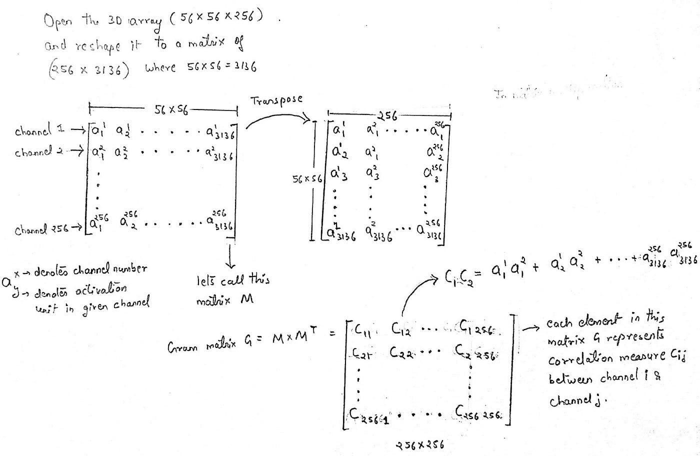

Figure 9 - Gram Matrix G

现在，您可以看到这个 gram 矩阵的每个元素如何包含所有通道相互之间的相关性度量。接下来，我们如何使用计算出的 Gram 矩阵 G 来计算风格损失。让我们将层 L 的样式图像的 gram 矩阵表示为 GM[L](S)，将同一层的生成图像的 gram 矩阵表示为 GM[L](G)。两个 gram 矩阵都是从同一层计算的，因此使用相同数量的通道，使其成为大小为 ***ch* x *ch*** 的矩阵，现在如果我们找到这两个矩阵的平方差之和或元素差的 L2 范数，并尝试将其最小化，那么这将最终导致样式图像的样式和生成的图像之间的差异最小化。想想看，这可能需要一些时间来适应，但当它适应后，你会被它的简单而有效所迷惑。

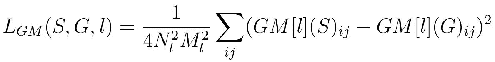

Figure 10 — Style Loss of single layer L

上式中， ***N*** 下标 ***l*** 表示图层***l******M***下标 ***l*** 表示图层 ***l*** 的特征映射/输出的高度*宽度。

在计算风格损失时，我们使用多个激活层，这种情况使我们有可能为不同层提供的每个子损失分配不同的权重。下面的等式，很好地总结了我刚才说的，但是在我们的情况下，或者大多数情况下，人们通常给所有的层相同的权重。

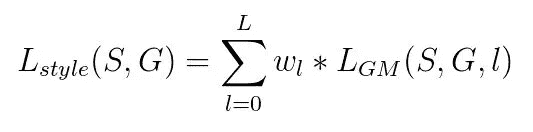

Figure 11

**接下来是什么？**

向前移动，一旦你有内容和风格的损失，把它们加起来，并使用任何优化程序来执行梯度下降，以改变生成的图像，使其减少每次迭代后的损失。

这差不多总结了，我希望我的解释足以消除你对神经风格基础的任何疑虑。现在你可以深入到 neural style 的代码中，我将检查我的代码的每一行，并正确地剖析它，但是下面提到的伪代码几乎概括了你将要运行和使用的代码的所有内容。

```
S = Style_img
C = Content_img
G = random_initialization( C.size() )
```

下面的内容和样式层是原文中建议的常用层，但是你也可以尝试其他层。

```
# content_layers
C_Lys = [“relu_3_3”]# style_layers
S_Lys   = [“relu_1_2”, “relu_2_2”, “relu_3_3”, “relu_4_3”]alpha = 0.5 # content loss weight
beta  = 0.5 # style loss weightfor i = 1 to no_iteration = 1000:
   Loss = alpha*C_loss(C_Lys, C, G) + beta*S_Loss(S_Lys, S, G)
   minimize(loss).change(G)show_image(G)
```

这就是神经风格的本质。如果你对本文的任何部分还有疑问或者想要更好的解释，请在下面评论，我会尽我所能尽快回复你。

快乐学习！

链接。到原创神经风格转印纸 [Leon A. Gatys 的论文，一种艺术风格的神经算法](https://arxiv.org/abs/1508.06576)。

你可以期待接下来的文章在不久的将来被写出来。

Tensorflow 和 pyTorch 的神经类型转移课程:

1.  第一部分神经类型迁移理论
2.  [第二部分——神经风格转移的实现](/neural-style-transfer-series-part-2-91baad306b24)
3.  第三部分:快速神经风格转换的实现
4.  第四部分深度照片
5.  第五部分:人脸的神经类型转移理论
6.  第六部分:人脸神经风格转换的实现

感谢您阅读本文！

如果你认为我们是志同道合的人，应该联系，那么你可以在 [LinkedIn](https://www.linkedin.com/in/vamshik-shetty/) 上找到我，或者发电子邮件到 vamshikdshetty@gmail.com 找我。如果您有任何想法、问题或反馈，请在下面随意评论，我很乐意收到您的来信。