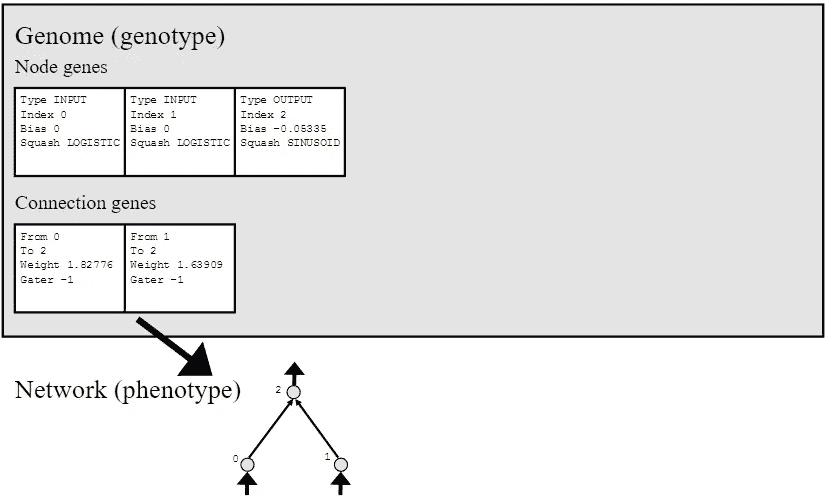
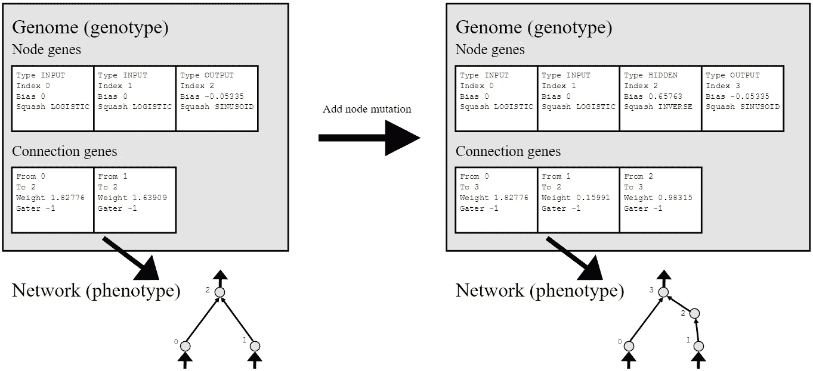
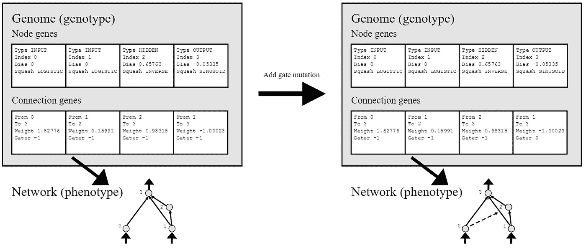
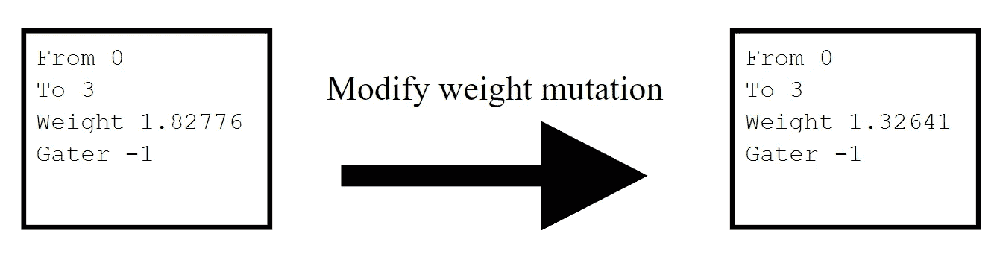
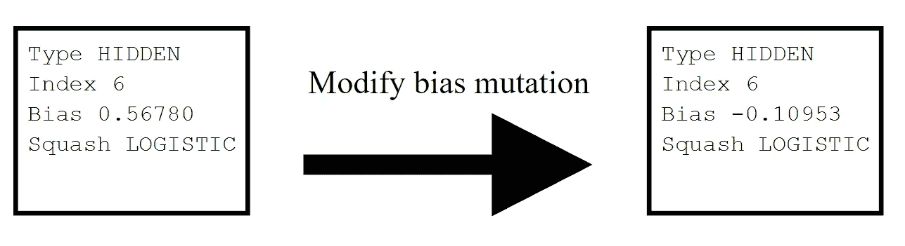
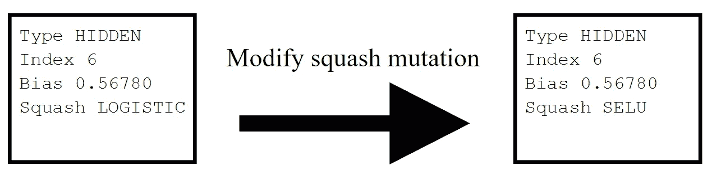
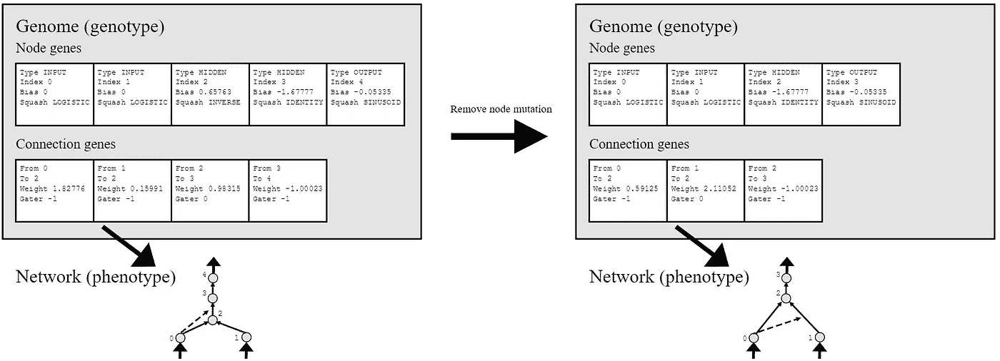
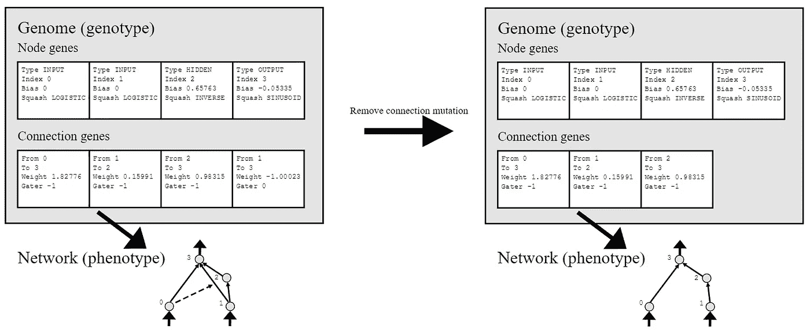
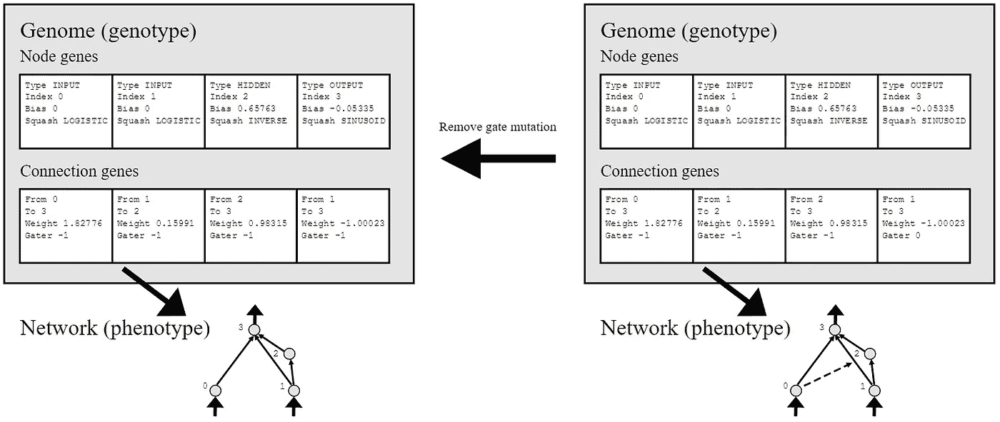

# 本能:类固醇上的神经进化

> 原文：<https://towardsdatascience.com/neuro-evolution-on-steroids-82bd14ddc2f6?source=collection_archive---------4----------------------->

当我第一次实现神经进化时，我实现了 Kenneth O. Stanley 和 Risto Miikkulainen 的论文中描述的算法； [*通过扩充拓扑进化神经网络*](http://nn.cs.utexas.edu/downloads/papers/stanley.ec02.pdf) 。我设法让它工作，但当我在更复杂的数据集上测试算法时，问题开始出现。

节点连接偏差的缺乏迫使网络对于简单的问题变得过于庞大和复杂。跟踪所谓的创新数字在计算上非常昂贵。但最重要的是:由于缺少门，该算法永远不会产生任何像我们在 LSTM 的记忆细胞。

我很快开始修改算法，添加偏差和门，删除创新数，但也添加了节点变异其激活函数的选项:这是一个非常强大的工具，因为基因组现在可以针对数据集/环境完全修改自己。

# 本能算法

我喜欢称我的算法为本能算法。不仅仅是因为这听起来很酷，还因为神经进化在某些环境中发展了神经代理的本能。

> 本能的本质在于它是独立于理性而存在的。—查尔斯·达尔文

我将仅仅讨论基因组的结构，以及它们应该如何被培育、变异和限制。建立遗传算法取决于你。关于工作示例，请参见[我的 Javascript 神经进化库](https://github.com/wagenaartje/neataptic)。

另请注意，当算法发生变化时，本文将会更新。例如，我已经计划加入共享权重，这将很快加入。

## 1 个基因组

如图 1 所示，一个基因组由一组节点和一组连接组成。



(figure 1) Simple example of a genotype and corresponding phenotype

**1.1 节点**

每个节点都有一个类型。只有三种:`input`、`hidden`、`output`。类型为`input`的节点总是停留在列表的开头，类型为`output`的节点将停留在列表的末尾。如果通过突变添加了新节点，它们将总是具有`hidden`类型。

index 参数没有真正的功能，它只是表示节点被激活的顺序。这是按升序发生的。

每个节点都有一个可修改的偏置和挤压(或:激活功能)。偏见没有固定的范围。为每个新变异的节点随机选择激活函数。

**1.2 连接**

连接从索引为`from`的节点连接到索引为`to`的节点。即使连接引用了索引，它实际上也引用了它所连接的节点。例如，如果索引 2 和 3 上的节点之间存在连接，则该连接总是引用最初在索引 2 和 3 上的节点。

每个连接也有自己的权重和网关。重量没有固定范围。`gater`参数表示节点基因列表中控制连接的节点的索引，它总是引用该节点，而不管其索引如何。

**1.3 激活**

激活基因组的方法与其他神经网络完全相同，但我想在这里放一些(类似 JS 的)伪代码以防万一。请记住，自连接是由节点先前的*状态*而不是节点先前的激活状态相乘的。

```
FUNCTION ACTIVATE: 
  output = [] FOR EACH node IN genome.nodes:
    IF node.type === 'INPUT':
      node.activation = input[i]
    ELSE:
      // self-connections are handled differently!
      node.state = node.selfconnection.weight * node.state *
        genome.nodes[node.selfconnection.gater].activation +
        node.bias FOR EACH connection IN node.incomingConnections:
        node.state += connection.weight *
          genome.nodes[connection.from].activation * 
          genome.nodes[connection.gater].activation

      node.activation = node.squash(node.state)

      IF node.type === 'OUTPUT':
        output.add(node.activation)
```

## 2 交叉

杂交是基因组改进的关键。当两个基因组被选择进行杂交时，它们会产生一个独特的后代。它可能会从两个不太健康的父母那里创造出非常健康的后代。它刺激了群体中新网络拓扑的创建。

> 一个普遍的法则，导致所有有机生物的进步，也就是，繁殖，变化，让最强的生存，最弱的死亡。——[**查尔斯·达尔文**，**物种起源**](https://en.wikipedia.org/wiki/On_the_Origin_of_Species)

首先，后代的大小被确定。基因组的大小等于基因组的节点数。如果双亲中的一个比另一个具有更高的适合度，那么大小将与最适合的双亲的大小相同。如果双亲同样合适，则在双亲的尺寸之间随机选择一个尺寸。

```
IF parent1.fitness > parent2.fitness:
  offspring.size = parent1.size
ELSE IF parent2.fitness > parent1.fitness:
  offspring.size = parent2.size
ELSE:
  offspring.size = randomBetween(parent1.size, parent2.size)
```

不管哪个父节点更合适，对于每个索引，节点将从每个父节点中统一选择。这样做，直到节点的数量等于先前确定的大小。

当子代的大小大于最小的父代时，将总是选择来自最大父代的节点。

这些规则有两个例外:首先，如果后代的输出节点还没有被选择，那么类型为`output`的节点可能永远不会被选择。其次，当为后代选择第`n`个输出节点时，则选择双亲之一的第`n`个输出节点。

```
FOR i = 0, i < offspring.size, i++:
  IF i < offspring.size - parents.outputSize:
    // Choose non-output nodes
    IF i > parent1.size - parents.outputSize:
      node = parent2.nodes[i];
    ELSE IF i > parent2.size - parents.outputSize:
      node = parent1.nodes[i]
    ELSE:
      node = SELECT_UNIFORM(parent1.nodes[i], parent2.nodes[i])
  ELSE:
    // Choose output nodes
    node = SELECT_UNIFORM(
      parent1.nodes[parent1.size + i - offspring.size],
      parent1.nodes[parent2.size + i - offspring.size]
    )

  offspring.nodes[i] = node; 
```

一旦选择了节点，连接被分成两个不同的组:*公共*和*额外*连接。当两个父节点具有相同的`from`和`to`值时，这是一个普通连接。否则，它就是一个额外的连接，意味着这个连接只存在于父母中的一个。

最有效的方法

*公共*节点从双亲中统一选择，而不考虑它们的适合度。只有当父母中的一方至少和另一方一样健康时，来自该方的额外基因才会被添加。

## 3 突变

与整洁的论文不同，我将描述应该用来从基因组中获得最大效率的突变方法。每个描述都附有一些伪代码。

**3.1 添加节点突变**

拥有一种将节点基因添加到基因组的突变方法是必不可少的。没有这种突变方法，基因组将不会增长，因此在节点被连接饱和后永远不会改善。

当添加新节点时，现有连接将被拆分为两个新连接，新节点位于这两个连接之间。



(figure 2) Example of the add node mutation, a new node between 1 and 2 is added

如果被删除的连接有一个网关，该网关将被转移到两个新连接中的一个。当一个新的节点被插入到一个基因组的基因列表中时，它被放置在原始连接的接收节点(具有索引`to`的节点)的之前*并且从不在具有`output`类型的任何*节点的之后*。*

当一个节点被插入到其他节点之间时，被插入节点之后的所有节点的索引增加 1。因此，现有的连接总是保留在它们最初被分配到的节点之间。

新节点总是被分配一个统一选择的激活函数。

```
connection = SELECT_UNIFORM(genome.connections)
gater = connection.gaterindex = MIN(connection.to, genome.size - genome.outputSize)
node = new Node()genome.nodes.insert(node, index)
genome.connections.remove(connection)newConnection1 = {
  from: connection.from, 
  to: index, 
  weight: randomNumber(),
  gater: -1
}newConnection2 = {
  from: index, 
  to: connection.to, 
  weight: randomNumber(),
  gater: -1
}IF gater !== -1:
  SELECT_UNIFORM(newConnection1, newConnection2).gater = gatergenome.connections.add(newConnection1)
genome.connections.add(newConnection2)
```

**3.2 添加连接突变**

与变异新节点同等重要的是变异新连接。首先，生成存在*不存在*的连接列表。列表生成后，其中一个生成的连接将被放入基因组的连接基因列表中。


(figure 3) Example of the add connection mutation, a new connection between 1 and 3 is added

来自`hidden`或`output`类型节点的连接从不连接到`input`类型节点，因为`input`类型节点的激活值不是计算出来的，而是由数据集提供的。创建这些连接会调用不必要的内存。

```
pairs = []FOR EACH node1 IN genome.nodes:
  FOR EACH node2 IN genome.nodes:
    IF node1.isNotConnectedTo(node2):
      pairs.add([node1, node2])pair = SELECT_UNIFORM(pairs)connection = {
  from: pair[0].index,
  to: pair[1].index,
  weight: random(),
  gater: -1
}genome.connections.add(connection)
```

**3.3 添加门突变**

拥有一种设置连接基因闸门的突变方法，对于开发复杂的网络来检测多个连续输入之间的模式是必要的。

统一选择一个连接，并将`gater`值设置为从基因组的节点基因列表中统一选择的节点的索引。



(figure 4) Example of the add gate mutation, connection from 1 to 3 is gated

```
connection = SELECT_UNIFORM(genome.connections)
connection.gater = selectionUniform(genome.nodes).index
```

**3.4 修改体重突变**

统一选择一个连接，并在该连接的权重上加上或减去一个值。我喜欢把修改固定在`(-1, 1)`的范围内。



(figure 5) Example of the modify weight mutation

```
connection = SELECT_UNIFORM(genome.connections)
modification = random() * (max - min) + minconnection.weight += modification
```

**3.5 修改偏置突变**

统一选择一个节点，并从该节点的偏差中增加或减去一个值。我喜欢修正`(-1, 1)`的射程。确保不要突变输入节点，因为这对基因组的输出没有影响。



(figure 6) Example of the modify bias mutation

```
node = SELECT_UNIFORM(genome.nodes) // exclude input nodes
modification = random() * (max - min) + minnode.bias += modification
```

**3.6 修改南瓜突变**

最后但肯定不是最不重要的:修改节点基因激活功能的突变方法。就个人而言，我坚持使用以下激活功能列表:

[*逻辑*](https://en.wikipedia.org/wiki/Logistic_function) *，* [*双曲正切*](https://en.wikipedia.org/wiki/Hyperbolic_function) *，* [*恒等式*](https://en.wikipedia.org/wiki/Identity_function) *，* [*二进制步长*](https://en.wikipedia.org/wiki/Heaviside_step_function) *，*[*ReLU*](https://en.wikipedia.org/wiki/Rectifier_(neural_networks))*，软符号，* [*高斯*](https://en.wikipedia.org/wiki/Gaussian_function)

如果你寻求更多样的激活功能，我推荐[这个列表](https://stats.stackexchange.com/questions/115258/comprehensive-list-of-activation-functions-in-neural-networks-with-pros-cons)。



(figure 7) Example of the modify squash mutation

```
node = SELECT_UNIFORM(genome.nodes)
newSquash = SELECT_UNIFORM(listOfSquashes)node.squash = newSquash
```

**3.7 清除节点突变**

随着基因组的增长，它可能表现得更好，但有时它有利于基因组回复已经发生的突变。这也降低了激活基因组的计算成本。



(figure 8) Example of the remove node mutation, node on index 2 is getting removed

首先，`input`或`output`类型的节点永远不会被删除。一旦随机选择一个隐藏类型的节点进行删除，就会创建一个带有节点索引的列表，该列表提供到该节点的所有传入连接(不包括自连接)。另一个列表是用所有输出连接的目标节点索引创建的。同时，不是输入和输出连接的`-1`的`gater`值被保存。

```
node = SELECT_UNIFORM(genome.nodes)gaters = [];
sourceNodes = [];FOR EACH connection IN node.incomingConnections:
  IF connection.from !== node.index:
    sourceNodes.add(connection.from)
    IF connection.gater !== -1:
      gaters.add(connection.gater)targetNodes = [];FOR EACH connection IN node.outgoingConnections:
  IF connection.to !== node.index:
    targetNodes.add(connection.to)
    IF connection.gater !== -1:
      gaters.add(connection.gater)
```

现在`sourceNodes`阵列中的每个节点索引*与`targetNodes`阵列中的每个*节点索引*连接(如果尚未连接)。保留了所创建的连接的列表。创建完所有连接后，`gaters`中的每个选通器都被分配给一个连接，直到没有连接留给选通器。*

```
newConnections = [];FOR EACH source IN sourceNodes:
  FOR EACH target IN targetNodes:
    IF source.notConnectedTo(target):
      connection = {
        from: source,
        to: target,
        weight: random(),
        gater: -1
      }
      newConnections.add(connection)
      genome.connections.add(connection)FOR EACH gater IN gaters:
  IF newConnections.length === 0:
    break;

  randomConnection = SELECT_UNIFORM(newConnections);

  randomConnection.gater = gater
  newConnections.remove(randomConnection)
```

由被移除的节点选通的每个连接的`gater`值被设置为`-1`。最后，从基因组中移除该节点。

```
FOR EACH connection IN genome.connections:
  IF connection.gater === node.index:
    connection.gater = -1genome.nodes.remove(node)
```

**3.8 移除连接突变**

只有当源节点有多个传出连接并且目标节点有多个传入连接时，才能删除连接。这样，所有节点将始终至少有一个传入连接和一个传出连接。



(figure 9) Example ofthe remove connection mutation, connection between 1 and 3 is being removed

```
connections = [];FOR EACH connection IN genome.connections:
  IF connection.from.hasMultipleOutgoingConnections() AND
     connection.to.hasMultipleIncomingConnections():
    connections.add(connection)connection = SELECT_UNIFORM(connections)
genome.connections.remove(connection)
```

**3.9 移除门突变**

先前已经变异的门可能会对基因组的表现造成问题。这种变异方法从随机选择的门控连接中移除门。



(figure 10) Example of the remove gate connection, connection from 1 to 3 is getting ungated

```
gatedConnections = [];FOR EACH connection IN genome.connections:
  IF connection.gater !== -1:
    gatedConnections.add(connection)connection = SELECT_UNIFORM(gatedConnections)
connection.gater = -1
```

**3.10 其他突变方法**

有时将添加连接变异方法拆分成多个其他变异方法是有意义的:*添加前馈连接、添加递归连接*和*添加自连接*。这也需要*移除前馈连接，移除循环连接*和*移除自连接。*

例如，当数据集没有空间关系(多个样本之间的关系)时，您不希望出现任何重复性突变。

## 4 个限制因素

就像任何其他训练方法一样，本能算法有可能过度拟合数据集。为了避免过拟合，引入了一个新的全局参数:*生长*。

`growth`参数不利于基因组变大，但性能相对较低。通常，`growth`是十进制数。节点、连接和门的数量乘以`growth`得到基因组的适应度惩罚。

```
penalty = (genome.nodes.length + genome.connections.length + genome.gates.length) * growth
```

用于计算罚金的参数是自由选择的。例如，罚款计算也可以是:

```
penalty = genome.nodes.length * growth
```

**4.1 示例**

一个基因组在某个数据集上有`10`的适合度。基因组发生了变异。它获得了一个额外的节点。突然，适应度提高到了`11`。可悲的是，随着以下惩罚的应用，最终适应度降低到`9`:

```
fitness = fitness - genome.nodes.length * growth
```

其`growth`值为`2`。因此，如果一个基因组想要达到更高的最终适应度，适应度的增加应该高于`2`。