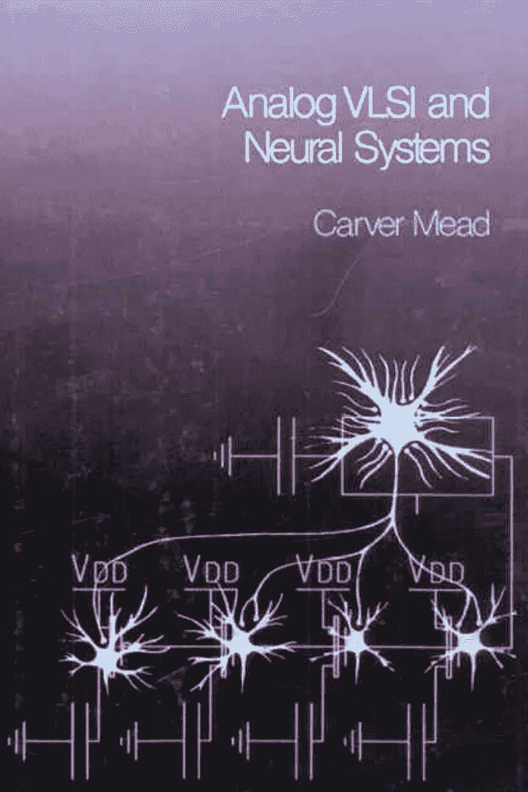
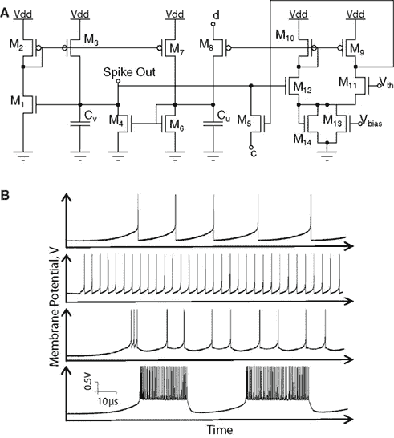
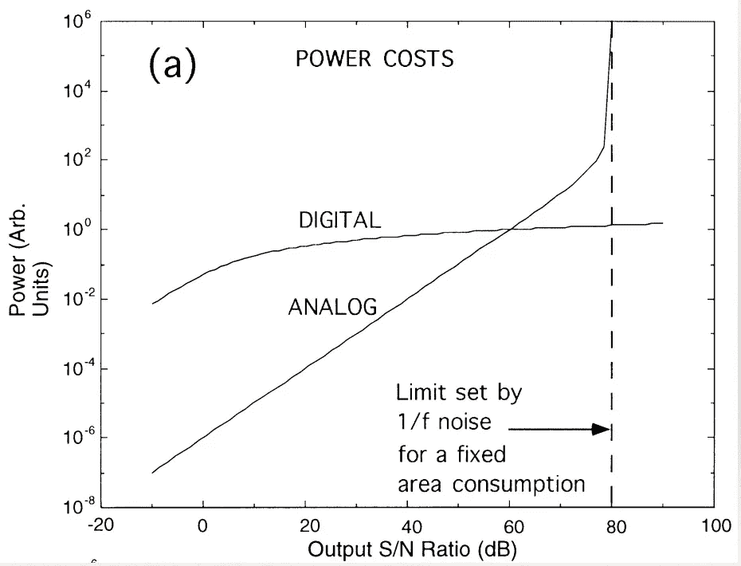
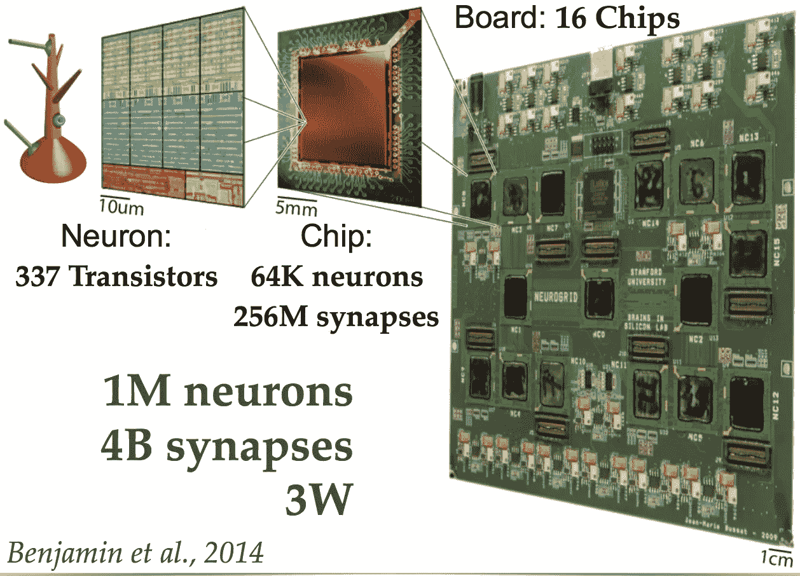

# 神经形态和深度神经网络

> 原文：<https://towardsdatascience.com/neuromorphic-and-spiking-or-not-894a836dc3b3?source=collection_archive---------0----------------------->

*免责声明:我在博士期间一直从事模拟和混合信号神经形态微芯片的研究，在最近 10 年里，我转向了深度学习和全数字神经网络。关于我们作品的完整列表，请看* [*这里*](http://e-lab.github.io/html/publications.html) *。关于这个主题的一个更老的出版物是* [*这里是*](http://e-lab.github.io/data/papers/Frontiers_neuromorph_2012.pdf) *(来自我们组)。*

# **神经形态神经网络**

用于计算神经网络的神经形态或标准数字:**哪个更好？这个问题很难回答。标准的数字神经网络是我们在深度学习中看到的那种，它们取得了所有的成功。它们使用 64 位或更低的数字值进行计算，所有这些都在[标准数字硬件](https://medium.com/towards-data-science/hardware-for-deep-learning-8d9b03df41a)中。**

神经形态系统和硬件有很多种风格，主要源于卡弗·米德的开创性工作(他的书的封面在右边)。他们通常使用每个值 1 位，就像在**脉冲神经网络**中一样。他们可以用模拟或数字计算单元进行计算。主要思想是神经元是自由运行和独立的单元，由 1 比特脉冲形式的尖峰信号的通信来刺激。神经形态神经元既可以是[复杂的数字计数器](http://ieeexplore.ieee.org/document/1610778/)也可以是[简单的模拟积分器](http://e-lab.github.io/data/papers/jsscc2003-octopus.pdf)。

The Izhikevich neuron circuit, from [here](http://journal.frontiersin.org/article/10.3389/fnins.2011.00073/full)

通信是[异步且复杂的](http://e-lab.github.io/data/papers/neco07vogel.pdf)。此外，使用数字通信更节能、抗噪，如下图所示。

[Sarpeshkhar 1998](http://www.mitpressjournals.org/doi/abs/10.1162/089976698300017052)

数字形式的神经形态硬件由 IBM ( [TrueNorth](http://www.research.ibm.com/articles/brain-chip.shtml) )设计，模拟形式由许多研究小组( [Boahen](https://web.stanford.edu/group/brainsinsilicon/boahen.html) 、 [Hasler](https://www.ece.gatech.edu/faculty-staff-directory/jennifer-o-hasler) 、[我们的实验室](http://e-lab.github.io/index.html)等)设计。).最好的系统使用模拟计算和数字通信:

[Kwabena Bohaen group](https://ia600206.us.archive.org/11/items/Redwood_Center_2016_03_23_Kwabena_Boahen/Redwood_Seminar_2016_03_23_Kwabena_Boahen.pdf)

使用传统的数字硬件来模拟神经形态硬件( [SpiNNaker](http://apt.cs.manchester.ac.uk/projects/SpiNNaker/) )显然是低效的，因为我们正在使用 32 位硬件来模拟 1 位硬件。

# 神经网络计算

神经网络需要[乘加运算](https://mattmazur.com/2015/03/17/a-step-by-step-backpropagation-example/)。M*M 矩阵与 M 向量乘积需要 M 次乘法和加法，或 2*M 次运算。他们还通过卷积或人工感受域进行计算，这[基本上与矩阵向量乘法](http://colah.github.io/posts/2014-07-Understanding-Convolutions/)相同，只是你为每个输出数据点乘以多个值(过滤器)。

**神经形态系统以不同的方式**计算相同的运算**，而不是使用 B 位字进行激活和加权，它们使用神经元之间的 1 位尖峰通信。神经元可以在正负线上发送尖峰信号，以激活或多或少与其相连的神经元。**神经形态神经元**在**数字计数器或模拟积分器**中整合输入，当达到某个阈值时，它们自己触发另一个尖峰信号，以与其他神经元进行通信。**

**神经元阵列和神经激活:**神经元被组织成阵列，并将激活存储在每个神经元内部的存储器中。这是一个问题，因为神经网络可能很大，需要许多神经元。这使得神经形态微芯片变得很大，因为神经元不能像我们在传统数字系统中那样被重用。如果一个人想要在同一序列中重复使用神经元阵列进行多次计算，那么他必须使用模拟存储器来存储神经激活，或者将它们转换为数字并存储到传统的数字存储器中。**神经形态问题:这两种选择目前都被禁止。**详见下文“模拟与数字存储器”。

**计算神经形态阵列中的神经网络层**需要将权重值 W 添加到神经元激活中。这很简单:**没有乘法。**数字乘法器每比特使用 L(~ 30–300)个晶体管(下限:每个触发器 12 个晶体管，2 ff，一个 xor 门进行乘法)，而模拟乘法器可能只需要少量晶体管(1 个用于乘法，5–10 个用于偏置电路)来乘以~5 比特(受噪声限制)——这都取决于权重是如何实现的。神经形态计算通过使用少得多的功率赢得了重要的时间。

重量是如何实现的？它们可以是数字的也可以是模拟的。通常它们是数字的，因为模拟存储器在操作期间会褪色，并且每单位重量需要大的电路以避免泄漏。数字重量增加了与其数字值成比例的激活量。

**这些砝码存放在哪里**？在本地，每个神经元的存储容量是有限的，但是如果这还不够的话，就不得不求助于外部数字存储器。更多信息请见下文“模拟与数字存储器”。

神经形态系统在**无时钟设计**中使用尖峰信号的**异步通信**。这允许通过仅在需要时通信而不是在不相关的时钟滴答时通信来节省功率。但这也使系统设计和通信基础设施变得复杂。更多信息请见下面的“系统设计”。

注意:为了从神经元阵列中获取值，我们需要**将数字**(例如图像中的 8 位像素)**转换成脉冲串**。这可以通过将强度值转换成脉冲频率来实现。理想情况下，这种转换只在数组的输入数据和输出端执行。

# **模拟与数字存储器:**

神经网络计算需要计算 M*M 矩阵与 M 向量的乘积。m 通常在 128–4096 的范围内。

由于处理器必须按顺序计算多个这样运算，因此它需要交换矩阵，依靠外部存储器进行存储。**这需要一个数字存储器**，因为数值是数字。

模拟处理器必须将数值从模拟转换成数字，然后再转换回来，以对数字存储器进行操作。每个进出内存的端口都需要一个 AD/DA。这些器件需要以存储器速度工作，通常在 1GHz 的数量级，这是当前转换器的极限，需要非常大的功率。

禁止在每一层来回转换 AD/DA。因此，模拟神经网络将不得不在模拟模式下连续执行多个层，这是有噪声的并且会降低信号质量。这也需要用于多层的硬件，N 层乘 M*M 硬件乘法器块需要可用。这需要大的微芯片硅面积/尺寸。

相比之下，数字硬件可以很容易地从数字存储器中存储和检索，并且硬件可以重复使用，需要更少的微芯片硅面积/尺寸。此外，没有数据转换的开销。

# **系统设计:**

神经形态脉冲网络使用无时钟设计和异步数字设计。很少有工程师受过设计这种系统的训练。

模拟需要更多的专业知识，而可用的工程师却更少。

[**神经形态系统往往比传统的数字系统**](http://journal.frontiersin.org/article/10.3389/fnins.2011.00073/full) 设计起来更加复杂。它们更容易出错，需要更多的设计迭代、非标准工具和微芯片工艺变化。

# 稀疏性:

一些系统可能在稀疏计算领域更胜一筹，在稀疏计算领域，它们只需要计算其中的一部分，而不是计算整个 2*M 运算。注意:在深度神经网络中，输入不是稀疏的(图像、声音)，但可以通过隐藏层来稀疏化。许多值为零或非常接近，可以高度量化。

让我们假设在前 1-2 层中没有稀疏度，而在一些隐藏层中有高达 100 倍的稀疏度。

传统数字系统和神经形态系统之间没有**差异**，因为两者都可以执行稀疏运算。我们确实需要支持稀疏矩阵乘法的硬件(目前很多深度学习框架和硬件都没有实现)！

# 最后注意:

神经形态系统仍然很难设计。为了扩大规模，它们需要模拟存储器或快速低功耗的 AD/DA 转换器，而这些目前还不可用。

但是，如果计算是模拟的，并且通信使用事件间定时，则它们可以节省大量能量。

# 关于作者

我在硬件和软件方面都有将近 20 年的神经网络经验(一个罕见的组合)。在这里看关于我:[媒介](https://medium.com/@culurciello/)、[网页](https://e-lab.github.io/html/contact-eugenio-culurciello.html)、[学者](https://scholar.google.com/citations?user=SeGmqkIAAAAJ)、 [LinkedIn](https://www.linkedin.com/in/eugenioculurciello/) 等等…