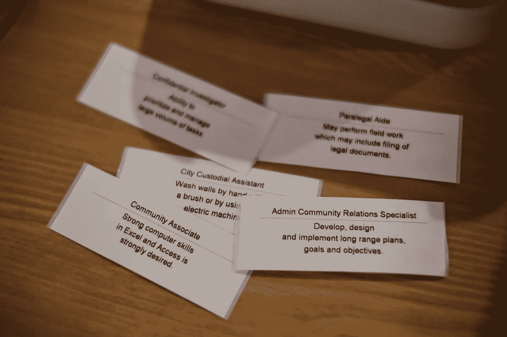
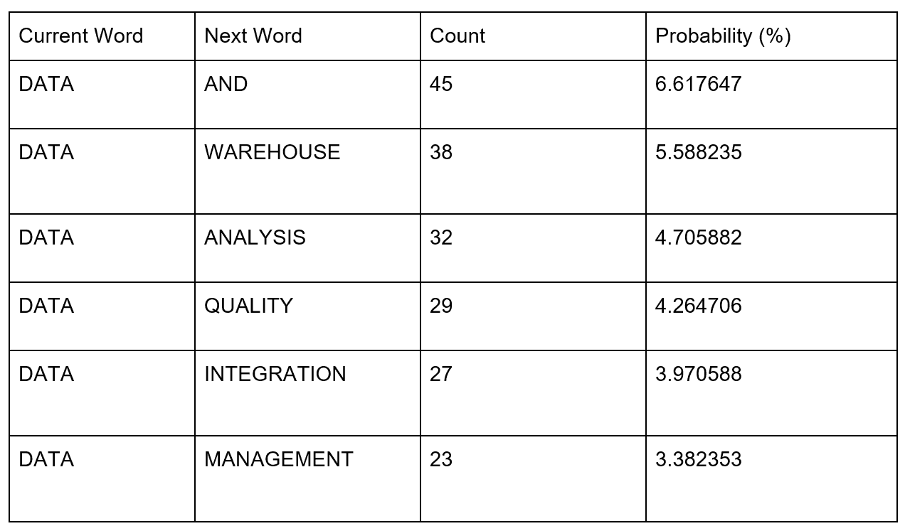
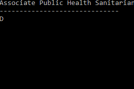
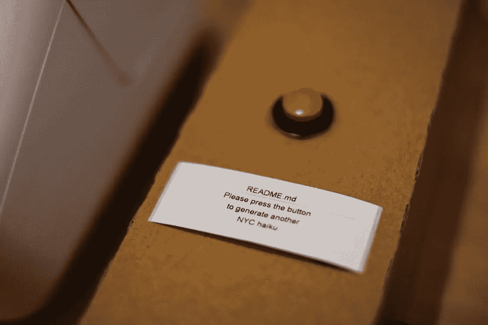
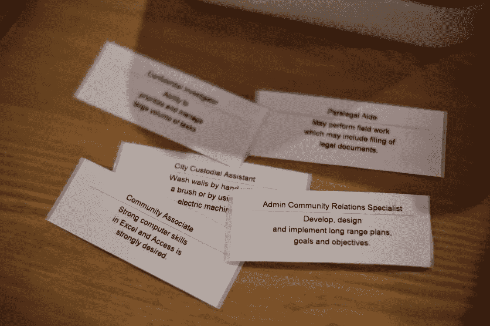

# 纽约寻求俳句:从纽约市政府职位描述中产生俳句

> 原文：<https://towardsdatascience.com/new-york-seeks-haikus-generating-haikus-from-nyc-government-job-descriptions-c27496a376fd?source=collection_archive---------9----------------------->

六年前，纽约市通过了一项法律，要求市政机构公开他们的数据。从那时起，超过 1600 个数据集已经在该市的[开放数据门户](https://opendata.cityofnewyork.us/)上可用，并且新的数据不断提供。

[开放数据周](https://www.open-data.nyc/)——纽约市长数据分析办公室在全市范围内开展的活动——是对这一进步的庆祝，并与[数据贯穿设计](http://datathroughdesign.com/)展览同时举行。这次展览的目的是挑战艺术家们使用这些公开的数据来讲述关于这座城市的有见地的有趣的故事。

作为一名土生土长的纽约人、数据科学家和公务员，这个挑战激起了我的兴趣，因为以创造性的新方式使用城市数据是我的工作。

需要 40 万名政府雇员来维持纽约市(美国人口最多的大都会区)的运转。从维护基础设施、提供应急服务，到创造减少浪费、无家可归和犯罪的创新方法，这一切都归结于他们。

因此，对于《设计中的数据》,我想讲述 40 万人在幕后工作的故事，以及他们是如何让我的家乡保持生机和繁荣的。最终，这个概念演变成一个程序，根据市政府工作的职位描述，通过算法生成俳句。

# **纽约市寻求**

这些数据来自纽约市工作数据集。它包含纽约市官方招聘网站上的最新招聘信息。开放数据门户上的大部分数据都是关于城市发生了什么，城市做了什么。这个数据集让我们得以一窥这些事情背后的人和事。

每个职务公告都包含机构、薪资范围和发布日期等信息。对于这个项目，我使用了三栏:公务员职称、职位描述和职位资格。

此外，我使用了一个数据集，其中包含 Jim Kang 的 [phonemenon](https://github.com/jimkang/phonemenon) 中单词的音节数。我不得不修改数据，以包括非标准的单词，如机构缩写(即 NYPD，4 个音节和点，3 个音节)。

# **生成俳句**

目标是利用纽约市的工作描述来创作俳句。俳句最初是日本的一种诗歌形式，包含三行，第一行五个音节，第二行七个音节，第三行五个音节。

为了创作一首俳句，我使用了一种定制的[马尔可夫链](https://en.wikipedia.org/wiki/Markov_chain)方法。马尔可夫链是一种在给定当前值和当前值之后的值的概率的情况下生成序列的技术。在这种情况下，给定一个单词，接下来可能是什么单词？

第一步是确定这些概率。我按公务员头衔(计算机系统经理、油漆工、土木工程师等)对数据进行了分类。)和首选技能字段中的文本建立了一个单独的数据语料库。然后我把语料库拆分成句子，把句子拆分成单词，统计 A 跟着 b 的次数。

下面的例子显示了计算机系统经理在“数据”后面最常用的词。给定一个这样的表，马尔可夫链将随机选择一个按概率加权的下一个单词。然后，它将得到这个单词，并一次又一次地重复这个过程。

因为我在创作俳句，所以我有严格的音节限制。我只考虑下一个符合音节限制的单词。例如，如果我在第一行(5 个音节)，我当前的单词是“数据”，我不会选择“分析”或“整合”作为下一个单词，因为这会将该行置于 5 个音节之上。

在这个过程中，当在音节限制内没有有效的选择时，生成器有时会将自己写入一个不可能的状态。在这种情况下，它会返回并尝试一个新词，看看它是否会导致一个有效的俳句。

俳句以一种原始的状态出现在这个过程中——全部是小写，没有标点符号，有时它们就是不太好。我发现的最大问题是，因为俳句太短，结果往往是不完整的想法。

马尔可夫链会在一个句子的中间，当它达到音节数时突然停止。我试图通过只使用符合逻辑的结尾词来纠正这一点，但这并不适用于所有情况。

例如，以下两句都以“设计和施工过程”结尾，但只有第一句是完整的句子:

> *与项目负责人
> 一起创建设计和
> 施工流程*

和

> *纽约市
> 设计部
> 施工流程*

有些结果实际上很有趣:

> *环境
> 和环境
> 和环境。*

和

> *新城市
> 纽约市:开放的数据，
> 开放的政府。*

通过一个半手工、半自动化的编辑过程，我清理了俳句，以获得像样的结果。最后一篇有 750 多首俳句。

# **增加观众参与度**

我现在有能力创作俳句；但是我应该如何呈现它们呢？我想给一些算法如何工作的见解。为此，我决定展示反复创作的俳句。该算法尝试的每个单词都会显示出来，当遇到失败状态时，它会删除单词并再次尝试。

这是它的样子:

展览组织者 Michelle Ho 建议将这些俳句印在标签上，这样它们就可以作为纪念品带回家，供设计展览的观众参考。

我添加了一个按钮，按下后会生成并打印下一首俳句:

其结果是对该市公务员的一些职责和技能进行了异想天开的互动审视。

以下是一些我最喜欢的:

> *纽约市
> 政府是一个加号，但
> 不是必需的。*
> 
> *财务部正在寻找
> 一名充满活力的实习生来
> 发挥团队作用。*
> 
> *确保数据
> 准确、整洁、及时并
> 准备好接受审计。*
> 
> *对
> 干线水和废水
> 收集系统的深刻认识。*
> 
> *谁想成为
> 信息
> 安全人员的一部分？*

*此文原贴于* [*数据驱动新闻*](http://datadrivenjournalism.net/featured_projects/new_york_seeks_haikus_a_data_through_design_exhibit) *。*

感谢 Abigail Pope-Brooks 的编辑和反馈。

*所有用到的代码和数据都可以在*[*github*](https://github.com/docmarionum1/new_york_city_seeks)*上找到。杰里米·内曼在他的网站上做着同样毫无意义的事情:*[*http://jeremyneiman.com/*](http://jeremyneiman.com/)