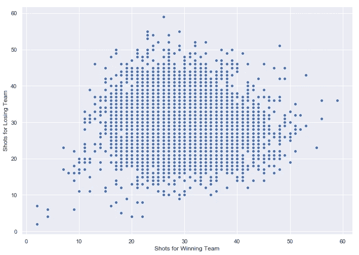

# NHL 分析:投篮，篮板和微弱信号

> 原文：<https://towardsdatascience.com/nhl-analytics-shots-rebounds-and-weak-signals-c293ba8c635f?source=collection_archive---------15----------------------->

## 浅析射门及其对曲棍球比赛获胜的影响

任何职业运动都是百分比练习。职业选手在这项运动中是所有人中排名前 99.99%的人。这一事实扭曲了我们对优秀和不优秀玩家的看法，也扭曲了我们对游戏中微小但重要的部分的影响的估计。NHL 也不例外——事实上，NHL 的明显随机性(与 NFL 和 NBA 相比，最好的球队赢得最少的比赛)可能会使它最终变得更加重要。一个小小的优势可能会导致赢得比赛的系统性增加，并大幅增加将奖杯带回家的可能性。在我们的分析中，我们将致力于发现和揭露这些小想法，并揭示一些潜在的游戏破坏者。

注意——下面的交互式图表在小型移动设备上效果不佳。如果你想探索它们，最好在台式机或平板电脑上观看。

首先是篮板。

守门员训练多年来学习如何防止他们，整个球队专注于创造他们。看到一个从球门区弹起的击球落在队友等待的球棍上，通常会导致进球。我们想知道这有多重要？不仅知道篮板球是如何发生的，而且知道在哪里、什么时候以及为什么会发生，可能会让我们增加获得篮板球的机会——从而带来更多的进球和更多的胜利。

**什么是反弹？**

在我们理解为什么篮板是至关重要的之前，我们需要准确理解什么是篮板。理解这一点需要大量的数据；幸运的是，NHL 主持并发布了绝大多数游戏中的统计数据。剧本被精确地记录下来，这使我们能够挖掘和提取一些有趣的花絮。在这一块，我们看到了超过 7000 场比赛和超过 400，000 个镜头。

因为我们不能仅仅说哪些投篮被认为是篮板(这在原始数据中没有分类)，我们可以通过以下方式寻找统计分类:

1.  查看所有镜头之间的时间，以及；
2.  寻找标准评分率与提高的评分率之间的显著偏差

假设是，如果篮板确实带来更好的得分机会，我们会看到一个更好的得分率。下面是一张图表，显示了得分率与两次投篮之间的时间的关系。

显然，对于任何小于三秒的时间，得分率都有显著的增加(在两秒时达到峰值)。如果投篮和反弹之间的持续时间是两秒，那么得分的可能性几乎是四倍！另一个不足为奇的发现是——与所有其他投篮相比，篮板导致的投篮次数和进球次数大幅增加。

因为我们可以有把握地说，在第一次投篮之后有三秒钟的时间，得分的概率会急剧增加，所以我们可以有把握地把这个范围内的所有投篮都归类为“篮板”这对这件作品的其余部分非常重要。

**1–2–3**

为什么两秒后的篮板比一秒后的篮板好？为什么 2 秒后的篮板比 5 秒后的篮板重要得多？

*   如果下一次射门发生在三秒钟之内，守门员没有足够的时间复位，他就不在位置上了。
*   不到一秒的投篮很可能是一个接一个的快速投篮(想想试图把冰球塞进去)。更有可能的是球员没有抢到干净的篮板。一秒钟内拍摄的照片比两秒钟内拍摄的照片多得多，这一事实进一步证明了这一点。
*   两秒钟的镜头往往是最佳拍摄点。在两秒钟时，守门员没有足够的时间复位，而球员有时间射门。2 秒出手次数的大幅下降也强化了这一点(把这当成篮板球的圣杯吧)。

现在我们知道了反弹是什么，我们可以看看它们有多重要。

Roughly 5% of shots that constitute rebounds lead to over 15% of the goals scored.

虽然抢篮板的投篮只占所有投篮的 5%,但他们占所有进球的 15%以上。在下图中，我们可以看到这些镜头在热图上的位置。

大多数镜头来自意料之外的地方。如果我们换个角度来看这个问题——从一个特定的位置投篮可能会导致篮板，我们会发现一些更分散的东西。你离禁区越近，投篮就越有可能导致反弹，但是投篮导致反弹的概率并不像实际投篮那样偏斜。

这指向了一个假设，即投篮地点和他们导致反弹的可能性(即得分机会)之间的关系没有一些人想象的那么强。也许球队应该更少地关注正确的投篮，而更多地关注更多的投篮？

**好镜头 vs 更多镜头**

从我们目前所看到的来看，假设一支把更多投篮机会转化为篮板的球队更有可能赢得比赛是有道理的。我们还注意到，在非常接近夜晚的时候拍摄的镜头非常集中，尽管这些镜头很难获得。也许球队应该更关注投篮而不是正确的投篮？

从分析的数据来看，更高的篮板球率实际上并不意味着更高的胜率。事实上，较高的反弹率与较低的胜场数相关联！

我们还发现，更高的篮板率与投篮次数更少有很大关系，而且投篮次数越多，胜率越高。

有必要在上下文中思考上述结果。所有的图表都有很大的差异，但是一些数据点有明显的趋势。我们可以看数据的另一种方式是看游戏水平而不是季节水平。有趣的是，我们发现了相反的效果。当我们一场一场地看时，我们看到投篮次数少的球队往往赢得更多的比赛(以微弱优势)。也许一场比赛中篮板率较低的球队得分更高？

要知道每队场均篮板数只有 3.9 个。在大多数情况下，篮板最多的球队只多一个篮板。

这是违反直觉的——以至于我花了很多时间梳理代码寻找错误。一个合理的解释可能是，在一个赛季中，一支投篮次数很少、篮板率很低的球队确实太努力寻找正确的投篮。相反，一个有很多投篮机会的团队会投更多的球(导致更好的结果)。也许游戏与游戏之间的数据差异太大(在我之前已经有很多人做过类似的分析)以至于它们毫无意义？

如果你还是不相信我？这是获胜队和失败队的击球对比图。完全是噪音。

指出这一点的一个具体例子是 2017-2018 赛季的卡罗莱纳飓风。他们场均投篮次数第四高，场均投篮次数最少，但是他们没有进入季后赛。

**接下来的步骤**

我的分析得出的一个主要结论是，曲棍球是一项非常复杂的运动。很难指出个别的统计数字并作出明确的陈述。可以肯定的是，我不是第一个登陆这里的人。

然而，我们确实在更长时期的统计数据中发现了有意义的关系(尽管是微弱的关系)。可能的情况是，虽然单个游戏的统计数据非常嘈杂(或者，事实上，几乎是随机的)，但我们可以在季度或月度水平上找到更好的关系。

本系列的下一篇文章将关注团队，以更好地理解投篮、篮板、团队行为和胜利之间的关系。

**附言:**

1.  接下来，我将对大部分分析进行基于代码的演练。有兴趣就跟着我吧！
2.  我正在为这种类型的分析建立一个高级分析应用程序，我正在寻找一个软件/数据工程师来帮忙。框架是 Python 使用 Dash/Plotly。有兴趣的话 Ping 我@ jessemoore07@gmail.com。

**演职员表:**

这里的原始数据集—**[https://www.kaggle.com/martinellis/nhl-game-data](https://www.kaggle.com/martinellis/nhl-game-data)**

**绘制冰场的起点—[https://modern data . plot . ly/NHL-shots-analysis-using-plot ly-shapes/](https://moderndata.plot.ly/nhl-shots-analysis-using-plotly-shapes/)**