# [NIPS 2017/Google] -在众目睽睽之下隐藏图像:具有交互代码的深度隐写术[带 TF 的手动背道具]

> 原文：<https://towardsdatascience.com/nips-2017-google-hiding-images-in-plain-sight-deep-steganography-with-interactive-code-e5efecae11ed?source=collection_archive---------6----------------------->

Gif from [here](https://giphy.com/gifs/dance-surprise-garbage-UcoqhB0G1BMNW/download)

所以几周前，我在 NIPS 2017 出版网站上发现了 [Shumeet Baluja](https://papers.nips.cc/author/shumeet-baluja-1103) (谷歌研究员)的这篇论文“ [*在众目睽睽之下隐藏图像:深度隐写术*](https://papers.nips.cc/paper/6802-hiding-images-in-plain-sight-deep-steganography) ”。

和往常一样，让我们比较一下[扩张反向传播](/outperforming-tensorflows-default-auto-differentiation-optimizers-with-interactive-code-manual-e587a82d340e)与自动微分相比表现如何。

**论文结果**

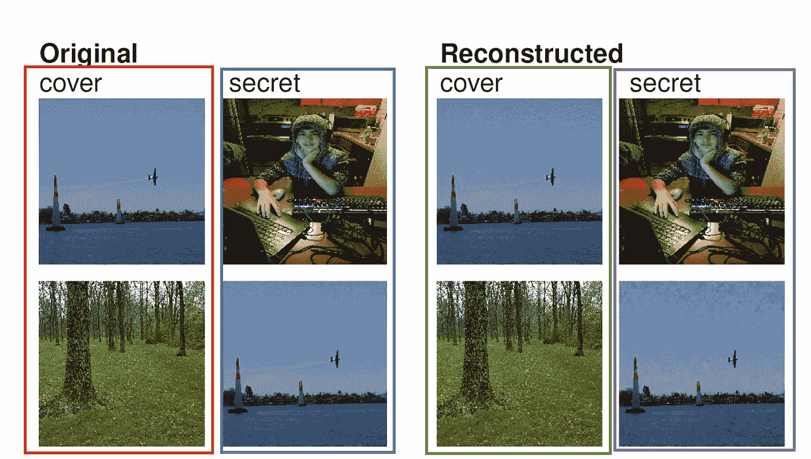

**红框→** 载体图像隐藏我们的秘密消息 **蓝框→** 我们要隐藏的秘密消息 **绿框→** 载体图像隐藏秘密消息后 **紫框→** 从绿框图像中重构秘密图像

整个想法非常简单，我们将有一个载体图像，我们将在该图像中隐藏一些秘密信息(这是另一个图像),稍后再揭开它。现在让我们来看看这个模型的网络架构。

**网络架构(高/低级别)**

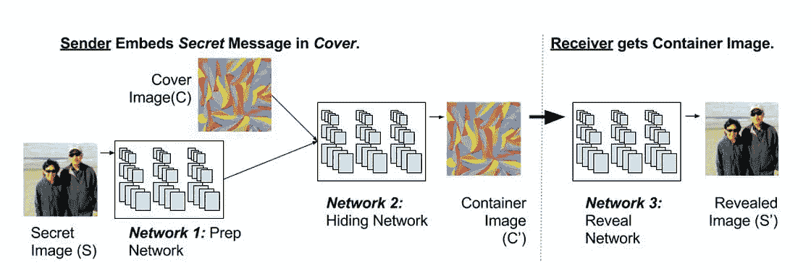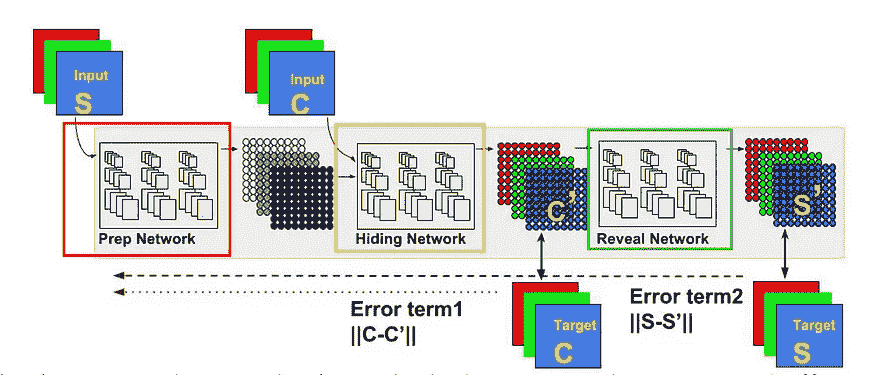

**红框** →准备图像的神经网络(Prep Network)
**黄框** →隐藏的神经网络(Hiding Network)
**绿框** →揭示的神经网络(Reveal Network)

主要有三个网络，一个是准备图像、隐藏图像和揭示秘密图像。现在让我们来看看较低层次的实现。

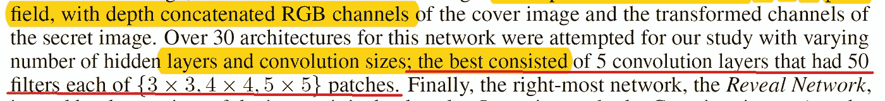

**红线** →网络架构描述

这篇文章的一个奇怪之处是，它没有详细描述网络体系结构。我甚至无法找到网络有什么样的激活功能。

所以在我的能力范围内，我相信每个网络有 5 层，每层有 50 个频道。准备网络的核大小为 3，隐藏网络的核大小为 4，最终显示网络的核大小为 5。同样，我将只使用 ReLU()激活函数，这个决定是通过实验性的试验做出的。

**成本函数**

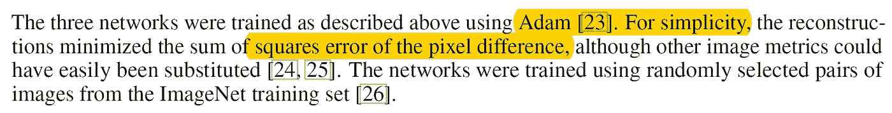

然而，令人欣慰的是，这篇论文确实描述了网络使用哪种成本函数以及它使用哪种优化器。我们将使用亚当和 L2 损失函数，平方差。

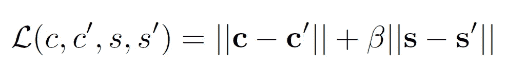

以上是完整的误差函数，我们将载体图像和秘密图像之间的平方差。对于 scecrte 镜像误差函数，我们将在平方差前面有一个β项(我们将它设为 1，因此可以忽略它),它决定了我们必须将多少误差输入反向传播。但是，还有一点需要注意的是这个模型的梯度流。

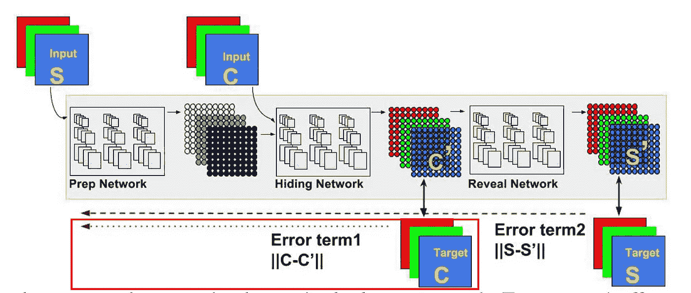

**红框** →从载体图像应用梯度流

如上所述，秘密图像的错误率一直向后传播，然而对于载体图像错误率，它仅应用于隐藏网络和准备网络。

**网络架构(OOP 形式)**

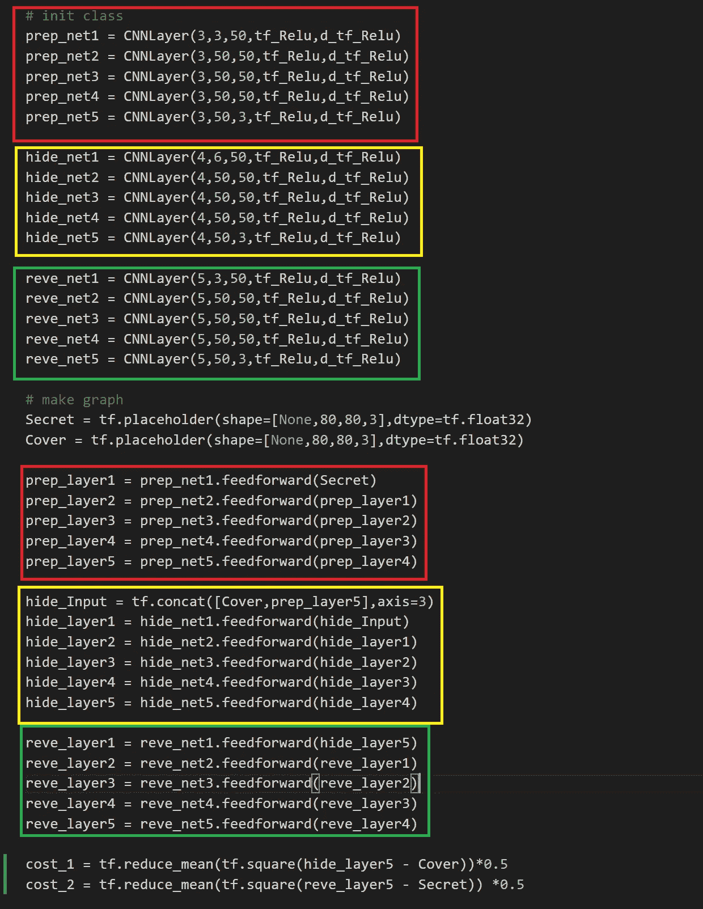

**红框** →准备网络及其前馈操作
**黄框** →隐藏网络及其前馈操作
**绿框** →显示网络及其前馈操作

如上所述，网络本身并不难实现。因为它由 5 个卷积运算组成，且具有相同数量特征映射。这很容易。

**实验设置**

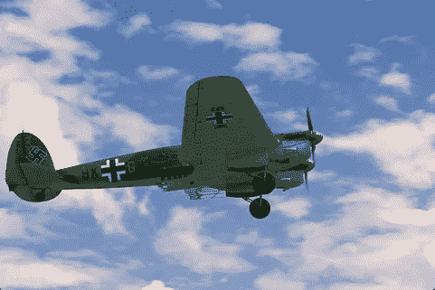

如上所述，我们将使用来自[李辉](http://www.ntu.edu.sg/home/asjfcai/Benchmark_Website/benchmark_index.html)蔡剑飞[的公开可用数据](http://www.ntu.edu.sg/home/asjfcai/)[作为语义图像分割的基准](http://www.ntu.edu.sg/home/asjfcai/Benchmark_Website/benchmark_index.html)。此外，由于硬件限制，我们将所有的图像调整为 80 * 80 像素的图像。在上面的数据集中，有 100 幅彩色图像，我们打算用 50 幅作为秘密消息图像，剩下的 50 幅作为封面图像。

**结果(自动微分)**

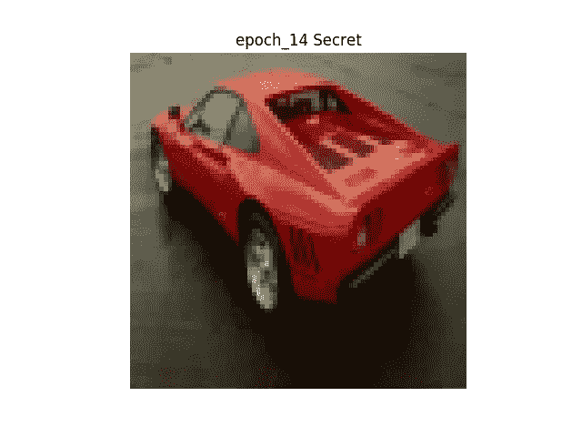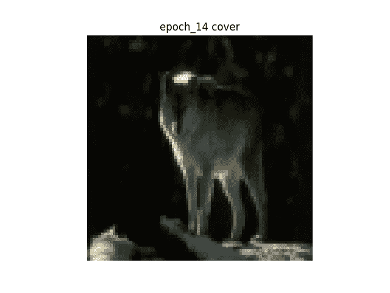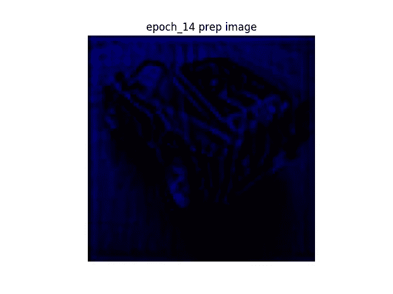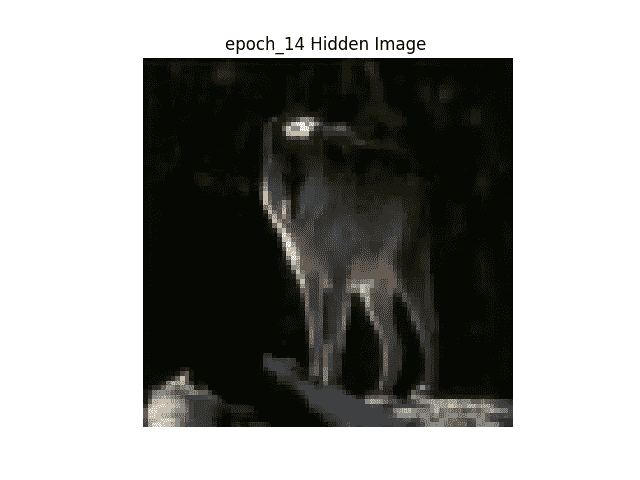

**左上图** →原秘密图
**右上图** →原封面图
**左下图** →准备图
**下中间图** →秘密+封面图
**右下图** →透露图

如上所述，该网络做得非常好，不仅隐藏了封面图像中的秘密图像，还揭示了它们。然而，在有些情况下，网络未能做到这一点。

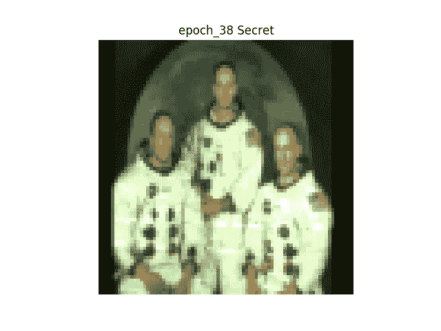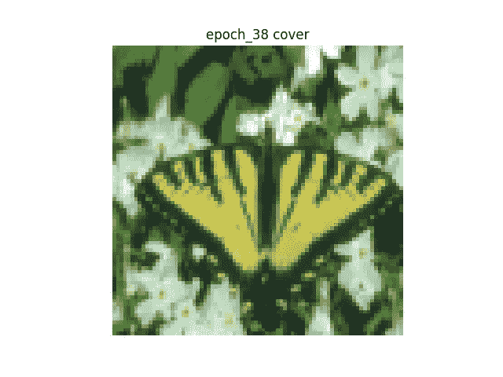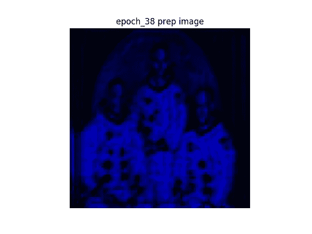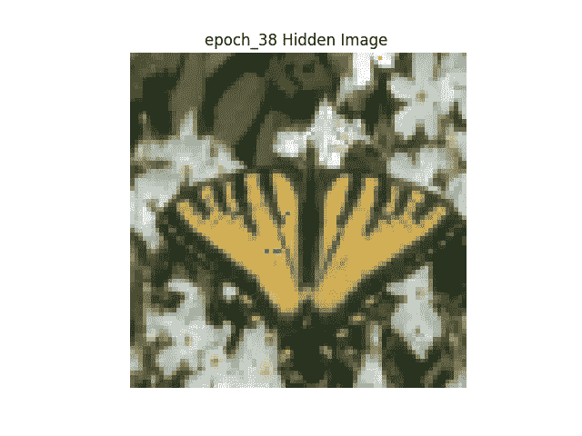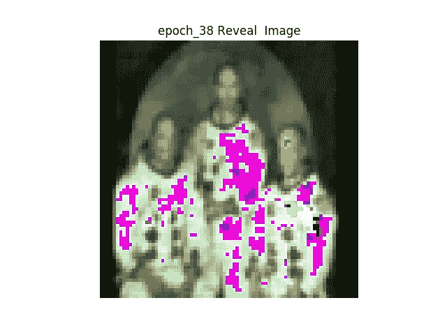

**左上图** →原秘密图
**右上图** →原封面图
**左下图** →准备图
**下中间图** →秘密+封面图
**右下图** →揭露图

如上所述，当图像包含各种不同的颜色时，显示的图像非常失真。

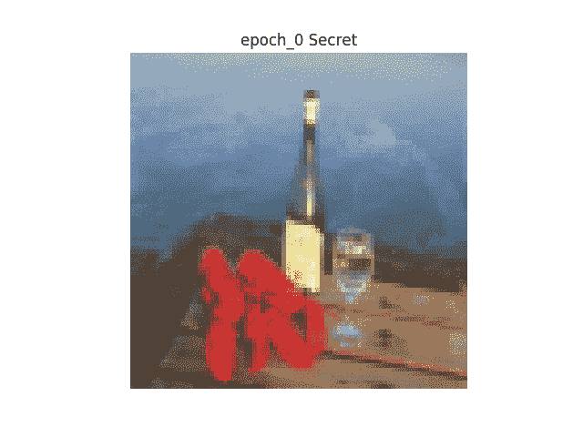

**左图** →网络如何走向终结的汇编
**右图** →网络如何随着时间的推移而走向终结的汇编

以上是网络在最后一个时期以及随着时间的推移如何工作的汇编，随着训练的继续(通过增加时期可以看到)，我们可以看到网络在隐藏图像方面做得更好。

**结果(扩张反向传播)**

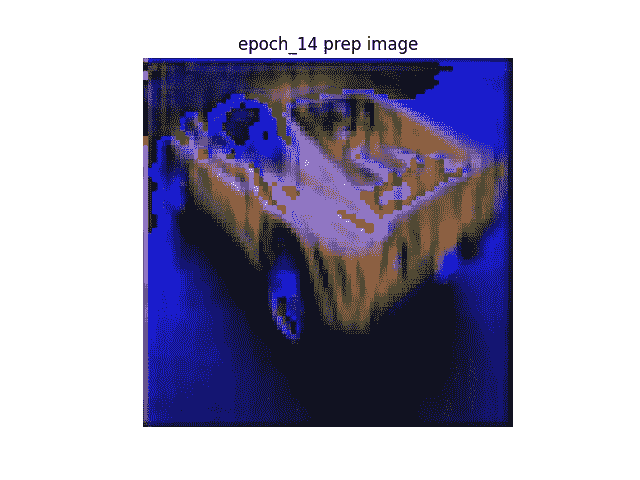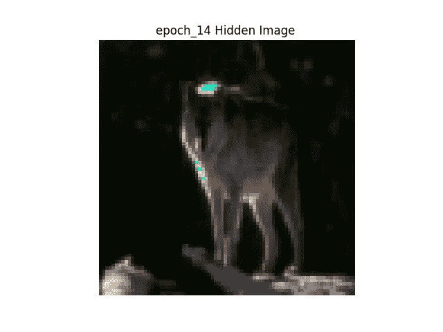

**左上图** →原秘密图
**右上图** →原封面图
**左下图** →准备图
**下中间图** →秘密+封面图
**右下图** →透露图

随着足够的时代扩大反向传播做了很好的隐藏图像。然而，类似于自动区分，也存在网络不能很好地运行的情况。

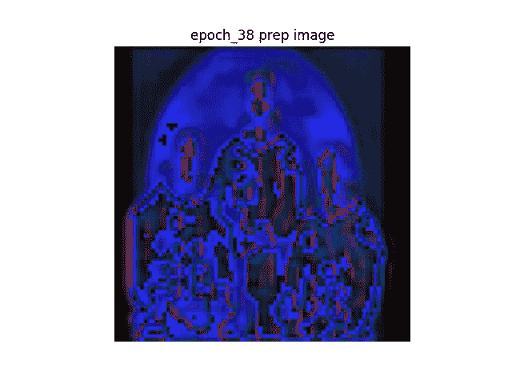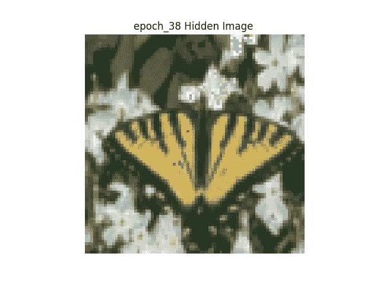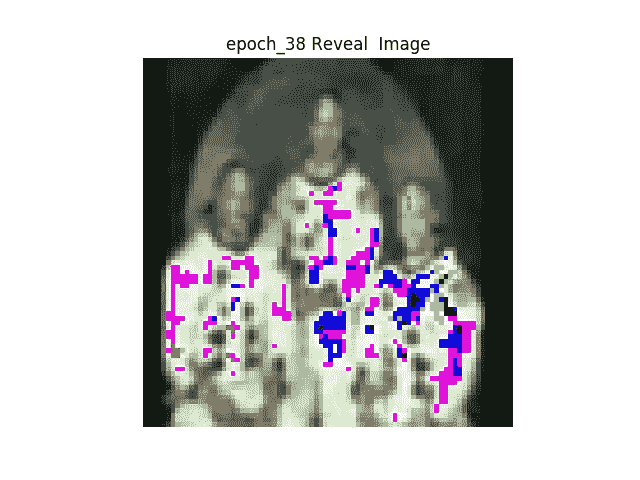

**左上图** →原秘密图
**右上图** →原封面图
**左下图** →预备图
**下中间图** →秘密+封面图
**右下图** →已曝光图

以上是网络性能不佳时的完全相同的情况。

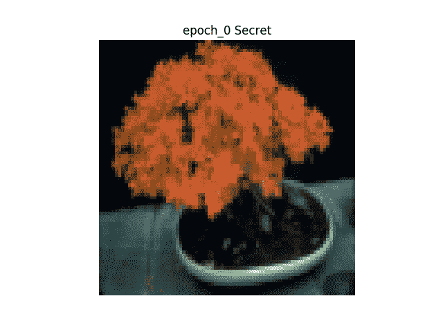

**左 GIF** →汇编网络如何在它的最后时代
**右 GIF** →汇编网络如何随着时间的推移

以上是网络在最后一个时期以及随着时间的推移如何工作的汇编，随着训练的继续(通过增加时期可以看到)，我们可以看到网络在隐藏图像方面做得更好。

**交互代码**

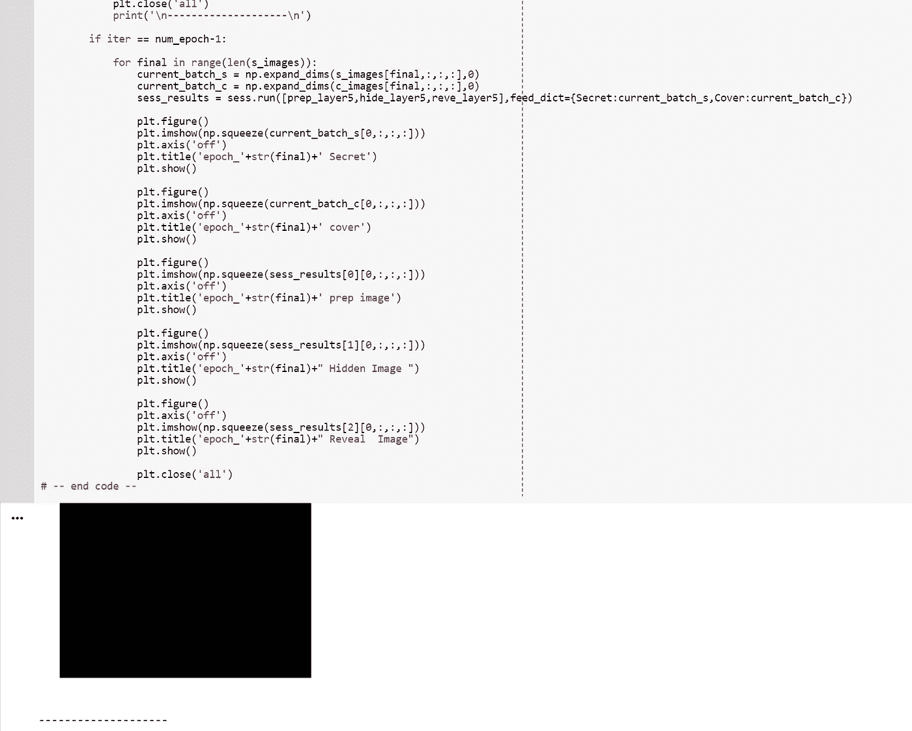

*对于谷歌实验室，你需要一个谷歌帐户来查看代码，你也不能在谷歌实验室运行只读脚本，所以在你的操场上做一个副本。最后，我永远不会请求允许访问你在 Google Drive 上的文件，仅供参考。编码快乐！*

请点击[进入](https://colab.research.google.com/drive/1lZt-7aM-osS9O4R_dUi5ea7MPjJnxC9D)扩张反向传播代码。
请点击[进入自动微分模型](https://colab.research.google.com/drive/1T-TGGJgSYNjs7K_Hg1ZQIsiCvl5jg4Pn)代码

如果您希望在本地设备上运行代码，请从这个[链接](http://www.ntu.edu.sg/home/asjfcai/Benchmark_Website/benchmark_index.html)下载数据集，并相应地更改 data_location(如下所示)变量。

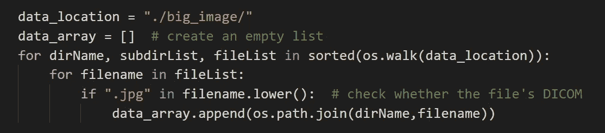

**透明度**

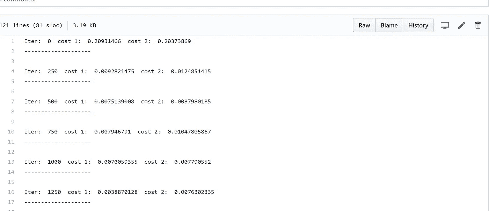

为了让这个实验更加透明，我把训练时产生的所有输出都上传到了我的 Gihub。恳求 [se 点击这里查看日志。](https://github.com/JaeDukSeo/Only_Numpy_Basic/blob/master/Steganography/hide_10000.txt)请点击此处[查看手动反向传播](https://github.com/JaeDukSeo/Only_Numpy_Basic/blob/master/Steganography/dilated.txt)日志。

**最后的话**

实际上，我在医学图像领域有一个非常有趣的用例，即将实现！

如果发现任何错误，请发电子邮件到 jae.duk.seo@gmail.com 给我，如果你想看我所有写作的列表，请在这里查看我的网站。

同时，在我的 twitter [这里](https://twitter.com/JaeDukSeo)关注我，并访问[我的网站](https://jaedukseo.me/)，或我的 [Youtube 频道](https://www.youtube.com/c/JaeDukSeo)了解更多内容。如果你感兴趣的话，我还做了解耦神经网络的比较。

**参考**

1.  导数双曲函数。(2018).Math2.org。检索于 2018 年 3 月 7 日，来自[http://math2.org/math/derivatives/more/hyperbolics.htm](http://math2.org/math/derivatives/more/hyperbolics.htm)
2.  tf.concat | TensorFlow。(2018).张量流。检索于 2018 年 3 月 7 日，来自[https://www.tensorflow.org/api_docs/python/tf/concat](https://www.tensorflow.org/api_docs/python/tf/concat)
3.  Tensorflow，a. (2018)。张量流中的加性高斯噪声。Stackoverflow.com。检索于 2018 年 3 月 7 日，来自[https://stack overflow . com/questions/41174769/additive-Gaussian-noise-in-tensor flow](https://stackoverflow.com/questions/41174769/additive-gaussian-noise-in-tensorflow)
4.  正态分布。(2018).Mathsisfun.com。检索于 2018 年 3 月 7 日，来自[https://www . mathsisfun . com/data/standard-normal-distribution . html](https://www.mathsisfun.com/data/standard-normal-distribution.html)
5.  [2]2018.【在线】。可用:[https://www . quora . com/How-can-l-visualize-cifar-10-data-RGB-using-python-matplotlib。](https://www.quora.com/How-can-l-visualize-cifar-10-data-RGB-using-python-matplotlib.)【访问时间:2018 年 3 月 7 日】。
6.  标准化数据/标准化。(2015).统计学如何？检索于 2018 年 3 月 8 日，来自 http://www.statisticshowto.com/normalized/
7.  s . balu ja(2017 年)。隐藏图像:深度隐写术。在*神经信息处理系统的进展*(第 2066–2076 页)。
8.  惠，L. (2018)。语义图像分割的基准。NTU . edu . SG . 2018 年 4 月 4 日检索，来自[http://www . NTU . edu . SG/home/asjfcai/Benchmark _ Website/Benchmark _ index . html](http://www.ntu.edu.sg/home/asjfcai/Benchmark_Website/benchmark_index.html)
9.  超越 Tensorflow 的默认自动微分优化器，具有交互式代码[手动…(2018).走向数据科学。检索于 2018 年 4 月 4 日，来自[https://towards data science . com/outpering-tensor flows-default-auto-difference-optimizer-with-interactive-code-manual-e587 a82d 340 e](/outperforming-tensorflows-default-auto-differentiation-optimizers-with-interactive-code-manual-e587a82d340e)
10.  Python 中的 DICOM:用 PyDICOM 和 VTK 将医学图像数据导入 NumPy。(2014).PyScience。2018 年 4 月 4 日检索，来自[https://pyscience . WordPress . com/2014/09/08/DICOM-in-python-importing-medical-image-data-into-numpy-with-pydicom-and-VTK/](https://pyscience.wordpress.com/2014/09/08/dicom-in-python-importing-medical-image-data-into-numpy-with-pydicom-and-vtk/)
11.  用不同的名称保存用 wget 下载的文件。(2018).电动工具箱。检索于 2018 年 4 月 4 日，来自[https://www . electric toolbox . com/wget-save-different-filename/](https://www.electrictoolbox.com/wget-save-different-filename/)