# 【NIPS 2017/Part 1】带交互代码的 OCR 选通递归卷积 NN【带 TF 的手动回推】

> 原文：<https://towardsdatascience.com/nips-2017-tensorflow-gated-recurrent-convolution-neural-network-for-ocr-part-1-with-47bb2a8a7ab3?source=collection_archive---------7----------------------->

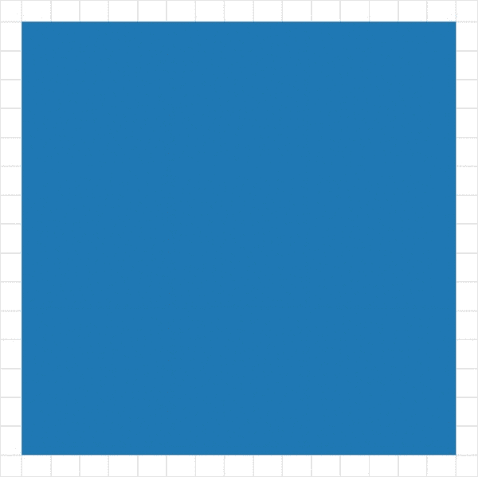

Gif from [here](https://giphy.com/gifs/fractals-noah-salvaterra-p7tJ6LVoxuEiA/download)

所以这是实现 G[gated 递归卷积神经网络](https://papers.nips.cc/paper/6637-gated-recurrent-convolution-neural-network-for-ocr.pdf)的第一部分。我将逐一介绍，所以今天让我们实现一个简单的递归卷积神经网络作为热身，并在 [MNIST 数据集上执行分类。](https://www.tensorflow.org/versions/r1.1/get_started/mnist/beginners)

最后，像往常一样，让我们比较手动[扩张反向传播](/outperforming-tensorflows-default-auto-differentiation-optimizers-with-interactive-code-manual-e587a82d340e)与自动微分相比的表现。

**网络架构(数学方程式形式)**


Screen Shot from [Paper](https://papers.nips.cc/paper/6637-gated-recurrent-convolution-neural-network-for-ocr.pdf)

因此，从上面我们可以看到，递归卷积神经网络与递归神经网络完全相同，但具有卷积运算而不是矩阵乘法。

**网络架构/前馈操作(图形形式)**

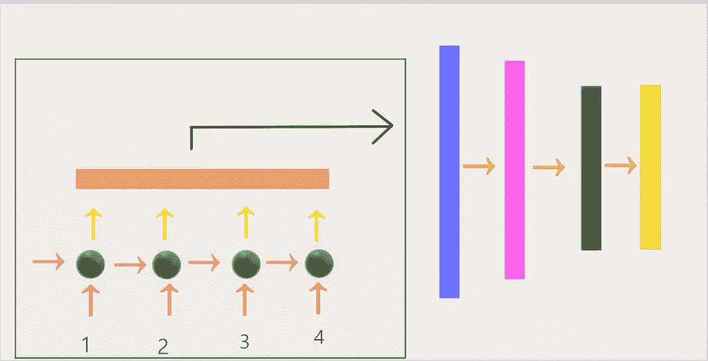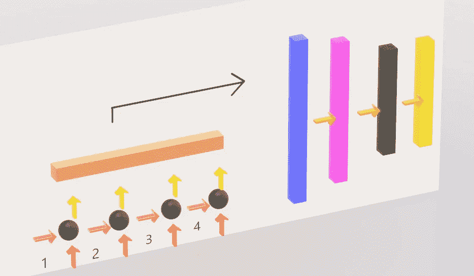

Left — Front View, Right — Side View

**绿框** →递归卷积神经网络(RCNN)部分提取特征
**红色箭头**→RCNN 的输入序列
**黄色箭头**→RCNN 的输出序列
**橙色矩形** →连接 RCNN 的特征空间(4 个时间戳)

**蓝色矩形** →全连接网络第一层
**粉色矩形** →全连接网络第二层
**黑色矩形** →全连接网络第三/最后一层
**黄色矩形** →全连接网络软最大层

所以我们的网络由两个不同的网络组成，第一部分是递归卷积神经网络来提取特征，第二部分是全连接神经网络来执行分类。

**输入数据/噪声生成(4 个时间戳)**

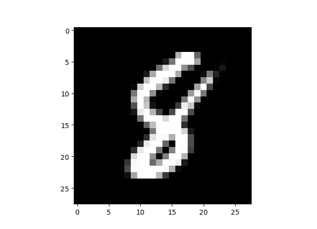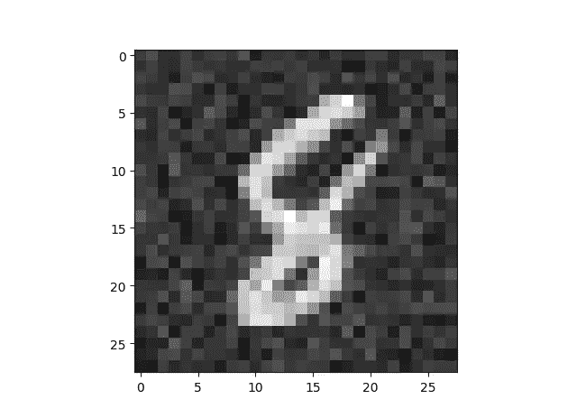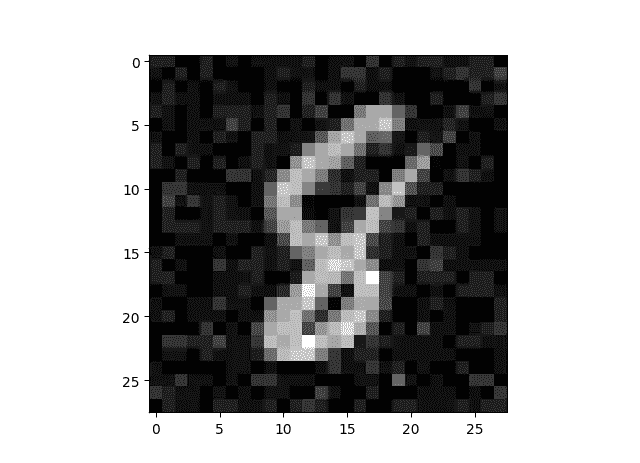

Left — Original, Middle — Gaussian, Right — Poisson

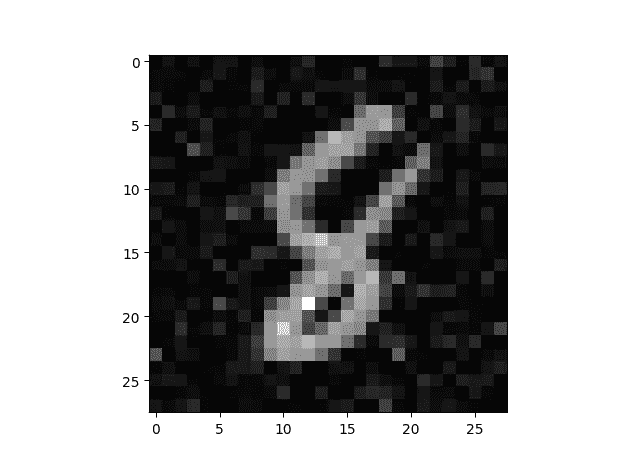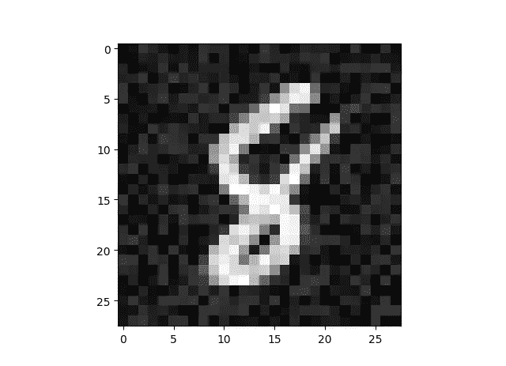

Left — Gamma , Right — Uniform

因此，对于递归卷积神经网络的 4 个输入图像，我们将向原始图像添加噪声，我们将向原始图像添加的噪声类型是[高斯噪声](https://en.wikipedia.org/wiki/Gaussian_noise)、[泊松噪声](https://en.wikipedia.org/wiki/Poisson_distribution)、[伽马噪声](https://en.wikipedia.org/wiki/Gamma_distribution)和[均匀噪声](https://en.wikipedia.org/wiki/Uniform_distribution_(continuous))。上面的图像显示了添加噪声后的结果。下面是几个例子。

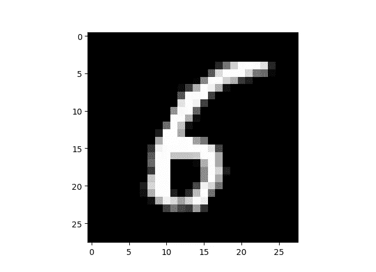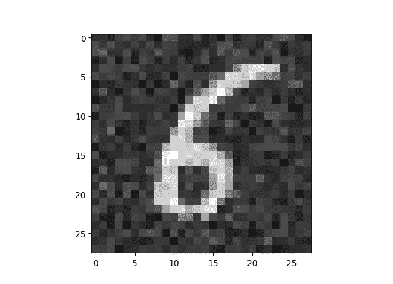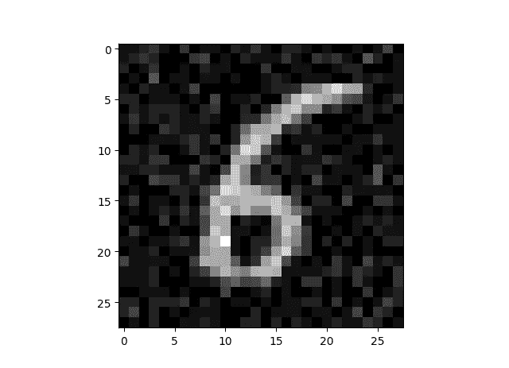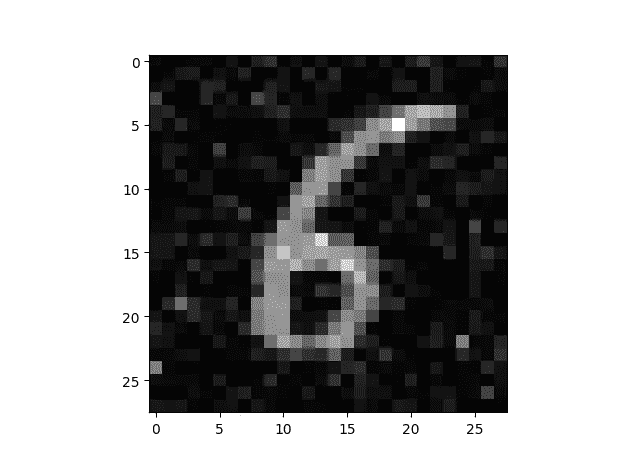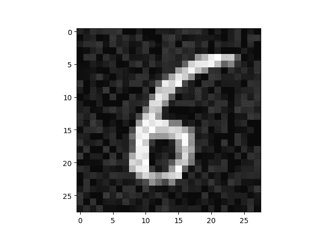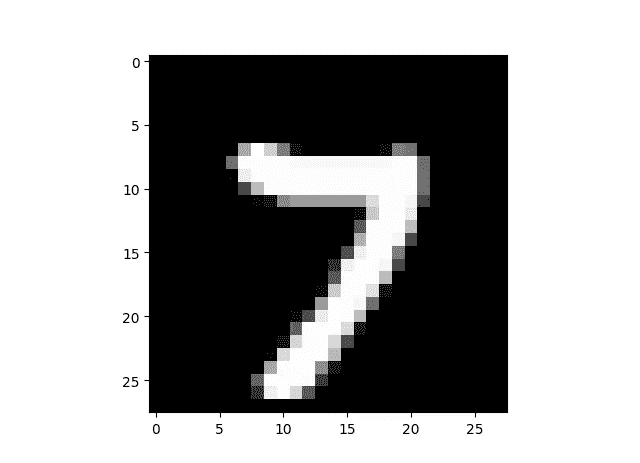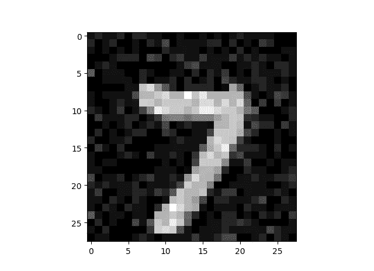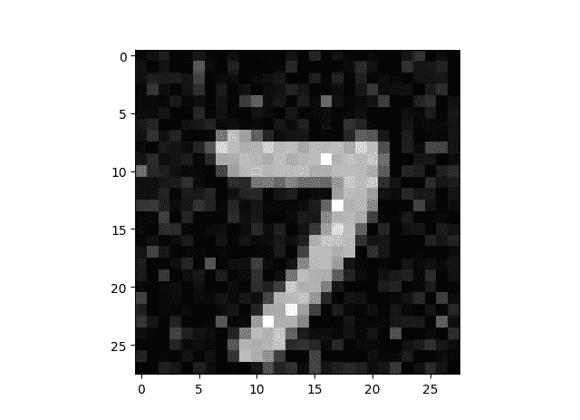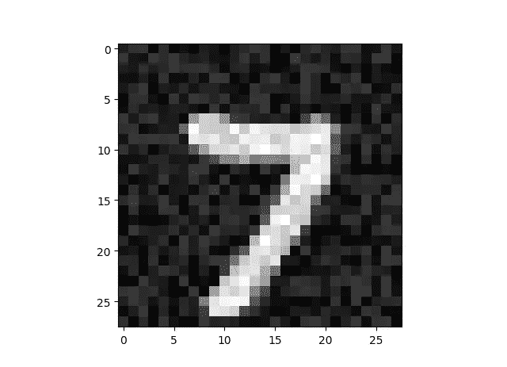

**测试案例/指示颜色**

```
**Case 0: Standard Manual Back Propagation with ADAM
Case 1: Auto Back Propagation with ADAM
Case 2: Dilated Back Propagation with ADAM Sparse Connection
Case 3: Dilated Back Propagation with ADAM Sparse Connection 2
Case 4: Dilated Back Propagation with ADAM Dense Connection 1
Case 5: Dilated Back Propagation with ADAM Dense Connection 2
Case 6: Dilated Back Propagation with ADAM Dense Connection 3**
```

如上所述，我们总共要比较七个案例。下面显示了每种情况下的每种颜色。

```
**Case 0: Red
Case 1: Green
Case 2: Blue
Case 3: Cyan
Case 4: Magenta
Case 5: Yellow
Case 6: Black**
```

**训练结果(本地结果)**

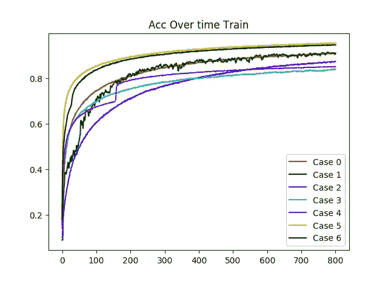

**左图** →训练图像上的时间成本
**右图** →训练图像上的时间精度

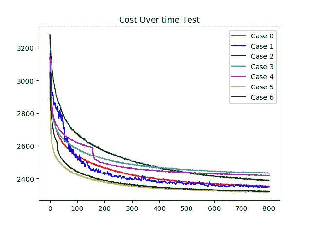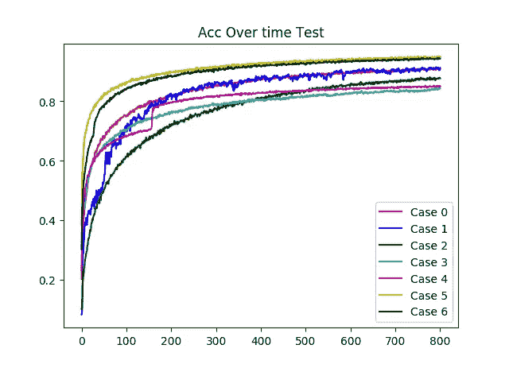

**左图** →测试图像随时间变化的成本
**右图** →测试图像随时间变化的精度
(请注意，我在着色上犯了一个错误，案例 1 和案例 2 交换了颜色)

非常有趣的是，观察到稀疏连接的扩张反向传播表现不佳，而密集连接的扩张反向传播表现不佳。

**透明度**

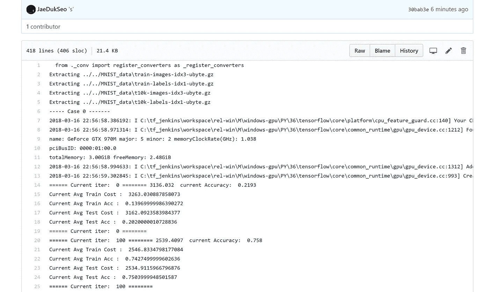

为了增加这个实验的透明度，我上传了在我的[笔记本电脑上运行这个程序时我的命令提示符的所有输出。](https://github.com/JaeDukSeo/Only_Numpy_Basic/blob/master/4_recurrent_CNN/LocalCMD_Results.txt)

**训练结果(试验 2)**

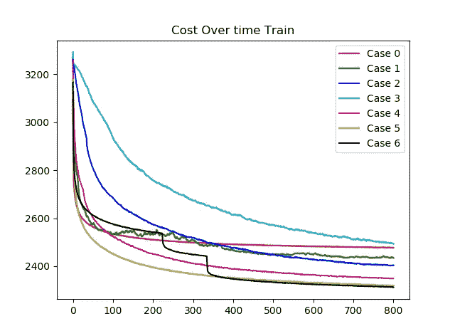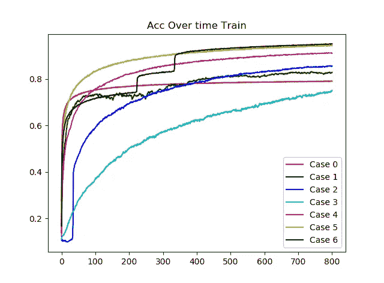

**左图** →训练图像上的时间成本
**右图** →训练图像上的时间精度

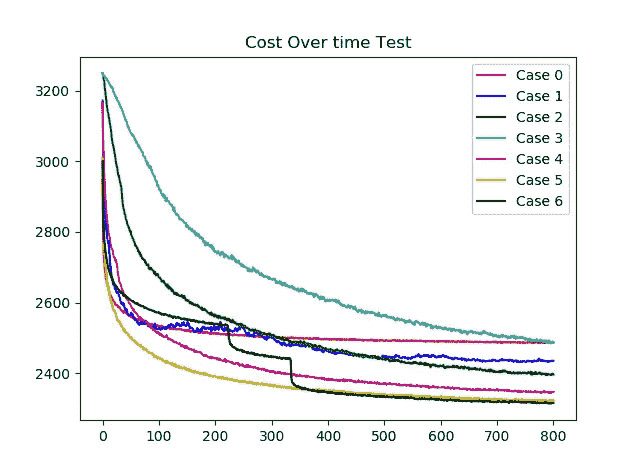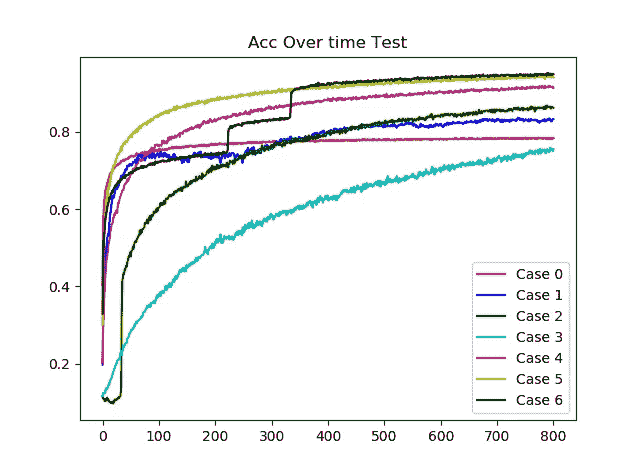

**左图** →测试图像随时间变化的成本
**右图** →测试图像随时间变化的精度
(请注意，我在着色上犯了一个错误，案例 1 和案例 2 的颜色发生了变化)

我们可以观察到，即使在第二次试验中，我们也能超越自动微分。为了增加这个实验的透明度，我上传了在我的[笔记本电脑上运行这个程序时我的命令提示符的所有输出。](https://github.com/JaeDukSeo/Only_Numpy_Basic/blob/master/4_recurrent_CNN/Transparcy2.txt)

**互动代码(Google Colab / Replt.it /微软 Azure)**

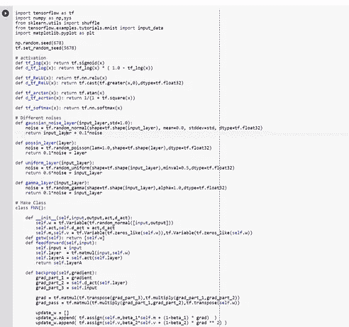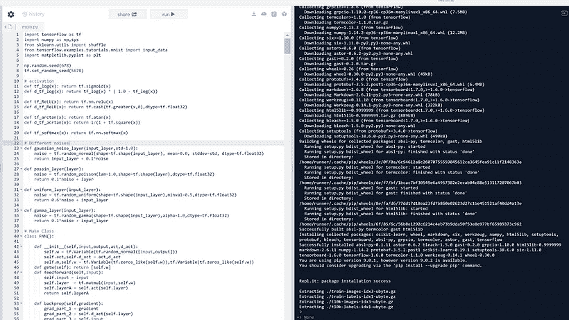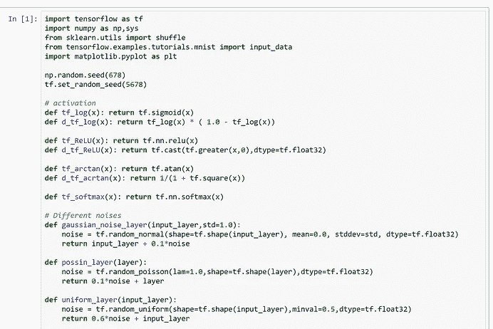

对于 Google Colab，你需要一个 Google 帐户来查看代码，而且你不能在 Google Colab 中运行只读脚本，所以在你的操场上复制一份。最后，我永远不会请求允许访问你在 Google Drive 上的文件，仅供参考。编码快乐！

要访问 [Google Colab 上的代码，请点击这里](https://colab.research.google.com/drive/1YsaZGqrdp8L2BBrVtzfFRE6CnmARgO7f)。
要访问 [Repl 上的代码，请点击此处](https://repl.it/@Jae_DukDuk/30-Recurrent-Convolutional-Neural-Network)。
要访问 [Microsoft Azure 笔记本上的代码，请单击此处。](https://rcnn-jaedukseo.notebooks.azure.com/nb/notebooks/RCNN.ipynb)

**最后的话**

在下一部分，我们将涵盖门控递归卷积神经网络。

如果发现任何错误，请发电子邮件到 jae.duk.seo@gmail.com 给我，如果你想看我所有写作的列表，请[在这里查看我的网站](https://jaedukseo.me/)。

与此同时，请在我的 twitter [这里](https://twitter.com/JaeDukSeo)关注我，并访问[我的网站](https://jaedukseo.me/)，或我的 [Youtube 频道](https://www.youtube.com/c/JaeDukSeo)了解更多内容。如果你感兴趣，我也在这里做了解耦神经网络[的比较。](https://becominghuman.ai/only-numpy-implementing-and-comparing-combination-of-google-brains-decoupled-neural-interfaces-6712e758c1af)

**参考**

1.  适合 ML 初学者的 MNIST。(2018).张量流。检索于 2018 年 3 月 15 日，来自[https://www . tensor flow . org/versions/r 1.1/get _ started/mnist/初学者](https://www.tensorflow.org/versions/r1.1/get_started/mnist/beginners)
2.  适合 ML 初学者的 MNIST。(2018).张量流。检索于 2018 年 3 月 15 日，来自[https://www . tensor flow . org/versions/r 1.1/get _ started/mnist/初学者](https://www.tensorflow.org/versions/r1.1/get_started/mnist/beginners)
3.  王军，胡小玲(2017)。用于光学字符识别的门控递归卷积神经网络。在*神经信息处理系统的进展*(第 334-343 页)。
4.  导数表。(2018).Math.com。检索于 2018 年 3 月 15 日，来自[http://www.math.com/tables/derivatives/tableof.htm](http://www.math.com/tables/derivatives/tableof.htm)
5.  tf.atan | TensorFlow。(2018).张量流。检索于 2018 年 3 月 15 日，来自[https://www.tensorflow.org/api_docs/python/tf/atan](https://www.tensorflow.org/api_docs/python/tf/atan)
6.  Tensorflow，a. (2018)。张量流中的加性高斯噪声。Stackoverflow.com。检索于 2018 年 3 月 16 日，来自[https://stack overflow . com/questions/41174769/additive-Gaussian-noise-in-tensor flow](https://stackoverflow.com/questions/41174769/additive-gaussian-noise-in-tensorflow)
7.  tf.reshape | TensorFlow。(2018).张量流。检索于 2018 年 3 月 16 日，来自 https://www.tensorflow.org/api_docs/python/tf/reshape
8.  “Tf。Random_Gamma | Tensorflow”。2018.张量流。2018 年 3 月 16 日访问。[https://www.tensorflow.org/api_docs/python/tf/random_gamma](https://www.tensorflow.org/api_docs/python/tf/random_gamma)。
9.  tf.stack？，W. (2018)。为什么我会使用 tf.concat 而不是 tf.stack？。Stackoverflow.com。检索于 2018 年 3 月 16 日，来自[https://stack overflow . com/questions/41534593/why-would-I-ever-use-TF-concat-instead-of-TF-stack](https://stackoverflow.com/questions/41534593/why-would-i-ever-use-tf-concat-instead-of-tf-stack)
10.  “梯度下降优化算法概述”。2016.塞巴斯蒂安·鲁德。2018 年 3 月 16 日访问。[http://ruder.io/optimizing-gradient-descent/](http://ruder.io/optimizing-gradient-descent/)。
11.  “Tf。nn . conv 2d _ back prop _ Input | tensor flow "。2018.张量流。2018 年 3 月 16 日访问。[https://www . tensor flow . org/API _ docs/python/TF/nn/conv2d _ back prop _ input](https://www.tensorflow.org/api_docs/python/tf/nn/conv2d_backprop_input)。
12.  “Tf。Reset_Default_Graph |张量流"。2018.张量流。2018 年 3 月 17 日访问。[https://www . tensor flow . org/API _ docs/python/TF/reset _ default _ graph](https://www.tensorflow.org/api_docs/python/tf/reset_default_graph)。
13.  “指定颜色— Matplotlib 2.0.2 文档”。2018.Matplotlib.Org。2018 年 3 月 17 日访问。[https://matplotlib.org/users/colors.html](https://matplotlib.org/users/colors.html)
14.  高斯噪声。(2018).En.wikipedia.org。检索于 2018 年 3 月 17 日，来自[https://en.wikipedia.org/wiki/Gaussian_noise](https://en.wikipedia.org/wiki/Gaussian_noise)
15.  泊松分布。(2018).En.wikipedia.org。检索于 2018 年 3 月 17 日，来自[https://en.wikipedia.org/wiki/Poisson_distribution](https://en.wikipedia.org/wiki/Poisson_distribution)
16.  伽玛分布。(2018).En.wikipedia.org。检索于 2018 年 3 月 17 日，来自 https://en.wikipedia.org/wiki/Gamma_distribution
17.  均匀分布(连续)。(2018).En.wikipedia.org。检索于 2018 年 3 月 17 日，来自[https://en . Wikipedia . org/wiki/Uniform _ distribution _(continuous)](https://en.wikipedia.org/wiki/Uniform_distribution_(continuous))
18.  JaeDukSeo/Only_Numpy_Basic。(2018).GitHub。检索于 2018 年 3 月 17 日，来自[https://github . com/JaeDukSeo/Only _ Numpy _ Basic/blob/master/4 _ recurrent _ CNN/local cmd _ results . txt](https://github.com/JaeDukSeo/Only_Numpy_Basic/blob/master/4_recurrent_CNN/LocalCMD_Results.txt)