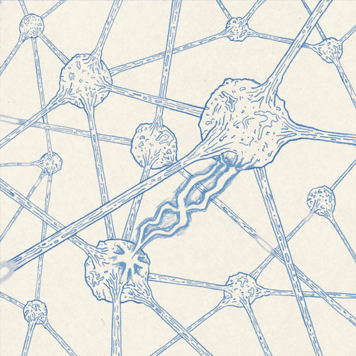
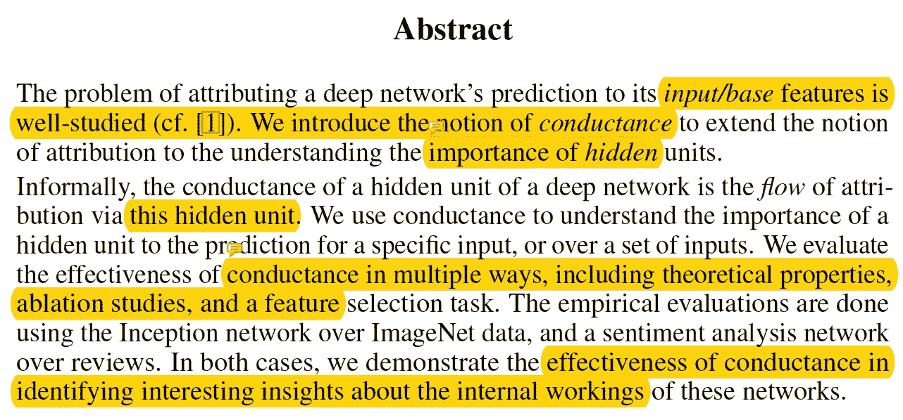
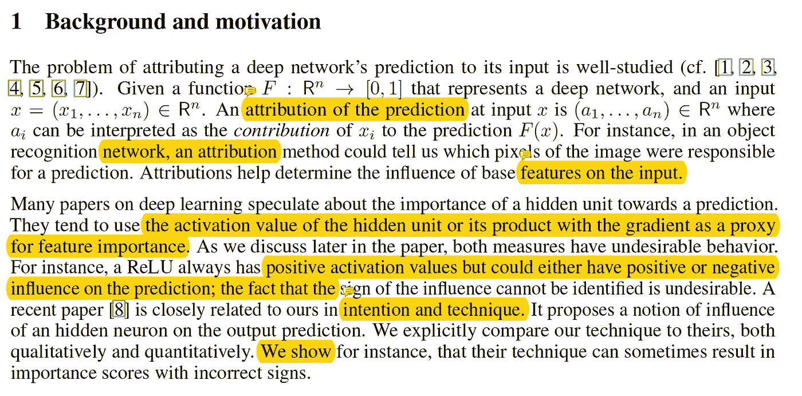
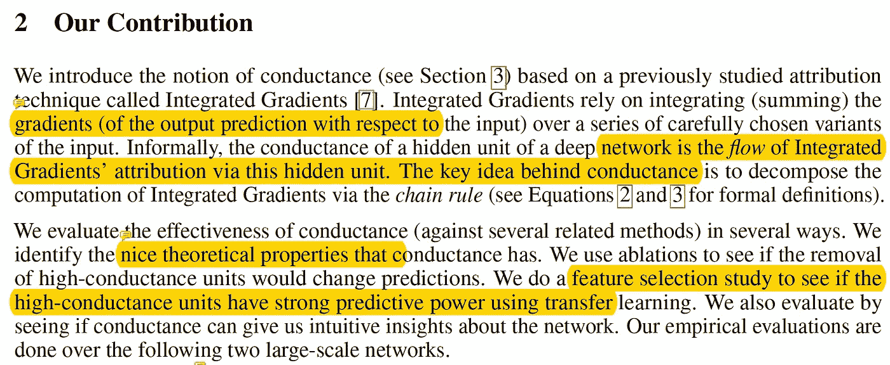
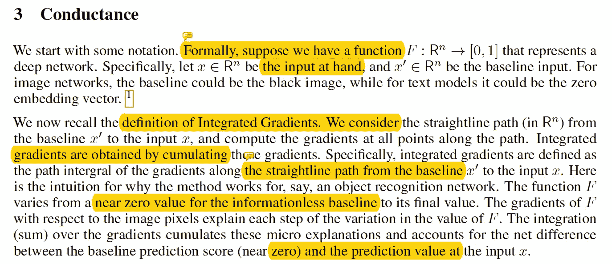
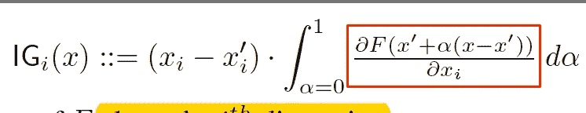
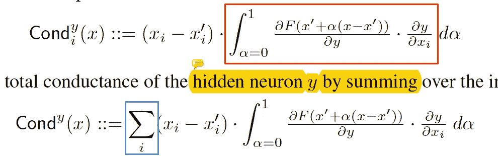
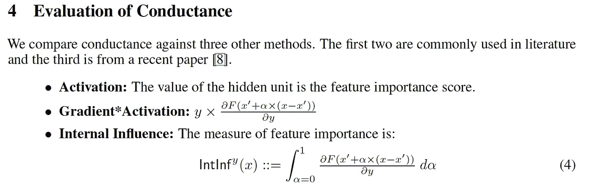
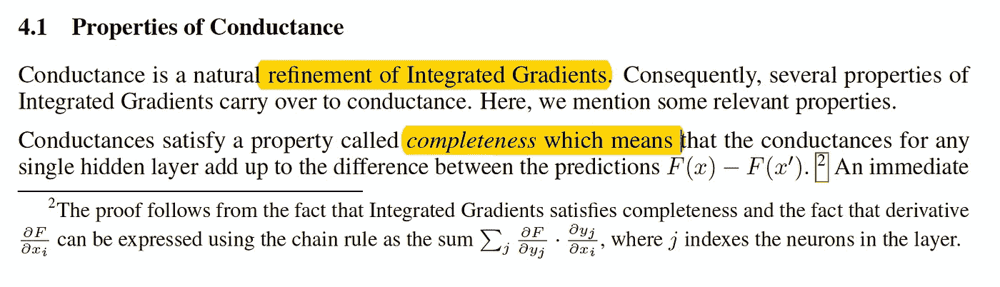

# 【NIPS2018/ Google /论文摘要】一个神经元有多重要？

> 原文：<https://towardsdatascience.com/nips2018-google-paper-summary-how-important-is-a-neuron-3de4b085eb03?source=collection_archive---------5----------------------->

Gif from this [website](https://giphy.com/gifs/l3vRcrVqhBVSpJte0)

我们如何衡量网络内部隐藏单元的重要性？测量网络内部活动的最常用方法是测量每个神经元的激活值。这是衡量重要性的最佳方法吗？本文介绍并研究了电导的概念。

> **请注意，这个帖子是给未来的自己看的，用来回顾和复习资料，不用再读一遍整篇论文。**

**摘要**

在这一节中，作者介绍了术语电导，以扩展归因的概念，理解隐藏单元的重要性。电导可以理解为隐藏层内部的属性流。我对电导的简单理解是“隐藏单元如何处理来自先前输入的输入数据，从而得到最终预测”。

**背景和动机**

作者决定写这个主题有几个背景/原因

1.  大多数论文通过测量隐藏单元的激活值或梯度来评估隐藏单元的重要性。(而且这种方法有一些不良后果，将在后面讨论。)
2.  测量隐藏单元的重要性的另一种方法是基于优化的方法。也就是说，手动将输入图像调整到网络中，以优化神经元的激活。然而，这些方法不能识别隐藏单元的重要性，也不能保证所有适当的隐藏单元都被这种方法研究。
3.  衡量重要性的第三种方法是首先识别隐藏单元中的功能，并重建一个更简单的网络。然而，这种方法不能保证新模型中隐藏单元的影响与原始模型完全相同。
4.  最后，最后一种方法是将人类定义的概念作为输入，并识别哪些隐藏的神经元对这些特征做出响应。这种方法的主要问题是网络具有与人类固有不同的表现形式。并且可能无法识别某些预测的所有重要概念。

与上述所有方法相比，作者决定看看网络自身的抽象(过滤器)。因此，对人类来说，这种解释可能不太直观，但整个预测过程都得到了解释。

我们(作者)的贡献

作者的所有贡献可以用一个词“电导”来表达。这实际上是基于另一个叫做积分梯度的想法。综合梯度是对一系列精心选择的输入变量的梯度求和的过程。非正式地，电导可以定义为积分梯度的流动，电导背后的关键思想是通过链规则分解积分梯度的计算。

作者研究了两种不同网络的电导。一个是著名的基于 mageNet 数据的 inception 网络架构。另一个是来自[尹金](https://www.linkedin.com/in/yoonrkim/)一个[卷积神经网络用于句子分类](http://www.aclweb.org/anthology/D14-1181)。(今天我只看盗梦空间网络。)

**电导**

在这一节中，作者介绍了电导的正式数学概念。在继续之前，作者定义了基本输入和输入的概念。

> “假设 x 是手边的输入，x `是基线输入。对于图像网络，基线可以是黑色图像，而对于文本模型，基线可以是零嵌入向量”

如果我们考虑一条从 x '到 x 的直线路径(我将此理解为一种变换)，并计算沿着该路径的所有点的梯度，则可以通过对所有梯度求和来获得积分梯度。积分梯度的形式如下所示。

**红框** →输入 x 的积分(第 I 个维度)

既然我们已经看到了积分梯度的定义，现在让我们看看电导是如何数学定义的。

**红框** →对隐藏神经元 y 和链式法则的积分
**蓝框** →对隐藏单元内所有维度的积分求和

如上所述，我们可以清楚地看到两个方程的相似之处。两者之间的主要区别是，我们对变量进行积分。(同样，我们可以将此视为通过链式法则分解积分梯度的过程。)

**电导的评估**

在这里，作者将电导与机器学习(ML)社区中广泛使用的其他三种不同方法进行了比较。第一种方法已经是非常众所周知的方法，当测量一个隐藏单元有多重要时，第二种方法是当我们另外乘以梯度时。而最后一种方法是从本文介绍的*深度卷积网络的影响导向解释。*

***神经网络的电导/饱和/极性/灵敏度特性***

**

*在这一节中，作者讨论了电导的一些基本性质。*

1.  ***完整性** →任何单一隐藏层的电导加起来就是预测之间的差异*
2.  ***逐层守恒原理** →网络的输出活动通过 DNN 的各层完全重新分配到输入变量上，即正负证据都不会丢失*
3.  ***线性** →数学关系或函数的属性，这意味着它可以用直线[来表示](https://en.wikipedia.org/wiki/Line_(geometry))*
4.  ***不敏感** →如果改变一个隐藏单元的值不改变网络的预测，它的电导为零。如果改变输入不改变隐藏单元的值，则隐藏单元的电导为零。*

*接下来作者讨论了电导如何克服神经元饱和的问题。基本上，类似于内部影响，电导法取 0 和 1 之间的积分，克服了这个问题。(我不是 100%确定这种方法如何克服饱和神经元的问题，我将阅读论文“深度网络的公理化归属”并回来讨论此事。)最后，作者描述了其他方法所具有的不良特性。*

***激活方法** →有影响的属性与输出符号不一致。例如，ReLU()激活函数只能具有正值，但是 ReLU 节点可以根据上游权重对输出产生积极或消极的影响。*

***梯度*激活** →具有超调特性，其中具有零影响的神经元可以被分配高重要性分数。*

***内部影响** →具有与输出符号不一致的影响属性。*

***将电导应用于对象识别模型/消融研究***

**

*在本节中，作者使用电导来识别初始网络隐藏层中有影响的过滤器。如上所述，作者发现在执行分类任务时，一些过滤器被一个或多个图像共享。(左边是检测眩光的滤镜，右边是检测红色的滤镜。)*

*接下来，作者们进行了消融(删除)研究，他们想看看为了让模型改变它的预测，需要丢弃(删除)多少这些重要的过滤器。他们发现，网络平均去除 3.7 次就足以改变它对一幅图像的预测。与内部影响相比，电导给出了较小的数字，这意味着电导能够有效地识别最重要的过滤器。*

*最后，请注意还有最后一节(**将电导应用于情感模型**)以及作者做的一个额外实验**(特征选择研究)**。然而，我的笔记本电脑快没电了，所以我现在不做总结。*

***遗言***

*我发现这张纸上展示的材料非常坚硬。但是一个惊人的事实让我吃惊，我记得我做了另一篇论文的论文摘要，叫做“对基于反向传播的可视化的复杂行为的理论解释”。我记得那篇论文的主旨是，如果我们想了解网络内部发生了什么，我们需要按照事物(梯度或显著图)的本来面目来看待它，而不是试图修改它，让人类看起来更愉快。这篇论文似乎也有类似的论点。*

*如果发现任何错误，请发电子邮件到 jae.duk.seo@gmail.com 给我，如果你想看我所有写作的列表，请在这里查看我的网站。*

*同时，在我的 twitter [这里](https://twitter.com/JaeDukSeo)关注我，并访问[我的网站](https://jaedukseo.me/)，或我的 [Youtube 频道](https://www.youtube.com/c/JaeDukSeo)了解更多内容。我还实现了[广残网，请点击这里查看博文 pos](https://medium.com/@SeoJaeDuk/wide-residual-networks-with-interactive-code-5e190f8f25ec) t。*

***参考***

1.  *Dhamdhere，m . Sundararajan 和 q . Yan(2018 年)。一个神经元有多重要？。Arxiv.org。检索于 2018 年 6 月 3 日，来自[https://arxiv.org/abs/1805.12233](https://arxiv.org/abs/1805.12233)*
2.  *ImageNet。(2018).Image-net.org。检索于 2018 年 6 月 3 日，来自 http://www.image-net.org/*
3.  *(2018).Aclweb.org。检索于 2018 年 6 月 3 日，来自 http://www.aclweb.org/anthology/D14-1181*
4.  *:Anon，(2018)。[在线]可在:[https://www.linkedin.com/in/yoonrkim/](https://www.linkedin.com/in/yoonrkim/)[2018 年 6 月 3 日访问]。*
5.  *为基于反向传播的复杂行为提供了理论解释。(2018).走向数据科学。检索于 2018 年 6 月 3 日，来自[https://towards data science . com/paper-summary-a-theoretical-explain-behaviors-of-back-propagation-based-220083 D7 dddd](/paper-summary-a-theoretical-explanation-for-perplexing-behaviours-of-back-propagation-based-220083d7dddd)*
6.  *雷诺，k .，李，l .，森，s .，，M. (2018)。深层卷积网络的影响导向解释。Arxiv.org。检索于 2018 年 6 月 3 日，来自[https://arxiv.org/abs/1802.03788](https://arxiv.org/abs/1802.03788)*
7.  *线性。(2018).En.wikipedia.org。检索于 2018 年 6 月 3 日，来自[https://en.wikipedia.org/wiki/Linearity](https://en.wikipedia.org/wiki/Linearity)*
8.  *Sundararajan，m .，Taly，a .，和 Yan，Q. (2017 年)。深度网络的公理化属性。Arxiv.org。检索于 2018 年 6 月 3 日，来自[https://arxiv.org/abs/1703.01365](https://arxiv.org/abs/1703.01365)*