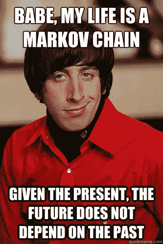

# 有趣的 NLG—自动标题生成器

> 原文：<https://towardsdatascience.com/nlg-for-fun-automated-headlines-generator-6d0459f9588f?source=collection_archive---------4----------------------->


Image Courtesy: [https://pixabay.com/en/texture-handwriting-s%C3%BCtterlin-1362879/](https://pixabay.com/en/texture-handwriting-s%C3%BCtterlin-1362879/)

自然语言生成是我们这个时代要探索的一个非常重要的领域。它形成了机器人如何交流的基础——不像文人如何写书，而是像我们如何交谈。在这个内核中，我将向您展示一个非常简单但功能强大的 Python 模块，它用几行代码就完成了类似的工作。

模块:马克维奇

我们这里用的 Py 模块是`[markovify](https://github.com/jsvine/markovify)`。

**马科维奇的描述:**

Markovify 是一个简单的，可扩展的马尔可夫链生成器。目前，它的主要用途是建立大型文本语料库的马尔可夫模型，并从中生成随机句子。但是，理论上，它可以用于其他应用。

**关于数据集:**

这包括 ABC 网站在给定时间范围内发布的全部文章。每天 200 篇文章的量和对国际新闻的良好关注，我们可以相当肯定地说，每一个重大事件都在这里被捕获。这个数据集可以从 [Kaggle 数据集](https://www.kaggle.com/therohk/million-headlines/data)下载。

# 关于马尔可夫链的小知识

> 马尔可夫链以安德烈·马尔可夫命名，是从一种“状态”(一种情况或一组值)跳到另一种状态的数学系统。例如，如果你为一个婴儿的行为建立一个马尔可夫链模型，你可以包括“玩”、“吃”、“睡觉”和“哭”作为状态，这些状态和其他行为一起可以形成一个“状态空间”:一个所有可能状态的列表。此外，在状态空间的顶部，马尔可夫链告诉你从一个状态跳跃或“过渡”到任何其他状态的可能性——例如，当前正在玩耍的婴儿在接下来的五分钟内睡着而没有先哭的可能性。

在 Victor Powell 的互动文章中阅读更多关于马尔可夫链如何工作的信息



# 加载所需的包

```
import pandas as pd *# data processing, CSV file I/O (e.g. pd.read_csv)*
import markovify *#Markov Chain Generator*
*# Any results you write to the current directory are saved as output.*
```

# 读取输入文本文件

```
inp = pd.read_csv('../input/abcnews-date-text.csv')inp.head(3)publish_date headline_text
020030219 aba decides against community broadcasting lic…
120030219 act fire witnesses must be aware of defamation
220030219a g calls for infrastructure protection summit
```

# 用马尔可夫链建立文本模型

```
text_model = markovify.NewlineText(inp.headline_text, state_size = 2)
```

# 是时候享受自动生成的标题了

```
*# Print five randomly-generated sentences*
for i **in** range(5):
    print(text_model.make_sentence())iron magnate poised to storm cleanup
meet the png government defends stockdale appointment
the twitter exec charged with animal cruelty trial
pm denies role in pregnancy
shoalhaven business boosts hunter
```

现在，这段文字可以成为 Twitter 机器人、Slack 机器人甚至是恶搞博客的输入。这才是重点。

参考资料:

1.  [Github 回购](https://github.com/amrrs/nlg_for_fun)
2.  [Kaggle 内核](https://www.kaggle.com/nulldata/nlg-for-fun-automated-headlines-generator/notebook)
3.  [马尔可夫链直观解释](http://setosa.io/ev/markov-chains/)
4.  [输入数据集](https://www.kaggle.com/therohk/million-headlines/data)