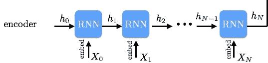
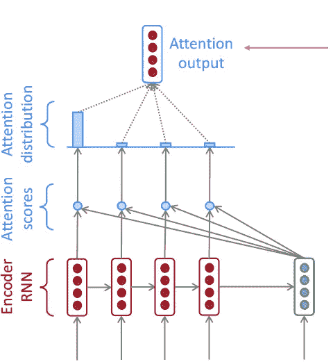
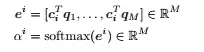
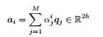
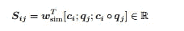
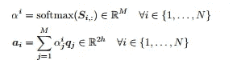
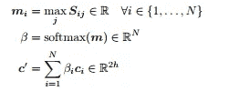
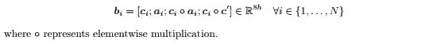

# NLP —构建问题回答模型

> 原文：<https://towardsdatascience.com/nlp-building-a-question-answering-model-ed0529a68c54?source=collection_archive---------0----------------------->

*用数据做酷事！*

我最近在斯坦福大学通过深度学习(CS224N)完成了一门关于 NLP 的课程，我很喜欢这种体验。学到了一大堆新东西。在我的最后一个项目中，我设计了一个基于[斯坦福问答数据集(SQuAD)](https://rajpurkar.github.io/SQuAD-explorer/) 的问答模型。在这篇博客中，我想介绍问答模型的主要组成部分。

你可以在我的 [Github](https://github.com/priya-dwivedi/cs224n-Squad-Project) repo 上找到完整的代码。

我最近还为这个模型添加了一个[网络演示](http://deeplearninganalytics.org/demos)，你可以放入任何段落并提出相关问题。查看[链接](http://deeplearninganalytics.org/demos)

**小队数据集**

S**S**tanford**Qu**estion**A**nswering**D**ataset([SQuAD](https://rajpurkar.github.io/SQuAD-explorer/))是一个新的阅读理解数据集，由一组维基百科文章上的众包工作者提出的问题组成，其中每个问题的答案都是相应阅读文章的一段文字，或 *span* 。SQuAD 拥有 500+篇文章上的 100，000+问答对，比以前的阅读理解数据集大得多。

在 SQuAD 数据集上有了快速的进步，一些最新的模型在回答问题的任务中达到了人类水平的准确性！

上下文、问题和答案的示例

背景——阿波罗计划从 1961 年运行到 1972 年，并得到了从 1962 年到 1966 年与它同时运行的双人双子座计划的支持。双子座任务开发了一些太空旅行技术，这些技术对于阿波罗任务的成功是必要的。阿波罗使用土星家族火箭作为发射工具。阿波罗/土星飞行器也被用于阿波罗应用计划，该计划包括天空实验室，这是一个在 1973-74 年支持三次载人任务的空间站，以及阿波罗-联盟测试项目，这是 1975 年与苏联的联合地球轨道任务。

问:在 1973-1974 年间，哪个空间站支持了三次载人任务？

答案——天空实验室

小队的主要特征:

I)它是一个封闭的数据集，意味着问题的答案总是上下文的一部分，也是上下文的连续跨度

ii)因此找到答案的问题可以简化为找到对应于答案的上下文的开始索引和结束索引

iii) 75%的答案长度小于等于 4 个单词

# **机器理解模型—关键部件**

**i)嵌入层**

模型的训练数据集由上下文和相应的问题组成。这两者都可以被分解成单独的单词，然后使用像[手套](https://nlp.stanford.edu/projects/glove/)向量这样的预训练向量将这些单词转换成单词嵌入。要了解更多关于单词嵌入的知识，请查看我的文章。单词嵌入在捕捉单词周围的上下文方面比对每个单词使用一个热点向量要好得多。对于这个问题，我使用了 100 维手套词嵌入，并且在训练过程中没有调整它们，因为我们没有足够的数据。

**ii)编码器层**

RNN Encoder

我们在模型中添加的下一层是基于 RNN 的编码器层。我们希望上下文中的每个单词都知道它前面和后面的单词。双向的 GRU/LSTM 可以帮助做到这一点。RNN 的输出是向前和向后方向的一系列隐藏向量，我们将它们连接起来。类似地，我们可以使用相同的 RNN 编码器来创建问题隐藏向量。

**iii)关注层**

到目前为止，我们有一个上下文的隐藏向量和一个问题的隐藏向量。要找到答案，我们需要将二者放在一起看。这就是注意力的来源。它是问题回答系统中的关键部分，因为它帮助我们决定，给定问题，我应该“注意”上下文中的哪些单词。让我们从最简单的注意力模型开始:

*点产品注意事项*

Basic Attention Visualisation from CS224N

点积注意力将是，对于每个上下文向量 c i，我们乘以每个问题向量 q j 以获得向量 e i(上图中的注意力分数)。然后我们对 e i 取一个 softmax，得到α i(上图注意力分布)。Softmax 保证所有 e i 之和为 1。最后我们计算 a i，作为注意力分布α i 和相应问题向量(上图中注意力输出)的乘积。点积注意力也在下面的等式中描述

上述注意已经在 Github 代码中实现为基线注意。

*更复杂的注意——BiDAF 注意*

你可以用上面描述的基本注意力层运行小队模型，但是性能不会很好。更复杂的注意力导致更好的表现。

让我们描述一下 [BiDAF 论文中的关注点。](https://arxiv.org/abs/1611.01603)主要思想是注意力应该双向流动——从上下文到问题，从问题到上下文。

我们首先计算相似性矩阵 S ∈ R N×M，它包含每对(ci，qj)上下文和问题隐藏状态的相似性得分 Sij。sij = wT sim[ci；QJ；ci♀QJ]∈R 这里，ci♀QJ 是元素式乘积，wsim ∈ R 6h 是权重向量。在下面的等式中描述:

接下来，我们执行上下文到问题(C2Q)注意。(这个和上面说的点积注意差不多)。我们取 S 的行方式 softmax 来获得注意力分布α i，我们用它来取问题隐藏状态 q j 的加权和，产生 C2Q 注意力输出αI

接下来，我们执行问题到上下文(Q2C)注意。对于每个上下文位置 i ∈ {1，.。。，N}，我们取相似性矩阵的对应行的最大值，m i = max j Sij ∈ R。然后，我们取结果向量 m ∈ R N 上的 softmax 这给出了上下文位置上的注意力分布β ∈ R N。然后我们用β取上下文隐藏状态 c i 的加权和——这就是 Q2C 注意力输出 c 素数。参见下面的等式

最后，对于每个上下文位置 c i，我们组合来自 C2Q 注意力和 Q2C 注意力的输出，如下式所述

如果您觉得这一部分令人困惑，不要担心。注意力是一个复杂的话题。尝试用一杯茶阅读 BiDAF 文件:)

iv)输出层

快到了。模型的最后一层是 softmax 输出层，帮助我们决定答案范围的开始和结束索引。我们组合上下文隐藏状态和来自前一层的注意力向量来创建混合的重复。这些混合的重复成为全连接层的输入，该全连接层使用 softmax 来创建具有开始索引概率的 p_start 向量和具有结束索引概率的 p_end 向量。因为我们知道大多数答案的开始和结束索引最多相差 15 个单词，所以我们可以寻找使 p_start*p_end 最大化的开始和结束索引。

我们的损失函数是起点和终点的交叉熵损失之和。并且使用 Adam 优化器将其最小化。

我构建的最终模型比上面描述的要复杂一点，在测试集上 F1 得分为 75。还不错！

## 后续步骤

关于未来探索的几个额外想法:

*   我一直在用一个基于 CNN 的编码器来代替 RNN 编码器，因为 CNN 比 RNNs 快得多，并且更容易在 GPU 上并行化
*   其他注意机制，如在[论文](https://arxiv.org/abs/1611.01604)中描述的动态共同注意

给我一个❤️，如果你喜欢这个职位:)希望你拉代码，并尝试自己。

**其他著述**:【http://deeplearninganalytics.org/blog】T4

PS:我有自己的深度学习咨询公司，喜欢研究有趣的问题。我已经帮助几家初创公司部署了基于人工智能的创新解决方案。请到 http://deeplearninganalytics.org/来看看我们吧。

如果你有一个我们可以合作的项目，请通过我的网站或 priya.toronto3@gmail.com 联系我

**参考文献:**

*   [CS 224N](http://web.stanford.edu/class/cs224n/)
*   [小队数据集](https://rajpurkar.github.io/SQuAD-explorer/)
*   [BiDAF 型号](https://arxiv.org/abs/1611.01603)