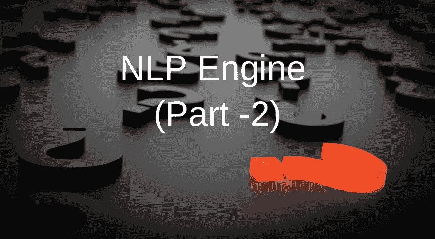
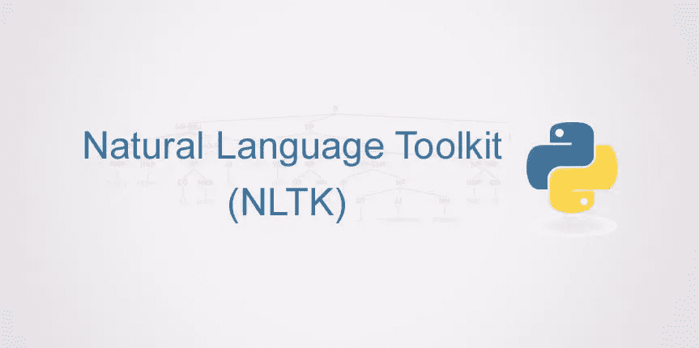
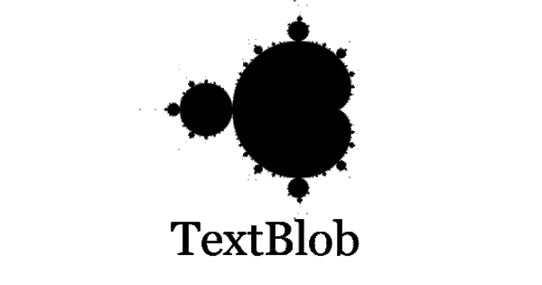
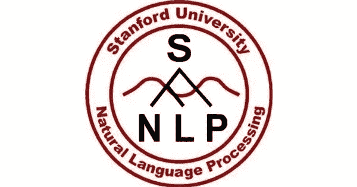
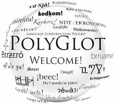

# NLP 引擎(第 2 部分)->自然语言处理的最佳文本处理工具或库

> 原文：<https://towardsdatascience.com/nlp-engine-part-2-best-text-processing-tools-or-libraries-for-natural-language-processing-c7fd80f456e3?source=collection_archive---------14----------------------->

NLP 库—何时、何地使用它们。NLTK，TextBlob，Spacy，CoreNLP，Genism，Polyglot。

构建 NLP 引擎时出现的一个主要问题是**“我应该使用哪个库来进行文本处理？”**既然市场上有很多，还有**“NLP 库的用途是什么？”**这两个问题将在这里解决，并帮助您在自己从头构建 NLP 引擎的道路上迈出正确的一步。

这篇文章是正在进行的系列文章的一部分:[第一部分](/nlp-vs-nlu-vs-nlg-know-what-you-are-trying-to-achieve-nlp-engine-part-1-1487a2c8b696)

# "使用 NLP 库的需求是什么？"

自然语言处理(NLP)今天变得非常流行。NLP 是 ***人工智能*** 的一个领域，旨在**理解和提取**文本中的重要信息，并基于文本数据进一步训练。主要任务包括****文本分析******情感分析、机器翻译*** 等。*

*这些库帮助我们从文本中提取含义，其中包括广泛的任务，如**文档分类、主题建模、词性(POS)标注和情感分析**等。*

# *"我应该使用哪个库进行文本处理？"*

*这里是六个最流行的 NLP 库的列表，它们在任何地方都被使用，但没有特定的顺序。这取决于你选择哪一个适合于你正在尝试执行的任务。*

*如果这五个都掌握了，那么你就没有必要去寻找其他的 NLP 库了。即使你掌握了其中的一个，也很容易在它们之间切换来学习和使用其他库。*

1.  ***NLTK(自然语言工具包):**最古老的 之一，多用于 ***研究*** 和 ***教育目的*** 。*
2.  ***TextBlob:** 构建于 NLTK 之上，最适合 ***初学者*** 。这是一个用户友好和直观的 NLTK 界面。它用于快速原型制作。*
3.  ***Spacy: *行业标准*** 目前最好的。*
4.  ***CoreNLP(斯坦福 CoreNLP):** 由斯坦福集团构建和维护的生产就绪解决方案，但它是用 java 构建的。*
5.  ***Genism:** 它是用于主题和向量空间建模、文档相似性的包。*
6.  ***多语种**:通常用于涉及某个语言空间不支持的项目。*

*这些库并不是唯一的库，但是你可以说它们是**“NLP 的骨干”**掌握这些库可以让你做任何简单或高级的自然语言处理。*

*现在最好的是**“Spacy”**我不能推荐它给 NLP。如果你想让它成为**生产就绪和工业标准**请使用 Spacy，NLTK 仅用于学术目的。*

> ***NLTK(自然语言工具包)***

**

*[source](http://www.treselle.com/wp-content/uploads/freshizer/x2062a4072509f2ab963bc5b8b71a71eb_NLTK-863-430-c.jpg.pagespeed.ic.4FVcBOki2T.jpg)*

*[NLTK](https://www.nltk.org/) 是最古老的 NLP 之一。如果你是一个初学者，必须学习自然语言处理领域的基础知识，那么自然语言处理是适合你的。你可以为你应该完成的适当的任务建立适当的模型。*

*“一旦掌握了 NLTK，它将成为文本分析研究人员的游乐场”。NLTK 有超过 50 个语料库和词典，9 个词干分析器和几十种算法可供选择。基本上是为了一个学术研究者。*

> ***文本斑点***

**

*[source](https://images.g2crowd.com/uploads/product/image/social_landscape/social_landscape_1489716016/textblob.png)*

*[TextBlob](https://textblob.readthedocs.io/en/dev/quickstart.html) 是 NLTK 的一个接口，它将文本处理变成了一个 ***简单且相当愉快的过程*** ，因为它有 ***丰富的功能*** 和 ***平滑的学习曲线*** 由于有[详细且易懂的文档](https://textblob.readthedocs.io/en/dev/index.html)。因为它允许简单地添加各种组件，如情感分析器和其他方便的工具。用于**【快速成型】**。*

> *空间*

**

*[source](https://spacy.io/assets/img/social/preview_default.jpg)*

*[**Spacy**](https://spacy.io/)**是用 Python & [Cython](http://cython.org/) 写的。SpaCy 不能像 NLTK 那样为任何任务提供超过 50 种不同的解决方案。“ ***Spacy 只为任务提供一个且是最好的一个解决方案，从而免去了自己选择最优路线的问题*** ”，确保建立的模型精益、中庸、高效。此外，该工具的功能已经很强大，并且会定期添加新功能。***

> *****科伦普(斯坦福科伦普)*****

******

***[source](https://s3-ap-south-1.amazonaws.com/av-blog-media/wp-content/uploads/2018/04/stanford-nlp-net.jpg)***

***[**CoreNLP**](http://stanfordnlp.github.io/CoreNLP/index.html) 由一套生产就绪的自然分析工具组成。是用 Java 写的，不是 Python。虽然有社区做的 Python 包装器。它可靠健壮，比 NLTK 快(但是 spacy 快得多)，并且还支持多种语言。许多组织将 CoreNLP 用于生产实现。***

***CoreNLP 为 NLP 任务提供了一个很好的基础设施。然而，客户机-服务器体系结构引入了一些开销，这对于较小的项目或在原型开发期间可能是不利的***

> *****Genism*****

******

***是针对主题和向量空间建模、文档相似性的包。**“Gensim 并不适合所有类型的任务或挑战，但它能做什么，就做什么”**。在主题建模和文档相似性比较领域，高度专业化的 Gensim 库是无可匹敌的。所以 Genism 不是一个通用的 NLP，但是它的使用取决于手边的任务。***

> *****多语种*****

******

***[source](https://encrypted-tbn0.gstatic.com/images?q=tbn:ANd9GcQj1NiYJ6a-6neqYmEvX-crSgJ3jtQOq_veQwKOZfalr07C-ion)***

*******略显冷门的图书馆。它提供了广泛的分析和令人印象深刻的语言覆盖面。多亏了 NumPy，它的运行速度也非常快。使用 polyglot 类似于 spaCy——非常简单，对于涉及 spaCy 不支持的语言的项目来说，这将是一个极好的选择**。该库之所以与众不同，还因为它通过管道机制请求在命令行中使用专用命令。绝对值得一试*********

*******结论:*******

*****NLTK 更多的是**学术性**。你可以用它来尝试不同的方法和算法，组合它们等等。相反，Spacy 为每个问题提供了一个现成的解决方案。 ***你不用去想哪种方法更好:Spacy 的作者们已经搞定这个*** 。还有， **Spacy 非常快(比 NLTK 快好几倍)**。一个缺点是 Spacy 支持的语言数量有限。然而，支持的语言数量一直在增加。因此，我们认为 Spacy 在大多数情况下是最佳选择，但是如果您想尝试一些特殊的东西，可以使用 NLTK*****

*****在这里，你可能不理解标记化、主题建模、意图等的含义，我将在下一篇 NLP 引擎文章(第 3 部分)中介绍。*****

*****学分:*****

1.  *****[https://www . kdnugges . com/2018/07/comparison-top-6-python-NLP-libraries . html](https://www.kdnuggets.com/2018/07/comparison-top-6-python-nlp-libraries.html)*****
2.  *****https://elitedatascience.com/python-nlp-libraries*****
3.  *****[https://sunscrapers . com/blog/6-best-python-natural-language-processing-NLP-libraries/](https://sunscrapers.com/blog/6-best-python-natural-language-processing-nlp-libraries/)*****

*****请务必关注我的 [**中**](https://medium.com/@chethankumargn) **，**[**LinkedIn**](http://www.linkedin.com/in/chethankumargn)**，**[**Twitter**](https://twitter.com/chethan1gn)**，**[**insta gram**](https://www.instagram.com/data_science_by_chethan/)**获取更多更新。如果你喜欢这篇文章，请鼓掌并分享它。*******

*******在这里加入我们的 [**WhatsApp**](https://chat.whatsapp.com/LLwBIyYYcABEV31ZFI7QR3) 社区。*******