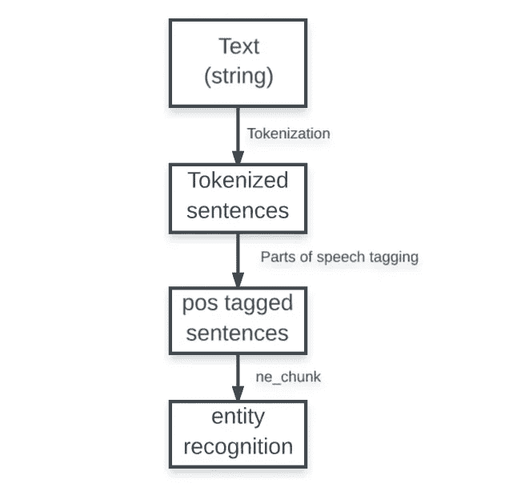

# NLP —从文本中提取位置

> 原文：<https://towardsdatascience.com/nlp-extracting-location-from-text-aa99c55e77d5?source=collection_archive---------0----------------------->

我目前正在做一个 NLP 任务，需要从文本中提取位置。例如，“我住在纽约”，那么必须从文本中提取“纽约”。有几个像 nltk 或 T2 这样的图书馆可以做这种工作。

# NLTK 和 StanfordNER 是如何从文本中识别位置的？

Pipeline for named entity recognition in nltk

ne_chunk 函数将标记分为不同的实体，如“人”、“组织”、“位置”等。ne_chunk 使用基于分类器的方法，并且已经在词性标记数据上进行了训练。分类器试图理解句子中各种词类和实体之间的关系。

# 挑战

因为 NLTK 和 StandfordNER 依靠词性标注来识别位置；不以大写字母开头的位置名称无法识别。

例如，“我住在班加罗尔”，单词“班加罗尔”将被两个库识别为一个位置。相反，“我住在班加罗尔”，单词“班加罗尔”不会被他们中的任何一个识别为地点。这是因为“bangalore”在词类标记上有一个“NNP”标记，表示专有名词，而“Bangalore”只被标记为表示名词的“NN”。

我的数据集基本上是从电子邮件中提取的，有许多这样的句子，其中地点名称不是以大写字母开头。因此，如果不以大写字母开头，就无法提取位置。

## 其他几个模糊之处

1.  **Devi Circle 是一个美丽的地方**--“Devi”被识别为一个人，而 Devi Circle 是 Bangalore 的一个地方。
2.  **Martahalli 是一个美丽的地方-**“Martahalli”是一个人，而 Marta halli 是班加罗尔的一个地方。
3.  **我的学校在 Martahalli 警察局附近-** 有趣的是**‘Marta halli’被正确归类为位置。**
4.  ****我想从 Koramangala 到 Madivala-** 只有“Koramangala”被识别为一个位置，而 koramangala 和 Madivala 都是班加罗尔的位置。**

**上述歧义清楚地表明，命名实体识别器(ne_chunk)被训练成仅理解词性标注，以理解一个标记是否是实体。**

# **结论**

**许多 NLP 技术需要从文本中提取实体，如人名、位置、组织名称或日期。不幸的是，没有简单的方法来实现这一点。**

## **我请求读者提出他们心目中有助于完成这项任务的任何方法。**