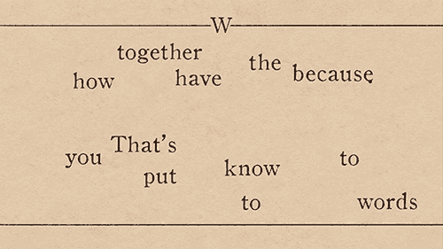

# NLP:使用 LDA 在几分钟内从数据集中提取主要主题

> 原文：<https://towardsdatascience.com/nlp-extracting-the-main-topics-from-your-dataset-using-lda-in-minutes-21486f5aa925?source=collection_archive---------1----------------------->

用数据做很酷的事情！



Power of NLP

我最近开始学习用于主题建模的潜在狄利克雷分配(LDA ),惊讶于它的强大和快速运行。主题建模是使用无监督学习来提取文档集合中出现的主要主题(表示为一组单词)的任务。

我在 20 个新闻组数据集上测试了该算法，该数据集包含来自新闻报道的许多部分的数千篇新闻文章。在这个数据集中，我提前知道了主要的新闻主题，并且可以验证 LDA 是否正确地识别了它们。

代码运行起来非常简单快速。可以在 [Github](https://github.com/priya-dwivedi/Deep-Learning/blob/master/topic_modeling/LDA_Newsgroup.ipynb) 上找到。我鼓励你拉一下试试。

# 关于 LDA

LDA 用于将文档中的文本分类到特定主题。它建立了每个文档的主题模型和每个主题的单词模型，建模为 Dirichlet 分布。

*   每个文档被建模为主题的多项式分布，并且每个主题被建模为单词的多项式分布。
*   LDA 假设我们输入的每一个文本块都包含有某种关联的单词。因此，选择正确的数据是至关重要的。
*   它还假设文档是由多个主题混合而成的。然后，这些主题根据它们的概率分布生成单词。

要了解更多关于 LDA 的信息，请点击这个[链接](http://www.jmlr.org/papers/volume3/blei03a/blei03a.pdf)。

# **使用的数据集**

我用的数据集是 20Newsgroup 数据集。它可以在 sklearn 数据集下获得，并且可以作为

```
from sklearn.datasets import fetch_20newsgroups
newsgroups_train = fetch_20newsgroups(subset=’train’, shuffle = True)
newsgroups_test = fetch_20newsgroups(subset=’test’, shuffle = True)
```

这个数据集已经将新闻分组为关键主题。你可以熬过来

```
print(list(newsgroups_train.target_names))
```

数据集中有 20 个目标——*‘alt .无神论’，
‘comp . graphics’，
‘comp . OS . ms-windows . misc’，
‘comp . sys . IBM . PC . hardware’，
‘comp . sys . MAC . hardware’，
‘comp . windows . x’，
‘misc . for sale’，
‘rec . autos’，
‘rec . motors’，
‘rec .’*

从视觉上看，我们可以说这个数据集有几个广泛的主题，如:

*   科学
*   政治
*   运动
*   宗教
*   技术等

# **使用 Python 中的 LDA 提取主题**

1.  **预处理原始文本**

这包括以下内容:

*   **分词**:将文本拆分成句子，句子拆分成单词。将单词小写，去掉标点符号。
*   少于 3 个字符的单词将被删除。
*   所有的**停用词**都被删除。
*   单词被**词汇化**——第三人称的单词被改为第一人称，过去时态和将来时态的动词被改为现在时态。
*   单词被**词干化**——单词被还原成它们的词根形式。

我们使用 NLTK 和 gensim 库来执行预处理

```
def lemmatize_stemming(text):
    return stemmer.stem(WordNetLemmatizer().lemmatize(text, pos='v'))# Tokenize and lemmatize
def preprocess(text):
    result=[]
    for token in gensim.utils.simple_preprocess(text) :
        if token not in gensim.parsing.preprocessing.STOPWORDS and len(token) > 3:
            result.append(lemmatize_stemming(token))

    return result
```

生成的文本如下所示:

```
Original document: 
['This', 'disk', 'has', 'failed', 'many', 'times.', 'I', 'would', 'like', 'to', 'get', 'it', 'replaced.']

Tokenized and lemmatized document: 
['disk', 'fail', 'time', 'like', 'replac']
```

**2。将文本转换成单词包**

在主题建模之前，我们将标记化和词条化的文本转换为一个单词包，你可以把它想象成一个字典，其中的关键字是单词，值是单词在整个语料库中出现的次数。

```
dictionary = gensim.corpora.Dictionary(processed_docs)
```

我们可以进一步筛选出现次数很少或出现频率很高的单词。

现在，对于每个预处理过的文档，我们使用刚刚创建的 dictionary 对象将文档转换成单词包。也就是说，我们为每个文档创建一个字典，报告有多少单词以及这些单词出现了多少次。

```
bow_corpus = [dictionary.doc2bow(doc) for doc in processed_docs]
```

结果看起来像:

```
Word 453 ("exampl") appears 1 time.
Word 476 ("jew") appears 1 time.
Word 480 ("lead") appears 1 time.
Word 482 ("littl") appears 3 time.
Word 520 ("wors") appears 2 time.
Word 721 ("keith") appears 3 time.
Word 732 ("punish") appears 1 time.
Word 803 ("california") appears 1 time.
Word 859 ("institut") appears 1 time.
```

**3。运行 LDA**

这实际上很简单，因为我们可以使用 gensim LDA 模型。我们需要指定数据集中有多少主题。假设我们从 8 个独特的主题开始。通过次数是对文档进行培训的次数。

```
lda_model =  gensim.models.LdaMulticore(bow_corpus, 
                                   num_topics = 8, 
                                   id2word = dictionary,                                    
                                   passes = 10,
                                   workers = 2)
```

# 结果并解释它们

就是这样！模型已经建立。现在让我们来解读它，看看结果是否有意义。

该模型的输出是 8 个主题，每个主题由一系列单词分类。LDA 模型不会给这些词起一个主题名，而是由我们人类来解释它们。请参见下面的模型输出示例，以及“我”如何为这些单词分配潜在主题。

```
Topic 1: Possibly Graphics Cards
Words: "drive" , "sale" , "driver" , *"wire" , "card" , "graphic" , "price" , "appl" ,"softwar", "monitor"Topic 2: Possibly Space
Words: "space","nasa" , "drive" , "scsi" , "orbit" , "launch" ,"data" ,"control" , "earth" ,"moon"Topic 3: Possibly Sports
Words: "game" , "team" , "play" , "player" , "hockey" , season" , "pitt" , "score" , "leagu" , "pittsburgh"Topic 4: Possibly Politics
Words: "armenian" , "public" , "govern" , "turkish", "columbia" , "nation", "presid" , "turk" , "american", "group"Topic 5: Possibly Gun Violence
Words: "kill" , "bike", "live" , "leav" , "weapon" , "happen" , *"gun", "crime" , "car" , "hand"
```

查看 [github](https://github.com/priya-dwivedi/Deep-Learning/blob/master/topic_modeling/LDA_Newsgroup.ipynb) 代码来查看所有主题，并使用模型来增加或减少主题的数量。

**观察:**

*   该模型在提取数据集中的独特主题方面做得非常好，我们可以在已知目标名称的情况下确认这些主题
*   模型运行非常快。我可以在几分钟内从数据集中提取主题
*   它假设数据集中有不同的主题。因此，如果数据集是一堆随机的推文，那么模型结果可能就不可解释了。

**未来的改进**

我对这个关于 [Guided LDA](https://medium.freecodecamp.org/how-we-changed-unsupervised-lda-to-semi-supervised-guidedlda-e36a95f3a164) 的帖子很感兴趣，很想尝试一下。

我有自己的深度学习咨询公司，喜欢研究有趣的问题。我已经帮助许多初创公司部署了基于人工智能的创新解决方案。请到 http://deeplearninganalytics.org/来看看我们吧。

你也可以在 https://medium.com/@priya.dwivedi 的[看到我的其他作品](https://medium.com/@priya.dwivedi)

如果你有一个我们可以合作的项目，请通过我的网站或 info@deeplearninganalytics.org 联系我

**参考文献**

*   非常感谢 Udacity，特别是他们的 NLP 纳米学位让学习变得有趣！
*   [LDA 上的纸](http://www.jmlr.org/papers/volume3/blei03a/blei03a.pdf)