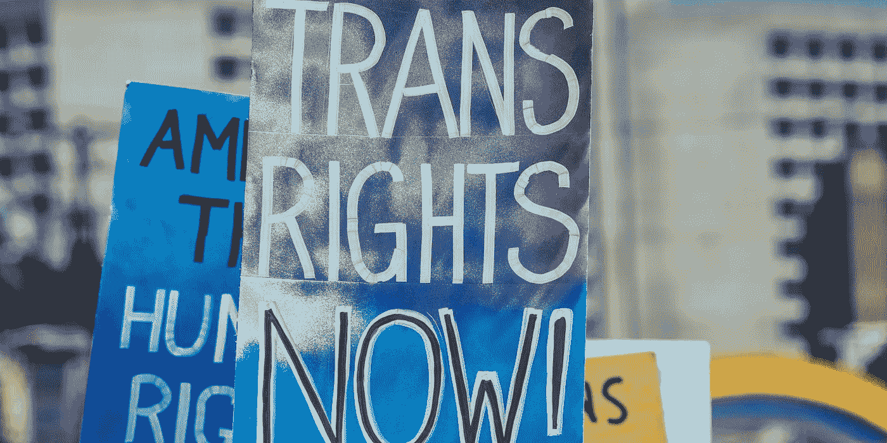
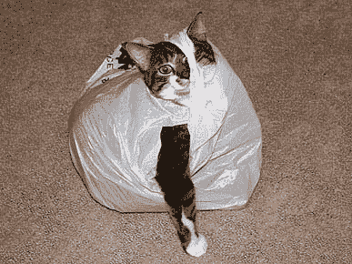
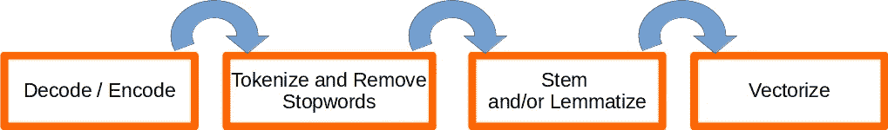
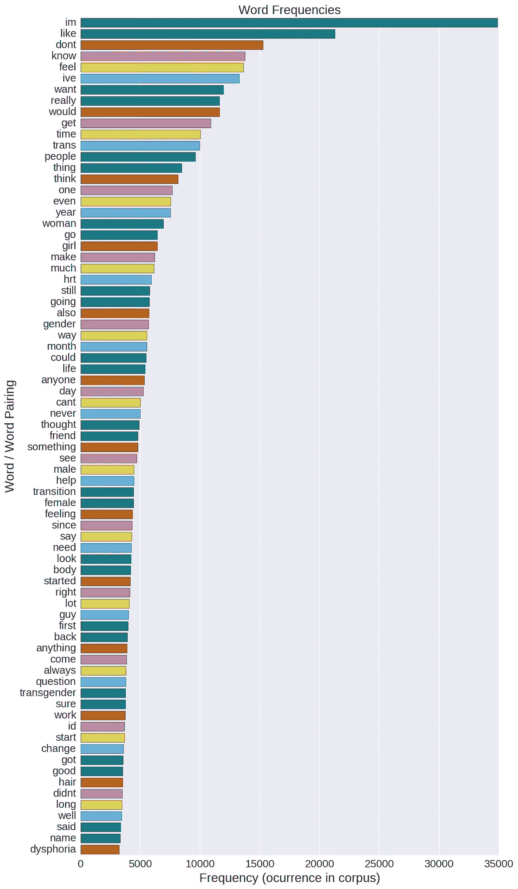
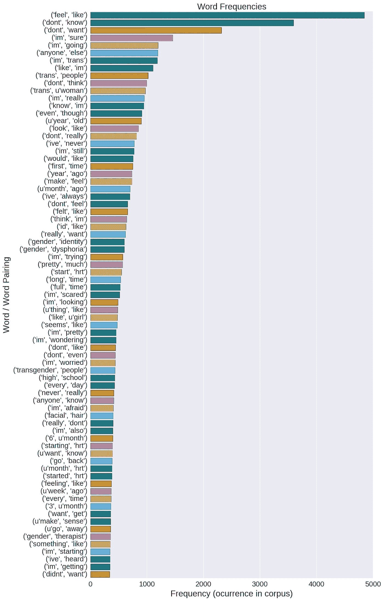
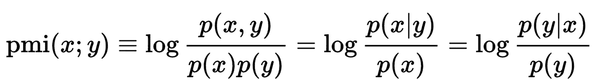
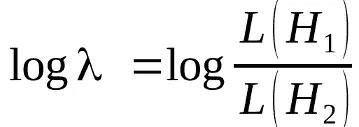

# 面向 LGBTQIA+社区的 NLP:自然语言处理入门第 1 部分

> 原文：<https://towardsdatascience.com/nlp-for-the-lgbtqia-community-a-primer-on-natural-language-processing-part-1-7f0ffd1bb54d?source=collection_archive---------0----------------------->



What do we want? Trans rights! When do we want them? NOW!

# 跨性别群体的担忧

我将坦率地直接切入正题:当涉及到每天在世界上导航时，跨性别群体面临着不可逾越的挑战。**2016 年有 27 名变性妇女**被谋杀，2017 年**有 9 名变性妇女**被谋杀(这个数字大概会)。这些妇女大多是有色人种。

国家跨性别平等中心在最近的一份报告中显示了非常明显的统计数据。27%的变性人。 **27%** 的跨性别者报告生活贫困(年收入 2 万美元)。 **14%** 报告失业(是总人口的两倍)，绝大多数人报告存在某种职业歧视(无论是被拒绝升职还是因跨性别被解雇)。

在我们的刑事司法系统中，变性人面临着严重的歧视。 **22%** 曾报告被警察骚扰。 **16%** 曾被监禁的受访者报告过监狱看守的严重性骚扰。我们甚至没有多少变性人仅仅因为表达他们的身份而被监禁的数字。

跨性别群体在健康和获得健康方面存在巨大差异。 **41%** 的跨性别者报告曾试图自杀， **19%** 报告曾被医务人员拒绝提供医疗帮助， **28%** 报告因受到歧视威胁而推迟护理。

我为什么关心这些问题？**我是一名变性女性**，一直在思考我们当前社会对我生计的攻击。但此外，我很荣幸拥有高等学位和专业技能。我有责任将这些技能运用到工作中。

# 获取跨社区相关数据。

我在以前的一篇文章中提到过，很难找到与同性恋问题相关的数据，至少那些公开的数据是如此。这需要一些创新思维。Reddit 实际上是一个数据宝库，尽管人们可能不会这么想。我们通常认为 Reddit 是猫图片和愚蠢迷因的来源。在我发现自己身份的旅程中，我在 reddit 上找到了我经常使用的支持论坛。这些论坛提供了一个独特的数据集，以更好地了解变性人的关注。

我一直在使用**自然语言处理**方法挖掘这些数据，并决定一石二鸟也是值得的:1)通过自然语言处理和机器学习提供对围绕跨性别群体的关注的见解，2)做一个关于自然语言处理基础的教程。

# 什么是自然语言处理(NLP)？

根据 Algorithmia 的说法，NLP 是“计算机以一种聪明而有用的方式来分析、理解人类语言并从中获取意义的一种方式。”我用一个很傻的句子，取自 sub-Reddit[/r/startled cats](http://www.reddit.com/r/startledcats)作为例子。



“Can I haz bag?” I needed to offset the gloomy trans stats with sillier cats.

```
I do yoga with cats. Cats are magnetically drawn to a human engaged in awkward positions. The will place themselves where they can be most inconvenient.
```

我们如何用一种有意义的方式将这些词量化？我们甚至不要正确理解这句话的意思。首先，我们需要对文本进行标记。这意味着将文本拆分成如下内容:

`['I', 'do', 'yoga', 'with', 'cats']`

也许我们需要确定这个句子的语法。

```
[(‘I’, ‘PRP’), (‘do’, ‘VBP’), (‘yoga’, ‘RB’), (‘with’, ‘IN’), (‘cats’, ‘NNS’)
```

其中 PRP 是人称代词，VBP 是现在时动词，rb 是副词，IN 是介词，NNS 是复数名词。当您读入更多的文本数据时，它会变得更加复杂。

假设您想用这些单词标记进行某种文本分类。如何把文字当做特征？`with`和`do`这两个词有关联吗？在我们的例子中，我们如何对待单词`cat`和`cats`？我们是把它们当成一个词，两个词，还是要看上下文？

让我们思考一下单词的意思。计算机如何从下面的句子中提取意思:

`I went by the river bank yesterday.`

`I went and robbed a bank yesterday.`

我们如何着手确定单词 token `bank`的含义？

我希望这能让你更好地理解我们在日常生活中经常看到的自然语言处理的应用。语言很复杂！我们甚至还没有触及亚马逊 Alexa 和谷歌 Home 等产品中的信号处理。

# NLP 管道，一目了然。

我在 [Insight](http://www.insighthealthdata.com) 中学到了相当多的 NLP，我只想说:与典型的数据挖掘相比，挖掘文本数据并不是一个真正透明的过程。典型的数据集，即使是杂乱的，也会通过 SQL 数据库来到你面前。csv 文件，JSON 格式的数据等。许多文本数据不支持。那么，我们如何对文本数据进行分析呢？(顺便说一下，我使用的当前数据集存储在 SQLite 数据库中)。

首先，您需要适当的库。我使用 Python 包`nltk` ( [自然语言工具包](http://www.nltk.org))作为我的面包和黄油，但是像`spaCy` (www.spacy.io)这样的新包可以做很多和`nltk`一样的事情。



The most basic NLP pipeline.

管道通常遵循上述格式。首先从数据源读入数据。然后标记并删除停用词。标记化将句子`'I do yoga with cats'`放入一个数组`['I', 'do', 'yoga' ,'with', 'cats'].`中

“停用词”是低信息词，对你正在分析的文本没有什么帮助。`nltk`有一个常用停用词库，但我通常也会定义自己的停用词集。删除停用词时，您的文本可能如下所示:``['I', 'yoga' ,'cats']`。删除停用词的方法没有对错之分，这取决于您正在处理的文本数据。

现在我们对文本进行“词干化”或“词汇化”。单词可以有许多屈折变化。我们举个例子`startle`。可以有`startled`或者`startling`。为了便于分析，您可能只想将令牌简化为`startl`。词条简化包括将一个单词简化成它的常见形式，即词条。例如，标记`go`、`going`、`gone`和`went`具有相同的基础形式`go`。

从那里，我们以某种方式对文本进行矢量化(我将在接下来的另一篇博客文章中介绍)。这只是意味着每个令牌都以某种方式用数字表示。它们可以被表示为原始频率。存在更复杂的矢量化，可以表示与主题相关的单词或者它们如何与其他单词相关联(例如，潜在语义分析、Word2Vec 单词嵌入模型)。

# **将这些方法应用于来自 Reddit 的转基因数据**

好了，现在是我想吃的肉。我将分享一些代码片段，但我的大部分代码你可以在相关的 [github repo](https://github.com/mjtat/Trans-NLP-Project) 中看到。

为了这个分析，我从 reddit /r/asktransgender 子网站上收集了大约 2 万条评论。具体来说，我利用谷歌的云平台([谷歌大查询](https://www.google.com/aclk?sa=l&ai=DChcSEwj2pN-cm8rTAhXRi7MKHSfsBAIYABAAGgJxbg&sig=AOD64_1_YxiMtmHTWYC_jnVGCPJxfiHDXA&q=&ved=0ahUKEwjlpdicm8rTAhXCKCYKHTiFDRsQ0QwIJw&adurl=))来检索评论。谷歌有大量的当前和以前年份的 reddit 评论语料库(文本数据集合)，这是一个不太难获取 reddit 数据的来源。

我所有的 Reddit 数据都存储在 SQLite 数据库中(顺便说一句，这个数据库比我以前的 Postgres 数据库更容易建立。下次再发)。最初，我查询了数据，并将其读入熊猫数据框。文本数据可能不可靠，你将不得不不断地从 [UTF-8](https://en.wikipedia.org/wiki/UTF-8) 文本格式中解码和重新编码它们。

以下代码采用一个数据帧。在您指定的列标题中，它会将文本转换为字符串格式，将所有文本设置为小写，并最终解码文本。

```
def decode(column_title):
    dataframe = self.dataframe
    dataframe[column_title] = dataframe[column_title].astype(str)
    dataframe[column_title] = dataframe[column_title].str.lower()
    dataframe[column_title] =   dataframe[column_title].str.decode('UTF-8', errors='strict')
    return dataframe
```

在接下来的代码片段中，我定义了要删除的停用词。有一个预建的字典，但是我也添加了一些随机的 ASCII 字符来删除。您也可以使用正则表达式来删除这些符号。

```
def defineStopwords(words = None):
    stop_words = stopwords.words('english')
    etc_stop = ['.', ',', '?', '!', '\'',  ':', '\"', '{', '}', ';', '%', '[',  ']', '(', ')', '-', '\'s', '\'ve', '...', '\'ll', '`', '``', '"n\'t"', '"\'m"', "''", '--', '&']
   if words is not None: 
       stop_words = stop_words + etc_stop + words

       else:
           stop_words = stop_words + etc_stop

   return stop_words
```

这个片段中有很多内容，但它本质上实现了我的 NLP 管道。我做一些重新编码和解码，标记我的语料库中的每个文档(在`nltk`中使用`RegexTokenizer`，并使用列表理解`i for i in temp if i not in stopwords`删除停用词。然后我让记号符号化。该函数返回单个标记以及二元模型的大列表。

二元模型是词对而不是单个记号。有时我们对二元模型感兴趣，因为它们添加了更多关于常见共现词的信息(例如，`panic attack`)。

我们将这些记号和二元模型添加到空列表中。现在我们准备做一些基本的可视化！

```
def wordTokens(df_column, words = None, encode = True):

    df = self.dataframe
    df = self.decode(df_column)
    corpus = df[df_column].tolist() singletons = []
    bigrams = []

    stopwords = self.defineStopwords()

    for post in corpus:
       temp = post.lower()
       if encode == True:
           temp = post.encode('ascii', 'ignore').decode('ascii')
       else:
           continue

       print temp
       temp = temp.encode('utf-8').translate(None, string.punctuation)
       tokenizer = RegexpTokenizer(r'\w+')
       temp = tokenizer.tokenize(temp)
       stopped_tokens = [i for i in temp if not i in stopwords]
       lemmatized_tokens = [nltk.WordNetLemmatizer().lemmatize(i) for i in stopped_tokens]
       bigram = nltk.bigrams(lemmatized_tokens)
       bigram = list(bigram)
       singletons.append(lemmatized_tokens)
       bigrams.append(bigram)

       print '\n Successfully cleaned and tokenized abstracts.'

    return singletons, bigrams
```

# 我的/r/ask 跨性别语料库的频率计数

作为一名数据科学家，您应该做的第一件事是进行一些探索性分析。在自然语言处理中，你可以先看一下词频，以便更好地了解你正在看的东西。这就是我对单个单词和二元模型所做的。

```
token_corpus = []
for doc in tokens:
    for token in doc:
        token_corpus.append(token)
```

单个令牌和二元模型被组织成嵌入到一个更大列表中的列表。我想得到一个**单个**记号列表，所以我简单地遍历我的原始语料库并创建一个新的。

```
fdist = nltk.FreqDist(token_corpus)
words = []
freq = []
for word, frequency in fdist.most_common(100):
    words.append(word)
    freq.append(frequency)
```

我调用`nltk.FreqDist`来生成我的频率分布。从那里，我使用我的`fdist`对象(这是一个字典)，并创建两个单词和频率列表。最后，我使用这些列表来可视化我在`seaborn`的频率分布。

下图显示了前 75 个单个令牌和二元模型。

**个人代币**



**二元模型**



我想指出，二元模型的频率产生了一些有趣的见解。在我们的文本中，我们看到了一些性别身份的不确定性，这并不奇怪(至少对我来说，作为一个跨性别的同性恋者),因为/r/asktransgender 是一个支持社区。人们经常提到“性别认同”和“性别焦虑”。我们还观察到诸如“开始 hrt”的标记。HRT 代表“激素替代疗法”。在我们的社区，获取荷尔蒙是一件大事，有很多人问这个问题也不足为奇(至少对我来说)。我们也看到像“我很担心”这样的标记，这可能表明个人对过渡有某种焦虑。

# 词对搭配

[搭配](http://www.nltk.org/howto/collocations.html)是相互之间有很强关联的词对，我们可以用统计学来确定某个词对是否有超出随机几率的显著的相互关联。例如，在我们的语料库中`gender identity`和`gender dysphoria`是可以相互关联的。

简而言之，我们可以使用[逐点互信息统计](https://en.wikipedia.org/wiki/Pointwise_mutual_information)来计算重要的搭配。这方面的方程式如下:



其中 PMI 等于给定 word-x 的 word-y 的概率的对数除以 word-y 的概率，`nltk`具有搭配功能，从我们的语料库中导出 PMI 得分。也有其他方法可以实现这一点(例如，卡方检验、学生 t 检验和对数似然比检验)。

```
bigram_measures = BigramAssocMeasures()
finder = BigramCollocationFinder.from_words(token_corpus)
finder.apply_freq_filter(20)
finder.nbest(bigram_measures.pmi, 15)
```

上面的代码获取一个语料库，应用一个频率过滤器(只查找出现 20 次以上的搭配)，并找到 15 个最佳搭配。这些搭配列举如下:

```
('roller', 'coaster'),
 ('vice', 'versa'),
 ('san', 'francisco'),
 ('bart', 'van'),
 ('howard', 'brown'),
 ('penile', 'inversion'),
 ('caitlyn', 'jenner'),
 ('rib', 'cage'),
 ('north', 'carolina'),
 ('cyproterone', 'acetate'),
 ('adam', 'apple'),
 ('van', 'de'),
 ('brow', 'ridge'),
 ('coping', u'mechanism'),
 ('planned', 'parenthood')
```

所以我们看到一些有趣的事情。还是那句话，很多医学上的东西。阴茎倒置是性别确认手术中使用的一种技术。霍华德·布朗是芝加哥的一家 LGBTQ 诊所。醋酸环丙孕酮是一种用于阻断睾酮的药物。我们也看到渗透社会意识的事情，比如凯特琳·詹娜和北卡罗来纳([由于歧视性的 HB2 法案](https://en.wikipedia.org/wiki/Public_Facilities_Privacy_%26_Security_Act))。还列出了人们可能希望生活的地方(旧金山)，以及其他可以获得激素替代疗法的地方(计划生育)。

我还使用对数似然比测试探索了搭配。简而言之，[对数似然比检验](https://en.wikipedia.org/wiki/Likelihood-ratio_test)是:



对数似然比测试以下内容。假设 1 (H1):单词 1 的出现独立于单词 2 的先前出现。假设命题 2 (H2):单词 2 的出现依赖于单词 1 之前的出现。因此，对数等于 H1 和 H2 的可能性。对数似然检验给了我们一些更合理的搭配。

```
 ('feel', 'like'),
 ('dont', 'know'),
 ('dont', 'want'),
 ('anyone', 'else'),
 ('year', 'old'),
 ('im', 'sure'),
 ('even', 'though'),
 ('month', 'ago'),
 ('gender', 'identity'),
 ('year', 'ago'),
 ('trans', 'woman'),
 ('high', 'school'),
 ('facial', 'hair'),
 ('trans', 'people'),
 ('informed', 'consent')
```

我们看到有一些非常常见的搭配(例如，“感觉像”、“不知道”)。有些搭配为质疑性别认同的个人提供了一个共同关注的视角。像“其他任何人”这样的搭配表示一种陈述，如“其他任何人*和*经历过……”，或者“知情同意”表示一个问题，如“其他任何人*和*知道 x 区有一家*知情同意*诊所可以获取激素吗？”

简单的文本语料库分析产生的线索可以帮助我们理解跨性别群体的密切关注。

# 结论和后续步骤

这些仅仅是分析这个数据集的初步步骤，但是到目前为止我们看到了一些有趣的数据模式。当挖掘这个数据集时，我一直在问自己的问题围绕着最常见的话题是什么，以及我们如何从关联的单词中推导出单词的含义，以深入数据？我们能否在文档分类框架中使用这些文本数据来预测精神痛苦或医疗需求？第 2 部分将涵盖其中的一些主题，敬请关注！

米歇尔是波士顿的 LGBTQ 活动家和数据科学家。你可以在 [*LinkedIn*](https://www.linkedin.com/in/michelle-tat/) *或者她的* [*个人网站*](http://mjtat.github.io) *上找到更多关于她的信息。*