# 法律文档主题建模和摘要的自然语言处理。

> 原文：<https://towardsdatascience.com/nlp-for-topic-modeling-summarization-of-legal-documents-8c89393b1534?source=collection_archive---------1----------------------->

你有没有想过律师是如何有效地处理一系列法庭陈述的？他们如何绕开法律文件的总体背景，以便在最终不得不着手处理之前弄清楚需要注意什么。看起来很容易，除非你有一个 3000 页的文档，里面有突出的细节。这就是这个项目背后的动机，从法律文档的 pdf 中自动建模主题并总结关键上下文。

该项目旨在从双方签订的一份长达 5 页的**商标和域名协议**中自动建立话题模型，以提取对双方有利或不利的话题上下文。这种方法包括:从文档的 pdf 副本中提取文本，清理提取的文本，从文档中建模主题，并显示可视摘要。注意，这里采用的方法可以扩展到几乎所有保存为 pdf 格式的文档。

**从 PDF 文档中提取文本**

双方之间的法律协议以 pdf 文档的形式提供。首先使用下面显示的函数从 pdf 文档中提取文本。该函数使用 python 库 [*pdf-miner*](https://github.com/euske/pdfminer) *从 pdf 文档中提取除图像之外的所有字符(尽管我可以修改以适应这一点)。*该函数只接受主目录中 pdf 文档的名称，从中提取所有字符，并将提取的文本作为字符串的 python 列表输出。

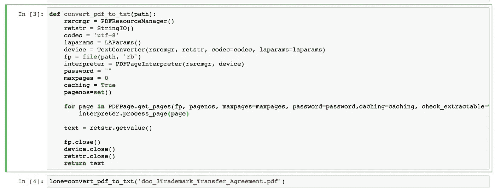

Figure showing the function that extracts texts from a pdf document

**清理提取文本**

从 pdf 文档中提取的文本包含需要删除的无用字符。这些字符降低了我们的模型的有效性，因为它们提供了不必要的计数比。下面的函数使用了一系列的 [***正则表达式***](https://en.wikipedia.org/wiki/Regular_expression) 搜索和替换函数以及一个列表理解来用空格替换这些字符。以下函数用于此过程，显示的结果文档仅包含字母数字字符。

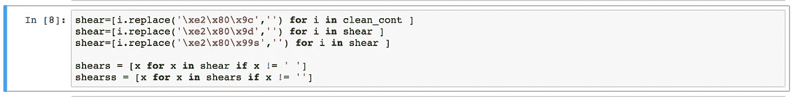

Figure showing code which replaces document coding with blank space

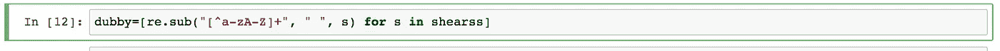

Figure showing code which replaces non-alpha characters with blank space

**主题建模**

T 使用 scikit-learn 模块 [*计数矢量器*](http://scikit-learn.org/stable/modules/generated/sklearn.feature_extraction.text.CountVectorizer.html) 进行最小参数调整，将干净文档表示为 DocumentTermMatrix。这是因为建模要求将字符串表示为整数。CountVectorizer 显示删除停用字词后，某个字词在列表中出现的次数。

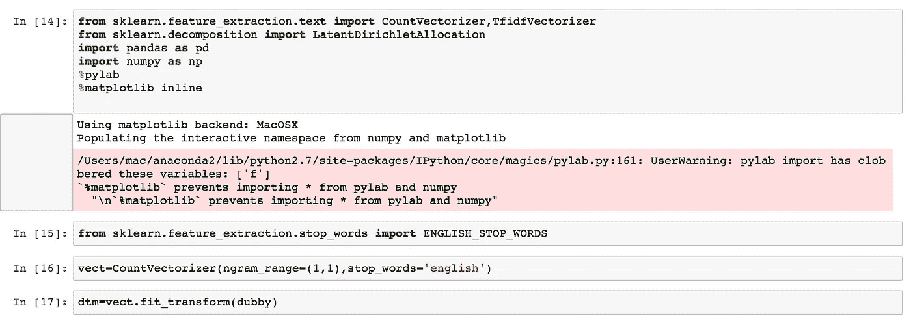

Figure showing how the CountVectorizer is fitted on the document with stop-words

文档术语矩阵被格式化为 pandas 数据框架，以便浏览数据集，如下所示。该数据框显示了文档中每个术语的单词出现次数。在没有格式化为数据帧的情况下，文档术语矩阵作为稀疏矩阵存在，并且应该使用 ***todense()*** 或 ***toarray()将其转换为密集矩阵。***

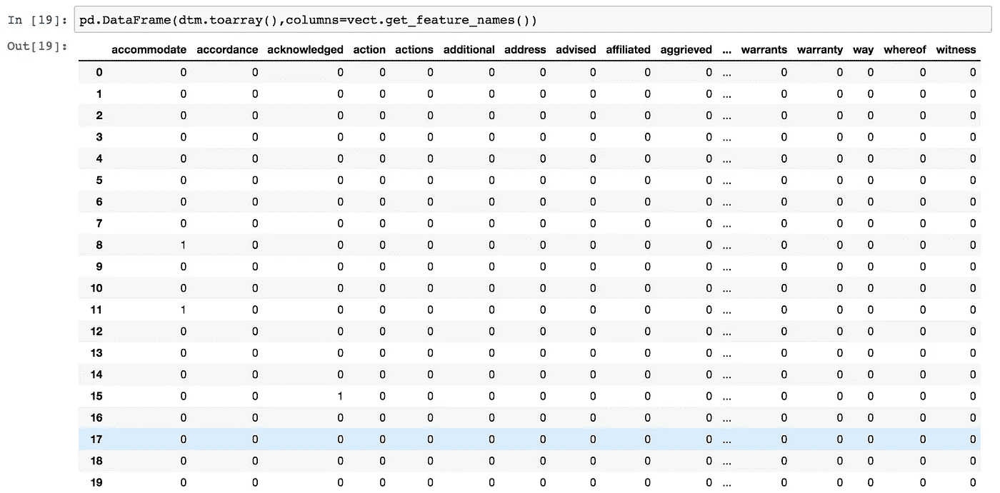

Figure showing a cross-section of the output from the CountVectorizer

该文档术语矩阵被用作由 [*潜在狄利克雷分配*](http://scikit-learn.org/stable/modules/generated/sklearn.decomposition.LatentDirichletAllocation.html) *算法*用于主题建模的输入数据。现在这个 LDA 算法有几个不同的实现，但是对于这个项目，我将使用[*scikit-learn*](http://scikit-learn.org/stable/)*实现。另一个非常著名的 LDA 实现是 Radim Rehurek 的 [gensim](https://radimrehurek.com/gensim/) 。这适合于由计数矢量器输出的文档术语矩阵。该算法适合于隔离五个不同的主题上下文，如下面的代码所示。这个值肯定可以根据您想要从建模中获得的粒度级别进行更改。*

**

*Figure showing how the LDA model was fitted on the DocumentTermMatrix with 5 topics*

*下面的代码使用 [*mglearn*](https://github.com/amueller/mglearn) 库来显示每个特定主题模型中的前 10 个单词。人们可以很容易地从每个主题所呈现的单词中总结出结论。*

*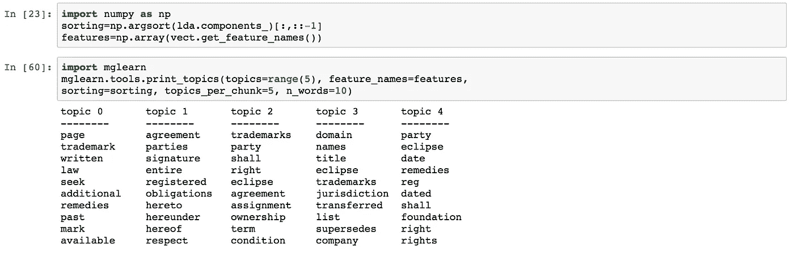*

*Figure showing the 5 topics from LDA and the most common words in each topic*

*从以上结果来看，显然主题 2 与商标所有权协议条款和条件有很大关系。话题 1 谈论涉及签名和一些义务的当事人之间的协议。ECLIPSE 一词似乎在所有五个主题中都很普遍，这表明了它在整个文档中的相关性。*

*这一结果与文件**(商标和域名协议)非常一致。***

*为了更细致地观察每个主题，我们提取每个主题模型的句子进行简要总结。下面的代码从主题 1 和主题 4 中提取了前 4 个句子。*

*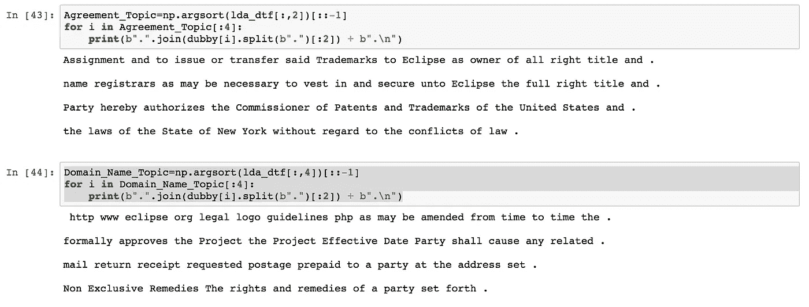*

*Figure showing sentences within Topic model 1 and 4*

*Topic-1 中的句子讨论了根据纽约市的法律将商标转让给 eclipse 的问题。*

*此外，题目 4 中的句子清楚地表明了域名和商标协议的生效日期。*

***结果可视化***

*T 何[pyl Davis库用于可视化主题模型。请注意主题 1 和主题 4 之间的关系有多密切，主题 2、主题 3 和主题 5 之间的距离有多远。这些主题(2、3 和 5)捕获了法律文档中相对不同的主题，并且是那些应该更仔细观察的主题，因为它们在组合时会提供文档的更宽视图:](https://github.com/bmabey/pyLDAvis)*

*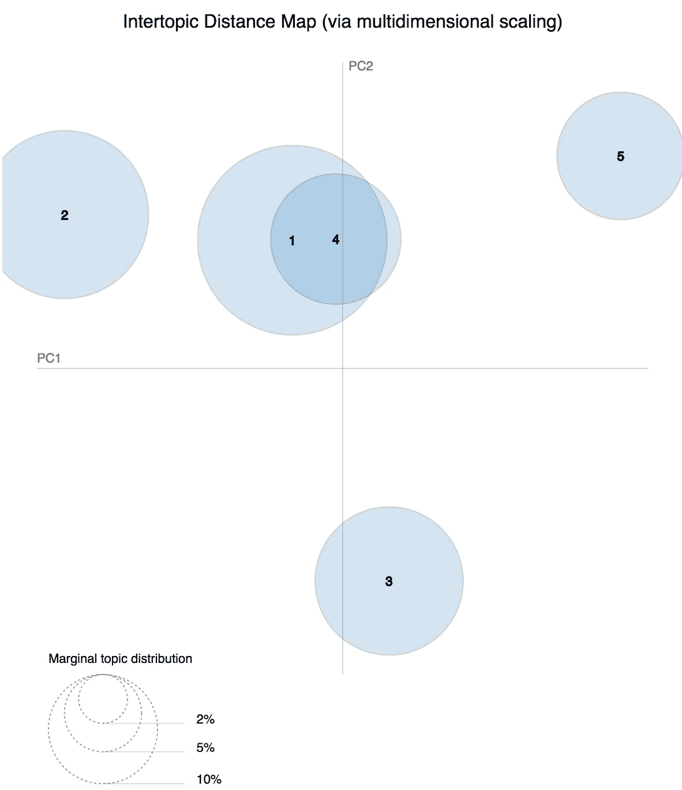*

*Figure showing how distinct each modelled topic is from one another*

*从下图可以看出，话题 5 指的是双方之间的协议、义务和签名，而话题 3 谈论的是域名、头衔和商标。*

*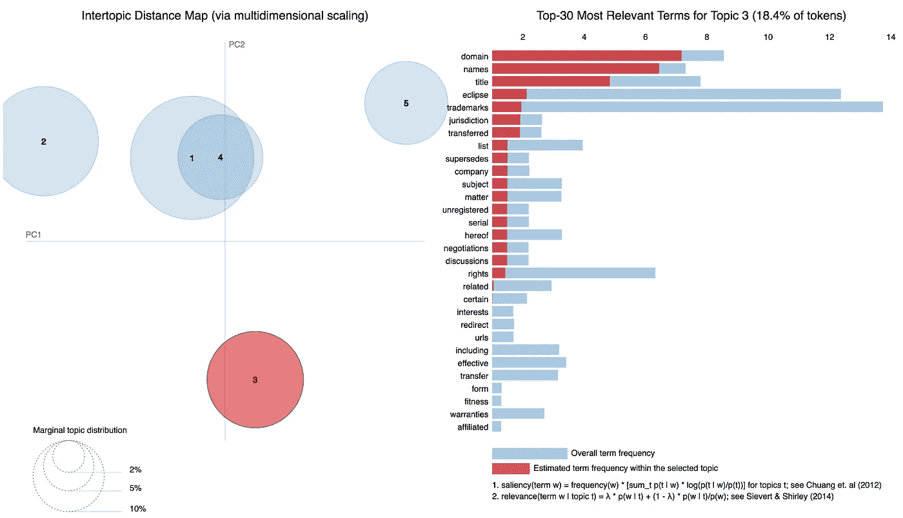*

*Figure showing the words which are most frequent in Topic-3*

*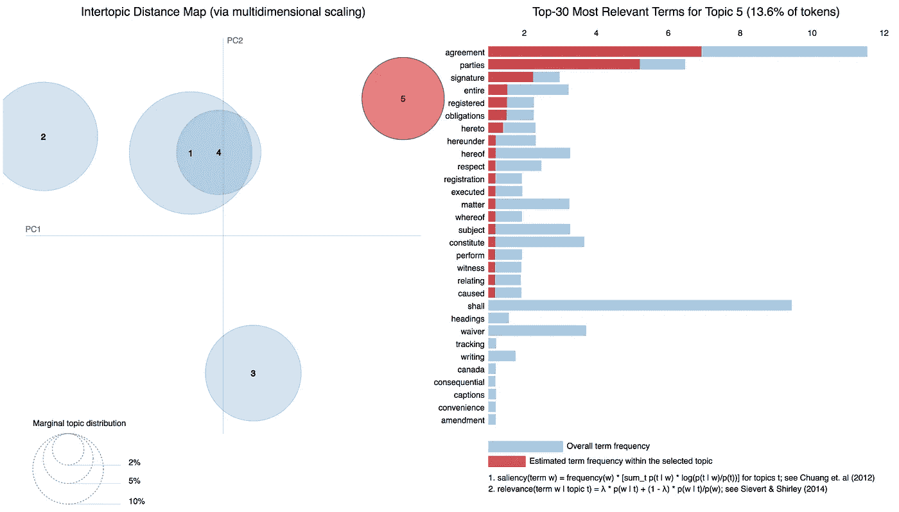*

*Figure showing the words which are most frequent in Topic-3*

*还为整个法律文档生成了一个 [wordcloud](https://github.com/amueller/word_cloud) ，以记录文档中最常出现的术语，如下图所示。这通常与主题建模的结果一致，因为像*商标、协议、域名、eclipse 等*这样的词被视为重复出现，因此更加醒目。*

*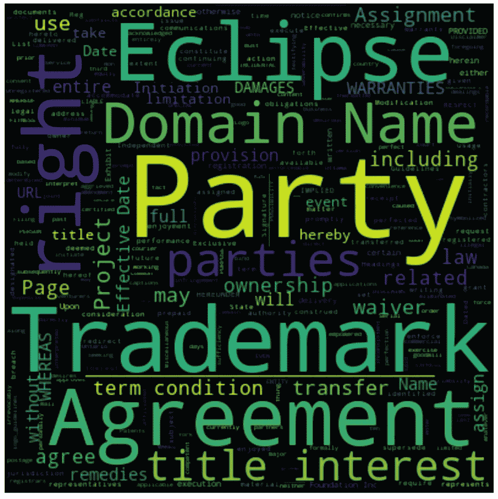*

*A wordcloud showing the most occurrent words/phrases in the legal document*

***结论***

*B y 将通过潜在狄利克雷分配模型获得的主题 2、3 和 5 与为法律文件生成的词云相结合，我们可以有把握地推断出该文件是双方之间对商标域名转让的简单法律约束。*

*这个项目遵循一个简单的方法来从 pdf 文档中提取文本，这个项目可以修改以从图像文件中提取文本。jpeg。png)，从而可以在文档快照上进行主题建模和摘要。该项目显示了机器学习如何应用于法律部门，通常用于提供主题的文档摘要。*

*这个项目的一个更实际的应用是在小说、教科书等的章节上进行文本摘要，它已经被证明是非常有效的。*

## *用于此分析的代码(IPython 笔记本)的链接可以在我的 github 页面上找到:[https://github . com/chibueze 07/Machine-Learning-In-Law/tree/master](https://github.com/chibueze07/Machine-Learning-In-Law/tree/master)*