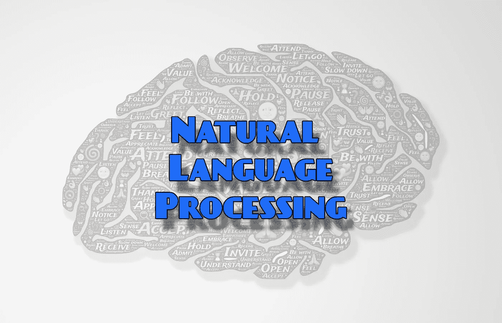
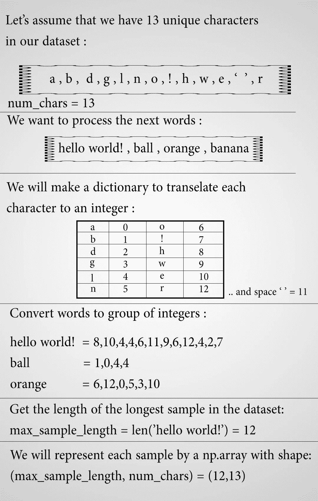
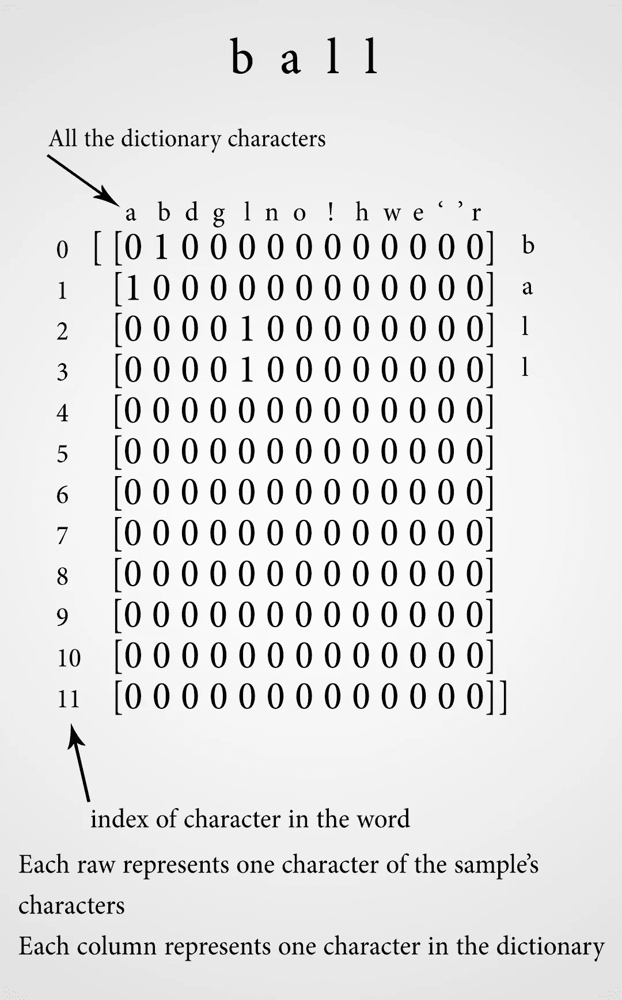
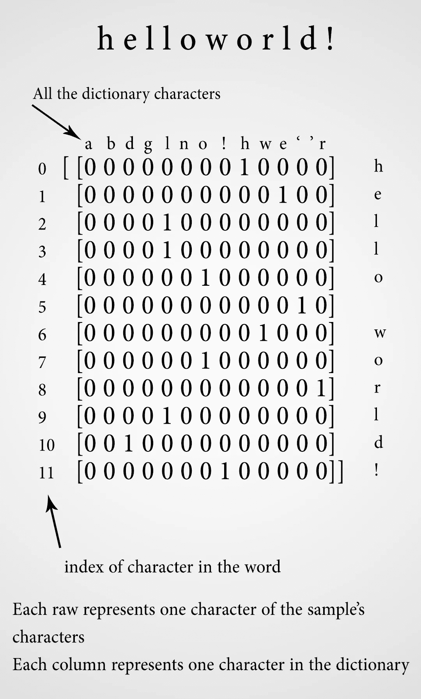

# NLP |序列到序列网络|第 1 部分|处理文本数据

> 原文：<https://towardsdatascience.com/nlp-sequence-to-sequence-networks-part-1-processing-text-data-d141a5643b72?source=collection_archive---------3----------------------->



通过理解 NLP，你可以获得许多好处，你可以制作自己的模型来回答问题并在聊天机器人中使用它，或者你可以制作一个翻译器来将文本从你的语言翻译成英语或相反的语言，或者你可以制作一个文本摘要器。

在这个教程系列中，我们将学习如何制作一个 seq2seq 网络，并训练它将英语文本翻译成法语，或者您可以在另一个 seq2seq 用途中使用它。

在本系列的这一部分中，我们将学习如何处理文本数据以将其提供给 seq2seq 网络。

我们将学习两种处理文本的方法

*   字符级处理
*   单词级处理(使用嵌入)

我用了一个英语→法语句子的数据集，你可以从[这里](http://www.manythings.org/anki/fra-eng.zip)得到我用的数据集。

对于其他语言，您可以使用[[this](http://www.manythings.org/anki/)链接获得数据集

# 第一:字符级处理

## 概述:

我在下面的图片中解释了文本处理的步骤:



所以，代表这个词的**球:**



，来代表句子 **hello world！:**



我希望您对处理文本数据的步骤有了一些直觉。

现在我们将使用 python 进行一些编码:

首先，让我们导入 numpy:

```
import numpy as np
```

然后，加载文本文件:

之后，拆分样本并获取必要的字典:

制作所需的字典，将字符转换为整数，反之亦然:

计算最长样本的长度和一些其他变量:

输出:

```
Number of E Samples  	: 160872
Number of D Samples 	: 160872
Number of D Chars  	: 115
Number of E Chars 	: 92
The Longest D Sample has 351 Chars
The Longest E Sample has 286 Chars
```

E →输入文本(稍后编码)
D →输出文本(稍后解码)

接下来，我们将通过字母
**ex** 对样本进行**热编码:**

hi—>[[0，0，0，…，1，0，0，0]，[0，0，0，…，0，1，0，0]]
其中我们将每个样本表示为一个包含(n)行和(j)列的零数组
**n =最长样本中的字符数
j =字典中的字符数**

我们将制作三组数据:
1-编码器输入样本(英语句子)
2-解码器输入样本(法语句子)
3-目标(法语句子)

**目标**将是与**解码器输入**相同的数据，但它将领先一个字符
**例如:**
解码器输入= '\tHow are yo'
目标= '你好吗'

```
[Output]:
Shape of encoder_input_data : (160872, 286, 92) 
Shape of decoder_input_data : (160872, 351, 115) 
Shape of target_data        : (160872, 351, 115)
```

现在，seq2seq 模型可以使用这些数据了。

# ٍSecond:单词级处理(使用嵌入):

## 概述:

在这种方法中，我们执行与第一种方法相同的步骤，但是这里不是制作字符字典，而是制作我们想要处理的文本中使用的单词的字典，或者有时我们使用文本语言中最常见的 10，000 个单词。

为了便于理解我们将要做的事情，我们将:

1.  将文本转换为小写
2.  清除数字和标点符号中的数据。
3.  将“SOS”和“EOS”附加到目标数据:

> SOS →感知开始
> 
> EOS →感觉结束

4.制作字典将单词转换成索引数字。

5.使用嵌入层将每个单词转换为固定长度的向量。

> 单词嵌入提供了单词及其相关含义的密集表示。

了解更多关于单词嵌入的信息:[ [1](https://machinelearningmastery.com/use-word-embedding-layers-deep-learning-keras/) ，[ [2](https://keras.io/layers/embeddings/) ，[ [3](https://www.youtube.com/watch?v=5PL0TmQhItY) ，[ [4](https://www.youtube.com/watch?v=Qu-cvY4HP4g) ]

6.现在，seq2seq 网络可以使用这些数据了。

加载文本数据:

## 数据清理:

## 样品处理:

## 使用单词嵌入:

我将展示我使用嵌入层的那一行，整个网络将在本系列教程的下一部分解释。

```
num_words : is the number of words in the dictionary we used to convert words to numbers
vec_len : The length of the vector that will represent the words
```

# 接下来是什么:

在下一部分[ [**part 2**](https://medium.com/@mamarih1/nlp-sequence-to-sequence-networks-part-2-seq2seq-model-encoderdecoder-model-6c22e29fd7e1) ]我们将制作模型并训练它，然后用它将英文文本翻译成法文。

## 参考资料:

这个系列的所有参考资料将在最后一部分的结尾。

**可以在 Twitter 上关注我**[**@ ModMaamari**](https://twitter.com/ModMaamari)

# NLP |序列到序列网络:

[1- NLP |序列到序列网络|第 1 部分|处理文本数据](/nlp-sequence-to-sequence-networks-part-1-processing-text-data-d141a5643b72)

2- [NLP |序列到序列网络|第 2 部分|Seq2seq 模型(编码器解码器模型)](https://medium.com/@mamarih1/nlp-sequence-to-sequence-networks-part-2-seq2seq-model-encoderdecoder-model-6c22e29fd7e1)

## 您可能还喜欢:

*   [**AI 生成泰勒斯威夫特的歌词**](https://blog.goodaudience.com/ai-generates-taylor-swifts-song-lyrics-6fd92a03ef7e)
*   [**深度神经网络用于回归问题**](https://medium.com/@mamarih1/deep-neural-networks-for-regression-problems-81321897ca33)
*   [**带 TensorFlow APIs 的机器学习速成班汇总**](https://medium.com/@mamarih1/machine-learning-crash-course-with-tensorflow-apis-summary-524e0fa0a606)
*   [**如何使用 Tensorflow 和 Keras**](https://medium.com/@mamarih1/how-to-make-a-cnn-using-tensorflow-and-keras-dd0aaaed8ab4) 制作 CNN
*   [**如何选择最好的机器学习模型？**](https://medium.com/@mamarih1/how-to-choose-the-best-machine-learning-model-e1dbb46bdd4d)