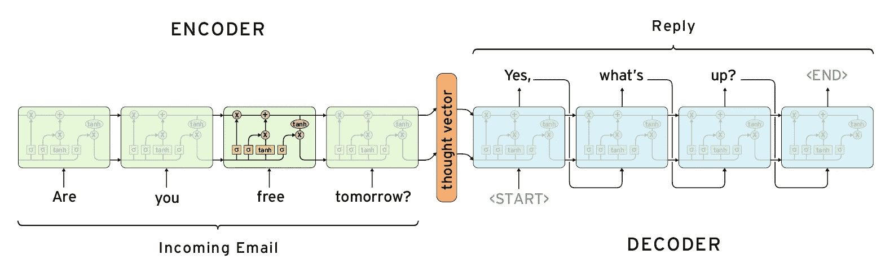
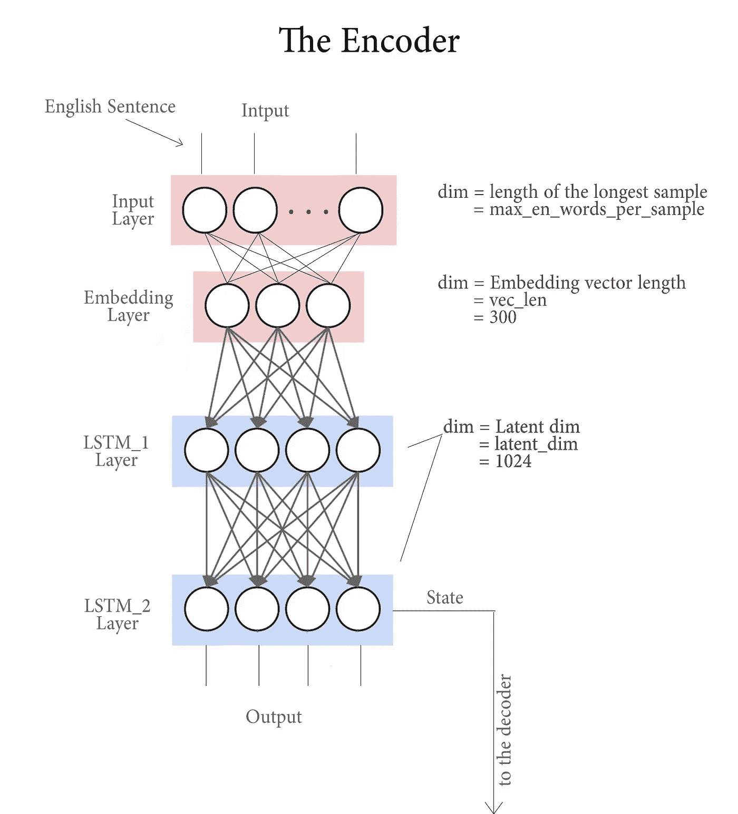
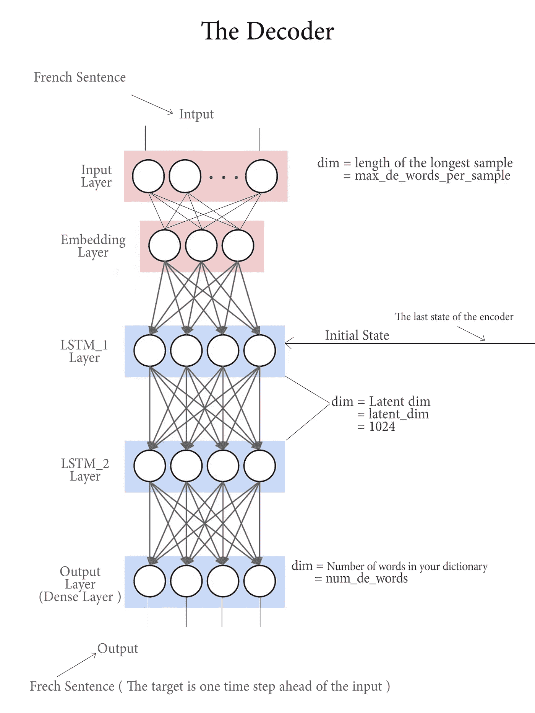
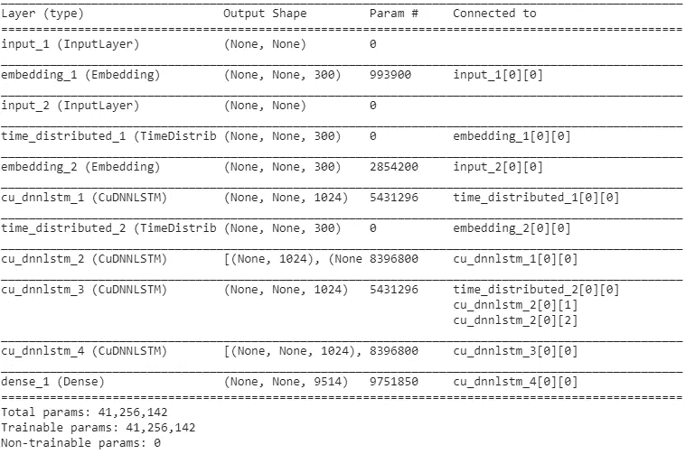

# NLP |序列到序列网络|第 2 部分|Seq2seq 模型(编码器/解码器模型)

> 原文：<https://towardsdatascience.com/nlp-sequence-to-sequence-networks-part-2-seq2seq-model-encoderdecoder-model-6c22e29fd7e1?source=collection_archive---------2----------------------->


在[[NLP | Sequence to Sequence Networks | Part 1 | Processing text data](/nlp-sequence-to-sequence-networks-part-1-processing-text-data-d141a5643b72)中，我们学习了如何处理文本数据，在这一部分中，我们将创建一个模型，该模型将获取我们处理的数据，并使用它来训练将英语句子翻译成法语。

我们将使用一种称为(seq2seq)或(Encoder Decoder)的架构，它适用于输入序列(在我们的例子中是英语句子)的长度与输出数据(在我们的例子中是法语句子)的长度不同的情况

## 什么是编码器解码器架构？


[Encoder Decoder Architecture](https://smerity.com/articles/2016/google_nmt_arch.html)

编码器解码器架构由两个主要部分组成:

1.  **编码器**:

编码器简单地获取输入数据，并对其进行训练，然后将其循环层的最后状态作为初始状态传递给解码器部分的第一循环层。

```
Encoder input : English sentencesEncoder initial state : It depends on the initializer we use
```

**2。解码器:**

解码器获取编码器最后一个递归层的最后一个状态，并将其用作其第一个递归层的初始状态，解码器的输入是我们想要得到的序列(在我们的例子中是法语句子)。

```
Decoder input : French sentencesDecoder initial state : The last state of encoder’s last recurrent layer
```

**其他一些解释编码器解码器的图片:**


[Simple Representation](/sequence-to-sequence-model-introduction-and-concepts-44d9b41cd42d)



[Generative Model Chatbots](https://medium.com/botsupply/generative-model-chatbots-e422ab08461e)

了解有关编码器/解码器架构的更多信息[[0](https://smerity.com/articles/2016/google_nmt_arch.html)]、[1](https://machinelearningmastery.com/define-encoder-decoder-sequence-sequence-model-neural-machine-translation-keras/)、[2](https://machinelearningmastery.com/encoder-decoder-models-text-summarization-keras/)、[3](https://machinelearningmastery.com/develop-encoder-decoder-model-sequence-sequence-prediction-keras/)、[4](https://www.liip.ch/en/blog/sentiment-detection-with-keras-word-embeddings-and-lstm-deep-learning-networks)

## 构建模型:

首先，导入所需的依赖项:

**构建编码器:**

The Encoder

我们使用( [Keras Functional API](https://keras.io/getting-started/functional-api-guide/) )来构建这样复杂的模型，如果你想了解更多关于 Keras Functional API 的知识:[ [1](https://www.youtube.com/watch?v=elOLCEJV-dc) ，[ [2](https://machinelearningmastery.com/keras-functional-api-deep-learning) ]

**编码器由以下部分组成:**

1.  输入层:获取英语句子并将其传递给嵌入层。
2.  嵌入层:获取英语句子并将每个单词转换成固定大小的向量
3.  第一个 LSTM 层:每一个时间步，它采用一个代表一个单词的向量，并将其输出传递给下一层，我们使用 CuDNNLSTM 层而不是 LSTM，因为它快得多。
4.  第二 LSTM 层:它与前一层做同样的事情，但不是传递其输出，而是将其状态传递给解码器的第一 LSTM 层。



**构建解码器:**

**解码器由:**组成

1.  输入层:获取法语句子并将其传递给嵌入层。
2.  嵌入层:获取法语句子，并将每个单词转换为固定大小的向量
3.  第一个 LSTM 层:每一个时间步，它都采用一个表示单词的向量，并将其输出传递给下一层，但在解码器中，我们将这一层的状态初始化为解码器中最后一个 LSTM 层的最后一个状态。
4.  第二 LSTM 层:处理前一层的输出，并将其输出传递给密集层。
5.  密集层(输出层) :获取前一层的输出，并输出一个表示目标法语单词的 hot vector

**注:**

我们必须知道，我们不能在一个时间步长内将每一个英语句子转换成法语，我们要在多个时间步长内完成，这些时间步长等于最长的英语句子的字数。

因此，如果最长的英语句子有 10 个单词，我们必须采取 10 个时间步骤来获得它的法语翻译。



我使用前面的模块简化了编码器和解码器模型，实际上，我们有许多时间步长，而不是简化表示中的一个，最终输出不是我们可以直接阅读的句子，实际情况是，每个时间步长我们都会获得一个代表目标单词的热点向量。

**将编码器和解码器整合到一个模型中:**



Model Summary

## 训练模型:

我只使用了 9000 个样本，因为我没有足够的内存来使用整个数据集，正因为如此，结果不够好。

我们使用的优化器是 [**rmsprop**](https://keras.io/optimizers) **，**它用在有循环层的模型中。

> 这个优化器通常是递归神经网络的好选择。

我们使用**categorial _ cross entropy**作为损失函数，因为我们将每个单词视为一个类别(我们的输出是一个代表单词的热点向量)

## 回想一下:

*   我们必须知道什么是编码器解码器模型。
*   如何创建编码器
*   如何使用嵌入层
*   如何制作解码器
*   我们了解编码器解码器模型是如何工作的
*   我们训练了这个模型

# 接下来是什么:

在本系列的下一部分，我们将使用训练好的模型将英语句子翻译成法语。

# NLP |序列到序列网络:

[1- NLP |序列到序列网络|第 1 部分|处理文本数据](/nlp-sequence-to-sequence-networks-part-1-processing-text-data-d141a5643b72)

2- [NLP |序列到序列网络|第 2 部分|Seq2seq 模型(编码器解码器模型)](https://medium.com/@mamarih1/nlp-sequence-to-sequence-networks-part-2-seq2seq-model-encoderdecoder-model-6c22e29fd7e1)

## 参考资料:

这个系列的所有参考资料将在最后一部分的结尾。

你可以在推特上关注我 [@ModMaamari](https://twitter.com/ModMaamari)

## 您可能还喜欢:

*   [**AI 生成泰勒斯威夫特的歌词**](https://blog.goodaudience.com/ai-generates-taylor-swifts-song-lyrics-6fd92a03ef7e)
*   [**深度神经网络用于回归问题**](https://medium.com/@mamarih1/deep-neural-networks-for-regression-problems-81321897ca33)
*   [**带 TensorFlow APIs 的机器学习速成班汇总**](https://medium.com/@mamarih1/machine-learning-crash-course-with-tensorflow-apis-summary-524e0fa0a606)
*   [**如何使用 Tensorflow 和 Keras 制作 CNN**](https://medium.com/@mamarih1/how-to-make-a-cnn-using-tensorflow-and-keras-dd0aaaed8ab4)
*   [**如何选择最好的机器学习模型？**](https://medium.com/@mamarih1/how-to-choose-the-best-machine-learning-model-e1dbb46bdd4d)