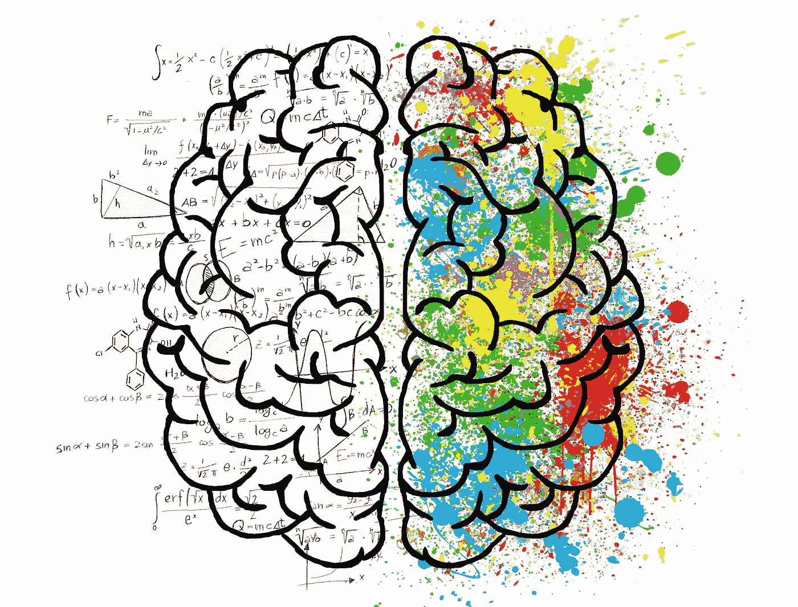
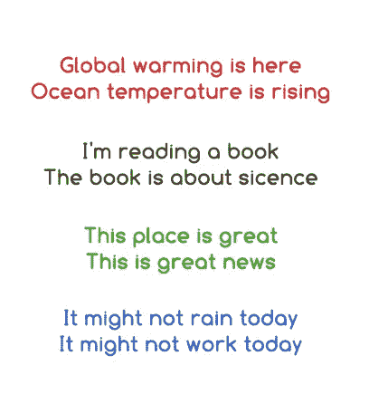
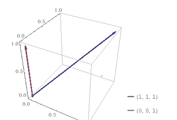
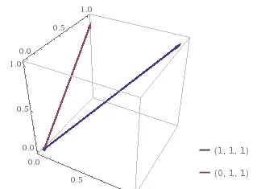
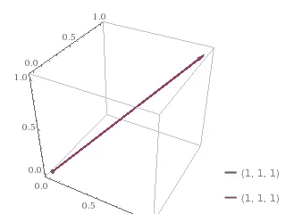
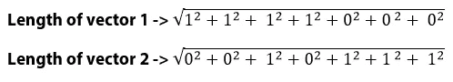

# NLP 文本相似性，它是如何工作的，以及它背后的数学原理

> 原文：<https://towardsdatascience.com/nlp-text-similarity-how-it-works-and-the-math-behind-it-a0fb90a05095?source=collection_archive---------9----------------------->



看看这几对句子，你觉得这几对中哪一对有**相似的句子？**



你可能对前两个很有信心，但对后两个就没那么有信心了。实际上，你是对的，因为前两对句子谈论的是同一件事(独立地)，所以非常相似。然而，最后两对中的句子谈论非常不同的事情，因此不会被视为相似的句子。

令人惊讶的是，NLP 模型正好相反。根据**文本相似度**在自然语言处理中的工作方式，最后两对句子非常相似，但不是前两对！😮

在你开始判断 NLP 的能力之前，让我们看看它是如何工作的，以及它背后的数学原理。所以，我们来看看机器是怎么看这些句子的！

**第一句:**“全球变暖来了”

**句子 2:** “海洋温度正在上升”

为了使这两个句子相似，即使从机器的角度来看，你也需要探索一个全新的语义分析维度，根据这个维度，这两个句子非常相似。[点击此处](https://www.paralleldots.com/semantic-analysis)并键入这两个句子。

现在，回到我们的 NLP 模型，是我们破解它的时候了！

**第一步:**从两个句子中选出唯一的单词，等于 **7。**

**独特词汇:** *全球，变暖，是，这里，海洋，温度，上升*

第二步:统计每个句子中独特单词的出现次数

**分析句子 1**

```
global, 1
warming, 1
is, 1
here, 1
ocean, 0
temperature, 0
rising, 0
```

**分析第二句**

```
global, 0
warming, 0
is, 1
here, 0
ocean, 1
temperature, 1
rising, 1
```

简单的部分已经结束了，在我们继续之前，你必须知道 NLP 的文本相似度是在**余弦相似度的基础上工作的。**余弦相似度基本上就是两个向量之间的角度的**余弦。所以，我们想把句子转换成两个向量，我们已经完成了！**

**句子 1 的向量:** [ 1，1，1，1，0，0，0 ]

**句子 2 的向量:** [ 0，0，1，0，1，1，1]

让我们把向量形象化。

请注意，在我们的例子中，我们有一个 **7D 矢量**，因为不可能可视化一个 **7D** 矢量，我将向您展示两个 **3D 矢量**并解释其工作原理。



所以，这里我们有两个 **3D** 向量**【1，1，1】**和**【0，0，1】**。你可以把这些向量想象成总共有 3 个独特单词的两个句子。这里， **[ 1，1，1 ]** 将意味着所有 3 个唯一单词在第一句中出现一次，而 **[ 0，0，1 ]** 将意味着只有第三个唯一单词在第二句中出现一次。

我们只对这两个向量之间的角度感兴趣。两条线越近，角度就越小，因此相似性增加。因此，如果任何两个句子完全相似，你将在 **3D 空间中只看到一条线，**因为两条线会相互重叠。



Vectors getting closer, similarity increases as both sentences now have 2 words in common



A perfect match of 2 sentences!

我希望你能理解我们在这里想要达到的目标或者 NLP 想要做的事情。所以，让我们回到我们的原始向量，然后**计算两者之间的余弦角**。我们的载体:

**句子 1 的向量:**【1，1，1，1，0，0，0】

**句子 2 的向量:** [ 0，0，1，0，1，1，1]

**测量两个矢量之间的角度**

这不是火箭科学，你需要知道的只是这个公式:


在分子中，我们有矢量的**点积**，在分母中，我们有两个矢量长度的乘积。

1.  让我们为我们的例子找出点积:
    **公式->**(u*1 * v1)+*(U2** v2)+…..+*(un** VN)***那就->**(1 * 0)+(1 * 0)+(1 * 1)+(1 * 0)+(1 * 0)+(1 * 0)+(1 * 0)= 1
2.  求两个向量的长度:



所以，现在我们要计算:1 / 4 等于 **0.25**

总之，根据 NLP 文本相似度，两个句子“**全球变暖在这里**”和“**海洋温度正在上升**”只有 **25%** 相似，这与语义分析显示的完全相反。

现在，让我们快速对另外一对句子执行相同的步骤:

**句子 1:** “这个地方很棒”

**句子 2:** “这是个好消息”

**独特词汇:** *这，是，伟大，地方，新闻*

**句子 1 的向量:**【1，1，1，1，0】

**句子 2 的向量:**【1，1，1，0，1】

将这些向量放入余弦公式，您会得到值 **0.75，**表示相似度 **75%**

请注意，**值越大，角度**越小，句子越相似。

所以，下次当你想到在你的项目中使用 **NLP 文本相似度**时，你就会知道它的真正目的以及它与**语义分析的不同之处。**

***干杯！***