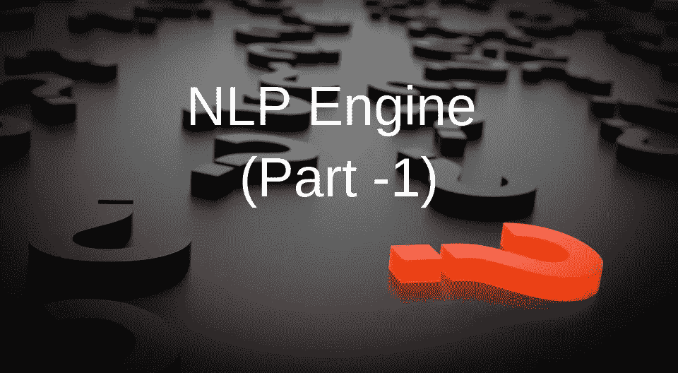
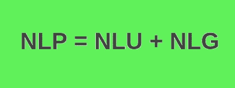
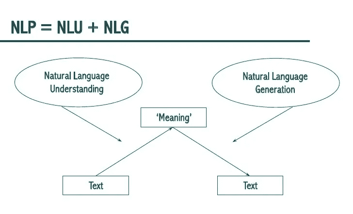
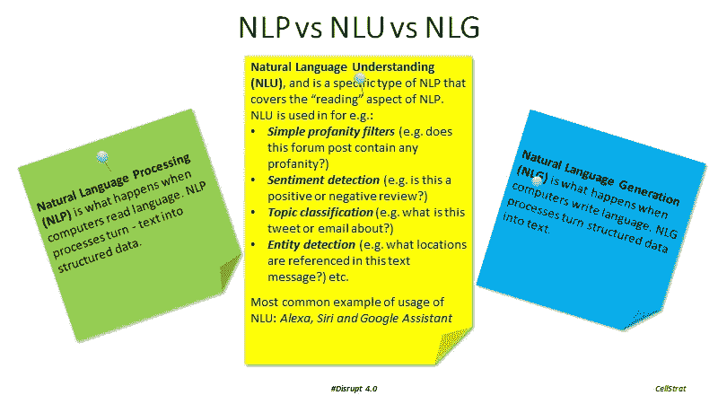
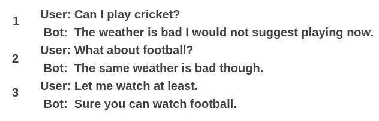
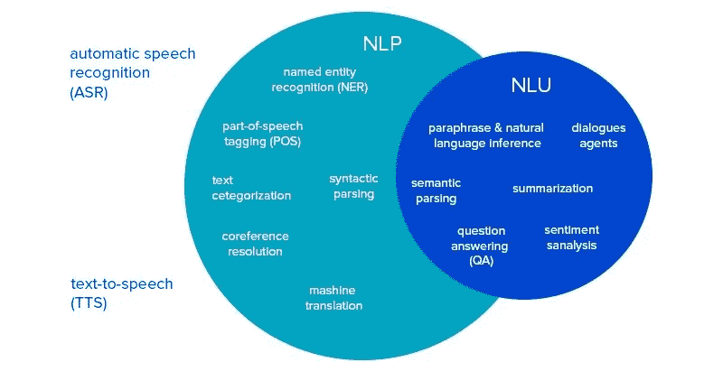

# NLP vs NLU vs NLG(知道你要达到的目标)NLP 引擎(第一部分)

> 原文：<https://towardsdatascience.com/nlp-vs-nlu-vs-nlg-know-what-you-are-trying-to-achieve-nlp-engine-part-1-1487a2c8b696?source=collection_archive---------4----------------------->

区别自然语言处理，NLU，NLG 和可能的事情可以实现时，实现聊天机器人的自然语言处理引擎。

在这个快速发展的机器学习和人工智能领域，混淆特定术语是非常常见的。以上同样是三个词互换为高兴的情况。

现在让我们用三个词来概括:

1.  **NLP** —自然语言**处理**
2.  **NLU** —自然语言**理解**
3.  **NLG** —自然语言**生成**

如果我需要用数学的方式来说，可以说 NLU 和 NLG 的结合将产生一个有效的 NLP 引擎。

NLP = NLU + NLG

NLU 是对用户或输入的含义的理解。那只不过是对所给文本的理解，并把它归类为适当的意图。

NLP = NLU + NLG([source](https://www.slideshare.net/rdale01/tarragona-summer-schoolautomated-writing-assistance-topic-5))

让我们举个例子:“**我今天可以打板球吗**

> **你的 NLP 引擎应该怎么做？？**

这里，用户意图是**玩** **板球**，但是，有许多可能性应该被考虑。其中一个依赖项是“**查看**外的天气”。

如果外面正在下雨，因为板球是一项户外运动，我们不建议玩，对吗？？？如您所见，我们需要将它转换成结构化数据，那么我们该怎么做呢？我们利用了意图和实体。

**NLP NLU NLG(**[**source**](http://www.cellstrat.com/2017/10/27/nlp-vs-nlu-vs-nlg/)**)**

## 意图:

意图只不过是动词(用户需要做的活动)。如果我们想要捕获一个请求，或者执行一个动作，使用一个**意图。**在这个例子中，玩耍就是意图。

## 实体:

实体是需要执行的动作的名词或内容。在这里，cricket 是一个名词。

一个实体玩游戏可能有多个意图(比如检查天气、检查场地是否可用、检查朋友是否有空),也可能有多个实体的意图和多个实体的多个意图。

此外，意图和实体的变化基于以前的聊天检查如下。

**第一步:“实体”——“板球”和“意图”——“游戏”**

**第二步:“实体”——“足球”和“意图”——“玩”**

**Step3:** **【实体】—“足球”“意图”—“观看”**

> 根据之前的聊天，查看实体和意图如何变化。

## 他们三人如何携手合作:

1.  NLU 根据语法、说话的上下文以及意图和实体来理解数据。
2.  NLP 会将文本转换成结构化数据。
3.  NLG 生成基于结构化数据生成的文本。

## NLU 和 NLG 是自然语言处理引擎的子集

NLP NLU([source](https://www.google.co.in/url?sa=i&rct=j&q=&esrc=s&source=images&cd=&ved=2ahUKEwiTvP73w9XdAhXYfn0KHSJeD24Qjhx6BAgBEAM&url=https%3A%2F%2Flabs.eleks.com%2F2018%2F02%2Fhow-to-build-nlp-engine-that-wont-screw-up.html&psig=AOvVaw2AgxfcrIfBQ97fVcGqjDqd&ust=1537943439715646))

> **更多参考资料:**

1.  [***人工智能真实还是只是这十年的炒作？？***](https://becominghuman.ai/artificial-intelligence-real-or-is-it-just-an-hype-of-this-decade-fear-what-learn-history-go-game-ac4476badf1b)
2.  [***人工智能:定义、类型、实例、技术***](https://medium.com/@chethankumargn/artificial-intelligence-definition-types-examples-technologies-962ea75c7b9b)
3.  [***人工智能 vs 机器学习***](https://medium.com/@chethankumargn/artificial-intelligence-vs-machine-learning-3c599637ecdd)
4.  [***机器学习为什么要实现人工智能？***](https://medium.com/@chethankumargn/why-machine-learning-for-achieving-artificial-intelligence-the-need-for-machine-learning-c69667b4a51f)
5.  *[***机器学习类型和算法***](https://becominghuman.ai/machine-learning-types-and-algorithms-d8b79545a6ec)*
6.  *[***【线性回归部分-1】***](/linear-regression-part-1-types-examples-gradient-descent-example-2e8c22b05f61)*
7.  *[***【线性回归第二部分(示例实现)***](/implementation-linear-regression-in-python-in-5-minutes-from-scratch-f111c8cc5c99)*

*一定要在 [**上关注我**](https://medium.com/@chethankumargn)**[**LinkedIn**](http://www.linkedin.com/in/chethankumargn)**[**Twitter**](https://twitter.com/chethan1gn)**[**insta gram**](https://www.instagram.com/data_science_by_chethan/)**获取更多更新。如果你喜欢这篇文章，请鼓掌并分享它。*********

*******在这里加入我们的 [**WhatsApp**](https://chat.whatsapp.com/LLwBIyYYcABEV31ZFI7QR3) 社区。*******